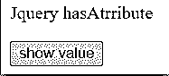
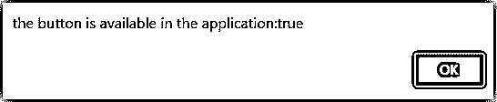
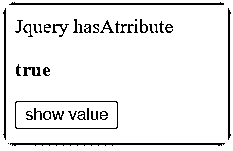
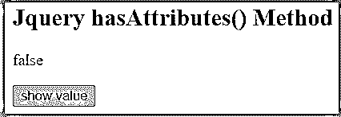
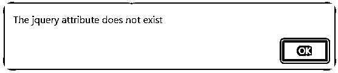
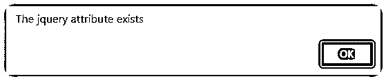

# jQuery 具有属性()

> 原文：<https://www.educba.com/jquery-hasattribute/>


## jQuery hasAttribute()简介

*   JQuery“has”属性检查 HTML 元素(如表单和 web 应用程序的输入)上是否存在属性。
*   jQuery 中的 hasAttribute()函数可以确定元素上是否存在属性。如果找到匹配，它将返回一个有效的布尔值；否则，它会产生一个布尔值 false。
*   JQuery 中的 attr()函数可以用来查看元素是否有属性。如果找到匹配，它返回布尔值 true 否则，它返回 false。

### 什么是 jQuery「有属性」？

*   “jQuery has attribute”正确地检查 web 应用程序的元素上是否存在属性。
*   该属性有助于根据应用程序的要求或所需位置来确定操作目标。

jQuery 的语法“hasAttribute”

*   有两种类型的“jQuery has attribute”语法用于验证。
*   下面给出了“jQuery has attribute”的第一种语法。

```
GivenElement.hasAttribute("target_function");
```

*   “GivenElement”表示应用程序代码的 jQuery 变量、选择器或元素。
*   “hasAttrubute”方法检查具有布尔输出的可用函数。
*   “target_function”是 onclick、onchange 和 onblur 等应用程序的可用函数。
*   jQuery 的第二种语法具有如下属性

```
GivenElement.hasAttributes();
```

o“given element”是 HTML web 应用程序的代表标签或元素，如主体、输入和其他标签。“hasAttrubutes”方法检查具有布尔输出的可用函数。

<small>网页开发、编程语言、软件测试&其他</small>

### 如何使用 jQuery has 属性？

1.  第一种方法

*   在 web 应用程序页面的正文部分创建一个 HTML 标记。
*   将所需的事件处理函数或元素放在 html 标记中。

```
<input type="button" id="myBtn" onclick="myFunction()" value="show value">
```

*   在 head 或 body 标记中创建一个 jQuery 脚本标记。

```
<script> write method here… </script>
```

*   添加“jQuery has attribute”方法检查函数。

```
let answers = document.getElementById("myBtn").hasAttribute("onclick");
```

*   在脚本标签中使用输出函数。

```
alert(answers);
```

**2。第二种方法**

*   在 web 应用程序页面的正文部分创建一个 HTML 标记。
*   将所需的事件处理函数或元素放在 html 标记中。

```
<input type="button" id="myBtn" onclick="myFunction()" value="show value">
```

*   添加“jQuery has attribute”方法检查函数。

```
let answers = document.getElementById("myBtn").hasAttributes("onclick");
```

*   在脚本标签中使用输出函数。

```
alert(answers);
```

### 使用函数 jQuery 具有属性

您可以在脚本标签中看到 jQuery 函数包含所有方法。
在 jQuery 函数中使用“jQuery has attribute”方法。
在这里，您可以看到 hasAttribute()函数检查函数的可用性。

```
<!DOCTYPE html>
<html>
<head>
<script src="https://ajax.googleapis.com/ajax/libs/jQuery/3.5.1/jQuery.min.js"></script>
<script>
$(document).ready(function(){
var answer = document.getElementById("myBtn").hasAttribute("onclick");
alert(answer);
});
</script>
</head>
<body>
<p>JQuery hasAtrribute</p>
<input type="button" id="myBtn" onclick="myFunction()" value="show value">
</body>
</html>
```

### jQuery hasAttribute()的示例

以下是不同的例子:

#### 示例#1

基本的“jQuery has attribute”示例，输出如下所示

*   在本例中，输出显示实际值。
*   如果函数可用，则“hasAttribute()”方法显示“true”输出。

```
<!DOCTYPE html>
<html>
<head>
<script src="https://ajax.googleapis.com/ajax/libs/jQuery/3.5.1/jQuery.min.js"></script>
<script>
$(document).ready(function(){
var answers = document.getElementById("myBtn").hasAttribute("onclick");
alert("the button is available in the application:" +answer);
});
</script>
</head>
<body>
<p>JQuery hasAtrribute</p>
<input type="button" id="myBtn" onclick="myFunction()" value="show value">
</body>
</html>
```

**输出 1:网页的输出**




**输出 2:“jQuery has attribute”函数的输出。**




**描述:**

*   点击按钮后，修改框显示真值。
*   这意味着该功能在网页上可用。

#### 实施例 2

具有“真”输出的基本“jQuery 有属性”示例如下所示

*   在本例中，输出显示真实值。
*   如果函数可用，则“hasAttributes()”方法显示“true”输出。

```
<!DOCTYPE html>
<html>
<head>
<script src="https://ajax.googleapis.com/ajax/libs/jQuery/3.5.1/jQuery.min.js"></script>
<script>
$(document).ready(function(){
var answers = document.getElementById("myBtn").hasAttributes();
document.getElementById("display").innerHTML = answers;
});
</script>
</head>
<body>
<p>JQuery hasAtrribute</p>
<b id="display"></b>
<p><input type="button" id="myBtn" onclick="myFunction()" value="show value"></p>
</body>
</html>
```

**输出:**




**描述:**

*   点击按钮后，输出显示真值。
*   这意味着该功能在网页上可用。

#### 实施例 3

基本的“jQuery has attributes”示例和输出如下所示

*   在本例中，输出显示真值或假值。
*   如果该函数不可用，则“hasAttributes()”方法会显示错误的输出。

```
<!DOCTYPE html>
<html>
<body>
<h2>JQuery hasAttributes() Method</h2>
<p id="demo"></p>
<p><input type="button" id="myBtn" onclick="myFunction()" value="show value"></p>
<script>
let answer = document.body.hasAttributes();
document.getElementById("demo").innerHTML = answer;
</script>
</body>
</html>
```

**输出:**




**描述:**

*   运行程序后，输出显示一个假值。
*   这意味着该功能在网页上不可用。

#### 实施例 4

带有假输出的基本“jQuery 有属性”示例如下所示

*   在本例中，输出显示真值或假值。
*   如果函数可用，那么 jQuery 方法会显示错误的输出。

```
<!DOCTYPE html>
<html>
<head>
<script src="https://ajax.googleapis.com/ajax/libs/jQuery/3.5.1/jQuery.min.js"></script>
</head>
<body>
<script>
$(document).ready(function() {
if ($("#myBtn").attr('name') !== undefined) {
alert('The jQuery attribute exists');
}
else {
alert('The jQuery attribute does not exist');
}
});
</script>
<p>JQuery hasAtrribute</p>
<input type="button" id="myBtn" onclick="myFunction()" value="show value">
</body>
</html>
```

**输出:**




**描述:**

*   运行程序后，输出在一个警告框中显示一个假值。
*   这意味着该功能在网页上不可用。

#### 实施例 5

具有真实输出的基本“jQuery 有属性”示例如下所示

*   在本例中，输出显示真值或假值。
*   如果函数可用，那么 jQuery 方法显示真实的输出。

```
<!DOCTYPE html>
<html>
<head>
<script src="https://ajax.googleapis.com/ajax/libs/jQuery/3.5.1/jQuery.min.js"></script>
</head>
<body>
<script>
$(document).ready(function() {
if ($("#myBtn").attr('onclick') !== undefined) {
alert('The jQuery attribute exists');
}
else {
alert('The jQuery attribute does not exist');
}
});
</script>
<p>JQuery hasAtrribute</p>
<input type="button" id="myBtn" onclick="myFunction()" value="show value">
</body>
</html>
```

**输出:**




**描述:**

*   输出在一个警告框中显示真实值。
*   这意味着该功能在网页上可用。

### 结论–jQuery 具有属性()

*   “jQuery has attribute”方法用于检查元素、函数和标记的可用性。
*   大量的网站和应用程序需要该功能来获取可用的编程信息。
*   这种方法有助于从大代码中搜索程序的小对象。
*   jQuery hasAttribute()使 web 应用程序变得用户友好、简单易懂。

### 推荐文章

这是 jQuery hasAttribute()的指南。这里我们讨论一下定义，什么是 jQuery“有属性”，如何用代码实现 jQuery 有属性。您也可以看看以下文章，了解更多信息–

1.  [jQuery Select()](https://www.educba.com/jquery-select/)
2.  [jQuery 滚动位置](https://www.educba.com/jquery-scroll-position/)
3.  [jQuery 中的文本内容](https://www.educba.com/textcontent-in-jquery/)
4.  [jQuery 长度](https://www.educba.com/jquery-length/)


