# jQuery Keypress()

> 原文：<https://www.educba.com/jquery-keypress/>

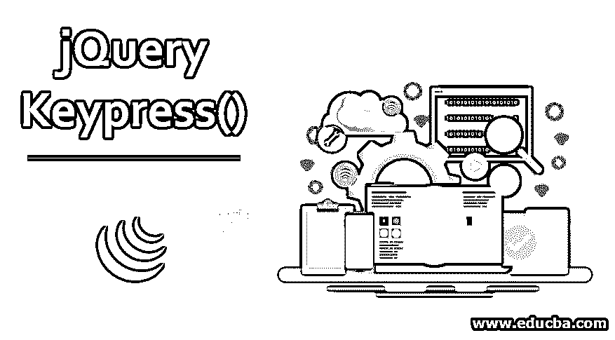


## jQuery 按键介绍()

jQuery keypress()方法是一种事件处理方法。它用于触发 keypress javascript 事件，或者附加一个在发生 keypress 事件(即按下键盘按钮时)时在所选元素上执行的函数。另一方面，它也可以用来检测任何键是否被按下。

**语法:**

<small>网页开发、编程语言、软件测试&其他</small>

| **语法** | **参数描述** | **值类型** | **版本** |
| $(选择器)。按键() | 钠 | 钠 | One |
| $(选择器)**。**按键(处理程序/功能) | **1。Handler:** 接受每次触发事件时将要执行的函数名。 | **1。处理程序**-函数(事件对象) | One |
| $(选择器)。按键([事件数据]，处理程序) | **1.eventData:**包含将传递给处理程序的数据的对象

**2。处理程序:**(如前所述)

 | **1.eventData:** Any

**2。处理程序:**函数(事件对象)

 | 1.4.3 |

### 不使用任何参数的 jQuery Keypress()

可以在不提供任何输入参数的情况下使用 keypress()方法。它用于事件被定义为手动触发的情况。

下面的例子演示了打印按钮被点击次数的功能。仅当单击按钮时，计数才会更新。

**举例:**

```
<!DOCTYPE html>
<html>
<head>
<script src="https://ajax.googleapis.com/ajax/libs/jquery/3.4.1/jquery.min.js"></script>
<script>
i = 0;
$(document).ready(function(){
$("p").keypress(function(){
$("span").text(i += 1);
});
$("button").click(function(){
$("p").keypress();
});
});
</script>
</head>
<body style="background-color: beige;">
<h3 style="font-family: Arial, Helvetica, sans-serif;">Use of keypress() method without any argument</h3>
<p style="font-family: Arial, Helvetica, sans-serif;">Number of times the button is pressed: 0</p>
<button>Click here</button>
</body>
</html>
```

**输出:**

在调用 keypress()方法之前:

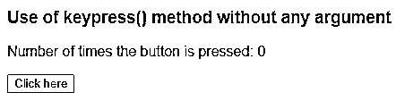


调用 keypress()方法后:

**屏幕 1:** “点击此处”按钮仅被点击一次。

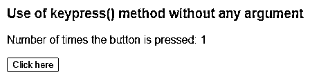


**屏幕 2:** 点击两次“点击此处”按钮。

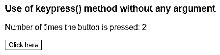


**屏幕 3:** 点击三次“点击此处”按钮。

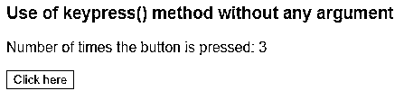


诸如此类。

**Note:** keypress() without  any input parameter, is shortcut for .trigger( “keypress” ) .

### 带有“处理程序/函数”参数

对于 jQuery keypress()，函数或处理程序名称可以作为输入参数传递。该函数将在触发[所选 html 元素](https://www.educba.com/html-form-elements/)上的任何按键事件时被调用。

在下面的代码片段中，keypress()方法与输入处理程序输入参数一起使用。每当按下任何键时，都会调用此处理程序。

**举例:**

```
<!DOCTYPE html>
<html>
<head>
<script src="https://ajax.googleapis.com/ajax/libs/jquery/3.4.1/jquery.min.js"></script>
<script>
i = 0;
$(document).ready(function(){
$("input").keypress(function(){
$("span").text(i += 1);
});
});
</script>
</head>
<body style="background-color: beige;">
<h3 style="font-family: Arial, Helvetica, sans-serif;">Use of keypress() method 'handler/function' parameter</h3>
<h4 style="font-family: Arial, Helvetica, sans-serif;">Tell about yourself: <input style="width:500px;" type="text"></h4>
<p style="font-family: Arial, Helvetica, sans-serif;">Number of characters Entered: 0</p>
</body>
</html>
```

**输出:**

在调用 keypress()方法之前:

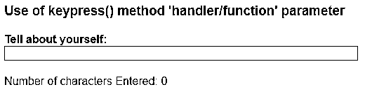


调用 keypress()方法后:

**屏幕 1:** 按键总数为 5。

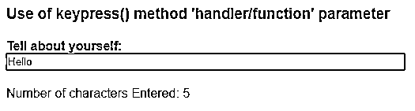


**屏幕 2:** 按键总数为 12。

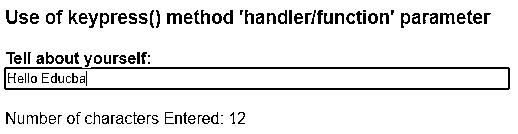


### 带有“eventdata”和“handler”参数的按键()

此类型用于将事件处理程序绑定到按键事件，其中处理程序的输入值以“事件数据”的形式作为按键方法参数给出。

在下面的代码片段中，“param 1”的值作为事件数据值给出，该值通过“event”对象传递给处理函数。该函数计算按下的键的数量，并将定义为“param1”的字符串追加到结果输出中。

**举例**:

```
<!DOCTYPE html>
<html>
<head>
<script src="https://ajax.googleapis.com/ajax/libs/jquery/3.4.1/jquery.min.js"></script>
<script>
i = 0;
$(document).ready(function(){
$("input").keypress({param1:'keys are pressed.'},function(event){
$("span").text((i+=1)+event.data.param1);
});
});
</script>
</head>
<body style="background-color: beige;">
<h3 style="font-family: Arial, Helvetica, sans-serif;">Use of keypress() method 'eventdata' and 'handler/function' parameter</h3>
<h4 style="font-family: Arial, Helvetica, sans-serif;">Type here: <input type="text"></h4>
<p>Output:0</p>
</body>
</html>
```

**输出:**

在调用 keypress()方法之前:

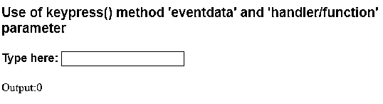


调用 keypress()方法后:

**画面 1:** 按键次数为 19。在与字符串值的事件数据合并后，将显示结果消息:“按键被按下”。

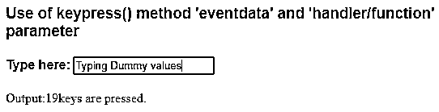


**画面二:**按键次数为 9。在与字符串值的事件数据合并后，将显示结果消息:“按键被按下”。

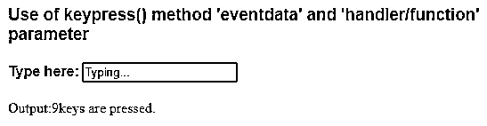


### 使用 keypress()方法检测按键事件

带有 handler 参数的 keypress 方法也可用于检测按键事件，即一旦任何按键被按下，它将触发处理程序。

下面的示例演示了在按下任何键时使用 keypress()方法来检测事件。

**举例:**

```
<html>
<head>
<title>Jquery | Keypress() </title>
<script src="https://cdnjs.cloudflare.com/ajax/libs/jquery/2.1.3/jquery.min.js">
</script>
</head>
<script>
$(document).keypress(function(event){
alert('You pressed a key');
});
</script>
<body style="background-color: beige;">
<h3 style="font-family: Arial, Helvetica, sans-serif;">Use of keypress() method to detect a keypress event</h3>
<h4 style="font-family: Arial, Helvetica, sans-serif;">Press any key...</h4>
</script>
</body>
</html>
```

**输出:**

在调用 keypress()方法之前:

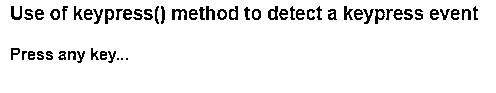


调用 keypress()方法后:

一旦您按下任何键，处理程序就会被调用，并弹出一个窗口，显示已配置的警报消息。

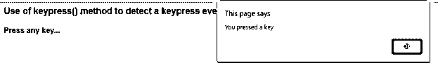


***Note:**
1\. keypress() with input parameter (either with handler or handler and event data both), is a shortcut for .on( “keypress”, handler ).*
*2\. It can execute on all the keys in keyboard except special characters or non-printing keys such as CTRL, ESC, SHIFT, Delete, etc.*

### 附加说明

1.  该方法的实际行为可能因不同平台、平台的不同版本、浏览器等而不同。，因为它不是正式的规范。
2.  该事件仅被焦点上的元素触发。因此，这种方法对表单控件非常有效，因为它们可以始终处于焦点上，而其他元素的焦点则依赖于浏览器。
3.  此方法不支持 ALT、CTRL、SHIFT 和 ESC 键。
4.  它类似于“keydown”事件，但在修饰键或非打印键的情况下不同于 keydown 事件，修饰键或非打印键支持 keydown 事件但不支持 keypress 事件。
5.  如果代码需要捕获被按下的键的值，那么行为需要附加一个文档对象。
6.  虽然浏览器使用不同的属性来存储关于被按下的键的值的信息，但是, [jQuery 具有特性](https://www.educba.com/what-is-jquery/)来规范化事件对象的属性，以便检索代码值，该值只不过是键的 Unicode 值(特殊键除外)。
7.  为了捕获不携带任何值的特殊键的击键，需要使用 keydown()或 keyup()。

### 推荐文章

这是 jQuery Keypress()的指南。这里我们讨论基本概念，jQuery Keypress()使用带或不带参数，以及语法和示例。您也可以阅读以下文章，了解更多信息——

1.  [jQuery 属性](https://www.educba.com/jquery-attributes/)
2.  [jQuery 效果](https://www.educba.com/jquery-effects/)
3.  [JQuery 进度条](https://www.educba.com/jquery-progress-bar/)
4.  [jQuery 备选方案](https://www.educba.com/jquery-alternatives/)


