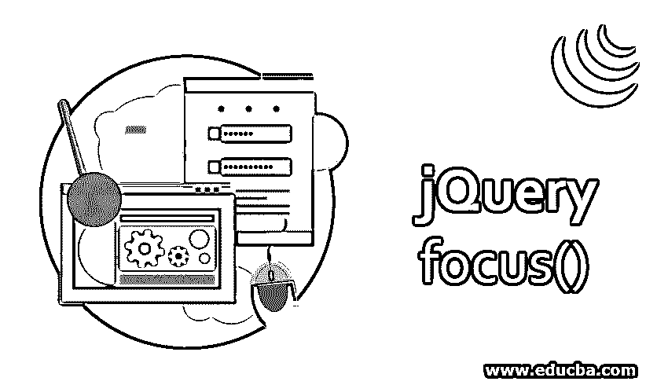
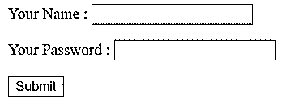
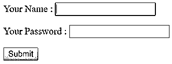
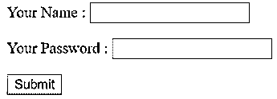
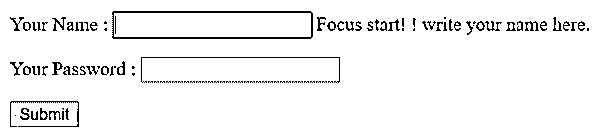
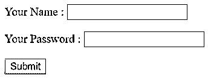
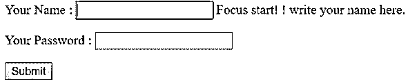
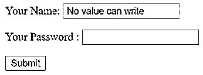
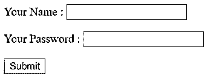
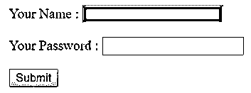

# jQuery 焦点()

> 原文：<https://www.educba.com/jquery-focus/>




## jQuery 焦点介绍()

JQuery focus()方法通过鼠标单击或鼠标导航来处理鼠标焦点事件。jQuery focus()方法是 jQuery 中的一个[内置方法。jQuery focus()方法，用于在元素获得焦点时聚焦于 html 元素。由鼠标单击或在其上导航的选项卡生成的焦点事件。](https://www.educba.com/jquery-methods/)

焦点事件由 html 元素的有限集合生成，如表单元素，如<input>、<select>等。还有链接< a href >。浏览器以某种方式突出显示焦点元素。通常，我们使用 blur()方法和 focus()方法。</select>

<small>网页开发、编程语言、软件测试&其他</small>

**语法**

```
$(selector).focus()
```

–它触发或执行选定元素的焦点事件。

```
$(selector).focus(function)
```

–它触发或执行焦点事件的功能。
**参数**

function–function 是可选参数，用于指定当 html 元素获得焦点时执行哪个函数。

### jQuery 焦点()的示例

以下是不同的例子:

#### 示例#1

Html 代码，以便更清楚地理解 jQuery focus()方法，在下面的示例中没有函数

```
<!Doctype html>
<html lang="en">
<head>
<meta charset="utf-8">
<title> This is an example for jQuery focus() Method </title>
<script src="https://code.jquery.com/jquery-1.10.2.js" > </script>
</head>
<body>
<p> Your Name : <input type="text"> </p>
<p> Your Password : <input type="password"> </p>
<input type="submit">
<script>
$( "input" ).focus();
</script>
</body>
</html>
```

**输出—**




一旦我们点击输入框，

**输出—**




在上面的示例代码中，当我们在所选的文本框元素上单击鼠标指针时，文本框周围会显示蓝色。html 元素在不使用非参数化焦点函数的情况下获得相同的焦点。

#### 实施例 2

理解 jQuery focus()方法的 Html 代码，通过使用 focus()方法中的函数来处理焦点事件。

```
<!doctype html>
<html lang="en">
<head>
<meta charset="utf-8">
<title> This is an example for jQuery focus() Method </title>
<script src="https://code.jquery.com/jquery-1.10.2.js" > </script>
<style>
span {
display: none;
colour: red;
}
</style>
</head>
<body>
<p> Your Name : <input type="text">  Focus start! ! write your name here. </p>
<p> Your Password : <input type="password">  Focus start! ! Write your password here. </p>
<input type= "submit">
<script>
$( "input" ).focus(function() {
$( this ).next( "span" ).css( "display", "inline" );
});
</script>
</body>
</html>
```

**输出—**




一旦我们点击输入框，

**输出—**




在上面的示例代码中，当我们在所选的文本框元素上单击鼠标指针时，文本框会显示为蓝色，内联文本显示为红色。

#### 实施例 3

现在，我们通过添加 jQuery fadeOut()方法重写上面的 HTML 代码

```
<!doctype html>
<html lang= "en">
<head>
<meta charset= "utf-8">
<title> This is an example for jQuery focus() Method </title>
<script src="https://code.jquery.com/jquery-1.10.2.js"  >  </script>
<style>
span {
display: none;
colour: red;
}
</style>
</head>
<body>
<p> Your Name : <input type="text">  Focus start! ! write your name here. </p>
<p> Your Password : <input type="password">  Focus start! ! Write your password here. </p>
<input type= "submit">
<script>
$( "input" ).focus(function() {
$( this ).next( "span" ).css( "display", "inline" ).fadeOut( 2500 );
});
</script>
</body>
</html>
```

**输出—**




一旦我们点击输入框，

**输出—**




在上面的示例代码中，当我们在选定的文本框元素上单击鼠标指针时，文本框会显示为蓝色，内联文本会显示为红色，在下一个 t6 文本框中，它会在 2500 毫秒后淡出。

#### 实施例 4

接下来，我们编写 html 代码，通过禁止在文本框中书写来禁止人们在输入文本框中书写，如下面的示例代码所示

```
<!DOCTYPE html >
<html lang= "en">
<head>
<meta charset= "utf-8">
<title> This is an example for jQuery focus() Method </title>
<script src="https://code.jquery.com/jquery-1.10.2.js" > </script>
</head>
<body>
<p> Your Name : <input type= "text" value=" No value can write "></p>
<p> Your Password : <input type= "password"> </p>
<input type= "submit">
<script>
$( "input[ type=text ]" ).focus( function() {
$(this).blur();
});
</script>
</body>
</html>
```

**输出—**




在上面的示例代码中，当我们在第一个文本框上单击鼠标指针时，文本框没有获得焦点，无法在其中写入任何内容。

#### 实施例 5

```
<!DOCTYPE html>
<html lang= "en">
<html>
<head>
<meta charset= "utf-8">
<title> This is an example for jQuery focus() Method </title>
<script src="https://ajax.googleapis.com/ajax/libs/jquery/3.4.0/jquery.min.js">
</script>
</head>
<body>
<p> Your Name : <input type="text" name="name"> </p>
<p> Your Password : <input type="password" name="pass"> </p>
<input type= "submit">
<script>
$("input").focus(function(){
$( this ).css("background-colour", "red");
});
</script>
</body>
</html>
```

**输出—**




一旦我们点击输入框，

**输出—**




在上面的示例代码中，当我们在所选的文本框元素上单击鼠标指针时，文本框会通过将背景颜色更改为红色而获得焦点。

### 结论

JQuery focus()方法通过鼠标单击或鼠标导航来处理鼠标焦点事件。jQuery focus()方法是 jQuery 中的一个内置方法。jQuery focus()的语法是$(选择器)。焦点( )和$(选择器)。focus( function)，参数 function 是可选参数，用于指定 html 元素获得焦点时要执行哪个函数。

### 推荐文章

这是 jQuery focus()的指南。这里我们讨论 jQuery focus()方法的不同例子以及输出。您也可以看看以下文章，了解更多信息–

1.  [jQuery 效果](https://www.educba.com/jquery-effects/)
2.  [如何安装 Jquery？](https://www.educba.com/install-jquery/)
3.  [jQuery 事件](https://www.educba.com/jquery-events/)
4.  [jQuery wrap()](https://www.educba.com/jquery-wrap/)


