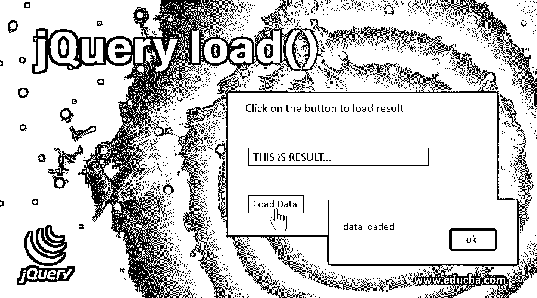
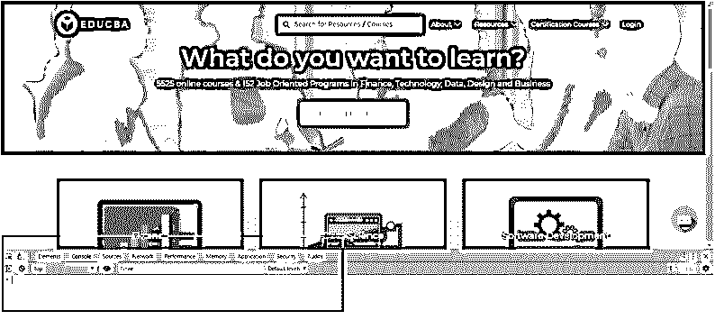
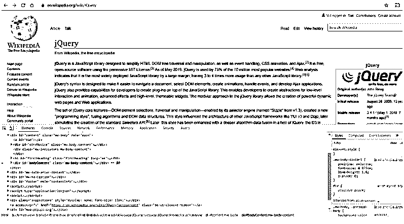
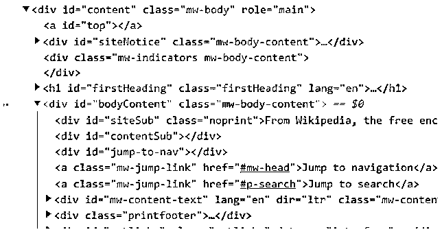
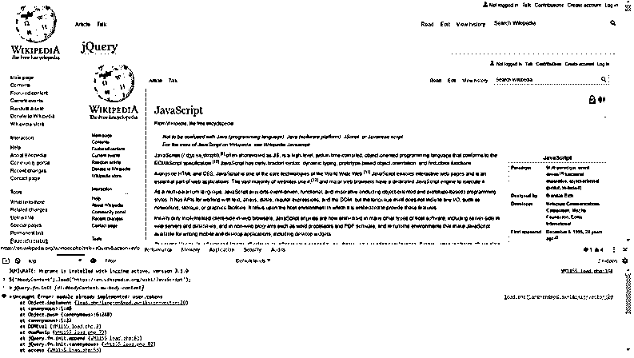
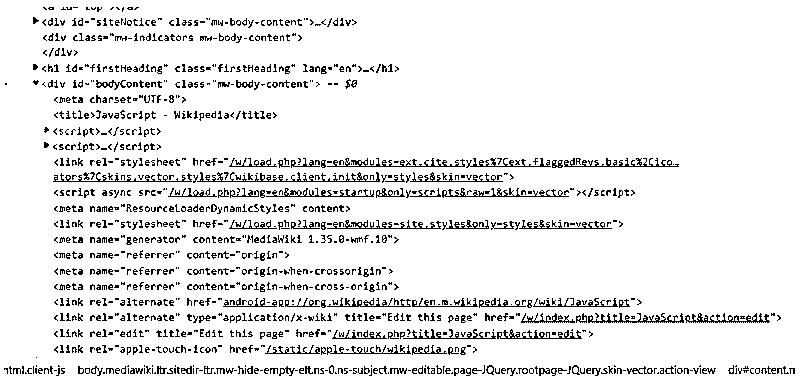

# jQuery load()

> 原文：<https://www.educba.com/jquery-load/>




## jQuery load()简介

jQuery 的 load()方法用于从服务器获取数据，并将 HTML 或文本响应放在 DOM 的元素中。因此，基本上，它是大多数脚本语言的两种传统方法的组合——全局 get 方法和获取 DOM 中的元素并设置其内容的相应方法。如果元素选择器与 DOM 中的任何元素都不对应，则不会调用 load 方法。

**NOTE:** Prior to jQuery v3.0, there was an event handler in jQuery by the name of the load. Whether the event handler would be invoked or the method was determined at run time based on the number of arguments passed. Post jQuery v3.0, the event handler has been deprecated, and we now only have the load() method to get data from the server and modify the contents of DOM elements with the response.

### load()方法的语法

load()方法的语法根据传递给该方法的可选参数的数量有三种变体。

<small>网页开发、编程语言、软件测试&其他</small>

*   基本和最基本的语法如下:

```
$(<element>).load(<url>);
```

该方法将获取指定 url 的内容，并将其插入到元素中。这是一个简单的 get 调用，没有数据随请求一起传递。

*   高级语法需要如下一些参数:

```
$(<element>).load(<url>, <data>);
```

在这里，数据和请求对象一起被发送到服务器。当服务器需要一些数据或参数以及请求对象时，这很有用。一个简单的例子是从服务器请求其详细信息的人的 id。

*   然后是包含回调函数的第三种语法:

```
$(<element>).load(<url>, <data>, [complete]);
```

这里 complete 是回调函数，当对服务器的请求完成时调用它。在收到响应和元素的 DOM 操作之后，对服务器的请求被认为是完成的。这里需要注意的非常重要的一点是，这个回调函数对选择器中的每个元素调用一次。

**NOTE:** If data is sent along with the request, the POST method is used by jQuery. If not, the GET method is assumed.

### load 方法是如何工作的？

让我们看看 load 方法的幕后。

**步骤 1–**从在 DOM 中查找元素开始。

**第 2 步–**如果找到了元素，下一步是向指定 url 的服务器发送 AJAX 请求。AJAX 是一个异步的 JavaScript 和 XML 调用。因为它们是异步的，所以确实需要页面刷新。

**步骤 3–**一旦从服务器收到响应，下一步就是插入 DOM 元素的响应。jQuery 使用浏览器的 [innerHTML 属性](https://www.educba.com/javascript-innerhtml/)来操作元素的内容。

**步骤 4—**现在是执行任何回调函数的时候了，如果有的话。

**NOTE:** jQuery uses the browser’s innerHTML property. During this process, often browsers filter the response to omit tags such as <html>, <title> or <head>. Due to this, the resulting content may not be exactly the same as when the document was to be retrieved by the browser directly.

### jQuery load()的示例

让我们看看 load()方法的一些例子。

**NOTE:** Throughout the examples in this article, we would be using the browsers’ developer console. Simply open the browser developer tools (Ctrl/Cmd + Shift + C) and go to the Console tab in the developer tools window.

在 Chrome 中看起来是这样的:




这是大多数 jQuery 相关概念的游乐场。在整篇文章中，我们都会用到这个操场。

现在，打开你的浏览器，进入任何基于 jQuery 的网站。出于本文的目的，我们需要一个可以返回数据的服务器。还有什么网站比数据的百科全书——维基百科(https://en . Wikipedia . org/wiki/JQuery)更好呢？幸运的是，它也是基于 jQuery 框架构建的。符合我们的目的。

打开开发人员控制台。




接下来，我们确定想要修改其内容的元素。让我们修改页面的全部内容。在“开发人员”窗口的“元素”选项卡中，您会看到元素是这样的:

```
<div id="bodyContent" class="mw-body-content">
```




这个元素是通过 id 属性 bodyContent 唯一定义的。我们将使用这个 id 作为选择器。

**NOTE:** Keep in mind that the attribute values are case sensitive – bodyContent is not the same as bodycontent.

现在，我们将从维基百科的 JavaScript 页面获取数据，并将其插入到 jQuery 页面的内容中。转到控制台选项卡，键入以下命令:

```
$("#bodyContent").load("https://en.wikipedia.org/wiki/JavaScript");
```

当您按 enter 键时，请注意 jQuery 页面的全部内容现在都包含了 JavaScript 页面的内容。




忽略错误——这是因为我们的实验导致多次实现一个对象模型，这导致维基百科的代码抛出一个错误。接下来，返回到 Elements 选项卡，再次搜索 bodyContent 元素。

请注意元素的整个 HTML 内容的变化。现在看起来是这样的:




您还可以通过 load 方法的 complete function 参数在整个操作成功时显示警告。返回控制台选项卡，键入以下命令:

```
$("#bodyContent").load("https://en.wikipedia.org/wiki/JavaScript", function(){
alert("Okay!!!");
});
```

### 负载方法的要素

jQuery 的 load()方法从 URL 中获取 HTML，并使用返回的 HTML 填充选定的元素；让我们来看看几个要素。

#### 加载页面片段

load()方法还允许我们加载内容的一个片段，而不是整个内容。让我们看看如何做到这一点。

```
$("#bodyContent").load("https://en.wikipedia.org/wiki/JavaScript #History");
```

去吧，试一试，自己看看结果。另外，转到 JavaScript 页面，通过 id 历史搜索元素。验证结果是否确实准确。

这里发生了什么？jQuery 加载了 url 的全部内容，但是对其进行了解析以找到 url 后缀的元素，并且只将元素的 innerHTML 内容插入到 DOM 中的 destination 元素中。

#### 执行脚本

jQuery 实现 load 方法时，在 url 后面附加一个选择器和在 url 后面不附加选择器之间有一个基本的区别。

在前一种情况下，会执行来自 url 的脚本。而在后一种情况下，脚本被省略。因此，

```
Executes scripts - $("#bodyContent").load("https://en.wikipedia.org/wiki/JavaScript");
Does not execute scripts - $("#bodyContent").load("https://en.wikipedia.org/wiki/JavaScript #History");
```

### 结论–jQuery load()

因此，我们已经在本文中介绍了 jQuery 的 load()函数。我们已经深入了解了 load 方法在幕后是如何工作的。建议用不同种类的数据多练习这种方法。这将帮助您更好地理解该函数是如何工作的。

### 推荐文章

这是 jQuery load()的指南。这里我们讨论 load()方法的一些例子，以及加载页面片段。您也可以看看以下文章，了解更多信息–

1.  [JQuery fadeToggle 效果](https://www.educba.com/jquery-fadetoggle/)
2.  [jQuery prepend()](https://www.educba.com/jquery-prepend/)
3.  [jQuery Clone()](https://www.educba.com/jquery-clone/)
4.  [jQuery append()](https://www.educba.com/jquery-append/)


