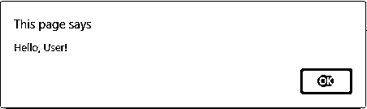
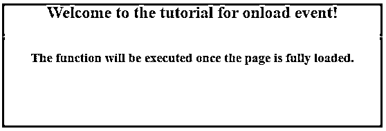
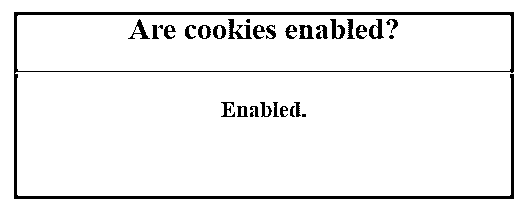
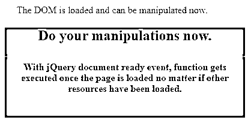

# jQuery onload

> 原文：<https://www.educba.com/jquery-onload/>


## jQuery onload 简介

在 JavaScript 中，我们有一个与窗口对象相关联的事件处理程序，称为 download。当 onload 事件发生时，onload 事件处理程序执行所需的函数，而当一个对象及其所有相关资源被完全加载时，onload 事件又会发生。onload 事件可以在需要执行一次功能时应用，并且仅在网页被完全加载时应用，包括所有图像、脚本、CSS 文件等。

onload 事件可用于自动检查访问者的浏览器类型和版本，并根据来自用户浏览器的信息加载页面的正确版本。这个事件也可以用于检查 cookies。所有流行的浏览器都支持 onload 方法。onload 通常用在元素中，它在页面加载完所有内容而不仅仅是 DOM 后执行脚本。

<small>网页开发、编程语言、软件测试&其他</small>

**语法:**

```
<body onload="functionToBeExecuted">
```

在哪里，

*   functionToBeExecuted 是指页面完全加载后执行的函数。

### 实现 jQuery onload 方法的示例

让我们看几个例子来理解如何在网页中实现 onload 事件。

#### 示例#1

下面的示例说明了 onload 事件如何在页面加载后立即显示警告消息。

**代码:**

```
<!DOCTYPE html>
<html>
<head>
<script src="https://code.jquery.com/jquery-1.12.4.min.js"></script>
<style>
#divstyle {
text-align: center;
background-color: cadetblue;
width: 550px;
height: 180px;
margin-left: 100px;
}
</style>
</head>
<body onload="myFunction()">
<div id="divstyle">
<h2>Welcome to the tutorial for onload event!</h2>
<hr />
<h3>The function will be executed once the page is fully loaded.</h3>
</div>
<script>
function myFunction() {
alert("Hello, User!");
}
</script>
</body>
</html>
```

**输出**

*   上面的代码一执行，下面的屏幕就会加载到网页中。
*   在下面的截图中，我们看到一个弹出的警告框显示了一个特定的消息和一个按钮。




*   这是一个问候/欢迎消息的例子，当资源被加载到页面上时就开始了。
*   它演示了如何使用 jQuery onload 事件将问候消息合并到 web 页面中。
*   单击警告框中的“确定”按钮，警告框消失，出现以下屏幕。




#### 实施例 2

在下面的例子中，我们使用一个 jQuery onload 事件来处理 cookies。

**代码:**

```
<!DOCTYPE html>
<html>
<head>
<script src="https://code.jquery.com/jquery-1.12.4.min.js"></script>
<style>
#divstyle {
text-align: center;
background-color: cadetblue;
width: 400px;
height: 150px;
margin-left: 100px;
}
#status {
font-size: large;
color: brown;
font-weight: bold;
}
</style></head>
<body onload="checkCookies()">
<div id="divstyle">
<h2>Are cookies enabled?</h2>
<hr />
<p id="status"></p>
</div>
<script>
function checkCookies() {
var text = "";
if (navigator.cookieEnabled == true) {
text = "Enabled.";
} else {
text = "Disabled.";
}
document.getElementById("status").innerHTML = txt;
}
</script>
</body>
</html>
```

**输出**

*   下面的屏幕截图是执行上述代码后显示在页面上的输出。
*   一旦页面及其所有资源被完全加载，就会启动 checkCookies()函数。




**注:**

*   **ready()** 事件和 **body.onload()** 事件，都有一个类似的工作要做，就是在页面加载的时候执行脚本，但是两者有一个关键的区别。
*   不同之处在于， **onload()** 事件仅在整个 DOM 连同相关资源被完全加载之后才被调用，而 jQuery 的 **document.ready()** 事件在 DOM 被加载之后才被调用，而无需等待相关资源，例如图像、脚本文件等。去装子弹。
*   一个页面中可以有多个 **ready()** 事件，但是 **body.onload()** 事件只能有一个。

#### 实施例 3

在下面的例子中，我们试图演示 jQuery document ready()事件与 jQuery onload 事件的不同之处。

**代码:**

```
<!DOCTYPE html>
<html lang="en">
<head>
<meta charset="utf-8" />
<title>Example for jQuery ready()</title>
<script src="https://code.jquery.com/jquery-1.12.4.min.js"></script>
<script>
$(document).ready(function() {
$("p").text("The DOM is loaded and can be manipulated now.");
});
</script>
<style>
#divstyle {
text-align: center;
background-color: cadetblue;
width: 400px;
height: 150px;
margin-left: 100px;
}
p {
color: crimson;
margin-left: 120px;
}
</style>
</head>
<body>
<p>Not loaded.</p>
<div id="divstyle">
<h2>Do your manipulations now.</h2>
<hr />
<b style="color: darkblue;">
With jQuery document ready event, function gets executed once the page
is loaded no matter if other resources have been loaded.
</b>
</div>
</body>
</html>
```

**输出:**

*   下面的屏幕截图显示了执行上述代码时的输出。
*   加载 DOM 时，网页上会显示一条消息。




### 结论

*   在本文中，我们讨论了如何在加载了整个页面之后才运行 JavaScript。
*   jQuery 为此提供了两种方法，jQuery document ready()和 jQuery onload()用于此目的。
*   jQuery document ready 事件只有在 DOM 被加载时才会被触发，不管其他所有相关的资源是否已经被加载。
*   当页面连同所有相关的图像、脚本、文件等被完全加载时，jQuery onload 事件被触发。
*   onload 事件可用于识别访问者的浏览器类型和版本，然后相应地加载页面。
*   这也是用来处理饼干的。

### 推荐文章

这是 jQuery onload 的指南。这里我们讨论 jquery onload 的介绍和语法，以及不同的例子和代码实现。您也可以看看以下文章，了解更多信息–

1.  [jQuery 是数值型的](https://www.educba.com/jquery-isnumeric/)
2.  [jQuery 变更()](https://www.educba.com/jquery-change/)
3.  [JQuery InputMask](https://www.educba.com/jquery-inputmask/)
4.  [jQuery html()](https://www.educba.com/jquery-html/)


