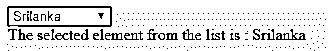
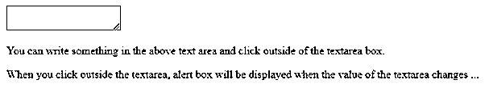
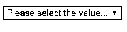
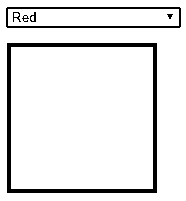
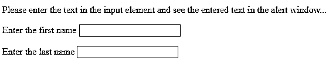
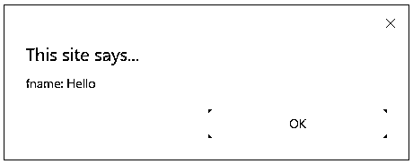

# jQuery 更改()

> 原文：<https://www.educba.com/jquery-change/>


## jQuery change()简介

每当元素的值改变时，就会发生 jQuery change 事件。change()事件仅限于<input>元素、<textarea>框和<select>元素。jQuery change()方法将这些 html 元素添加到事件处理程序方法中，并在 change 事件被激活时执行事件处理程序函数。每当用户用鼠标对选择框、复选框和单选按钮进行选择时，change()方法将被立即触发。当字段未获得其他元素类型的焦点时，将发生该事件。将事件处理程序附加到 JavaScript change()事件，或者激活元素上的事件。</select></textarea>

**语法:**

<small>网页开发、编程语言、软件测试&其他</small>

*   它为选定的元素生成一个更改事件，如下所示:

```
$(selector).change()
```

*   它通过向所选元素添加函数来为其提供更改事件，如下所示:

```
$(selector).change (content)
```

该方法采用如上所述的以下参数:

*   **Function** :可选参数，规定所选元素发生变化事件时运行的函数。经过修改后，[返回值将是一个元素](https://www.educba.com/python-return-value/)。

语法可以写成如下所示:

```
$(selector).change (function(){
//define your code here to execute once the change event is happened.
});
```

### 实现 jQuery change()方法的示例

我们经常遇到这样的情况，我们需要识别或检测对文本框或下拉列表所做的更改。jQuery change()方法将允许您识别或检测输入元素中的任何修改。只有当元素值发生变化时，jQuery change 事件才起作用。它只在表单字段中操作。一旦 change 事件发生，change()方法就会添加一个函数来运行它。

以下是 jQuery change()方法的示例:

#### 示例#1

**代码:**

```
<!DOCTYPE html>
<html lang="en">
<head>
<meta charset="utf-8">
<title>jQuery change() method</title>
<style>
div {
color: green;
}
</style>
<script src="https://code.jquery.com/jquery-1.10.2.js"></script>
</head>
<body>
<select id="mytxt" name="list" >
<option>South Africa</option>
<option selected="selected">India</option>
<option>Australia</option>
<option>New Zealand</option>
<option>Srilanka</option>
<option>England</option>
</select>
<div id="mytxt1"></div>
<script>
$( "select" ) .change(function () {
document.getElementById("mytxt1").innerHTML=" The selected element from the list is : "+document.getElementById("mytxt").value;
});
</script>
</body>
</html>
```

**输出:**

当您运行上面的代码时，您会看到所选择的元素名称是绿色的。将从列表中选择元素，该列表使用与元素的“id”相关联的<select>标签，并且应该在</select>标签和

输出将显示如下图所示:




#### 实施例 2

**代码:**

```
<!DOCTYPE html>
<html lang="en">
<head>
<meta charset="utf-8">
<title> jQuery change() method </title>
<style>
div {
color: green;
}
</style>
<script src="https://code.jquery.com/jquery-1.10.2.js"></script>
</head>
<body>
<select name="list" multiple="multiple">
<option>India</option>
<option selected="selected">South Africa</option>
<option>England</option>
<option selected="selected">New Zealand</option>
<option>Srilanka</option>
<option>Australia</option>
</select>
<div></div>
<script>
$( "select" )
.change(function () {
var str_val = "";
$( "select option:selected" ).each(function() {
str_val += $( this ).text() + " ";
});
$( "div" ).text( str_val );
})
.change();
</script>
</body>
</html>
```

**输出:**


在上面的例子中，可以从列表中选择多个元素。

#### 实施例 3

**代码:**

```
<!DOCTYPE html>
<html>
<head>
<meta charset="utf-8">
<title> jQuery change() method </title>
<script src="https://ajax.googleapis.com/ajax/libs/jquery/3.4.0/jquery.min.js">
</script>
<script>
$(document).ready(function(){
$("textarea").change(function(){
alert(" The value of the text area has been changed ... ");
});
});
</script>
</head>
<body>
<textarea type="text"></textarea>
<p> You can write something in the above text area and click outside of the textarea box. </p>
<p> WHen you click outside the textarea, alert box will be displayed when the value of the textarea changes ...</p>
</body>
</html>
```

**输出:**

当您加载上述代码时，将显示以下结果。下面的输出显示了文本区域值更改之前的情况:




当您在文本区域中键入文本并在文本区域外单击时。这将改变文本区域的值，从而触发 change 事件。警告框将显示在输出上，然后可以设置更改事件处理函数。

#### 实施例 4

**代码:**

```
<!doctype html>
<html>
<head>
<title> jQuery change() method </title>
<script src="https://ajax.googleapis.com/ajax/libs/jquery/1.11.1/jquery.min.js"></script>
</head>
<body>
<select id="txt" style="width:auto;">
<option> Please select the value... </option>
<option value="red"> Red </option>
<option value="orange"> Orange </option>
<option value="green"> Green </option>
</select><br />
<p id="myElement" style="width:150px; height:150px;"></p>
</body>
<script>
$(document).ready(function () {
$('#txt').change(function () {
switch (this.value) {
case "red":
case "orange":
case "green":
$('#myElement').css('background-color', this.value); break;
default: $('#myElement').css('background-color', '#FFF'); break;
}
});
});
</script>
</html>
```

**输出:**




在上面的结果中，当您从列表中选择特定的颜色名称时，相应的颜色将显示在框中。




#### 实施例 5

**代码:**

```
<!doctype html>
<html>
<head>
<meta charset="utf-8">
<title> jQuery change() method </title>
<script src="https://ajax.googleapis.com/ajax/libs/jquery/1.11.1/jquery.min.js"></script>
</head>
<body>
<p> Please enter the text in the input element and see the entered text in the alert window... </p>
<p> Enter the first name <input type="text" id="fname" value="" /></p>
<p> Enter the last name <input type="text" id="lname" value="" /></p>
</body>
<script>
$(document).ready(function () {
$('#fname').change(function () {
alert($(this).attr('id') + ': ' + $(this).val());
});
$('#lname').change(function () {
alert($(this).attr('id') + ': ' + $(this).val());
});
});
</script>
</html>
```

**输出:**

当您运行代码时，您将得到下面的输出。




在文本字段中输入文本，如下所示:




在输入字段中输入文本，并在输入元素外单击鼠标，文本将显示在警告框中。


### 结论

到目前为止，我们已经看到了如何使用 jQuery change()方法轻松捕捉元素的变化。这绝对是一个非常有用的方法，因为它帮助我们收集客户端的值，并在提交信息之前进行一些验证。jQuery change()方法必须执行 change 事件，或者在发生更改时包含要实现的函数。change 事件在选择菜单选项时发生。一旦信息被更改，当字段失去文本字段或文本区域的焦点时，就会发生 change 事件。jQuery change()方法是使用 on()或 trigger()方法的替代方法，将 change 事件作为第一个参数。

### 推荐文章

这是 jQuery change()的指南。在这里，我们讨论 jQuery change()方法的工作原理及其示例和代码实现。您也可以浏览我们推荐的其他文章，了解更多信息——

1.  [jQuery empty()](https://www.educba.com/jquery-empty/)
2.  [jQuery Slidetoggle()](https://www.educba.com/jquery-slidetoggle/)
3.  [jQuery unload()方法？](https://www.educba.com/jquery-unload/)
4.  [jQuery 验证](https://www.educba.com/jquery-validate/)


