# jQuery mouseenter()

> 原文：<https://www.educba.com/jquery-mouseenter/>

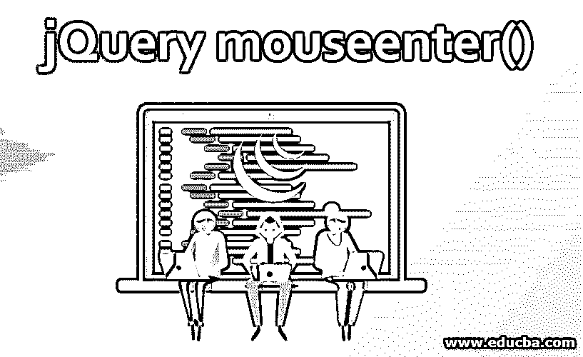


## jQuery mouseenter()简介

jQuery mouseenter()方法是一个内置的 jQuery 事件处理方法。当鼠标指针进入 HTML 元素或者鼠标光标在所选元素上时，它被执行。当一个处理程序附加到这个方法时，一旦鼠标光标进入会话，这个处理程序就在所选的方法上执行。

**语法:**

<small>网页开发、编程语言、软件测试&其他</small>

| **语法** | **参数描述** | **值类型** | **版本** |
| $(selector).mouseenter()组合键 | 钠 | 钠 | One |
| $(选择器)**。**鼠标输入(处理程序/函数) | **处理程序:**接受每次触发事件时将要执行的函数名。 | **处理程序:**函数(事件对象)。 | One |
| $(选择器)。mouse enter([事件数据]，处理程序) | **1\. eventData: **The object containing data that will be passed to the handler.**2。处理程序:**(之前描述过)。 | **1\. eventData:** Any**2。Handler:** 函数(事件对象)。 | 1.4.3 |

### 实现 jQuery mouseenter()的示例

以下是一些有助于更好理解的例子:

#### 1.不使用任何参数

可以在不提供任何输入参数的情况下使用 mouseenter()方法。它用于附加到一个元素的鼠标悬停事件需要由另一个元素调用。下面的示例演示了在单击“button”元素时附加到

元素的 mouseenter 事件的执行。该事件被定义为当鼠标光标进入

会话或点击配置按钮时，改变该会话的背景颜色。

**代码:**

```
<!DOCTYPE html>
<html>
<head>
<script src="https://ajax.googleapis.com/ajax/libs/jquery/3.4.1/jquery.min.js"></script>
<script>
$(document).ready(function(){
//mouseenter() event is called on 'p'' element
$("p").mouseenter(function(){
$("p").css("background-color", "#7DCEA0");
});
$("p").mouseleave(function(){
$("p").css("background-color", "#AEB6BF");
});
//mouseenter() event is called by button element to execute on 'p' element
$("#btn1").click(function(){
$("p").mouseenter();
});
$("#btn2").click(function(){
$("p").mouseleave();
});
});
</script>
</head>
<body style="background-color: beige;">
<p style="font-family: Arial, Helvetica, sans-serif;font-size: 30px;">This session is defined under 'p' html element</p>
<button id="btn1">Click here to trigger mouseenter event on 'p' element</button><br><br>
<button id="btn2">Click here to trigger mouseleave event on 'p' element</button>
</body>
</html>
```

**输出:**

在调用 mouseenter()方法之前，

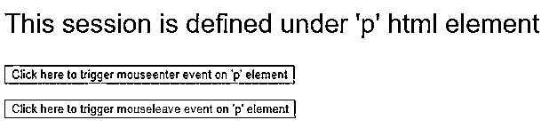


调用 mouseenter()方法后，

**屏幕 1:** 点击按钮‘点击此处触发‘p’元素上的 mouseenter 事件’。

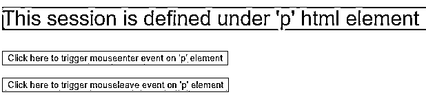


**屏幕 2:** 点击按钮‘点击此处触发‘p’元素上的鼠标离开事件’。

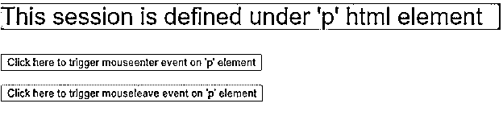


**屏幕 3:** 鼠标进入< p >元素会话。

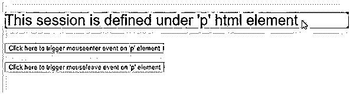


**屏幕 4:** 鼠标退出< p >元素会话。

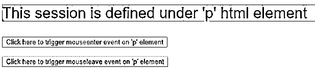


**Note:** mouseenter() event is often used along with mouseleave() event.

#### 2.带有“处理程序/函数”参数

对于 jQuery mouseenter()，函数或处理程序名称可以作为输入参数传递。当鼠标光标进入所选元素时，mouseenter()事件被调用，触发作为输入参数值提供的处理函数。在下面的代码片段中，mouseenter()事件应用于

会话。它有一个参数值的功能，每次鼠标光标进入' div '会话并在页面上显示计数。

**代码:**

```
<!doctype html>
<html lang="en">
<head>
<meta charset="utf-8">
<title>mouseenter() with handler</title>
<style>
div.out {
width: 40%;
height: 250px;
margin: 0 15px;
background-color:#F7DC6F ;
float: left;
}
div.in {
width: 60%;
height: 50%;
background-color:#E5E8E8 ;
margin: 10px auto;
}
p {
line-height: 2em;
margin: 1em;
padding: 0;
font-family: Arial, Helvetica, sans-serif;
font-size: 30px;
}
</style>
<script src="https://code.jquery.com/jquery-3.4.1.js"></script>
</head>
<body style="background-color: beige;">
<div class="in enterleave"><p>Move your mouse over here</p><p>0</p></div>
<script>
$( "div.overout" )
var n = 0;
$( "div.enterleave" )
//mouseenter() event is called on 'div' element
.mouseenter(function() {
$( "p", this ).first().text( "Number of times mouse entered:" );
//increases the count, each time the event is called
$( "p", this ).last().text( ++n );
})
.mouseleave(function() {
$( "p", this ).first().text( "Number of times mouse exited:" );
});
</script>
</body>
</html>
```

**输出:**

在调用 mouseenter()方法之前，

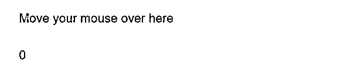


调用 mouseenter()方法后，

**画面 1:** 鼠标已经进入过一次< div >元素会话。

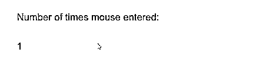


**屏幕 2:** 鼠标已经退出了一次< div >元素会话。

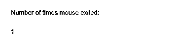


**屏幕 3:** 鼠标已经两次进入< div >元素会话。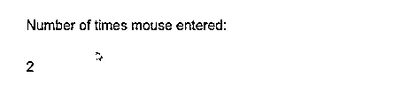


**屏幕 4:** 鼠标已经两次退出< div >元素会话。

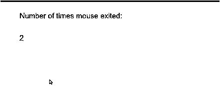


#### 3.带有“eventdata”和“handler”参数

此类型用于与 mouseenter()事件关联的处理程序方法使用 mouseenter()方法中给定的“事件数据”参数值作为输入。在下面的代码片段中，“param 1”的值作为事件数据值给出，该值通过“event”对象传递给处理函数。该函数被定义为在每次鼠标进入

会话时进行计数，并显示计数值以及追加的 param1 字符串值。

**代码:**

```
<!doctype html>
<html lang="en">
<head>
<meta charset="utf-8">
<title>mouseenter() with handler</title>
<style>
div.out {
width: 40%;
height: 250px;
margin: 0 15px;
background-color:#F7DC6F ;
float: left;
}
div.in {
width: 60%;
height: 50%;
background-color:#E5E8E8 ;
margin: 10px auto;
}
p {
line-height: 2em;
margin: 1em;
padding: 0;
font-family: Arial, Helvetica, sans-serif;
font-size: 30px;
}
</style>
<script src="https://code.jquery.com/jquery-3.4.1.js"></script>
</head>
<body style="background-color: beige;">
<div class="in enterleave"><p>Move your mouse over here</p><p>0</p></div>
<script>
$( "div.overout" )
var n = 0;
$( "div.enterleave" )
//mouseenter() event is called by button element to execute on 'p' element,
//the handler input is the function to count each time, the mouse cursor has //entered the ‘p’ session
//eventdata input is ‘param1’
.mouseenter({param1:' time(s), the mouse has entered here.'},function(event) {
$( "p", this ).first().text( "Display the count of entries appending the event data:" );
$( "p", this ).last().text((n+=1)+event.data.param1);
})
.mouseleave({param1:' time(s), the mouse has exited.'},function(event) {
$( "p", this ).first().text( "Display the count of exits appending the event data:" );
$( "p", this ).last().text(n+event.data.param1);
});
</script>
</body>
</html>
```

**输出:**

在调用 mouseenter()方法之前，

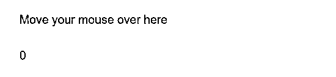


调用 mouseenter()方法后，

**画面 1:** 鼠标已经进入过一次< div >元素会话。

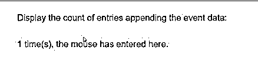


**屏幕 2:** 鼠标已经退出了一次< div >元素会话。

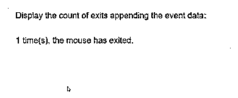


**屏幕 3:** 鼠标已经两次进入< div >元素会话。

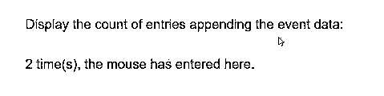


**屏幕 4:** 鼠标已经两次退出< div >元素会话。

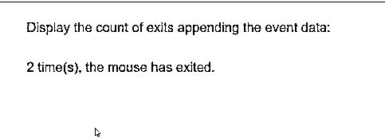


### 结论

该方法类似于 mouseover()事件。不同之处在于，当鼠标进入所选元素或其子元素时，mouseover()事件会被触发，而 mouseenter()事件只有在鼠标进入所选元素时才会被触发。这种方法是。on("mouseenter "，处理程序)*。*基本上，该事件属于 Internet Explorer，但是该事件的通用实用程序使 jQuery 能够模拟该事件，而不考虑浏览器。可以在{}内给定多个“eventdata”输入，用逗号分隔。

### 推荐文章

这是 jQuery mouseenter()的指南。在这里，我们讨论用代码实现来实现 jQuery mouseenter()的语法、参数和不同的例子。您也可以浏览我们推荐的文章，了解更多信息——

1.  [jQuery keydown()](https://www.educba.com/jquery-keydown/)
2.  [jQuery prop( )](https://www.educba.com/jquery-prop/)
3.  [jQuery 选择器](https://www.educba.com/jquery-elements/)
4.  [jquery intrawidth()](https://www.educba.com/jquery-innerwidth/)


