# jQuery mouseover()

> 原文：<https://www.educba.com/jquery-mouseover/>

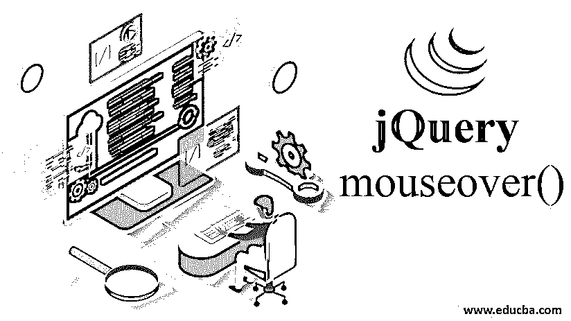


## jQuery mouseover()简介

jQuery mouseover()方法是一个内置的 jQuery 事件处理方法。当鼠标指针进入任何选中的 HTML 元素时，它就会被执行。当一个处理程序附加到这个方法时，一旦鼠标光标进入会话，这个处理程序就在所选的方法上执行。

**语法:**

<small>网页开发、编程语言、软件测试&其他</small>

| **语法** | **参数描述** | **值类型** | **版本** |
| $(选择器)。鼠标悬停() | 钠 | 钠 | One |
| $(选择器)**。**鼠标悬停(处理程序/函数) | **处理程序:**接受每次触发事件时将要执行的函数名。 | **处理程序**-函数(事件对象) | One |
| $(选择器)。鼠标悬停([事件数据]，处理程序) | **eventData: **The object containing data which will be passed to the handler

**处理程序:**(如前所述)

 | **eventData:** Any**处理程序:**函数(事件对象) | 1.4.3 |

### 在 JQuery mouseover()中实现的示例

以下是要实施的示例:

#### 示例# 1–不使用任何参数

*   可以在不提供任何输入参数的情况下使用 mouseover()方法。它用于附加到一个元素的鼠标悬停事件需要由另一个元素调用。
*   下面的示例演示了在单击“button”元素时执行附加到

    元素的 mouseover 事件。该事件被定义为当鼠标光标进入

    会话或点击配置按钮时，改变该会话的背景颜色。

**代码:**

```
<!DOCTYPE html>
<html>
<head>
<script src="https://ajax.googleapis.com/ajax/libs/jquery/3.4.1/jquery.min.js"></script>
<script>
$(document).ready(function(){
//mouseover() event is called on 'p'' element
$("p").mouseover(function(){
$("p").css("background-color", "#7DCEA0");
});
$("p").mouseleave(function(){
$("p").css("background-color", "#AEB6BF");
});
//mouseover() event is called by button element to execute on 'p' element
$("#btn1").click(function(){
$("p").mouseover();
});
$("#btn2").click(function(){
$("p").mouseleave();
});
});
</script>
</head>
<body style="background-color: beige;">
<p style="font-family: Arial, Helvetica, sans-serif;font-size: 30px;">This session is defined under 'p' html element</p>
<button id="btn1">Click here to trigger mouseover event on 'p' element</button><br><br>
<button id="btn2">Click here to trigger mouseleave event on 'p' element</button>
</body>
</html>
```

**输出:**

**在调用 mouseover()方法之前**:

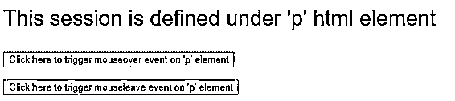


**调用 mouseover()方法后:**

*   **屏幕 1:** 点击按钮‘点击此处触发‘p’元素上的鼠标悬停事件’。

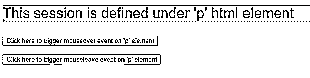


*   **屏幕 2:** 点击按钮‘点击此处触发‘p’元素上的鼠标离开事件’。

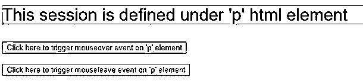


*   **屏幕 3:** 鼠标进入< p >元素会话。

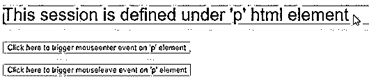


*   **屏幕 4:** 鼠标退出< p >元素会话。


**Note:** mouseover() event is often used along with mouseleave() event.

#### 示例# 2–带有“处理程序/函数”参数

*   对于 jQuery mouseover()，函数或处理程序名称可以作为输入参数传递。当鼠标光标进入所选元素时，mouseover()事件被调用，触发作为输入参数值提供的处理函数。
*   在下面的代码片段中，mouseover()事件应用于会话。它有一个参数值的功能，每次鼠标光标进入' div '会话并在页面上显示计数。

**代码:**

```
<!doctype html>
<html lang="en">
<head>
<meta charset="utf-8">
<title>mouseover() with handler</title>
<style>
div.out {
width: 40%;
height: 250px;
margin: 0 15px;
background-color:#F7DC6F ;
float: left;
}
div.in {
width: 60%;
height: 50%;
background-color:#E5E8E8 ;
margin: 10px auto;
}
p {
line-height: 2em;
margin: 1em;
padding: 0;
font-family: Arial, Helvetica, sans-serif;
font-size: 30px;
}
</style>
<script src="https://code.jquery.com/jquery-3.4.1.js"></script>
</head>
<body style="background-color: beige;">
<div class="in enterleave"><p>Move your mouse over here</p><p>0</p></div>
<script>
$( "div.overout" )
var n = 0;
$( "div.enterleave" )
.mouseover(function() {
$( "p", this ).first().text( "Number of times mouse entered:" );
//increases the count, each time the event is called
$( "p", this ).last().text( ++n );
})
.mouseleave(function() {
$( "p", this ).first().text( "Number of times mouse exited:" );
});
</script>
</body>
</html>
```

**输出:**

**在调用 mouseover()方法之前:**

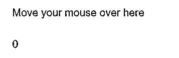


**调用 mouseover()方法后:**

*   **画面 1:** 鼠标已经进入过一次< div >元素会话。

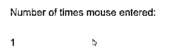


*   **屏幕 2:** 鼠标已经退出了一次< div >元素会话。

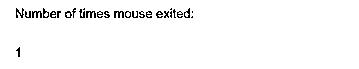


*   **屏幕 3:** 鼠标已经两次进入< div >元素会话。

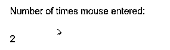


*   **屏幕 4:** 鼠标已经两次退出< div >元素会话。

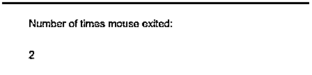


#### 示例# 3–带有“eventdata”和“handler”参数的 mouseover()

*   此类型用于与 mouseover()事件关联的处理程序方法使用 mouseover()方法中给定的“事件数据”参数值作为输入。
*   在下面的代码片段中，“param 1”的值作为事件数据值给出，该值通过“event”对象传递给处理函数。该函数被定义为在每次鼠标进入会话时进行计数，并显示计数值以及追加的 param1 字符串值。

**代码**:

```
<!doctype html>
<html lang="en">
<head>
<meta charset="utf-8">
<title>mouseover() with handler</title>
<style>
div.out {
width: 40%;
height: 250px;
margin: 0 15px;
background-color:#F7DC6F ;
float: left;
}
div.in {
width: 60%;
height: 50%;
background-color:#E5E8E8 ;
margin: 10px auto;
}
p {
line-height: 2em;
margin: 1em;
padding: 0;
font-family: Arial, Helvetica, sans-serif;
font-size: 30px;
}
</style>
<script src="https://code.jquery.com/jquery-3.4.1.js"></script>
</head>
<body style="background-color: beige;">
<div class="in enterleave"><p>Move your mouse over here</p><p>0</p></div>
<script>
$( "div.overout" )
var n = 0;
$( "div.enterleave" )
//mouseover() event is called by button element to execute on 'p' element,
//the handler input is the function to count each time, the mouse cursor has //entered the ‘p’ session
//eventdata input is ‘param1’
.mouseover({param1:' time(s), the mouse has entered here.'},function(event) {
$( "p", this ).first().text( "Display the count of entries appending the event data:" );
$( "p", this ).last().text((n+=1)+event.data.param1);
})
.mouseleave({param1:' time(s), the mouse has exited.'},function(event) {
$( "p", this ).first().text( "Display the count of exits appending the event data:" );
$( "p", this ).last().text(n+event.data.param1);
});
</script>
</body>
</html>
```

**输出:**

**在调用 mouseover()方法之前:**

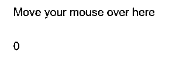


**调用 mouseover()方法后:**

*   **画面 1:** 鼠标已经进入过一次< div >元素会话。


*   **屏幕 2:** 鼠标已经退出了一次< div >元素会话。

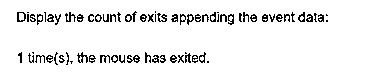


*   **屏幕 3:** 鼠标已经两次进入< div >元素会话。

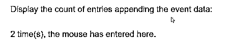


*   **屏幕 4:** 鼠标已经两次退出< div >元素会话。

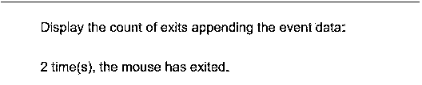


### 附加注释

*   该方法类似于 mouseenter()事件。不同之处在于，当鼠标进入所选元素或其子元素时，mouseover()事件会被触发，而 mouseenter()事件只有在鼠标进入所选元素时才会被触发。
*   这种方法是。on( "mouseover "，处理程序)。
*   基本上，由于事件冒泡，这种事件类型会导致不确定的行为。如果鼠标指针在内部元素上移动，一个 mouseover()会被发送到内部元素，但也会慢慢移动到外部元素。
*   可以在{}内给定多个“eventdata”输入，用逗号分隔。

### 推荐文章

这是 jQuery mouseover()的指南。这里我们讨论 JQuery mouseover()中的语法，举例实现 JQuery mouseover()。您也可以浏览我们的其他相关文章，了解更多信息——

1.  [jQuery detach()](https://www.educba.com/jquery-detach/)
2.  [jQuery slideDown()](https://www.educba.com/jquery-slidedown/)
3.  [jQuery scrollTop()](https://www.educba.com/jquery-scrolltop/)
4.  [jQuery 之后()](https://www.educba.com/jquery-after/)


