# jQuery 鼠标按下

> 原文：<https://www.educba.com/jquery-mousedown/>

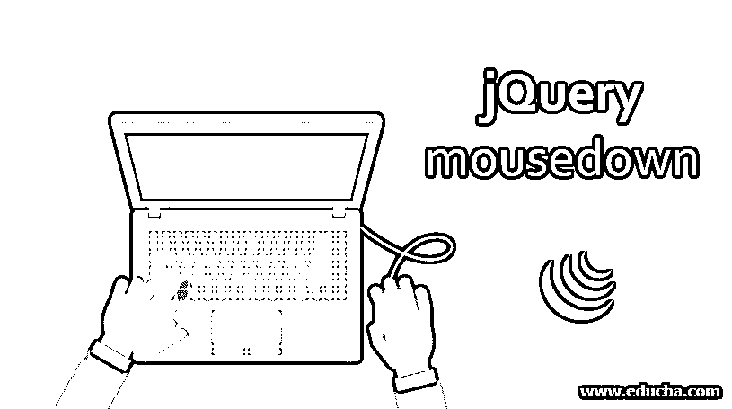


## jQuery mousedown()简介

当选定的元素向下按鼠标左键时，鼠标按下事件发生，jQuery mousedown()方法激活鼠标按下事件或绑定一个函数以在鼠标按下事件发生时运行。使用这个事件处理程序，我们可以做任何操作。如果我们不知道 mousedown 事件对于特定情况是最佳的，那么使用 click 事件通常更容易。鼠标按下方法通常与 mouseup()过程结合使用。此类事件主要用于检查主按钮是否启动了拖动操作；如果错过，当用户试图使用上下文菜单时会出现异常结果。

**语法:**

<small>网页开发、编程语言、软件测试&其他</small>

以下语法用于将函数附加到 mousedown 事件:

```
$(selector).mousedown(function)
```

在上面的语法中，函数允许一个可选的单参数函数。这用于定义调用 mousedown 事件时要执行的函数。以一种简单的方式，它将 mousedown 事件连接到函数。

当 mousedown 事件触发所选元素时，还可以使用一种语法:

```
$(selector).mousedown()
```

### 实现 jQuery mousedown()的示例

让我们看几个例子来理解用法和实现。

#### 示例#1

**代码:**

```
<!DOCTYPE html>
<html>
<head>
<meta charset="utf-8">
<title>jquery Mousedown Demo</title>
<script src="http://ajax.googleapis.com/ajax/libs/jquery/1.11.2/jquery.min.js"></script>
<script>
$(document).ready(function(){
$("#heading").mousedown(function(){
$( "div" ).text( "The mouse event has been triggered!!!" ).show().fadeOut( 2000 );
});
});
</script>
</head>
<body>
<h2 id="heading">Click on this heading...mouse event will get triggered...</h2>
<div></div>
</body>
</html>
```

**输出:**

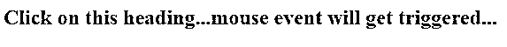


在上面的输出中，当你点击文本行时，鼠标按下事件将被触发，并且它将在 2 秒内从 HTML 页面中淡出。

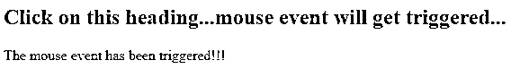


#### 实施例 2

**代码:**

```
<!DOCTYPE html>
<html>
<head>
<meta charset="utf-8">
<title>jquery Mousedown Demo</title>
<script src="http://ajax.googleapis.com/ajax/libs/jquery/1.11.2/jquery.min.js"></script>
<script>
$(document).ready(function(){
$("#heading").mousedown(function(){
$("#heading").css("background-color", "blue");
});
$("#heading").mouseup(function(){
$("#heading").css("background-color", "grey");
});
});
</script>
</head>
<body>
Press down the mouse left button on this text...
<div></div>
</body>
</html>
```

**输出:**

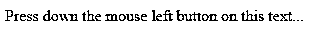


当您单击上面输出中的文本行时，鼠标按下事件将被触发，其背景颜色将变为蓝色。

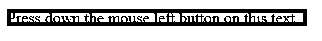


当你点击左侧，当鼠标抬起时，背景颜色将变成灰色。

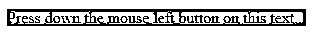


#### 实施例 3

**代码:**

```
<!DOCTYPE html>
<html>
<head>
<title>jquery Mousedown Demo</title>
<script src= "https://ajax.googleapis.com/ajax/libs/jquery/3.3.1/jquery.min.js"> </script>
<script>
$(document).ready(function() {
$("div").mousedown(function() {
alert("The left mouse key has been pressed... !!!");
});
});
</script>
<style>
.heading {
width: 150px;
height: 30px;
font-weight: 300;
border: 1px solid grey;
padding: 30px;
}
</style>
</head>
<body>
<!-- click on the button and alert box will get appear-->
<div class="heading">Welcome to EDUCBA.. !!!</div>
</body>
</html>
```

**输出:**

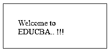


在上面的输出中，当您单击文本行时，鼠标按下事件将被触发，它将在页面上显示警告框。当您单击左侧时，将在警告框中触发鼠标按下事件。

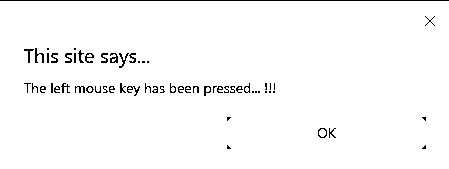


#### 实施例 4

**代码:**

```
<!DOCTYPE html>
<html>
<head>
<meta charset="utf-8">
<title>jquery Mousedown Demo</title>
<script src="http://ajax.googleapis.com/ajax/libs/jquery/1.11.2/jquery.min.js"></script>
<script>
$(document).ready(() => {
$(".heading").mousedown(function () {
$(this).after("<p style=\"color:#F9AD69;\"> Welcome to EDUCBA.. !!!... !!!</p>");
});
});
</script>
</head>
<body>
<div class = "heading">Click on the mouse button to see the mouse down event ...</div>
<div></div>
</body>
</html>
```

**输出:**

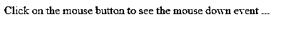


在下面的输出中，当您单击鼠标按钮时，鼠标按下事件将被触发，并且它将在用户每次单击按钮时显示文本。

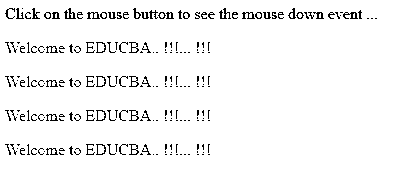


#### 实施例 5

**代码:**

```
<!DOCTYPE html>
<html>
<head>
<title>jquery Mousedown Demo</title>
<script src="http://ajax.googleapis.com/ajax/libs/jquery/1.11.2/jquery.min.js"></script>
<script>
$(document).ready(function(){
$("div").mouseup(function(){
$( this ).text("This is mouse up event, got triggered...");
});
$("div").mousedown(function(){
$( this ).text("This is mouse down event, got triggered...");
});
});
</script>
<style>
.heading
{
padding:6px;
text-align:center;
background-color:#F1D9C3;
border:solid 1px red;
}
</style>
</head>
<body>
<div class="heading">Click on this box, hold the mouse key and release it after sometime... !!!</div>
</body>
</html>
```

**输出:**

在上面的输出中，它将显示文本“按住鼠标键并释放它”。当您按住鼠标键时，它将触发鼠标按下事件，当您释放鼠标键时，它将触发鼠标抬起事件。

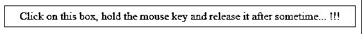


当您单击文本时，将触发鼠标按下事件，如下图所示。

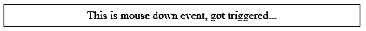


释放鼠标键时，将触发鼠标抬起事件，如下图所示。

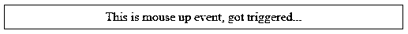


#### 实施例 6

**代码:**

```
<!DOCTYPE html>
<html>
<head>
<meta charset="utf-8">
<title>jquery Mousedown Demo</title>
<script src="http://ajax.googleapis.com/ajax/libs/jquery/1.11.2/jquery.min.js"></script>
<script>
$(document).ready(function(){
$(".mytext").mousedown(function(){
$(this).hide();
});
});
</script>
</head>
<body>
<p>Welcome to EDUCBA...</p>
Click on this text, to hide the when mouse button is pressed... !!!</p>
<div> </div>
</body>
</html>
```

**输出:**

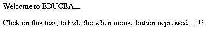


当我们没有点击任何 HTML 元素时，下图将显示文本。如下图所示，点击 HTML 文档的第二行后，第二行消失了。


### 结论

到目前为止，我们已经研究了 mousedown 事件，当在 HTML 元素上单击任何一个鼠标按钮时，无论是左键、右键还是中键，都可以将其用作事件处理函数。mousedown 方法选择包含在事件处理程序中的 HTML 元素。当用户在内容上单击任何鼠标按钮时，文本将被隐藏。使用上面解释的各种类型的例子，并根据你的方便来改变它们。

### 推荐文章

这是一个 jQuery mousedown 的指南。在这里，我们讨论 jQuery mousedown()的介绍，并进行适当的编程。您也可以浏览我们推荐的其他文章，了解更多信息——

1.  [jQuery unload()](https://www.educba.com/jquery-unload/)
2.  [jQuery hide()](https://www.educba.com/jquery-hide/)
3.  [jQuery mouseout()](https://www.educba.com/jquery-mouseout/)
4.  [jQuery 数据表](https://www.educba.com/jquery-data-table/)


