# jQuery mouseout()

> 原文：<https://www.educba.com/jquery-mouseout/>

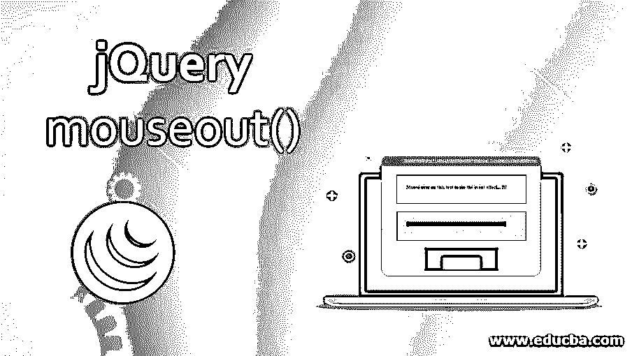


## jQuery mouseout()简介

当我们将鼠标光标或指针从所选元素上移开时，就会发生 mouseout 事件，mouse out()方法会激活 mouse out 事件或绑定一个函数，以便在 mouse out 事件发生时进行操作。MouseOut 事件用于当用户将鼠标从给定的 HTML 元素中移开时触发事件。

mouseout()事件通常与 mouseover()事件一起使用。jQuery 引入了名为 MouseEnter 和 MouseLeave 的自定义事件，它们构建在现有的 mouse over 和 mouse out 事件之上。这两个事件都将随着每个鼠标悬停/鼠标离开事件的 DOM 一起移动，以查看用户是进入了元素还是离开了元素。

<small>网页开发、编程语言、软件测试&其他</small>

**语法:**

以下语法用于将函数附加到 mouseout 事件:

```
$(selector).mouseout(function)
```

在上面的语法中，函数允许一个可选的单参数函数。这用于定义调用 mouseout 事件时要执行的函数。以一种简单的方式，它将 mouseout 事件连接到函数。

当 mouseout 事件触发所选元素时，还可以使用一种语法:

```
$(selector).mouseout()
```

### 实现 jQuery mouseout()的示例

下面给出了 jQuery mouseout()的例子:

#### 示例#1

**代码:**

```
<!DOCTYPE html>
<html>
<head>
<title>jquery Mouse Out Demo</title>
<script src=
"https://ajax.googleapis.com/ajax/libs/jquery/3.3.1/jquery.min.js">
</script>
<!-- The code is used to show the working of mouse out method -->
<script>
$(document).ready(function() {
$(".heading").mouseover(function() {
$(".heading").css("background-color", "green");
});
$(".heading").mouseout(function() {
$(".heading").css("background-color", "grey");
});
});
</script>
<style>
body {
width: 350px;
padding: 30px;
height: 30px;
border: 1px solid green;
font-weight: bold;
font-size: 15px;
}
</style>
</head>
<body>
Mouse over on this text to see the event effect... !!!</p>
</body>
</html>
```

**输出:**

用您选择的带有. html 扩展名的名称保存代码。上述代码将产生如下图所示的输出:


当你将鼠标指针悬停在下图中时，它的颜色会变成绿色。

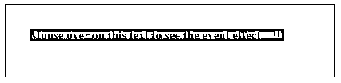


在下面的输出中，当您将鼠标指针悬停在该行或文本上时，鼠标离开事件将被触发，并且它将在 2 秒内改变 HTML 页面的颜色。

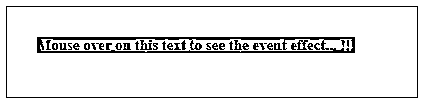


#### 实施例 2

**代码:**

```
<!DOCTYPE html>
<html>
<head>
<title>jquery Mouse Out Demo</title>
<script src=
"https://ajax.googleapis.com/ajax/libs/jquery/3.3.1/jquery.min.js">
</script>
<!-- The code is used to show the working of mouse out method -->
<script>
m = 0;
n = 0;
$(document).ready(function(){
$("div.heading").mouseout(function(){
$(".heading span").text(m += 1);
});
$("div.enter").mouseleave(function(){
$(".enter span").text(n += 1);
});
});
</script>
</head>
<body>
<p>The event will be triggered when user leave the selected element. </p>
<div class="heading" style="background-color:grey;padding:10px;width:200px;float:left">
<h3 style="background-color:white;">The mouse out event triggered: </h3>
</div>
</body>
</html>
```

**输出:**

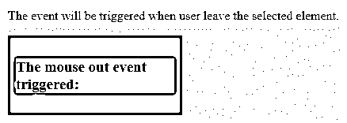


在下面的输出中，当您将鼠标悬停在该行或文本上时，鼠标离开事件将被触发，当鼠标离开所选元素时，它将增加数字。

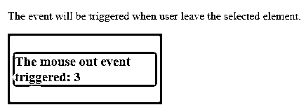


#### 实施例 3

**代码:**

```
<!DOCTYPE html>
<html lang="en">
<head>
<meta charset="utf-8">
<title>jQuery mouse over demo</title>
<style>
div.out_func {
width: 30%;
height: 100px;
margin: 0 12px;
background-color: green;
}
div.in_func {
width: 50%;
height: 50%;
background-color: grey;
margin: 8px auto;
}
</style>
<script src="https://code.jquery.com/jquery-1.10.2.js"></script>
</head>
<body>
<div class="out_func">
Move your cursor poniter on the grey color box...
<div class="in_func"></div>
</div>
<script>
$( "div.out_func" )
.mouseover(function() {
$( this ).find( "span" ).text( "This is mouse over event triggered... !!!" );
})
.mouseout(function() {
$( this ).find( "span" ).text( "This is mouse out evet triggered... !!!" );
});
</script>
</body>
</html>
```

**输出:**

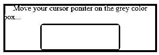


如上面的输出所示，当您将鼠标指针悬停在灰色框上时，将触发 mouseover 事件。

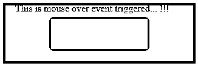


当你移动光标到方框中时，就会触发一个鼠标释放事件。

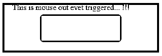


#### 实施例 4

**代码:**

```
<!doctype html>
<html>
<head>
<meta charset="utf-8">
<title>jQuery mouse over demo</title>
<style>
#parent {
background: cyan;
width: 150px;
height: 160px;
position: relative;
}
#child {
background: grey;
width: 60%;
height: 60%;
position: absolute;
left: 60%;
top: 60%;
transform: translate(-50%, -50%);
}
textarea {
height: 160px;
width: 250px;
display: block;
}
</style>
<script src="https://code.jquery.com/jquery-1.10.2.js"></script>
</head>
<body>
<div id="parent" onmouseover="mouselog_demo(event)" onmouseout="mouselog_demo(event)">This is parent window
<div id="child">This is child window</div>
</div> <br>
<textarea id="text"></textarea> <br>
<input type="button" onclick="text.value=''" value="Clear the data">
<script>
function mouselog_demo(event) {
text.value += `${event.type} [target: ${event.target.id}]\n`.replace(/(:|^)(\d\D)/, '$10$2');
text.scrollTop = text.scrollHeight;
}
</script>
</body>
</html>
```

**输出:**

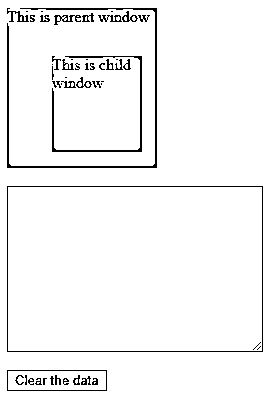


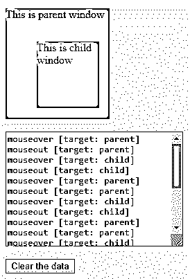


如上面的输出所示，当您将鼠标指针悬停在灰色框上时，将会触发 mouseover 事件，当您移动该框的光标时，将会触发 mouse out 事件。

#### 实施例 5

**代码:**

```
<!DOCTYPE HTML>
<html>
<head>
<title>jquery Mouse Out Demo</title>
<style type="text/css">
#outer_demo {
background-color: #ac9c9c ;
border: 1px solid #b86363 ;
float: left ;
height: 200px ;
margin-right: 15px ;
position: relative ;
width: 200px ;
}
span.inner {
background-color: #71777e ;
border: 1px solid red ;
color: #FFFFFF ;
height: 90px ;
left: 55px ;
line-height: 100px ;
position: absolute ;
text-align: center ;
top: 60px ;
width: 80px ;
}
</style>
<script src= "https://ajax.googleapis.com/ajax/libs/jquery/3.3.1/jquery.min.js"> </script>
<script type="text/javascript">
jQuery(function( $ ){
$( "#outer_demo" ).bind(
"mouseover mouseout",
function( event ){
console.log( event.type, " :: ", this.id );
}
);
});
</script>
</head>
<body>
<h1>MouseOver and MouseOut Events</h1>
<div id="outer_demo">
MouseOver
</div>
</body>
</html>
```

**输出:**

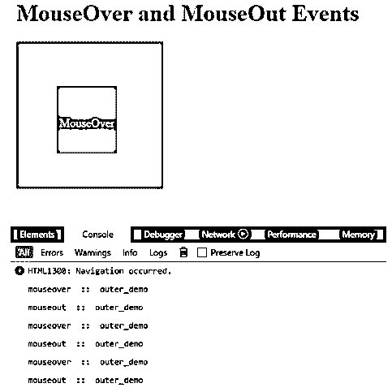


如上图所示，当鼠标指针停留在元素上时。您将在控制台中看到 mouseover 事件，当您将鼠标光标移出所选元素时，将触发 mouse out 事件。

### 结论

到目前为止，我们已经看到了 mouseout 事件在 jQuery 中是如何工作的。即使当我们从父元素移动到子元素时，mouseout 事件也会发生。应用程序确定鼠标一次只能在一个元素上。换句话说，当鼠标光标指针在鼠标离开事件发生时移除所选项时。鼠标离开是另一个只能在鼠标指针离开所选元素时触发的事件，而鼠标离开事件在鼠标光标离开任何子元素和所选元素时触发。

### 推荐文章

这是 jQuery mouseout()的指南。在这里，我们讨论用代码和输出实现 jQuery mouseout()的简介、语法和示例。您也可以看看以下文章，了解更多信息–

1.  [jQuery submit()](https://www.educba.com/jquery-submit/)
2.  [jQuery mouseenter()](https://www.educba.com/jquery-mouseenter/)
3.  [jQuery appendTo()](https://www.educba.com/jquery-appendto/)
4.  [jquery intrawidth()](https://www.educba.com/jquery-innerwidth/)


