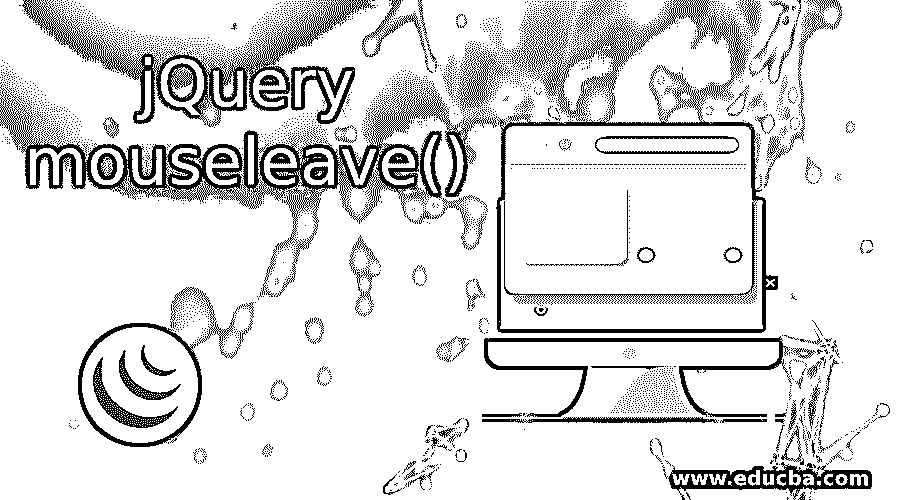
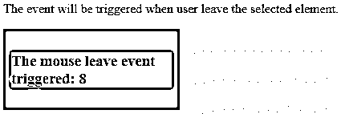
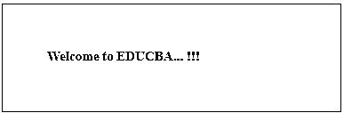
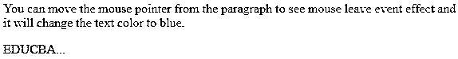
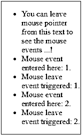
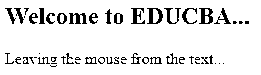

# jQuery mouseleave()

> 原文：<https://www.educba.com/jquery-mouseleave/>




## jQuery mouseleave()简介

用户可以在鼠标离开元素时附加一个触发事件处理程序，或者在元素上激活处理程序。鼠标左键是 Internet Explorer 特有的 JavaScript 事件。jQuery 模拟该事件，因为该事件具有公共性质，所以可以在不考虑浏览器的情况下使用它。当鼠标指针离开元素时，这个事件将被发送到一个实体。任何 HTML 元素都可以接收该事件。jQuery 引入了名为 MouseEnter 和 MouseLeave 的自定义事件，它们构建在现有的 mouse over 和 mouse out 事件之上。

**语法**

<small>网页开发、编程语言、软件测试&其他</small>

以下语法用于将函数附加到鼠标离开事件:

**语法#1**

```
$(selector).mouseleave(function)
```

在上面的语法中，函数允许一个可选的单参数函数。这用于定义调用鼠标离开事件时要执行的函数。以一种简单的方式，它将鼠标离开事件连接到函数。该过程返回使用 mouseleave()方法进行了更改的所选元素。

当鼠标离开所选元素的事件触发器时，可以使用另一种语法:

**语法#2**

```
$(selector).mouseleave()
```

### jQuery mouseleave()是如何工作的？

当用户将鼠标指针从文本或元素上移开时，鼠标离开可以在 mouseleave()事件的帮助下进行。为此，mouseleave()事件将事件处理函数附加到页面上的元素。

每当鼠标光标离开所选元素时，都会触发鼠标离开事件，并且在事件发生后，它会实现一个已附加到要运行的事件处理函数的鼠标离开事件。

### 实现 jQuery 鼠标离开事件的示例

下面是提到的例子:

#### 示例#1

**代码:**

```
<!DOCTYPE html>
<html>
<head>
<title>jquery Mouse Leave Demo</title>
<script src=
"https://ajax.googleapis.com/ajax/libs/jquery/3.3.1/jquery.min.js">
</script>
<!-- The code is used to show the working of mouse leave method -->
<script>
m = 0;
n = 0;
$(document).ready(function(){
$("div.heading").mouseout(function(){
$(".heading span").text(m += 1);
});
$("div.enter").mouseleave(function(){
$(".enter span").text(n += 1);
});
});
</script>
</head>
<body>
<p>The event will be triggered when user leave the selected element. </p>
<div class="heading" style="background-color:grey;padding:10px;width:200px;float:left">
<h3 style="background-color:white;">The mouse leave event triggered: </h3>
</div>
</body>
</html>
```

**输出:**




**解释:**在上面的输出中，当鼠标指针离开文本行时，鼠标离开事件将被触发，当鼠标离开所选元素时，它将增加数字。

#### 实施例 2

**代码:**

```
<!DOCTYPE html>
<html>
<head>
<title> jQuery Mouse Leave Demo </title>
<script src= "https://ajax.googleapis.com/ajax/libs/jquery/3.3.1/jquery.min.js"> </script>
<!-- jQuery code to show the working of this method -->
<script>
$(document).ready(function() {
$(".demo").mouseleave(function() {
$(".demo").css("background-color", "red");
});
});
</script>
<style>
body {
width: 280px;
padding: 50px;
height: 20px;
border: 1px solid grey;
font-weight: bold;
font-size: 15px;
}
</style>
</head>
<body>
<!--  Please move the cursor over this text and you will see the effect -->
 Welcome to EDUCBA... !!! 
</body>
</html>
```

**输出:**当你运行上面的代码时，会显示下面的输出。




**Output:** 当鼠标指针离开元素时，它会显示红色的背景色，如下图所示。


#### 实施例 3

**代码:**

```
<!DOCTYPE html>
<html>
<head>
<title> jQuery Mouse Leave Demo </title>
<script src="https://ajax.googleapis.com/ajax/libs/jquery/3.4.1/jquery.min.js"></script>
<script>
$(document).ready(function(){
$(".demo").mouseenter(function(){
$(".demo").css("color", "#F2892A");
});
$(".demo").mouseleave(function(){
$(".demo").css("color", "#1985C0");
});
});
</script>
</head>
<body>
<p> You can move the mouse pointer from the paragraph to see mouse leave event effect and it will change the text color to blue.</p>
 EDUCBA... 
</body>
</html>
```

**输出:**




#### 实施例 4

**代码:**

```
<!DOCTYPE html>
<html>
<head>
<title> jQuery Mouse Leave Demo </title>
<script src="https://ajax.googleapis.com/ajax/libs/jquery/3.4.1/jquery.min.js"></script>
<script>
$(document).ready(function(){
var mouseentercnt = 0;
var mouseleavecnt = 0;
const mouseDemo = document.getElementById('mouseDemo');
const myList = document.getElementById('myList');
mouseDemo.addEventListener('mouseenter', e => {
mouseDemo.style.border = '2px solid green';
mouseentercnt++;
addListItem(' Mouse event entered here: ' + mouseentercnt + '.');
});
mouseDemo.addEventListener('mouseleave', e => {
mouseDemo.style.border = '1px solid blue';
mouseleavecnt++;
addListItem(' Mouse leave event triggered: ' + mouseleavecnt + '.');
});
function addListItem(text) {
var txtnode = document.createTextNode(text);
var listitems = document.createElement("li");
listitems.appendChild(txtnode);
myList.appendChild(listitems);
}
});
</script>
<style>
#mouseDemo {
box-sizing: border-box;
width:10rem;
}
</style>
</head>
<body>
<div id='mouseDemo'>
<ul id="myList">
<li> You can leave mouse pointer from this text to see the mouse events ...!</li>
</ul>
</div>
</body>
</html>
```

**输出:**




**解释:**如上图所示，当鼠标光标进入文本或元素时，会触发鼠标进入事件，当鼠标指针离开文本时，会触发鼠标离开事件。每次当 use 重复这个过程时，鼠标事件计数器将保持增加，如输出所示。

#### 实施例 5

**代码:**

```
<!DOCTYPE html>
<html>
<head>
<title> jQuery Mouse Leave Demo </title>
<script src="https://ajax.googleapis.com/ajax/libs/jquery/1.11.2/jquery.min.js"></script>
<script>
$(document).ready(function(){
$("#h2").mouseleave(function(){
$( "div" ).text( " Leaving the mouse from the text..." ).show().fadeOut( 2500 );
});
});
</script>
</head>
<body>
<h2 id="h2"> Welcome to EDUCBA... </h2>
<div> </div>
</body>
</html>
```

**输出:**




**解释:**如上面的输出所示，当你将鼠标从文本元素上离开时，鼠标事件将被触发，它将淡出该事件，如图所示。

### 使用 jQuery mouseleave()的好处

*   鼠标离开事件用于当用户将鼠标从给定的 HTML 元素上离开时触发事件。
*   mouse 事件也可以与 mouse enter 事件一起使用。
*   鼠标离开事件不会对事件冒泡做出反应(在这种冒泡中，将首先处理最低级别的元素，然后处理 out 元素)。

### 结论

到目前为止，我们已经看到了鼠标离开事件在 jQuery 中是如何工作的。当用户将光标指针从元素移出时，鼠标离开事件发生。换句话说，当鼠标离开事件发生时，鼠标光标指针分离所选元素。与 mousevent()事件不同，鼠标离开事件只能在鼠标指针离开所选元素时触发，而鼠标离开事件在鼠标光标离开任何子元素和所选元素时触发。

### 推荐文章

这是 jQuery mouseleave()的指南。这里我们讨论 mouseleave()如何在 jQuery 中工作，并举例说明以便更好地理解。您也可以浏览我们的其他相关文章，了解更多信息——

1.  [jQuery appendTo()](https://www.educba.com/jquery-appendto/)
2.  [jQuery unwrap()](https://www.educba.com/jquery-unwrap/)
3.  [jQuery submit()](https://www.educba.com/jquery-submit/)
4.  [jQuery 数据表](https://www.educba.com/jquery-data-table/)


