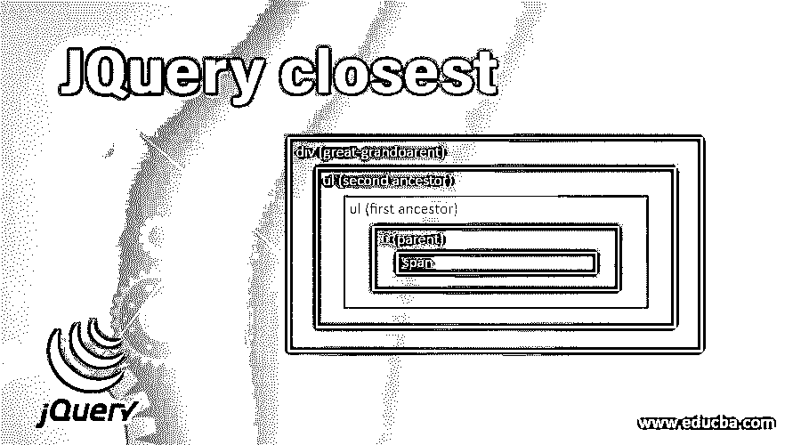
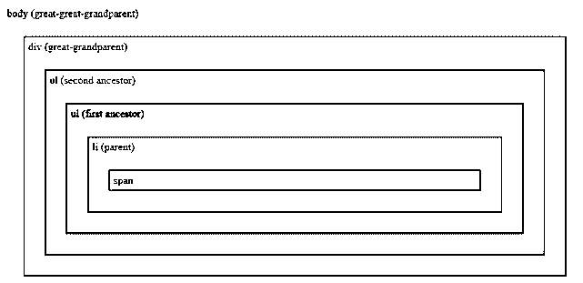
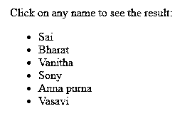
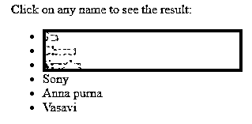
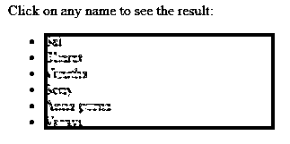
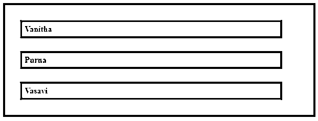
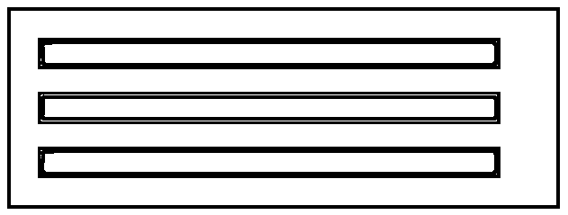
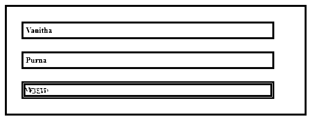
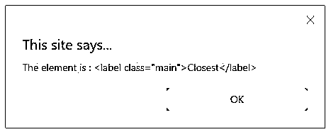

# JQuery 最近

> 原文：<https://www.educba.com/jquery-closest/>




## **JQuery 介绍最近的**

JQuery 的重要之处在于对 DOM(文档对象模型)的操作。JQuery 有很多 DOM 方法，这使得我们的工作变得容易，并且使用这些方法非常简单。JQuery closest()将帮助我们返回所选元素的第一个祖先(父母、祖父母、曾祖父母等等)。它向 DOM 树遍历，并从当前元素开始遍历，以找到第一个祖先。这与 parents()有些相似，但它们遍历的方式不同。在 parents()中，它从父元素开始遍历。

**语法:**

<small>网页开发、编程语言、软件测试&其他</small>

简单地说，我们可以说 closest()方法帮助我们在 DOM 树中搜索匹配的元素。JQuery 中最接近的()方法语法。它是 JQuery 中的一个内置方法。

```
$(selector).closest (selector [ , context] )
```

**参数:**

它包含两个参数。

*   **选择器:**选择器应为字符串类型，为必填字段。这样，它将缩小 DOM 树中祖先搜索的范围，并指定元素。
*   **Context:** 字符串类型，可选参数。

### JQuery 最接近的示例

下面给出了 JQuery closest 的例子:

#### 示例#1

这是最接近()方法的一个简单例子。在这个例子中，我们可以观察最接近的()方法是如何工作的。

**代码:**

```
<!DOCTYPE html>
<html>
<head>
<style>
.main * {
display: block;
border: 2px solid blue;
color: blue;
padding: 5px;
margin: 25px;
}
</style>
<script src="https://ajax.googleapis.com/ajax/libs/jquery/3.4.1/jquery.min.js"></script>
<script>
$(document).ready(function(){
$("span").closest("ul").css({"color": "green", "border": "2px solid green"});
});
</script>
</head>
<body class="main">body (great-great-grandparent)
<div style="width:800px;">div (great-grandparent)
<ul>ul (second ancestor)
<ul>ul (first ancestor)
<li>li (parent)
span
</li>
</ul>
</ul>
</div>
</body>
</html>
```

**输出:**

*   在这个例子中，我们通过使用最接近的方法得到了元素列表，它找到了 ul(第一个祖先),颜色变成了绿色，正如我们在 CSS 中提到的[。在下图中，我们可以看到 ul(始祖)的颜色是绿色。](https://www.educba.com/what-is-css/)




*   我们可以看到它已经返回了所选元素的第一个祖先。

#### 实施例 2

这是最近()方法的一个例子。

**代码:**

```
<html>
<head>
<title>The jQuery Example</title>
<script type = "text/javascript"
src = "https://ajax.googleapis.com/ajax/libs/jquery/2.1.3/jquery.min.js">
</script>
<script>
$(document).ready(function(){
$(document).bind("click", function (e) {
$(e.target).closest("li").css("background-color","blue");
});
});
</script>
</head>
<body>
<div>
<p>Click on any name to see the result:</p>
<ul>
<li class = "top">Sai</li>
<li class = "top">Bharat</li>
<li class = "middle">Vanitha</li>
<li class = "middle">Sony</li>
<li class = "bottom">Anna purna</li>
<li class = "bottom">Vasavi</li>
</ul>
</div>
</body>
</html>
```

**输出:**

*   在这个例子中，我们有一个名字列表，我们使用 CSS 和 closest()方法。在点击名字的时候，颜色会变成蓝色，就像我们在代码中提到的那样。
*   我们可以在点击名称之前观察输出，如下所示。




*   点击任何一个名字后，输出如下图所示。




*   点击所有的名字后，输出如下图所示。




#### 实施例 3

这是 closest()方法和 toggleClass()方法的示例。

**代码:**

```
<!doctype html>
<html>
<head>
<title>Example for the jQuery closest</title>
<style>
div {
display: block;
border: 4px solid red;
color: black;
padding: 5px;
margin: 25px;
width:600px;
}
span{
display: block;
border: 4px solid red;
color: black;
padding: 5px;
margin: 25px;
width:500px;
}
span.main {
background: blue;
}
</style>
<script src="https://code.jquery.com/jquery-2.1.1.js"></script>
</head>
<body>
<div>
<b>Vanitha</b>
<b>Purna</b>
<b>Vasavi</b>
</div>
<script>
$(document).on("click",function(event) {
$(event.target).closest("span").toggleClass("main");
});
</script>
</body>
</html>
```

**输出:**

*   在这个例子中，我们使用 div 和 span 作为我们应用了 closest()和 toggleClass()效果的 span。
*   对于 span，我们将背景颜色设置为蓝色。对于最接近的()方法，我们已经通过了跨度。
*   因此，通过点击这些块，背景颜色变成了蓝色。
*   toggleClass()方法可以在颜色之间切换，因此通过单击按钮，我们可以观察颜色的变化。
*   在单击块之前，我们可以观察如下所示的输出，如代码中所述，边框是红色的。




*   在下图中，我们可以观察到，在单击块后，由于 closest()和 toggleClass()方法的影响，背景色变成了蓝色。




*   在下图中，我们可以通过再次点击这些块来观察背景颜色的变化。




#### 实施例 4

这是最近()方法的一个例子。

**代码:**

```
<!doctype html>
<html lang="en">
<head>
<meta charset="utf-8">
<title>Example for the JQuery closest</title>
<style>
li {
margin: 10px;
background: blue;
}
</style>
<script src="https://code.jquery.com/jquery-1.10.2.js"></script>
</head>
<body>
<ul>
<li><label class="main">Closest</label></li>
</ul>
<script>
$(document).ready(function() {
$(".main").click(function() {
alert("The element is : " + $(this).closest("li").html());
})
})
</script>
</body>
</html>
```

**输出:**

*   这是最接近()方法的一个简单例子。在这里，我们为列表提供了边距和背景色，并将列表作为参数传递给了最近的()方法。
*   该方法被传递给一条警告消息。
*   通过运行代码，我们可以看到输出如下所示。


*   通过单击最近的文本，我们可以看到它将弹出我们在警报消息中传递的消息，即元素是:<label class="“main”">最近的</label>，如下图所示。




### 结论

因此，通过使用 closest()方法，我们可以返回 DOM 树中指定元素的第一个祖先，它将从当前元素开始遍历。它可以为每个元素返回零个或一个元素。

### 推荐文章

这是 JQuery closest 的指南。这里我们讨论 JQuery closest 的简介、参数和各种例子。您也可以看看以下文章，了解更多信息–

1.  [jQuery addClass()](https://www.educba.com/jquery-addclass/)
2.  [jQuery focus()](https://www.educba.com/jquery-focus/)
3.  [jQuery mouseout()](https://www.educba.com/jquery-mouseout/)
4.  [jQuery 数据表](https://www.educba.com/jquery-data-table/)


