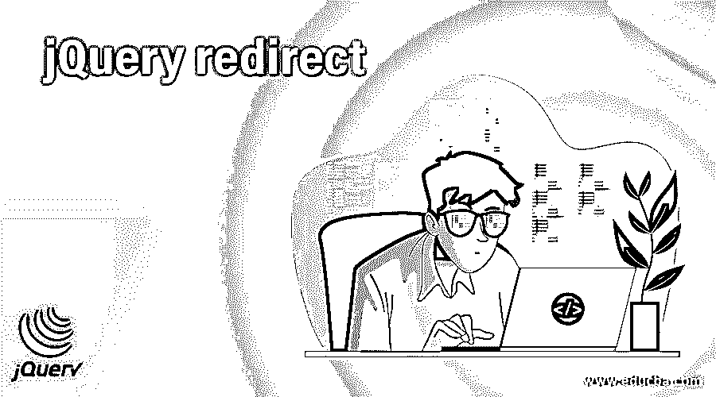
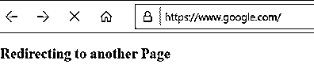
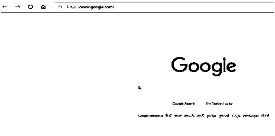
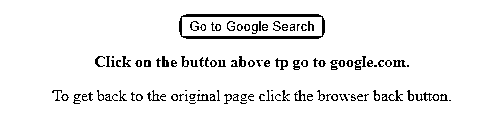
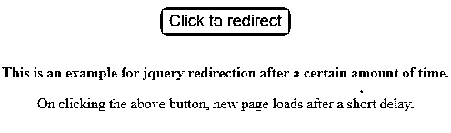
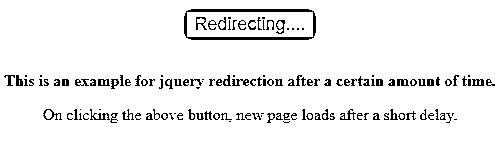
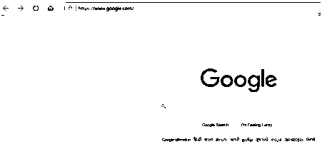

# jQuery 重定向

> 原文：<https://www.educba.com/jquery-redirect/>




## jQuery 重定向简介

*   重定向是一种将用户发送到不同于原始 URL 的机制。要重定向到的页面可以在同一服务器上，也可以在不同的服务器上。
*   有几种重定向页面的方法，使用 javaScript 或 jQuery，但 jQuery 由于其跨浏览器兼容性，比 javaScript 更受欢迎。
*   JavaScript 使用 location . hrefandlocation . replace()方法进行重定向。
*   JQuery 使用。要重定向的 attr()方法。
*   尽管 javaScript 和 jQuery 都提供了重定向的方法，但是它们之间还是有一些主要的区别。
*   JQuery。attr()将从服务器打开一个新的页面，而 javaScriptlocation.href 将从缓存中加载页面。

**语法:**

```
$(location).attr('href', url);
```

其中，href 指的是指定点击页面的 URL 的属性。
URL 是指 href 属性的值。它是网站或页面地址。
attr 是指将 url 值设置为 href 属性的方法。

<small>网页开发、编程语言、软件测试&其他</small>

jQuery 重定向可以通过两种方式实现，普通 javaScript 或 jQuery。使用哪一个完全是你的选择。这里我们将只讨论 jQuery 重定向。

### jQuery 重定向的例子

让我们看一些例子来理解使用 jQuery 的重定向机制。

#### 示例#1

下面给出了一个非常简单的例子来演示 jQuery 重定向机制。

**代码:**

```
<!DOCTYPE html>
<html>
<head>
<title>JQuery Example to Redirect a page or URL</title>
</head>
<body>
<div id="redirect">
<h2>Redirecting to another Page</h2>
</div>
<script src="https://code.jquery.com/jquery-1.12.4.js"></script>
<script>
$(document).ready(function () {
$(location).attr("href", "https://google.com");
});
</script>
</body>
</html> 
```

**输出:**

*   下面的屏幕显示了 https://google.com 的页面。
*   在执行代码时，原始页面被直接重定向到新的 URL 或 https://google.com 页面。







*   因为重定向的代码放在$(document)下。ready()函数，它将在页面加载后立即执行。
*   您将看到，一旦页面重定向完成，URL 以及页面标题也将被目标 URL 替换。

#### 实施例 2

让我们考虑另一个例子，它说明了 jQuery 重定向机制的实现。

**代码:**

```
<!DOCTYPE html>
<html>
<head>
<title>JQuery Example to Redirect a page or URL</title>
<script src="https://code.jquery.com/jquery-1.12.4.js"></script>
<script>
function pageRedirect() {
$(location).attr("href", "https://google.com");
}
</script>
<style>
#divstyle {
width: 500px;
height: 200px;
padding-top: 20px;
padding-left: 5px;
text-align: center;
background-color: cadetblue;
}
</style>
</head>
<body>
<div id="divstyle">
<button type="button" onclick="pageRedirect()">
Go to Google Search
</button>
<p>
<strong>Click on the button above tp go to google.com.</strong>
</p>
<p>
To get back to the original page click the browser back button.
</p>
</div>
</body>
</html>
```

**输出:**

*   当执行上述源代码时，会显示下面的屏幕。
*   我们看到一个按钮“转到谷歌搜索”，点击它会将用户从当前页面重定向到新页面。




**Note:** In the previous example, we were redirecting the web page directly from the current to the new one. In the above example, we are using a button click to perform redirection.

#### 实施例 3

在下面的例子中，我们试图以一定的延迟重定向网页。

**代码:**

```
<!DOCTYPE html>
<html>
<head>
<title>
Jquery Redirect Example with a delay
</title>
<script src="https://code.jquery.com/jquery-1.12.4.js"></script>
<script>
$(document).ready(function() {
$("button").click(function () {
$(this).text("Redirecting....");
var delay = 2000;
var url = "https://google.com";
setTimeout(function () {
window.location = url;
}, delay);
});
});
</script>
<style>
#divstyle {
width: 500px;
height: 200px;
padding-top: 20px;
padding-left: 5px;
text-align: center;
background-color: cadetblue;
}
</style>
</head>
<body>
<div id="divstyle">
<button style="font-size: large; color:brown">Click to redirect</button><br><br>
<p>
<strong>
This is an example for jquery redirection after a certain amount of time.
</strong
>
<p>
On clicking the above button, new page loads after a short delay.
</p>
</p>
</div>
</body>
</html>
```

**输出:**

*   当执行上述代码时，会显示下面的屏幕。




*   我们看到一个按钮“点击重定向”,点击它会将你重定向到新的网页，有一点延迟，在我们的例子中是 2 秒。
*   下面的屏幕显示了经过 2 秒钟延迟的重定向。




*   2 秒钟后，您将被重定向到新的 URL 页面，如下所示。




**Note:** Since we can use both, plain javaScript or jQuery for redirection mechanism, there is a slight difference between the two ways.
With javaScript, we use window.location.hrefand with jQuery, we use $(location).attr(‘href’, url) .
The $(location).attr(‘href’, url)requests a fresh page from server, whereas,window.location.href loads pages from cache.

### 结论

*   在本文中，我们讨论了如何使用 jQuery 将网页或 URL 重定向到另一个网页。
*   使用 jQuery 进行页面或 URL 重定向是一项非常简单的任务，只需一行代码就可以完成
*   jQuery 使用 attr()方法进行重定向，这与 javaScript 略有不同。
*   唯一的区别在于加载新页面的方式。
*   对于 jQuery，$(位置)。attr('href '，url)将从服务器打开一个新页面，而对于 javaScript，window.location.href 从缓存中加载页面。

### 推荐文章

这是一个 jQuery 重定向的指南。在这里，我们讨论 jQuery 重定向及其示例和代码实现的简要概述。您也可以浏览我们推荐的其他文章，了解更多信息——

1.  [jQuery toggle()简介](https://www.educba.com/jquery-toggle/)
2.  [jQuery empty()(示例)](https://www.educba.com/jquery-empty/)
3.  [如何使用 jQuery insertAfter()方法？](https://www.educba.com/jquery-insertafter/)
4.  [jQuery appendTo() |参数|示例](https://www.educba.com/jquery-appendto/)


