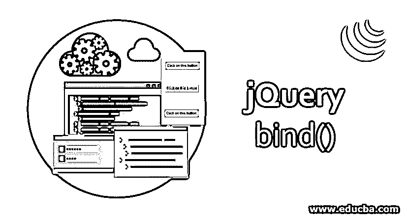
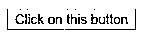
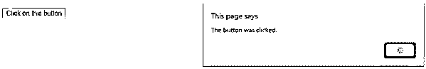
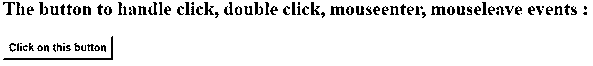
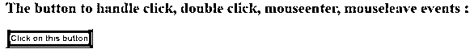
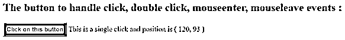
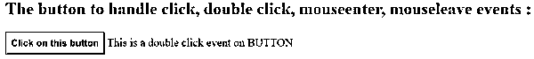
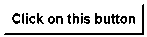
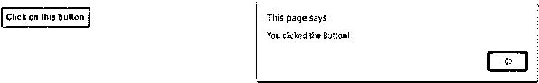

# jQuery 绑定()

> 原文：<https://www.educba.com/jquery-bind/>




## jQuery bind()简介

jQuery bind()方法用于处理一个或多个事件。该方法是 jQuery 中的内置方法。jQuery bind()方法从元素集合中接受一个或多个匹配 html 元素的事件处理程序。该方法还接受事件发生时要执行的函数的名称。通常，jQuery bind()方法与 jQuery 的其他方法或事件一起使用，如 click、blur、resize、focus、load、unload、scroll 等。

**语法:**

<small>网页开发、编程语言、软件测试&其他</small>

```
$(selector).bind( event, data, function, map )
```

此方法用于附加和处理元素集合中匹配的 html 元素的一个或多个事件。

**参数:**

*   **Event:** Event 参数不是可选参数，用于指定一个或多个事件附加到元素集合中匹配的 html 元素上。要指定多个事件，每个事件必须用空格隔开。
*   **Data:** Data 参数是可选参数，用于将数据传递给函数。
*   **函数:**函数参数不是可选参数，用于指定事件发生时要执行的函数的名称。
*   **Map:**Map 参数是[，用于映射函数](https://www.educba.com/javascript-map-function/)或附加到 html 元素的一个或多个事件。

### 实现 jQuery bind()的示例

以下是一些例子:

#### 示例#1

这是 html 代码，通过下面的示例可以更清楚地理解 jQuery bind()方法，bind()方法用于处理按钮元素的 click 事件。

**代码:**

```
<!DOCTYPE html>
<html lang= "en" >
<head>
<meta charset= "utf-8" >
<script type = "text/javascript" src="https://ajax.googleapis.com/ajax/libs/jquery/1.11.3/jquery.min.js" >
</script>
<title> This is an example for jQuery bind( ) method </title>
<!-- code to show the jQuery bind( ) working method -->
<script>
$(document).ready(function(){
$("#btn").bind("click", function(){
alert("The button was clicked.");
});
});
</script>
</head>
<body>
<!-- Click on this button to see the change -->
<button id="btn"> Click on this button </button>
</body>
</html>
```

**输出:**




一旦我们点击按钮，




在上面的代码中，使用了 bind()方法，被单击的指定事件被附加到 jQuery 集合中的选定 html 元素< button >,因此在输出中，一旦我们单击按钮，事件就会发生，并处理函数正在执行的事件。

#### 实施例 2

下一个例子是在按钮 html 元素上附加和处理多个事件，如下面的代码所示

**代码:**

```
<!DOCTYPE html>
<html lang= "en" >
<head>
<meta charset= "utf-8" >
<script type = "text/javascript" src="https://ajax.googleapis.com/ajax/libs/jquery/1.11.3/jquery.min.js" >
</script>
<title> This is an example for jQuery bind( ) method </title>
<style>
button {
font-weight: bold;
background: yellow;
cursor: pointer;
padding: 6px;
}
button.over {
background: red;
}
span {
color: black;
}
</style>
</head>
<body>
<h2> The button to handle click, double click, mouseenter, mouseleave events : </h2>
<!-- Click on this button to see the change -->
<button id="btn"> Click on this button </button>

<!-- code to show the jQuery bind( ) working method -->
<script>
$( "#btn" ).bind( "click", function( event ) {
var pos = "( " + event.pageX + ", " + event.pageY + " )";
$( "span" ).text( "This is a single click and position is " + pos );
});
$( "#btn" ).bind( "dblclick", function() {
$( "span" ).text( "This is a double click event on " + this.nodeName );
});
<!-- code to show the jQuery bind( ) working with more than one events -->
$( "#btn" ).bind( "mouseenter mouseleave", function( event ) {
$( this ).toggleClass( "over" );
});
</script>
</body>
</html>
```

**输出:**




一旦我们将鼠标移到“点击这个按钮”按钮上，输出是，




一旦我们点击“点击此按钮”按钮，输出是:




一旦我们双击“点击此按钮”按钮，输出是，




#### 实施例 3

在下一个示例代码中，我们重写了上面的代码，将消息作为数据传递给函数。如下例所示——

**代码:**

```
<!DOCTYPE html>
<html lang= "en" >
<head>
<meta charset= "utf-8" >
<script type = "text/javascript" src="https://ajax.googleapis.com/ajax/libs/jquery/1.11.3/jquery.min.js" >
</script>
<title> This is an example for jQuery bind( ) method </title>
<script>
function eventhandler(e) {
alert(e.data.msg);
}
<!-- code to show the jQuery bind( ) working method with passing data along with function-->
$(document).ready(function() {
$("#btn").bind("click", { msg: "You clicked the Button!" }, eventhandler)
});
</script>
<style>
button {
font-weight: bold;
background: yellow;
cursor: pointer;
padding: 6px;
}
</style>
</head>
<body>
<!-- Click on this button to see the change -->
<button id="btn"> Click on this button </button>
</body>
</html>
```

**输出:**




一旦我们点击“点击此按钮”按钮，输出是:




### 结论

bind()方法是 jQuery 的一种方法，用于处理指定 html 元素的不同类型的事件。jQuery bind()方法接受一个事件参数，它的值可以是 click、blur、resize、focus、load、unload、scroll 等。它还接受 function 参数，该参数在事件发生时执行。

### 推荐文章

这是 jQuery bind()的指南。这里我们讨论 jQuery bind()的语法、参数和不同的例子，以及代码实现。您也可以浏览我们的其他相关文章，了解更多信息——

1.  [jQuery detach()](https://www.educba.com/jquery-detach/)
2.  [jQuery slideUp()](https://www.educba.com/jquery-slideup/)
3.  [jQuery outerHeight()](https://www.educba.com/jquery-outerheight/)
4.  [jQuery Keypress()](https://www.educba.com/jquery-keypress/)


