# jQuery 解除绑定

> 原文：<https://www.educba.com/jquery-unbind/>

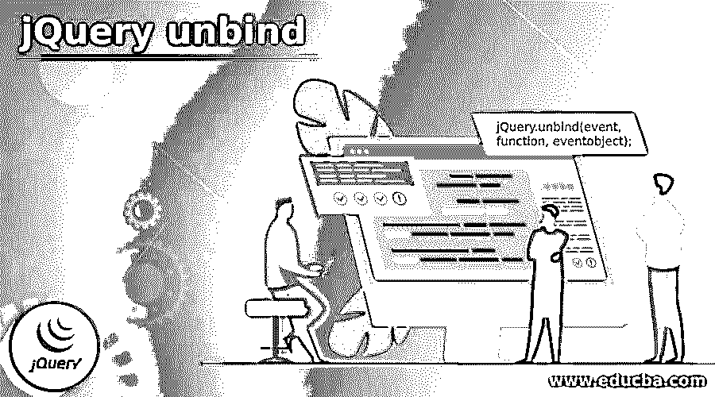


## jQuery unbind 简介

jQuery unbind()函数用于从所选元素中移除所有或特定的事件处理程序。jQuery unbind()函数是 jQuery 中的内置函数。unbind()函数删除使用 bind()函数添加的事件处理程序，并且它还停止在事件生成时运行的指定函数。

**jQuery unbind()函数的语法:**

<small>网页开发、编程语言、软件测试&其他</small>

```
jQuery.unbind(event, function, eventobject);
```

**参数:**

*   **event:** 这是一个可选参数，指定要从特定元素中解除绑定或移除的一个或多个事件。如果只有事件参数被传递给这个函数，那么所有绑定到这个特定事件的函数都将停止运行。
*   **function:** 这是一个可选参数，指定要与特定事件解除绑定的函数的名称。
*   **eventObject:** 可选参数，指定要从事件绑定函数中解除绑定的事件对象。

请注意，如果我们不向 unbind()函数传递任何参数，那么 unbind()函数将删除绑定到该特定元素的所有事件处理程序。

### jQuery unbind()函数的工作原理

*   unbind()函数接受三个参数，第一个参数是事件的名称，第二个参数是函数处理程序的名称，第三个参数是对象的名称。
*   假设在“h2”元素上,“mouseover”和“click”事件是绑定的，现在将被移动，所以我们将使用 unbind()函数作为“$(“H3”)。unbind()；"，它从“h2”元素中删除了这两个事件。
*   如果我们只想删除“click”事件，那么 unbind()函数的作用是“$(“H3”)。解除绑定(" click ")；".

### jQuery unbind()的示例

下面给出了 jQuery unbind 的例子:

#### 示例#1

jQuery unbind()函数的例子展示了 unbind()函数的工作原理。

**代码:**

```
<!DOCTYPE html>
<html lang= "en" >
<head>
<meta charset= "utf-8" >
<script type = "text/javascript" src="https://ajax.googleapis.com/ajax/libs/jquery/1.11.3/jquery.min.js" >
</script>
<title> This is an example for jQuery unbind() function </title>
<!-- code to show the jQuery unbind() working function -->
<script>
$(document).ready(function(){
$("#btn").bind("click", function(){
alert("The button was clicked.");
});
$("#btn2").click(function() {
$("#btn").unbind();
});
});
</script>
</head>
<body>
<!-- Click on this button to see the change -->
<button id="btn"> Click on this button to generate event. </button>
<br><br><br>
<button id="btn2"> Click on this button to remove event. </button>
</body>
</html>
```

**输出:**

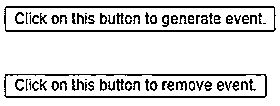


一旦我们单击第一个按钮，输出是:

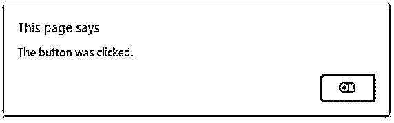


现在，单击第二个按钮，然后单击第一个按钮。这一次不会生成事件，也不会显示警报消息。

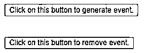


在上面的代码中，bind()函数正在使用，被单击的指定事件被附加到 button html 元素，并且进一步在 unbind()函数的帮助下，所有被附加的事件或 click 事件被移除，因为没有向其传递参数。

#### 实施例 2

jQuery unbind()函数的例子，展示了如何在绑定到元素上的多个事件中取消绑定或移除特定事件。

**代码:**

```
<!DOCTYPE html>
<html lang= "en" >
<head>
<meta charset= "utf-8" >
<script type = "text/javascript" src="https://ajax.googleapis.com/ajax/libs/jquery/1.11.3/jquery.min.js" >
</script>
<title> This is an example for jQuery unbind() function </title>
<style>
button {
font-weight: bold;
background: yellow;
cursor: pointer;
padding: 6px;
}
button.over {
background: red;
}
span {
color: black;
}
</style>
</head>
<body>
<h2> The button to handle click, double click, mouseenter, mouseleave events : </h2>
<!-- Click on this button to see the change -->
<button id="btn"> Click on this button. </button>

<br><br>
<button id="btn2"> Click on this button to remove click and  </button>
<!-- code to show the jQuery unbind() working function -->
<script>
$( "#btn" ).bind( "click", function( event ) {
var pos = "( " + event.pageX + ", " + event.pageY + " )";
$( "span" ).text( "This is a single click and position is " + pos );
});
$( "#btn" ).bind( "dblclick", function() {
$( "span" ).text( "This is a double click event on " + this.nodeName );
});
<!-- code to show the jQuery bind( ) working with more than one events -->
$( "#btn" ).bind( "mouseenter mouseleave", function( event ) {
$( this ).toggleClass( "over" );
});
$("#btn2").click(function() {
$("#btn").unbind("click");
});
</script>
</body>
</html>
```

**输出:**

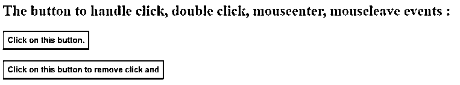


一旦我们点击“点击此按钮”按钮，输出是:

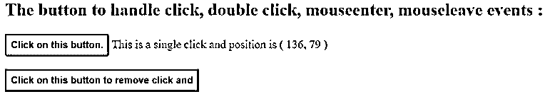


当我们双击并将鼠标移动到“单击此按钮”上时，输出是:

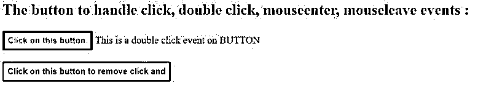


现在，单击第二个按钮，然后单击第一个按钮。这一次不会生成 click 事件，但是鼠标悬停和双击事件会起作用。

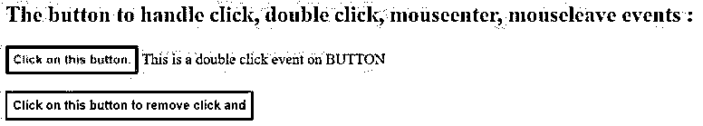


在上面的代码中，多个事件(如 click、double click、mouseenter 和 mouseleave)通过 bind()函数附加到按钮元素，并且进一步借助 unbind()函数，只有 click 事件被移除，因为 click 事件名称被传递给 unbind 函数。

#### 实施例 3

jQuery unbind()函数的示例，展示了如何移除事件并停止元素上函数处理程序的执行。

**代码:**

```
<!DOCTYPE html>
<html lang= "en" >
<head>
<meta charset= "utf-8" >
<script type = "text/javascript" src="https://ajax.googleapis.com/ajax/libs/jquery/1.11.3/jquery.min.js" >
</script>
<title> This is an example for jQuery unbind() function </title>
<script>
function eventhandler(e) {
alert(e.data.msg);
}
<!-- code to show the jQuery bind( ) working function with passing data along with function-->
$(document).ready(function() {
$("#btn").bind("click", { msg: "You clicked the Button!" }, eventhandler)
<!-- jQuery unbind() working function with passing event name along with function-->
$("#btn2").click(function() {
$("#btn").unbind("click", eventhandler);
});
});
</script>
<style>
button {
font-weight: bold;
background: yellow;
cursor: pointer;
padding: 6px;
}
</style>
</head>
<body>
<!-- Click on this button to see the change -->
<button id="btn"> Click on this button </button>
<br><br>
<button id="btn2"> Click on this button to remove click and  </button>
</body>
</html>
```

**输出:**

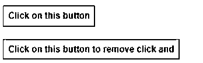


一旦我们单击第一个按钮，输出是:

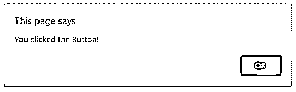


现在，单击第二个按钮，然后单击第一个按钮。这一次事件将不会生成。

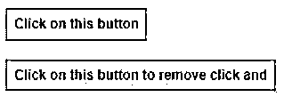


在上面的代码中，click 通过 bind()函数将 eventhandler()函数附加和绑定到 button 元素，并进一步借助 unbind()函数将事件和处理函数移除，正如我们在上面的输出中所看到的。

### 结论

jQuery unbind()函数是 jQuery 中的一个内置函数，用于从由 bind()函数绑定的选定元素中删除所有或特定的事件处理程序。

### 推荐文章

这是一个 jQuery unbind 的指南。这里我们分别讨论 jQuery unbind()函数的介绍、工作原理和实例。您也可以看看以下文章，了解更多信息–

1.  [jQuery 选择选项](https://www.educba.com/jquery-select-option/)
2.  [jQuery 背景色](https://www.educba.com/jquery-background-color/)
3.  [jQuery JSON 编码](https://www.educba.com/jquery-json-encode/)
4.  [jQuery 承诺](https://www.educba.com/jquery-promise/)


