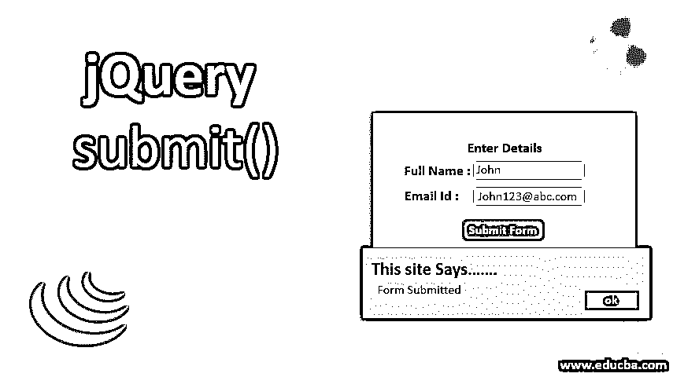
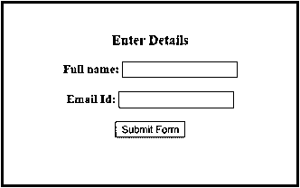
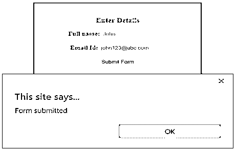
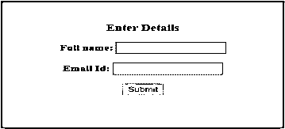
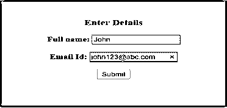
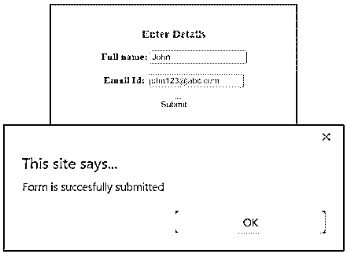
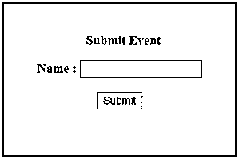
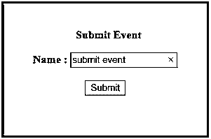
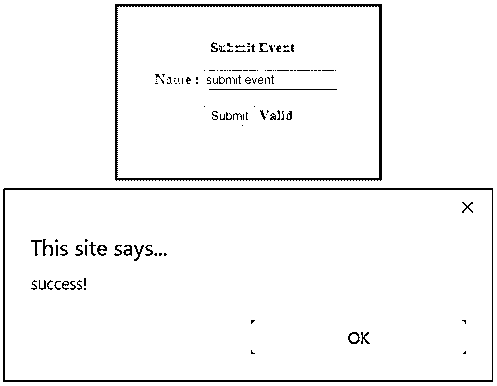
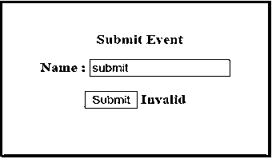

# jQuery 提交()

> 原文：<https://www.educba.com/jquery-submit/>




## jQuery submit()简介

jQuery submit() form 方法添加了一个事件处理程序，当 submit 事件发生时，该处理程序执行附加的函数。这个方法也可以用来触发提交事件。当用户试图提交表单时，submit 事件被发送到元素。该事件仅应用于表单元素。submit(handler)方法是。on(“提交”，处理程序)。submit()方法是。触发器(“提交”)。表格可以通过以下两种方式提交:

*   点击提交按钮
*   当某些表单元素有焦点时按 Enter 按钮。

**语法:**

<small>网页开发、编程语言、软件测试&其他</small>

*   来触发提交事件。

```
$(selector).submit()
```

*   将事件处理程序附加到提交事件。

```
$(selector).submit(function)
```

在哪里，

选择器引用选定的元素。function 是指 submit 事件发生时要执行的函数。

### 实现 jQuery submit()方法的示例

让我们看几个例子来理解 jQuery submit()事件方法的用法和实现:

#### 示例#1

以下示例说明了 jQuery submit()事件方法的实现。

**代码:**

```
<!DOCTYPE html>
<html>
<head>
<title>Example for jQuery submit() event method</title>
<script src="https://code.jquery.com/jquery-1.12.4.min.js"></script>
<script>
$(document).ready(function() {
$("#submit_btn").click(function() {
$("#form").submit();
});
});
</script>
<style>
div {
width: 350px;
height: 200px;
padding: 20px;
font-size: medium;
text-align: center;
margin: auto;
font-weight: bold;
border: 3px solid teal;
background-color: lightgrey;
margin-top: 50px;
margin-bottom: 10px;
}
p {
color: maroon;
font-weight: bolder;
font-size: large;
}
</style>
</head>
<body>
<div>
<p>Enter Details</p>
<form action="javascript:alert('Form submitted');" method="post" id="form"></form>
Full name:
<input type="text" name="FullName" /><br /><br />
Email Id:
<input type="text" name="EmailId" /><br /><br />
<button type="button" id="submit_btn">Submit Form</button>
</form>
</div>
</body>
</html>
```

**输出:**

*   下面是页面最初加载到浏览器时的截图。
*   到目前为止没有执行任何活动。
*   当单击 submit 按钮时，上面的代码片段将提交表单。
*   在这种情况下，submit 事件由单击 submit 按钮时的 submit()方法触发。




*   一旦输入框被填充并且提交按钮被点击，submit()方法触发提交事件并且表单被提交。
*   此外，还会弹出一个警报，显示如下所示的消息。




#### 实施例 2

submit()方法向 submit 事件添加事件处理程序的示例。

**代码:**

```
<!DOCTYPE html>
<html>
<head>
<title>Example for jQuery submit() event method</title>
<script src="https://code.jquery.com/jquery-1.12.4.min.js"></script>
<script>
$(document).ready(function() {
$("form").submit(function() {
alert("Form is succesfully submitted");
});
});
</script>
<style>
div {
width: 350px;
height: 200px;
padding: 20px;
font-size: medium;
text-align: center;
margin: auto;
font-weight: bold;
border: 3px solid teal;
background-color: lightgrey;
margin-top: 50px;
margin-bottom: 10px;
}
p {
color: maroon;
font-weight: bolder;
font-size: large;
}
</style>
</head>
<body>
<div>
<p>Enter Details</p>
<form action="">
Full name:
<input type="text" name="FullName" /><br /><br />
Email Id:
<input type="text" name="EmailId" /><br /><br />
<input type="submit" value="Submit" />
</form>
</div>
</body>
</html>
```

**输出:**

*   下面是页面最初加载到浏览器时的截图。
*   到目前为止没有执行任何活动。




*   在这种情况下，当输入框被填充并且提交按钮被点击时，一个提交事件发生，该事件调用附加的函数并执行它。
*   该函数在执行时会显示一条警告消息，如下所示。




*   接下来，单击提交。




#### 实施例 3

在给定的示例中，我们试图在表单提交期间使用 event.preventDefault()方法来防止发生默认操作。

**代码:**

```
<!DOCTYPE html>
<html>
<head>
<title>jQuery Submit</title>
<script src="https://code.jquery.com/jquery-3.2.1.min.js"></script>
<style>
div {
width: 250px;
height: 150px;
padding: 20px;
font-size: medium;
text-align: center;
margin: auto;
font-weight: bold;
border: 3px solid teal;
background-color: lightgrey;
margin-top: 50px;
margin-bottom: 10px;
}
p {
margin-left: 10px;
color: maroon;
}
.spanSuccess {
color: green;
}
</style>
</head>
<body>
<form action="javascript:alert( 'success!' );">
<div>
<p>Submit Event</p>
Name : <input type="text" name="Name" /><br /><br />
<input type="submit" value="Submit" />
</form>

<script>
$("form").submit(function(event) {
if (
$("input")
.first()
.val() === "submit event"
) {
$("span")
.text("Valid")
.show();
return;
}
$("span")
.text("Invalid")
.show();
event.preventDefault();
});
</script>
</div>
</body>
</html>
```

**输出:**

*   下面是页面最初加载到浏览器时的截图。
*   在上面的代码片段中，我们指定了如果输入文本是“submit Event ”,它将显示“Valid ”,否则显示“Invalid”文本。




 


*   如果如下所示输入指定的文本并提交表单，submit()方法将执行附加的事件处理程序。
*   弹出一个警告框，显示一条消息。
*   此外，还有一个文本显示“有效”。




*   如果输入的文本与指定的文本不匹配，将显示文本消息“无效”。
*   这里，我们注意到使用了一个名为 preventDefault()的方法。
*   因为我们在代码中使用了 alert()方法作为默认操作，所以如果我们不使用 preventDefault()方法，就会弹出一个警告。
*   为了防止这种默认的警报弹出动作，我们使用了这种方法。




### 结论

*   这篇 jQuery 文章演示了实现 jQuery submit()的用法和方法。
*   jQuery submit()方法是一个内置的 jQuery 事件方法，它基本上将一个事件处理程序绑定到 submit 事件，甚至触发它。
*   当有人试图提交表单时，会发生 Submit 事件。
*   此事件仅应用于表单元素。
*   每当用户尝试提交表单时，jQuery submit 事件都会被发送到元素。

### 推荐文章

这是 jQuery submit()的指南。在这里，我们讨论 jQuery submit()及其示例和代码实现的简要概述。您也可以浏览我们推荐的其他文章，了解更多信息——

1.  [jQuery mouseenter()](https://www.educba.com/jquery-mouseenter/)
2.  [jQuery toggle()](https://www.educba.com/jquery-toggle/)
3.  [jQuery empty()](https://www.educba.com/jquery-empty/)
4.  [jQuery appendTo()](https://www.educba.com/jquery-appendto/)


