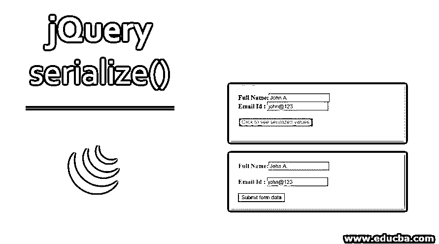
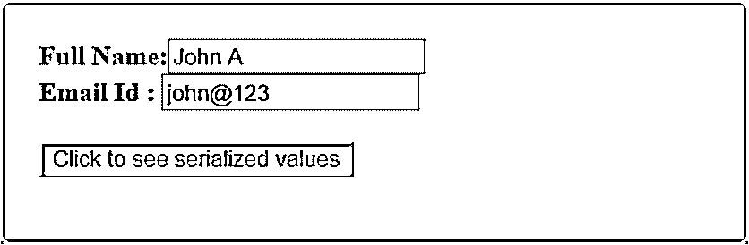
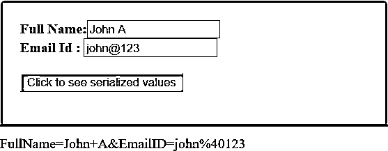
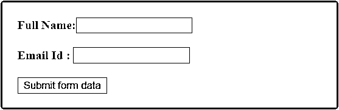
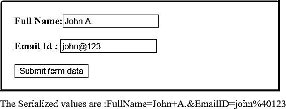
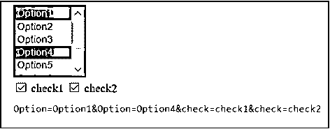
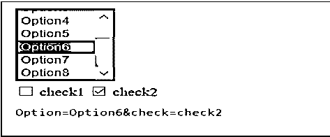

# jQuery serialize()

> 原文：<https://www.educba.com/jquery-serialize/>




## jQuery serialize()简介

jQuery serialize()方法用于通过序列化表单来创建标准 URL 编码表示法中的有效文本字符串。序列化用于将 JSON 对象数据转换为字符串格式，然后将其附加到请求中并发送给服务器。这个方法基本上将表单元素编码成一个有效的文本字符串。然后，这个文本字符串在发送到之前被附加到 [AJAX 请求上。](https://www.educba.com/what-is-ajax/)

这个方法可以用在任何有表单控件的 jQuery 对象上，比如 input、textarea 和 select。向发出 AJAX 请求时，可以在 URL 查询字符串中使用序列化值。jQuery 只将成功的控件序列化到查询中。成功的控件是名称与其当前值成对出现的控件。此控件对提交有效。

<small>网页开发、编程语言、软件测试&其他</small>

**语法**

下面给出了 serialize()方法的简单语法。

```
$(selector).serialize()
```

*   此方法不接受任何参数。
*   返回一个字符串对象。

### jQuery serialize()方法实现

为了更好地理解，我们来看几个例子:

#### 示例#1

这是一个非常简单的例子，其中使用了 serialize()方法。

```
<!DOCTYPE  html>
<html>
<head>
<script  src="https://code.jquery.com/jquery-1.12.4.min.js"></script>
<script>
$(document).ready(function()  {
$("button").click(function()  {
$("#div2").text($("form").serialize());
});
});
</script>
<style> #div1 {
width: 400px; height:  100px; padding:  20px; font-size:  medium; font-weight: bold;
border:  3px  solid  mediumseagreen; background:  lightgray;
margin-bottom:  10px;
}
</style>
</head>
<body>
<div  id="div1">
<form  action="">
Full  Name:<input  type="text"  name="FullName"  value="John  A"  /><br  /> Email  Id  :  <input  type="text"  name="EmailID"  value="john@123"  /><br  />
</form>
<br />
<button  style="background-color:palevioletred;"> Click  to  see  serialized  values
</button>
</div>
<div  id="div2"></div>
</body>
</html>
```

**输出:**

当页面第一次加载时，下面的屏幕显示在最开始。

屏幕显示了一个带有两个输入字段和一个按钮的表单。

两个输入字段中的值已经被硬编码。




单击按钮时，serialize()方法将输入字段值转换为文本字符串，如下面的




serialize()方法，用标准的 URL 编码表示法创建一个文本字符串。

jQuery 序列化表单中成功的控件，在本例中就是<input>。我们看到来自两个输入字段的序列化值使用&连接在一起。

#### 实施例 2

现在让我们看一个例子，在这个例子中，一旦表单被加载，输入字段的值就由用户提供。

```
<!DOCTYPE  html>
<html>
<head>
<title>JQuery  Example  for  Serialization</title>
<script  src="https://code.jquery.com/jquery-1.12.4.min.js"></script>
<script>
$(document).ready(function()  {
$("#submit").click(function()  {
var  text  =  $("form").serialize();  //  Serialize  form  Data
$("#div2").text("The  Serialized  values  are  :"  +  text); return  false;
});
});
</script>
<style> body {
font-family:  "Times  New  Roman";
}
#div1 {
width: 400px; height:  100px; padding:  20px;  color:  palevioletred; font-size:  medium; font-weight: bold;
border:  3px  solid  mediumseagreen; background:  lightgray;
margin-bottom:  10px;
}
#div2{
color:palevioletred;
}
</style>
</head>
<body>
<div  id="div1">
<form>
Full  Name:<input  type="text"  name="FullName"  /><br  /><br> Email  Id  :  <input  type="text"  name="EmailID"  /><br  /><br>
<input  type="submit"  id="submit"  value="Submit  form  data"/>
</form>
</form>
</div>
<div  id="div2"></div>
</body>
</html>
```

**输出:**

一旦页面第一次加载到浏览器中，就会显示下面的屏幕。

在这里，我们看到一个有两个输入字段和一个提交按钮的表单。




On providing the values in input fields and clicking on the button, input field values get serialized by the serialize() method to a text string in a URL-encoded




#### 实施例 3

让我们考虑一个例子，其中一个表单被序列化为一个查询字符串，并在 Ajax 请求中发送给服务器。

```
<!DOCTYPE  html>
<head>
<title>Jquery  Example  for  Serialization</title>
<script  src="https://code.jquery.com/jquery-1.12.4.min.js"></script>
<style> select {
font-size:  14px; height:100px; width:100px; color:indigo;
border:  3px  solid  grey;
}
form {
margin:  10px; color:green;
}
p { color:palevioletred; margin:  10px;
font-size:  14px;
}
b { color:green;
}
</style>
</head>
<body>
<form>
<select  name="Option"  multiple="multiple">
<option  selected="selected">Option1</option>
<option>Option2</option>
<option>Option3</option>
<option  selected="selected">Option4</option>
<option>Option5</option>
<option>Option6</option>
<option>Option7</option>
<option>Option8</option>
</select>
<br />
<input type="checkbox" name="check" value="check1" id="check1" />
<label for="check1">check1</label>
<input
type="checkbox" name="check" value="check2" checked="checked" id="check2"
/>
<label for="check2">check2</label>
</form>
<p><tt  id="results"></tt></p>
<script>
function  serializeValues()  {
var  str  =  $("form").serialize();
$("#results").text(str);
}
$("input[type='checkbox'").on("click",  serializeValues);
$("select").on("change",  serializeValues); serializeValues();
</script>
</body>
</html>
```

**输出:**

一旦页面首次加载到浏览器中，就会显示下面的屏幕。我们有一个下拉框，最初我们选择了两个选项，选项 1 和

此外，我们还有两个复选框，分别选中了 check1 和 check2。在表单的底部，我们可以看到表单输入字段的序列化值。

**Note:** In this example, only checked values from checkboxes (inputs type “checkbox”) are included.




Now, we change our selection to

这里的序列化值包括从 dropbox 中选择的选项，即 Option6 和复选框 check2




jQuery 只将成功的控件序列化到查询中。成功控件是对提交有效的控件。它必须有一个与其当前。这构成了提交的数据集的一部分。

只有当元素具有 name 属性时，表单元素的值才能包含在序列化字符串中。

### 结论

在本文中，我们主要关注使用 jQuery 中的 serialize()方法实现序列化。序列化是一个将 json 对象和数组数据转换成字符串的概念。这个过程可以用于使用 web 跨各种平台发送和接收 JSON 格式的数据。

我们看到了如何使用 jQuery serialize()将 jQuery 表单数据转换为序列化对象 json 格式。然后，对象字符串在服务器端被反序列化。serialize()方法可用于创建有效的查询字符串，该字符串将在 AJAX 中发送到服务器。

### 推荐文章

这是 jQuery serialize()的指南。这里我们讨论 jQuery serialize()方法的介绍、实现和例子。你也可以看看下面的文章来了解更多-

1.  [jQuery keydown()](https://www.educba.com/jquery-keydown/)
2.  [jQuery show( )](https://www.educba.com/jquery-show/)
3.  [jQuery delegate( )](https://www.educba.com/jquery-delegate/)
4.  [jQuery toggleClass()](https://www.educba.com/jquery-toggleclass/)


