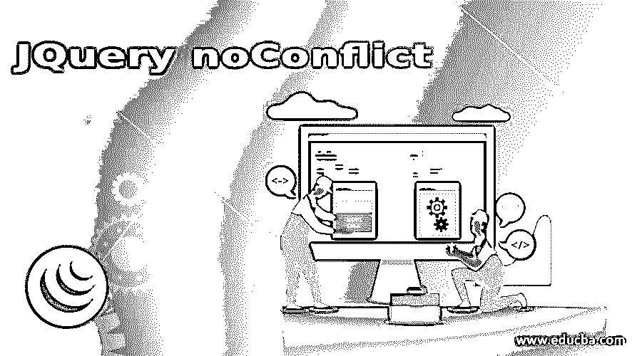
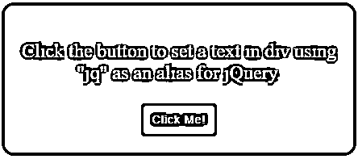
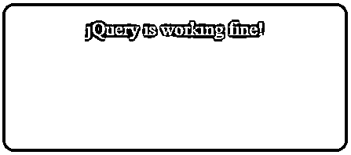
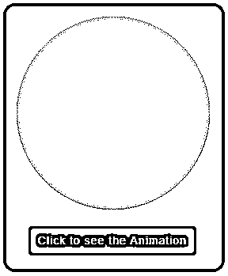
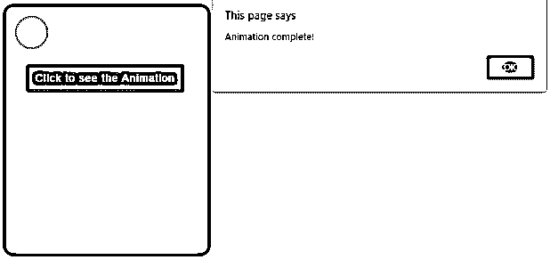
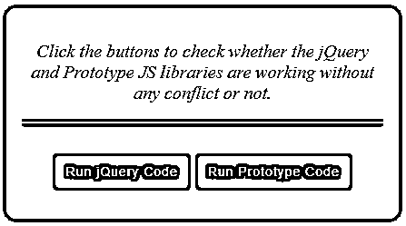
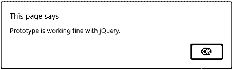

# JQuery 无冲突

> 原文：<https://www.educba.com/jquery-noconflict/>




## jQuery noConflict 简介

jQuery noConflict()方法是 jQuery 中的一个内置方法，它释放对“$”快捷方式标识符的控制，以便其他 JS 库可以使用它。通过应用 noConflict()方法，jQuery 告诉其他库“$”快捷方式不再属于 jQuery。这个方法非常重要，以防其他 JS 库对它们的方法使用相同的“$”快捷方式，这可能导致代码中的冲突。它还可以用于为 jQuery 变量和函数指定新的自定义名称。用户可以使用这种方法为 jQuery 创建自己的别名或快捷方式。noConflict()方法返回一个对 jQuery 的引用，该引用可以保存在一个变量中，供以后在代码中使用。

这种方法避免了冲突的情况，并使这些库和谐地工作成为可能。

<small>网页开发、编程语言、软件测试&其他</small>

**语法:**

```
$.noConflict(removeAll)
```

其中 removeAll 是可选参数，它返回一个布尔值，该值指定是否释放 jQuery 对所有 jQuery 变量的控制。

### 实现 jQuery noConflict()的示例

以下是 JQuery noConflict 的示例:

#### 示例#1

以下示例通过创建新的自定义别名来说明 jQuery noConflict()方法的用法。

**代码:**

```
<!DOCTYPE html>
<html>
<head>
<script src="https://code.jquery.com/jquery-1.10.1.min.js"></script>
</script>
<script>
varjq = $.noConflict();
jq(document).ready(function(){
jq(".btn").click(function(){
jq("#divstyle").text("jQuery is working fine!");
});
});
</script>
<style>
#divstyle
{
background: #408080;
width: 400px;
height: 150px;
padding-top: 20px;
padding-left: 5px;
border-radius: 15px;
text-align: center;
padding:20px;
font-size:24px;
color:#fff;
}
.btn{
background-color:#2D3942;
border: #2e6da4;
font-size: 20px;
color: #fff;
letter-spacing: 1px;
padding: 10px 14px;
font-size: 14px;
font-weight: normal;
border-radius: 4px;
line-height: 1.5;
text-decoration:none;
}
</style>
</head>
<body>
<div id ="divstyle"><br>Click the button to set a text in div using "jq" as an alias for jQuery.
<p>
<button class="btn">Click Me!</button>
</p>
</div>
</body>
</html>
```

**输出:**

*   当上面的代码被执行时，下面的屏幕显示。
*   在本例中，我们使用 noConflict()方法，创建一个新的自定义标识符或别名来代替“$”。




*   这里我们用“jq”代替“$”作为别名。
*   单击按钮后，将执行 jQuery 的 text()方法，为 div 元素设置一个文本，如下所示。




*   我们简单地声明了一个变量，并为它分配了 noConflict()方法。现在，这个变量名充当其余代码的别名。

#### 实施例 2

这是另一个使用“jQuery”而不是“$”的例子。

**代码:**

```
<!DOCTYPE html>
<html>
<head>
<script src="https://code.jquery.com/jquery-1.10.1.min.js"></script>
<script src="https://code.jquery.com/ui/1.11.2/jquery-ui.js"></script>
<script>
$.noConflict();
jQuery(document).ready(function () {
jQuery(".btncls").click(function () {
jQuery("#divanimation").animate(
{
width: "toggle",
height: "toggle",
},
{
duration: 5000,
specialEasing: {
width: "easeInOutSine",
height: "easeInOutSine",
},
complete: function () {
alert("Animation complete!");
},
}
);
});
});
</script>
<style>
#divstyle {
background: #408080;
width: 240px;
height: 300px;
padding-top: 20px;
padding-left: 5px;
border-radius: 15px;
padding: 20px;
font-size: 24px;
color: #fff;
}
#divanimation {
padding: 8px;
padding-left: 30px;
padding-top: 30px;
background: yellowgreen;
width: 200px;
height: 200px;
box-shadow: 0 0 5px #aaa;
font-size: 18px;
text-align: center;
border-radius: 200px;
}
.btncls {
background-color: #2d3942;
border: #2e6da4;
margin-left: 12px;
font-size: 15px;
color: #fff;
letter-spacing: 1px;
padding: 8px 12px;
font-size: 14px;
font-weight: normal;
border-radius: 4px;
line-height: 1.5;
text-decoration: none;
}
</style>
</head>
<body>
<div id="divstyle">
<div id="divanimation"></div>
<p><button class="btncls">Click to see the Animation</button></p>
</div>
</body>
</html>
```

**输出:**

*   当上面的代码被执行时，下面的屏幕显示。
*   在这个例子中，我们在方法、按钮点击和动画中使用了“jQuery”而不是“$”。




*   单击按钮后，动画就会出现。
*   即使不使用 noConflict()方法，上面的代码仍然可以工作。




#### 实施例 3

以下示例说明了如何使用 noConflict()方法避免冲突。

**代码:**

```
<!DOCTYPE html>
<html lang="en">
<head>
<meta charset="utf-8" />
<title>jQuery noConflict Example</title>
<script src="https://ajax.googleapis.com/ajax/libs/prototype/1.7.3.0/prototype.js"></script>
<script src="https://code.jquery.com/jquery-1.10.1.min.js"></script>
<script>
var $j = jQuery.noConflict();
$j(document).ready(function () {
$j("#jq").click(function () {
alert("jQuery is working fine with prototype.");
});
});
document.observe("dom:loaded", function () {
$("pro").observe("click", function (event) {
alert("Prototype is working fine with jQuery.");
});
});
</script>
<style>
.btn {
background-color: #2d3942;
border: #2e6da4;
font-size: 20px;
color: #fff;
letter-spacing: 1px;
padding: 10px 14px;
font-size: 14px;
font-weight: normal;
border-radius: 4px;
line-height: 1.5;
text-decoration: none;
}
#divstyle {
background: #408080;
width: 400px;
height: 200px;
margin-left: 400px;
margin-top: 100px;
padding-top: 20px;
padding-left: 5px;
border-radius: 15px;
text-align: center;
padding: 20px;
font-size: 20px;
font-style: italic;
}
</style>
</head>
<body>
<div id="divstyle">
<p>
Click the buttons to check whether the jQuery and Prototype JS libraries
are working without any conflict or not.
</p>
<hr />
<br />
<button type="button" class="btn" id="jq">Run jQuery Code</button>
<button type="button" class="btn" id="pro">Run Prototype Code</button>
</div>
</body>
</html>
```

**输出:**

*   执行上述代码时，屏幕显示如下。
*   在这个例子中，我们使用了两个 JS 库，jQuery 和 prototype。
*   由于这两个库都使用“$”作为别名，为了避免代码中的冲突，这里需要 noConflict()方法。
*   通过使用 noConflict()模式，jQuery 释放了对“$”标识符的控制，并使它可供其他库使用，这里是 prototype。




页面加载后，jQuery 立即进入 noConflict 模式，声明并分配一个新变量“j”来替换别名“$”，以避免与原型库冲突。

当点击“运行 jQuery 代码”按钮时，屏幕显示如下。


当点击“运行原型代码”按钮时，屏幕显示如下。




### 结论

*   本文讨论了 jQuery 中无冲突特性的重要性。
*   在使用不同的 JS 库或框架时，jQuery noConflict()方法非常重要。
*   这种方法确保不会因为使用不同的库而产生冲突，因为大多数库都使用“$”标识符作为别名。
*   这个方法一旦应用，就意味着“$”标识符不再是 jQuery 的快捷方式。

### 推荐文章

这是 jQuery noConflict 的指南。在这里，我们讨论 jQuery noConflict 及其示例和代码实现的简要概述。您也可以浏览我们推荐的其他文章，了解更多信息——

1.  [jQuery toggle()简介](https://www.educba.com/jquery-toggle/)
2.  [jQuery empty()(示例)](https://www.educba.com/jquery-empty/)
3.  [如何使用 jQuery insertAfter()方法？](https://www.educba.com/jquery-insertafter/)
4.  [jQuery appendTo() |参数|示例](https://www.educba.com/jquery-appendto/)


