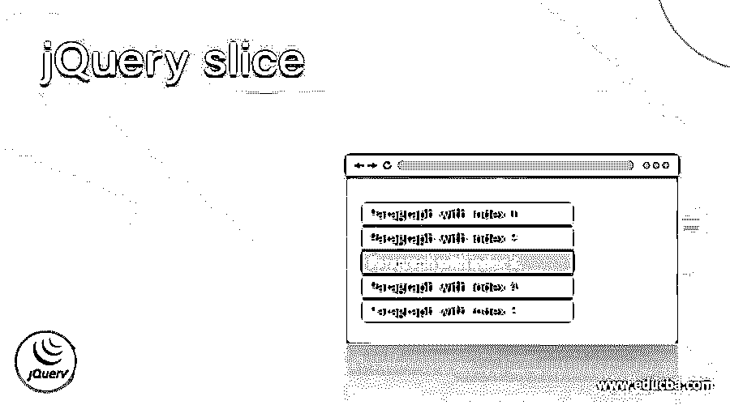
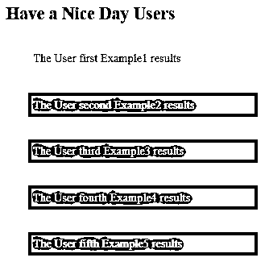
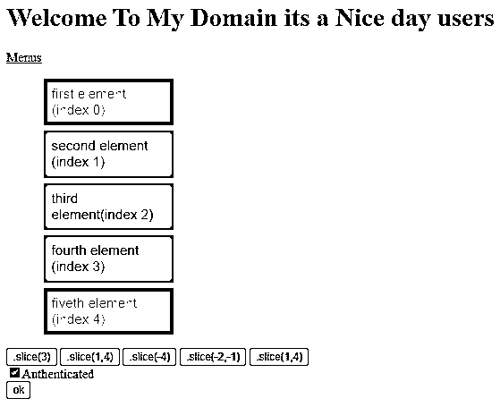
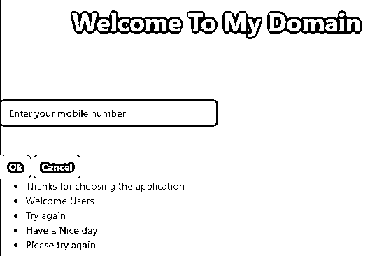

# jQuery 切片

> 原文：<https://www.educba.com/jquery-slice/>




## jQuery slice 简介

jQuery 切片是可用于设置 DOM 元素的方法之一，它还构造新的 jQuery 对象。它包含每个 html 元素的子集，方法有开始和结束参数。通过使用起始索引值，变元包含指定区域的索引值。元素的位置将由用户放置和识别。如果使用结束值索引来指定元素的位置，则完成。它使用索引将匹配元素的集合减少到编号范围的子集。

**语法:**

<small>网页开发、编程语言、软件测试&其他</small>

JQuery 有许多内置的方法来实现和呈现 web 应用程序中的 UI 层。slice()是选择基于索引值的 html 元素子集的默认方法之一。对于每个索引，该值将根据用户输入而变化。

```
<html>
<head>
<script type = "text/javascript" src="https://ajax.googleapis.com/ajax/libs/jquery/2.1.3/jquery.min.js”>
$(document).ready(function(){
$("").slice(start value, end value).addClass("");
});
</script>
<body>
---some UI tag elements usages depends upon the requirement---
</body></html>
```

以上代码是在 html web 页面中的 jQuery 上使用 slice(start，end)方法的基本语法。参数起始和结束索引值用于在 html 页面上传递方法参数。

### jQuery 中的 slice 方法是如何工作的？

jQuery slice()方法用于设置子字符串值和构造新对象。它支持用起始值和结束值参数指定的元素子集。参数值包含并支持存储和检索索引值的整数。通常，元素子集将包括起始索引处的元素值，这也排除了 html 元素的结束阶段的索引值。slice()方法的起始参数是一个必要的参数，用于指定要被选择的元素的起始索引。此外，索引值从基于 0 的索引值开始。该方法的目的是让我们从匹配的集合值中获取元素的子集。通过使用负数，它表示从具有匹配的集合元素的末端的偏移值。结束索引值是可选参数，它将在指定的元素处被选择，它将是停止的位置。如果我们省略了结束位置的索引值，则所选元素的指定范围将持续到匹配集值的末尾。

### jQuery 切片的示例

下面举几个例子

#### 示例#1

**代码:**

```
<!doctype html>
<html>
<head>
<title>Welcome To My Domain</title>
<style>
.first{
background: yellow;
}
.second{
background: green;
}
.third{
background: red;
}
.four{
background: blue;
}
.five{
background: pink;
}
div{
display: block;
border: 4px yellow;
color: violet;
padding: 7px;
margin: 31px;
width:303px;
}
</style>
<script src="https://code.jquery.com/jquery-2.1.1.js"></script>
</head>
<body>
<h2>Have a Nice Day Users</h2>
<div>The User first Example1 results</div>
<div>The User second Example2 results</div>
<div>The User third Example3 results</div>
<div>The User fourth Example4 results</div>
<div>The User fifth Example5 results</div>
<script>
$( "div" ).slice( 1,5).addClass("second");
$( "div" ).slice( -2,-6 ).addClass("first");
$( "div" ).slice( 2,4 ).addClass("third");
$( "div" ).slice( -1,-3 ).addClass("four");
$( "div" ).slice( -5,-7 ).addClass("five");
</script>
</body>
</html>
```

**输出:**




在上面的例子中，我们在基本字符串中使用了 slice()方法。我们使用了一些开始和结束的索引。切片(1，5)等..一旦我们切片，它会标记为红色。

#### 实施例 2

**代码:**

```
<!DOCTYPE html>
<html>
<head>
<script src="http://ajax.googleapis.com/ajax/libs/jquery/1.11.1/jquery.min.js"></script>
<script>
$(document).ready(function() {
$("#example1").click(function() {
$("li").css("background-color", "red");
$("li").slice(3).css("background-color", "violet");
});
$("#example2").click(function() {
$("li").css("background-color", "red");
$("li").slice(1, 4).css("background-color", "violet");
});
$("#example3").click(function() {
$("li").css("background-color", "red");
$("li").slice(-4).css("background-color", "violet");
});
$("#example4").click(function() {
$("li").css("background-color", "red");
$("li").slice(-2, -1).css("background-color", "violet");
});
$("#example5").click(function() {
$("li").css("background-color", "red");
$("li").slice(1, 4).css("background-color", "violet");
});
$('#Authenticated').click(function() {
if ($('#ok').is(':disabled')) {
$('#ok').removeAttr('disabled');
}
else {
$('#ok').attr('disabled', 'disabled');
}
});
});
</script>
<style>
ul {
font-family: Arial;
font-size: 17px;
font-family: Arial;
font-style: normal;
font-size-adjust: none;
width: 175px;
}
ul li {
background-color: blue;
margin: 7px;
padding: 9px;
list-style-type: none;
}
</style>
</head>
<body>
<h1>Welcome To My Domain its a Nice day users</h1>
<a href="#popupMenu" data-rel="popup" data-transition="slideup" class="ui-btn ui-corner-all ui-shadow ui-btn-inline ui-icon-gear ui-btn-icon-left ui-btn-a">Menus</a>
<div>
<div data-role="popup" id="popupMenu" data-theme="b">
<ul data-role="listview" data-inset="true" style="min-width:170px">
<li>first element (index 0)</li>
<li>second element (index 1)</li>
<li>third element(index 2)</li>
<li>fourth element (index 3)</li>
<li>fiveth element (index 4)</li>
</ul>
</div>
<div style="clear:both;">
<button id="example1">.slice(3)</button>
<button id="example2">.slice(1,4)</button>
<button id="example3">.slice(-4)</button>
<button id="example4">.slice(-2,-1)</button>
<button id="example5">.slice(1,4)</button>
</div>
<input id="Authenticated" name="Authenticated" type="checkbox" value="y"/>Authenticated<br>
<input id="ok" disabled="disabled" name="ok" type="submit" value="ok" />
</body>
</html>
```

**输出:**




在第二个例子中，我们使用了带有一些 html 认证的 slice()方法。像按钮和一些启用和禁用选项是用在前端。

#### 实施例 3

**代码:**

```
<!DOCTYPE html>
<html lang="en">
<head>
<head>
<link rel="stylesheet"
href=
"https://maxcdn.bootstrapcdn.com/bootstrap/4.0.0/css/bootstrap.min.css"
integrity=
"sha384-Gn5384xqQ1aoWXA+058RXPxPg6fy4IWvTNh0E263XmFcJlSAwiGgFAW/dAiS6JXm"
crossorigin="Welcome" />
<title>Have a Nice Day Users</title>
<style>
body {
height: 320px;
width: 107%;
background: rgba(0, 1, 0, 0.5);
}
#popup {
width: 603px;
height: 302px;
background-repeat: no-repeat;
background-position: center;
top: 63%;
left: 63%;
box-shadow: 3px 1px 4px 2px blue;
}
#emailId {
text-align: left;
left: 73%;
top: 73%;
}
.submitId {
top: 103px;
left: 194px;
}
.eg { color:blue; }
</style>
</head>
<body>
<h1 class=
"text-center text-white mt-5 font-weight-bold">
Welcome To My Domain
</h1>
<br />
<br />
<div class="first"
style="display: none;">
<div id="first">
<input type="mobile"
class=
"number-center w-50 form-control mt-5"
id="mobile"
placeholder=
"Enter your mobile number" />
<button class=
"submitId btn btn-primary font-weight-bold mt-5">
Ok
</button>
<button class=
"submitId btn btn-primary text-center font-weight-bold mt-5">
Cancel
</button>
</div>
</div>
<script src=
"https://code.jquery.com/jquery-3.2.1.slim.min.js"
integrity=
"sha384-KJ3o2DKtIkvYIK3UENzmM7KCkRr/rE9/Qpg6aAZGJwFDMVNA/GpGFF93hXpG5KkN"
crossorigin="welcome"></script>
<script src=
"https://cdnjs.cloudflare.com/ajax/libs/popper.js/1.12.9/umd/popper.min.js"
integrity=
"sha384-ApNbgh9B+Y1QKtv3Rn7W3mgPxhU9K/ScQsAP7hUibX39j7fakFPskvXusvfa0b4Q"
crossorigin="welcome"></script>
<script src=
"https://maxcdn.bootstrapcdn.com/bootstrap/4.0.0/js/bootstrap.min.js"
integrity=
"sha384-JZR6Spejh4U02d8jOt6vLEHfe/JQGiRRSQQxSfFWpi1MquVdAyjUar5+76PVCmYl"
crossorigin="welcome"></script>
<script>
$(document).ready(function () {
setTimeout(function () {
$(".first").css("display", "block");
}, 230);
});
$(".submitId").click(function () {
$(".first").css("display", "none");
});
$(document).ready(function() {
$("li").slice(3, 5).addClass("eg");
});
</script>
<div>
<ul>
<li class = "above">Thanks for choosing the application</li>
<li class = "top">Welcome Users</li>
<li class = "middle">Try again</li>
<li class = "bottom">Have a Nice day</li>
<li class = "below">Please try again</li>
</ul>
</div>
</body>
</html>
```

**输出:**




在最后一个例子中，我们使用了一些 html 元素，比如在输入手机号码提交到后端后，在文本框中输入手机号码。借助 slice()方法，我们可以用蓝色选项突出显示字符串。

### 结论

jQuery 库有许多特性和 UI 小部件。Like that slice()是一个用于切片或突出显示子字符串元素的内置方法。每当我们在 html 元素中使用该方法时，它都会创建一个单独的实例来利用 UI DOM 元素中的输入值。

### 推荐文章

这是一个 jQuery 切片指南。在这里，我们将讨论 slice 方法在 jQuery 中是如何工作的，并给出代码和输出。您也可以看看以下文章，了解更多信息–

1.  [jQuery 数组排序](https://www.educba.com/jquery-array-sort/)
2.  [jQuery 向下滚动](https://www.educba.com/jquery-scroll-down/)
3.  [jQuery preventDefault](https://www.educba.com/jquery-preventdefault/)
4.  [jQuery 宽度](https://www.educba.com/jquery-width/)


