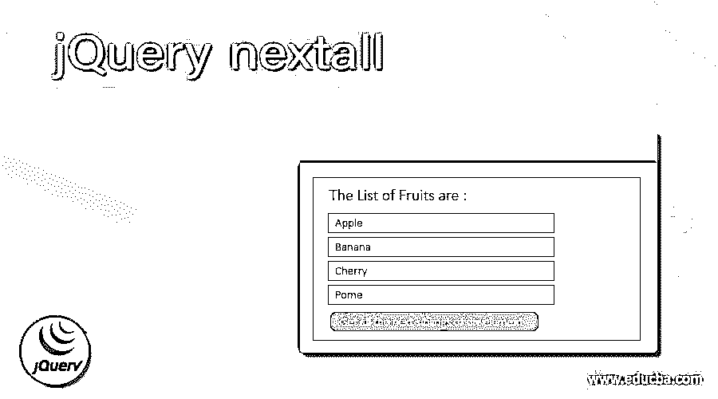
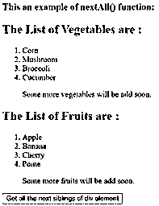
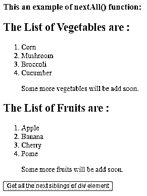
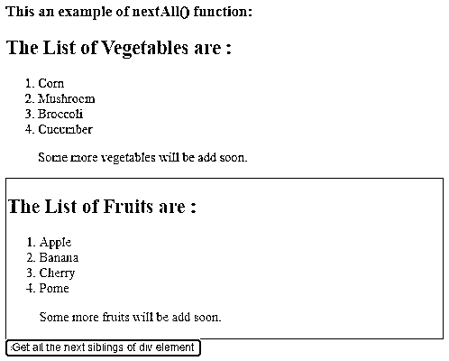
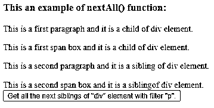
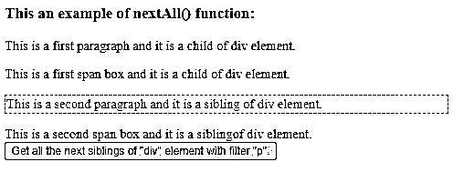
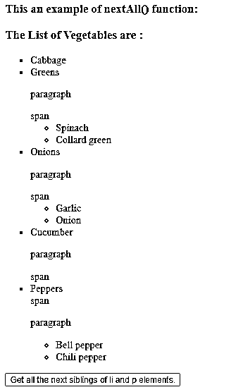
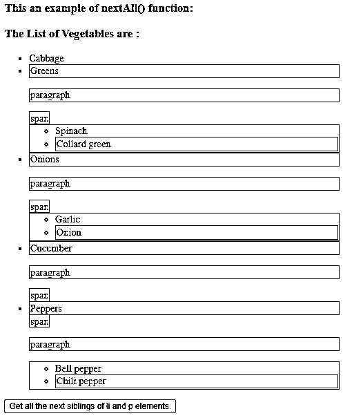

# jQuery nextall

> 原文：<https://www.educba.com/jquery-nextall/>




## jQuery nextall 简介

jQuery nextAll()函数用于获取指定选择器的所有下一个兄弟元素。jQuery nextAll()函数是 jQuery 中的内置函数。jQuery nextAll()函数在 DOM 树中向前搜索选择器的所有下一个兄弟。如果选择器没有传递给 nextUntil()函数，则 nextUntil()函数的执行与 nextAll()函数相同。

**语法—**

<small>网页开发、编程语言、软件测试&其他</small>

```
$(selector).nextAll(filter);
```

**参数—**

filter–这是一个可选参数。它指定过滤器表达式来向下搜索下一个匹配的同级元素。可以用逗号分隔符传递多个过滤器表达式，以获得多个兄弟元素。

**返回值-**

该函数的返回值是所选元素的所有下一个兄弟元素。

### 工作

JQuery nextAll()函数接受一个参数。假设我们在 HTML 页面中有一个 div 元素，它包含一些兄弟元素(它们的父元素是相同的)元素“p”和“span”。现在我们需要获得 div 元素的所有下一个兄弟元素，因此我们可以将 nextAll()函数用作“$(“div”)。nextAll()”，它将 div 元素的所有下一个兄弟元素作为“p”和“span”连同内容一起返回。

### jQuery nextAll()函数的示例

下面举几个例子

#### 示例#1

获取 div 元素的所有下一个兄弟元素的 jQuery nextAll()函数示例

**代码:**

```
<!doctype html>
<html lang="en">
<head>
<meta charset="utf-8">
<script src="https://code.jquery.com/jquery-3.5.0.js"></script>
<title> This is an example for jQuery nextAll() function </title>
<script>
function disp()
{
var content = $( "div" ).nextAll().css({
"color" : "red",
"border": "2px solid black"
});
}
</script>
</head>
<body>
<h3> This an example of nextAll() function: </h3>
<div>
<h2> The List of Vegetables are : </h2>
<ol>
<li> Corn </li>
<li> Mushroom </li>
<li> Broccoli </li>
<li> Cucumber </li>
<p> Some more vegetables will be add soon. </p>
</ol>
</div>
<div>
<h2> The List of Fruits are : </h2>
<ol>
<li> Apple </li>
<li> Banana </li>
<li> Cherry </li>
<li> Pome </li>
<p> Some more fruits will be add soon. </p>
</ol>
</div>
<button onclick = "disp()"> Get all the next siblings of div element </button>
</body>
</html>
```

上述代码的输出是




一旦我们点击按钮，输出是







在上面的代码中，有些 div 元素将“h2”、“ol”和“li”作为子元素，并将另一个“div”元素和 button 作为兄弟元素。接下来，使用 nextAll()函数以$(“div”)的形式获取 div 元素的所有兄弟元素。nextAll()；”，它返回“div”和“button”元素，这些元素通过 CSS()函数突出显示，单击按钮后我们就可以看到。

#### 实施例 2

jQuery nextAll()函数对 div 的所有下一个同级元素使用 filter p 元素的示例

**代码:**

```
<!doctype html>
<html lang="en">
<head>
<meta charset="utf-8">
<script src="https://code.jquery.com/jquery-3.5.0.js"></script>
<title> This is an example for jQuery nextAll() function </title>
<script>
function disp()
{
var content = $( "div" ).nextAll( "p" ).css({
"background-color": "yellow",
"border": "2px dashed green"
});
}
</script>
</head>
<body>
<h3> This an example of nextAll() function: </h3>
<div>
<p> This is a first paragraph and it is a child of div element. </p>
 This is a first span box and it is a child of div element. 
</div>
<p> This is a second paragraph and it is a sibling of div element. </p>
 This is a second span box and it is a siblingof div element. 
<br>
<button onclick = "disp()"> Get all the next siblings of "div" element with filter "p". </button>
</body>
</html>
```

上述代码的输出是–




一旦我们点击“获取 p 个子节点”按钮，输出是




在上面的代码中，有“div”元素，它们将“p”、“span”和“button”作为同级元素。接下来，nextAll()函数用于获取“div”元素的所有下一个同级元素，而“p”被指定为过滤元素，因此该函数仅从“p”、“span”和“button”同级元素中选择“p”同级元素，并将格式样式应用于“p”元素，如我们在上面的输出中所看到的。

#### 实施例 3

获取多个元素的所有下一个兄弟元素的 jQuery nextAll()函数示例

**代码:**

```
<!doctype html>
<html lang="en">
<head>
<meta charset="utf-8">
<script src="https://code.jquery.com/jquery-3.5.0.js"></script>
<title> This is an example for jQuery nextAll() function </title>
<script>
function disp()
{
var content = $( "li, p" ).nextAll().css({
"color": "black",
"border": "2px solid black",
"background-color" : "yellow"
});
}
</script>
</head>
<body>
<h3> This an example of nextAll() function: </h3>
<div>
<h3> The List of Vegetables are : </h3>
<ul>
<li> Cabbage </li>
<li> Greens </li>
<p> paragraph </p>
 span 
<ul>
<li> Spinach </li>
<li> Collard green </li>
</ul>
<li> Onions </li>
<p> paragraph </p>
 span 
<ul>
<li> Garlic </li>
<li> Onion </li>
</ul>
<li> Cucumber  </li>
<p> paragraph </p>
 span 
<li> Peppers </li>
 span 
<p> paragraph </p>
<ul>
<li> Bell pepper </li>
<li> Chili pepper </li>
</ul>
</ul>
</div>
<button onclick = "disp()"> Get all the next siblings of li and p elements. </button>
</body>
</html>
```

上述代码的输出是–




一旦我们点击“获取 p 个子节点”按钮，输出是




在上面的代码中，有“li”元素，它们的兄弟元素是“p”和“span”。接下来，使用 nextAll()函数以$(“li，p”)的形式获得“Li”和“p”元素的兄弟元素。nextAll()"，因此该函数选择“li”和“p”元素的兄弟元素，并将格式样式应用于所选的兄弟元素，正如我们在上面的输出中所看到的。

### 结论

jQuery nextAll()函数是一个内置函数，用于获取所选元素的所有下一个兄弟元素。

### 推荐文章

这是 jQuery nextall 的指南。在这里，我们将讨论 JQuery nextAll()函数的工作方式，以及示例和输出。您也可以看看以下文章，了解更多信息–

1.  [jQuery 移动元素](https://www.educba.com/jquery-move-element/)
2.  [jquery internhtml](https://www.educba.com/jquery-innerhtml/)
3.  [jQuery next()](https://www.educba.com/jquery-next/)
4.  [jQuery grep](https://www.educba.com/jquery-grep/)


