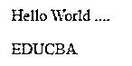
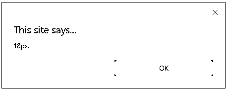

# jQuery 高度()

> 原文：<https://www.educba.com/jquery-height/>

")


## jQuery height()方法简介

height()方法确定或返回指定元素的高度。使用这种方法返回高度时，首先返回匹配元素的高度，使用这种方法设置高度时，将设置所有匹配元素的高度。当数学计算涉及到使用元素的高度时，最好使用 jQuery height()方法。这种方法还可以确定窗口和文档的高度。当元素或其父元素被隐藏时，height()方法指定的值不能保证是准确的。在使用 height()方法获得准确的结果之前，请验证元素是否明显。

**语法:**

<small>网页开发、编程语言、软件测试&其他</small>

```
$(selector).height ()
```

它用于返回元素的高度。

```
$(selector).height(value)
```

它用于设置特定元素的高度。

```
$(selector).height (function (index, currentheight))
```

它用于使用函数设置特定元素的高度。

### 参数和描述

*   **值**:设置元素高度的必需参数。高度可以用 px、em、pt 来指定。默认单位是 px。
*   **function (index，currentheight):** 可选参数，指定提供所选元素新高度的函数。
*   **index:** 返回所选元素在给定集合中的索引位置。
*   **currentheight:** 返回给定集合中所选元素的当前高度。

**身高的好处()方法:**

*   当在数学计算中需要元素的高度时，可以使用它。
*   它返回内容的高度，而不考虑 CSS box-size 属性的值。

### jQuery height()方法的工作原理

jQuery 通过使用 height()方法查找尺寸，或者根据您需要的尺寸查找内部宽度或内部高度或外部宽度或外部高度，使您可以轻松地处理元素甚至浏览器窗口的尺寸。元素的高度将简化元素的计算大小。jQuery height()方法将为一个元素设置新的维度，只需给一个参数一个新的值。

### jQuery height()的示例

下面是 jQuery height()的例子:

#### 示例#1

**代码:**

```
<!doctype html>
<html lang="en">
<head>
<meta charset="utf-8">
<title>jQuery height() method</title>
<style>
body {
background: grey;
}
button {
font-size: 10px;
margin: 4px;
}
p {
width: 150px;
border: 1px green solid;
}
div {
color: cyan;
font-weight: bold;
}
</style>
<script src="https://code.jquery.com/jquery-3.4.1.js"></script>
</head>
<body>
<p>
Click on below buttons to get various types heights ...
</p>
<button id="para_hgt"> Click here to get height of the paragraph </button>
<button id="doc_hgt"> Click here to get height of the Document </button>
<button id="wind_hgt"> Click here to get height of the window </button>
<div>&nbsp;</div>
<script>
function showHeight( element, height ) {
$( "div" ).text( "The height for the " + element + " is " + height + "px." );
}
$( "#para_hgt" ).click(function() {
showHeight( "paragraph", $( "p" ).height() );
});
$( "#doc_hgt" ).click(function() {
showHeight( "document", $( document ).height() );
});
$( "#wind_hgt" ).click(function() {
showHeight( "window", $( window ).height() );
});
</script>
</body>
</html>
```

**输出:**

 Example 1")


如上图所示，当你点击每个按钮时，你会得到段落、文档和窗口的高度。

 Example 1")


 Example 1")


 Example 1")


#### 实施例 2

**代码:**

```
<html>
<head>
<meta charset="utf-8">
<title>jQuery height() method</title>
<script src="http://java2s.com/style/jquery-1.8.0.min.js"></script>
<script type="text/javascript">
$(document).ready(function(){
function showHeight(element, hgt) {
alert( hgt + "px.");
}
$("p").click(function () {
showHeight("paragraph", $("p").height());
});
});
</script>
</head>
<body>
<body>
<p> Hello World .... </p> <p> EDUCBA </p>
</body>
</html>
```

**输出:**




在上面的输出中，当你点击文本时，它会在警告框中显示元素的字体大小。




#### 实施例 3

**代码:**

```
<!doctype html>
<html lang="en">
<head>
<meta charset="utf-8">
<title> jQuery height() method </title>
<style>
div {
width: 40px;
height: 80px;
float: left;
margin: 8px;
background: rgb(255,140,0);
cursor: pointer;
}
</style>
<script src="https://code.jquery.com/jquery-3.4.1.js"></script>
</head>
<body>
<div> </div>
<div> </div>
<div> </div>
<div> </div>
<div> </div>
<script>
$( "div" ).one( "click", function() {
$( this ).height( 40 ).css({
cursor: "auto",
backgroundColor: "grey"
});
});
</script>
</body>
</html>
```

**输出:**

 Example 3")


 Example 3")


#### 实施例 4

**代码:**

```
<!DOCTYPE html>
<html>
<head>
<meta charset="utf-8">
<title> jQuery height() method </title>
<script src="https://ajax.googleapis.com/ajax/libs/jquery/3.4.1/jquery.min.js"></script>
<script>
$(document).ready(function(){
$("button").click(function(){
$("div").height(function(n,c){
return c+100;
});
});
});
</script>
</head>
<body>
<button> Click on the button to increase the height of the div </button> <br> <br>
<div style="height:150px; border:2px dotted;"></div>
</body>
</html>
```

**输出:**

 Example 4")


 Example 4")


#### 实施例 5

**代码:**

```
<html>
<head>
<meta charset="utf-8">
<title> jQuery height() method </title>
<script src="https://ajax.googleapis.com/ajax/libs/jquery/3.3.1/jquery.min.js"></script>
<script>
$(document).ready(function() {
$("button").click(function() {
var msg = "";
msg += "The inner height of div element is : " + $("#hgt_demo").
innerHeight() + "</br>";
$("#hgt_demo").html(msg);
});
});
</script>
</head>
<style>
#hgt_demo {
height: 160px;
width: 330px;
padding: 15px;
margin: 2px;
border: 1px solid blue;
background-color: green;
}
</style>
<body>
<div id="hgt_demo"></div>
<button> Click Here... </button>
<p> Click on the above button to check the inner height of an element... </p>
</body>
</html>
```

**输出:**

 Example 5")


在输出中，当您单击按钮时，它将显示页面上元素的内部高度。

 Example 5")


#### 实施例 6

**代码:**

```
<html>
<head>
<meta charset="utf-8">
<title> jQuery height() method </title>
<script src="https://ajax.googleapis.com/ajax/libs/jquery/3.3.1/jquery.min.js"></script>
<script>
$(document).ready(function() {
$("button").click(function() {
var msg = "";
msg += "The height of div element is : " + $("#hgt_demo").
height() + "</br>";
$("#hgt_demo").html(msg);
});
});
</script>
</head>
<style>
#hgt_demo {
height: 160px;
width: 330px;
padding: 15px;
margin: 2px;
border: 1px solid blue;
background-color: green;
}
</style>
<body>
<div id="hgt_demo"></div>
<button> Click Here... </button>
<p> Click on the above button to check the height of an element without including padding... </p>
</body>
</html>
```

**输出:**

 Example 6")


在输出中，当您单击按钮时，它将显示页面上元素的高度。

**T2】**


 **### 结论

到目前为止，我们已经看到了 jQuery 的内置方法 height()来测量一个元素的高度。但这不会检查元素的填充、边框和边距。请记住，height(value)设置框的内容高度，而不考虑属性的 CSS 框大小值。当您使用 height()的值时，该值可以是字符串或整数。如果值中只有一个数字，那么 jQuery 假定一个像素单位。

### 推荐文章

这是 jQuery height()的指南。在这里，我们讨论 jQuery height()方法的工作原理及其示例和代码实现。您也可以浏览我们推荐的其他文章，了解更多信息——

1.  [jQuery hide()](https://www.educba.com/jquery-hide/)
2.  [jQuery 验证](https://www.educba.com/jquery-validate/)
3.  [jQuery draggable()](https://www.educba.com/jquery-draggable/)


**