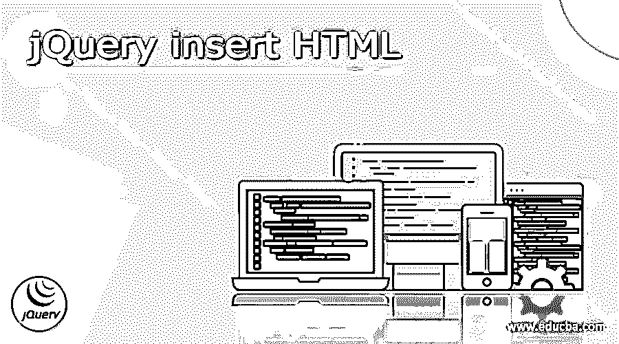
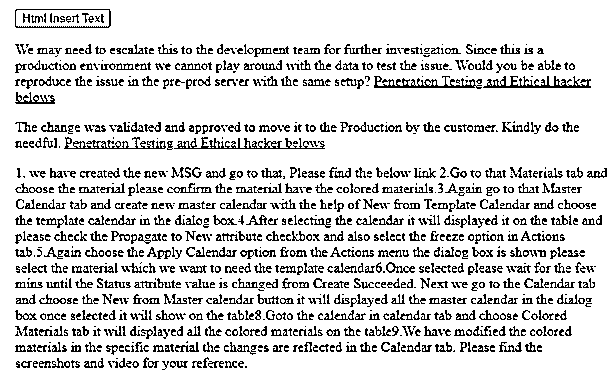
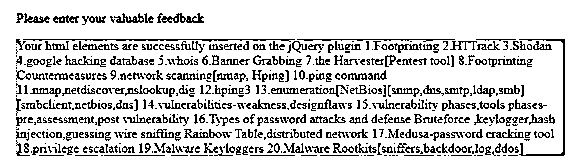

# jQuery 插入 HTML

> 原文：<https://www.educba.com/jquery-insert-html/>




## jQuery insert HTML 简介

jQuery insert HTML 是在 jQuery 库中插入 HTML 内容的特性之一，jQuery 库具有 javascript 库，我们可以在它支持的 jQuery 插件中添加 HTML 数据，并调用所有 HTML 标记元素和其他 DOM 元素， 文本节点它在每个可以设置为匹配的元素的开头插入 jQuery 对象，插入的元素也将在元素之前和元素之后进行验证，支持其他标记元素和方法，如 append()和 HTML 容器用于在插件上添加它。

**语法:**

<small>网页开发、编程语言、软件测试&其他</small>

JQuery 是可以用来创建动态网页的 javascript 库之一。使用$符号，jQuery 将作为代码中的选择器被调用。在 HTML 中，DOM 元素是导航网页最重要的东西之一。这样，我们可以将 HTML 标签元素放在选择器中。

```
<html>
<head>
<script>
$(document).ready(function(){
$("p").append('html tag and elements');
---some codes—
});
</script>
</head>
<body>
--some html codes—
</body>
</html>
```

上述代码是在 jQuery 库中使用和插入 HTML 代码的基本语法。

### 如何插入 HTML jQuery？

jQuery 插件是 javascript 中最重要和最有用的库之一。它有几种方法来实现 jQuery 库中的 HTML 代码。主要是将 HTML 内容附加到插件的基本 jQuery 选择器中，如$ symbol 所示，并用于在基于脚本的场景中调用 HTML 数据。用于执行此操作的一些方法，如 prepend()、append()、before()、after()、html()、text()和 wrap()这些方法允许我们在现有元素中插入新的 HTML 内容。并行地，我们可以通过使用 append()和 prepend()方法调用和插入多个元素，每个元素和方法都有自己的语法和属性，以便用户在所选元素之前插入 HTML 内容。同样，我们使用 after()方法在所选元素后插入内容，它还将用于在 DOM 类文档对象模型的元素容器前后插入段落，并且它可以插入 HTML 页面和 jQuery 插件支持的数据，如图像和其他文本格式。

#### 示例#1

```
<!DOCTYPE html>
<html lang="en">
<head>
<meta charset="utf-8">
<title>Welcome To My Domain its the first example that related to the jquery insert html elements</title>
<script src="https://code.jquery.com/jquery-3.5.1.min.js"></script>
<script>
$(document).ready(function(){
$("p").append(' <a href="#">Penetration  Testing and Ethical hacker belows</a>');
$("button").click(function(){
```

$("#container ")。追加(" 1。我们已经创建了新的消息，请点击下面的链接 2。转到物料选项卡并选择物料，请确认物料具有彩色物料。3 .再次转到主日历选项卡，在模板日历新建的帮助下创建新的主日历，并在对话框中选择模板日历。4 .选择日历后，它将显示在表格中，请选中传播到新属性复选框，并在操作选项卡中选择冻结选项。5 .再次从操作菜单中选择应用日历选项。显示对话框，请选择我们需要模板日历的物料。选择后，请等待几分钟，直到“状态”属性值从“创建成功”更改。接下来，我们转到“日历”选项卡，选择“从主日历新建”按钮，它将在对话框中显示所有主日历，一旦选中，它将显示在表格上 8。转到“日历”选项卡中的日历，并选择“彩色材料”选项卡，它将显示表 9 中的所有彩色材料。我们已经修改了特定材料中的彩色材料，这些更改将反映在日历选项卡中。请大家找到截图和视频，供大家参考。”);

```
});
});
</script>
</head>
<body>
<button type="button">Html Insert Text</button>
<div id="container">
```

我们可能需要将此问题上报给开发团队进行进一步调查。由于这是一个生产环境，我们不能用数据来测试问题。

您能在生产前服务器上用相同的设置重现该问题吗？

客户对变更进行了验证和批准，以将其转移到生产中。

请做必要的事。

**样本输出:**




在上面的例子中，我们使用 append()方法在 jQuery 插件中插入 HTML 元素。这样，我们可以在 jQuery 插件中调用其他 HTML 元素和方法。这里我们创建一个名为<button>的 HTML 元素来点击 DOM 元素，并将 HTML 内容放入网页的 jQuery 插件中。</button>

#### 实施例 2

```
<html lang="en">
<head>
<meta charset="utf-8">
<title>Welcome To My Domain its the second example that related to the jQuery insert html</title>
<style>
#demo {
background: violet;
}
</style>
<script src="https://code.jquery.com/jquery-3.5.0.js"></script>
</head>
<body>
<p> Please enter your valuable feedback </p>
<div id="demo">Your html elements are successfully inserted on the jQuery plugin
1.Footprinting
2.HTTrack
3.Shodan
4.google hacking database
5.whois
6.Banner Grabbing
7.the Harvester[Pentest tool]
8.Footprinting Countermeasures
9.network scanning[nmap, Hping]
10.ping command
11.nmap,netdiscover,nslookup,dig
12.hping3
13.enumeration[NetBios][snmp,dns,smtp,ldap,smb][smbclient,netbios,dns]
14.vulnerabilities-weakness,designflaws
15.vulnerability phases,tools
phases-pre,assessment,post vulnerability
16.Types of password attacks and defense
Bruteforce ,keylogger,hash injection,guessing
wire sniffing
Rainbow Table,distributed network
17.Medusa-password cracking tool
18.privilege escalation
19.Malware Keyloggers
20.Malware Rootkits[sniffers,backdoor,log,ddos]
</div>
<script>
$( "p" ).insertAfter( "#demo" );
$( "p" ).insertBefore( "#demo" );
</script>
</body>
</html>
```

**样本输出:**




我们使用的最后一个例子是在

HTML 标签中插入 HTML 元素。我们还可以在 jQuery 脚本中使用 insertAfter()和 insertBefore()方法插入数据。

### 结论

在 jQuery 插件中，它有许多应用程序的默认概念和行为。在 HTML 内容中，最重要和最有价值的数据内容放在插件上。它有许多默认的方法来将内容放入 jQuery 脚本中，以遍历 web 页面上的数据。

### 推荐文章

这是一个 jQuery 插入 HTML 的指南。这里我们讨论一下 jQuery 的定义，语法，如何插入 HTML？以及更好理解的例子。您也可以看看以下文章，了解更多信息–

1.  [jQuery 帖子](https://www.educba.com/jquery-post/)
2.  [jQuery keycode](https://www.educba.com/jquery-keycode/)
3.  [jQuery 替换类](https://www.educba.com/jquery-replace-class/)
4.  [jQuery ajax 请求](https://www.educba.com/jquery-ajax-request/)


