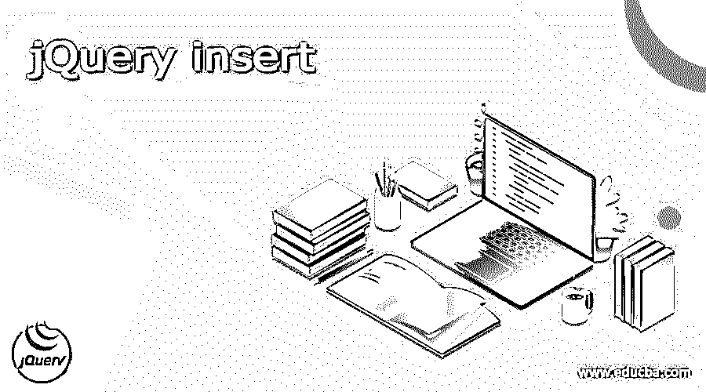
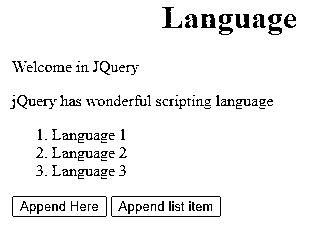
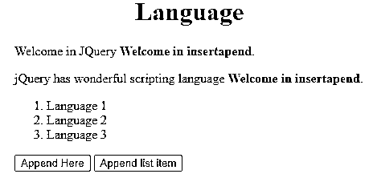
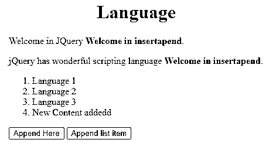

# jQuery 插入

> 原文：<https://www.educba.com/jquery-insert/>




## jQuery 插入的定义

jQuery 为用户提供了不同类型的功能，其中 jQuery insert 是 jQuery 提供的功能之一。通常 jQuery insert 提供了不同的方法，这意味着我们可以在指定元素之前插入 HTML 内容，也可以根据用户需求在指定元素之后插入 HTML 内容。jQuery 由不同的方法组成，在这个方法的帮助下，我们可以根据用户需求执行不同的操作。所以这里我们列出了 append()、HTML()、text()、before()、after()、wrap()和 prepend()等一些方法。我们可以使用任何方法，执行任何操作。

### jQuery 插入的方法

现在让我们看看 jQuery insert 的不同方法，如下所示

<small>网页开发、编程语言、软件测试&其他</small>

#### 1.insertAfter()

insertAfter()是 jQuery 中的一种内置策略，用于在预定组件后嵌入一些 HTML 内容。HTML 内容将在预定组件的每个事件之后嵌入。

**语法**

```
$(specified html content).insertAfter(specified target)
```

**解释**

在上面的例子中，我们使用不同的两种类型的参数如下。

*   指定的 HTML 内容意味着我们需要在所需内容之后插入的实际内容。
*   指定的目标意味着 HTML 页面的端点，或者换句话说，我们可以说在它之后我们需要插入内容。

#### 2.插入前置()

prepend()策略是 jQuery 中的一种内置技术，用于在所选组件的开头嵌入预定的内容。

*   界限:这些策略承认上面提到的和下面描述的两个界限:
*   内容:这是所要求的边界，用于确定应嵌入的物质。
*   功能:这是用于确定呼叫后执行能力的自由边界。

#### 3.在()前插入

jQuery before()技术用于在选择的组件之前嵌入内容。before()和 insertBefore()两种技术用于执行相同的赋值。它们之间的主要差别在于语言结构和物质与客观的情况。

#### 4.插入包装()

wrap()策略是 jQuery 中的一种内置技术，用于将预定义的组件折叠到选定的组件上。

*   **界限:**这一战略承认两个界限，如上所述，如下所述:
*   **组件:**是用来确定要折叠到所选组件上的组件的所需边界。
*   **功能:**用于确定返回包装组件的能力的自由边界。

#### 5.插入文本()

该策略用于设置或返回组件的文本内容。设置实体时，它会覆盖大量协调组件的实体。利用 text 方法()的返回内容返回每个协同组件的文本内容。

#### 6\. Inserthtml()

jQuery HTML()技术用于改变所选组件的整体内容。它用新的物质替换所选的成分含量。

**Note:** It is an extremely valuable capacity however works in a restricted region due to its API documentation. The API documentation of the jQuery HTML work comprises three-technique marks.

主技术签名没有争用，所以它只是返回组件内部的 HTML。剩下的两个标记进行单独的竞争:例如，一个字符串或一个字符串的容量

#### 7.插入追加()

基本上，append()技术用于嵌入一个确定的物质，就像 jQuery 分类中所选组件的最后一个 kid(接近末尾)。

**语法**

```
$(selector).append(specified web content, required function())
```

append()和 appendTo()技术用于完成类似的任务。

*   **边界:**这种技术承认上面提到的和下面描述的两个边界:
*   **内容:**这是一个必需的边界，用于指示将要嵌入到所选部件表面的物质。可以想象的有价值的实体是 HTML 组件、jQuery 项和 DOM 组件。
*   **Function(index，HTML):** 它是一个任意的边界，用来表示将返回要嵌入的物质的容量。

**1。Index:** 用于返回组件的记录位置。

**2。Html:** 用于返回所选组件的当前 Html。

### 例子

现在让我们看看 insert append()的不同示例，以便更好地理解，如下所示。

```
<!DOCTYPE html>
<html>
<head>
<title>
Welcome in jQuery append () method
</title>
<script src="https://ajax.googleapis.com/ajax/libs/jquery/3.5.1/jquery.min.js"></script>
<!-- Script to append content -->
<script>
$(document).ready(function(){
$("#bttn1").click(function(){
$("p").append(" <b>Welcome in insertapend</b></b>.");
});
$("#bttn2").click(function(){
$("ol").append("<li>New Content addedd</li>");
});
});
</script>
</head>
<body>
<h1 style="margin-left: 150px;">Language</h1>
<p>Welcome in JQuery</p>
<p>jQuery has wonderful scripting language</p>
<ol>
<li>Language 1</li>
<li>Language 2</li>
<li>Language 3</li>
</ol>
<button id="bttn1">Append Here</button>
<button id="bttn2">Append list item</button>
</body>
</html>
```

**解释**

在上面的例子中，我们试图实现 jQuery 的 append()方法，这里我们简单地为 HTML 内容编写了 HTML 代码，并且我们还添加了 jQuery 脚本，如下所示。之后，我们创建了两个按钮，在指定的内容之后添加我们想要的内容，如上面的代码所示。在这个例子中，我们在段落末尾添加内容。上面程序的最终结果我们用下面的截图来说明。




现在，单击第一个按钮“追加到此处”。点击按钮后，结果如下图所示。




现在点击第二个按钮，点击第二个按钮后，最终结果如下图所示。




这样，我们就可以根据需求添加更多的内容。

现在让我们看看 append 方法()的一个例子，如下所示。

```
<!doctype html>
<html lang="en">
<head>
<meta charset="utf-8">
<title>append method() demo</title>
<style>
#dm {
background: rgb(134, 134, 123);
}
</style>
<script src="https://code.jQuery.com/jQuery-3.5.0.js"></script>
</head>
<body>
Welcome in jQuery programming Language 
<div id="dm">Hi Read line </div>
<script>
$( "span" ).appendTo( "#dm" );
</script>
</body>
</html>
```

**解释**

在上面的例子中，我们试图通过使用 id 来追加内容，如下所示，这里我们追加 Hi Read 行内容。上面程序的最终结果我们用下面的截图来说明。


这样，我们可以通过使用 insert append()方法根据需求执行不同的操作。

### 结论

我们希望通过这篇文章，您能够了解更多关于 jQuery insert 的知识。从上面的文章中，我们已经理解了 jQuery insert 的基本思想，我们还看到了 jQuery insert 的表示和示例。从本文中，我们了解了如何以及何时使用 jQuery insert。

### 推荐文章

这是一个 jQuery 插入指南。这里我们讨论定义，概述，代码实现的例子。您也可以看看以下文章，了解更多信息–

1.  [jQuery 连接](https://www.educba.com/jquery-join/)
2.  [jQuery 队列](https://www.educba.com/jquery-queue/)
3.  [jQuery 日历调度器](https://www.educba.com/jquery-calendar-scheduler/)
4.  [jQuery ajax 失败](https://www.educba.com/jquery-ajax-fail/)


