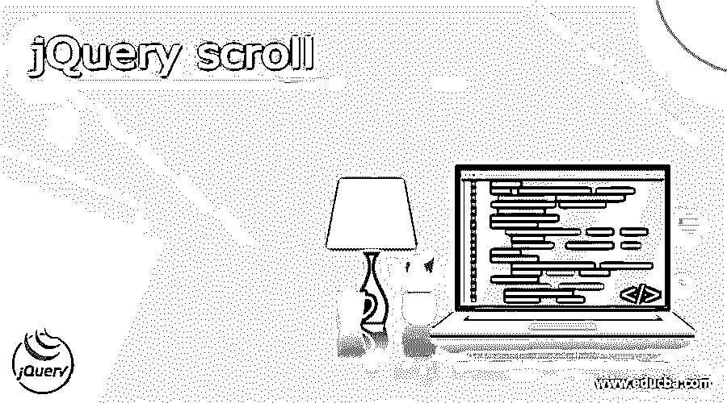
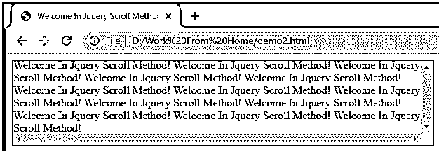
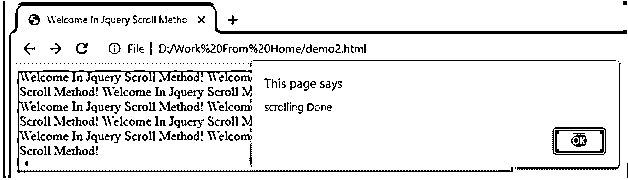
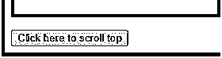
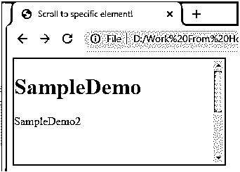

# jQuery 滚动

> 原文：<https://www.educba.com/jquery-scroll/>




## jQuery 滚动的定义

jQuery 为用户提供了不同类型的功能，其中 jQuery scroll 是方法()之一，或者我们可以说是 JQuery 提供的功能。在 jQuery 的帮助下，我们可以滚动我们想要的指定元素，这样 scroll()方法就是 jQuery 的一个内置方法。这适用于所有浏览器窗口以及所有可滚动元素。我们可以将这个方法用于不同的目的，比如我们需要滚动事件并在滚动后执行附加的函数。换句话说，我们可以说它是用来触发事件的。

### 什么是 jQuery 卷轴？

当客户端在组件中寻找一个更好的位置时，scroll()方法被从组件中释放出来。我们可以应用于窗口对象以及可滚动边缘的宽度并不完全是其实体的高度或宽度。scroll()方法在客户端查看预定义组件时发生。scroll()方法适用于每个可滚动组件和窗口对象(程序窗口)。scroll()方法触发 scroll()方法，或者在 scroll()方法发生时加入一个运行容量。

<small>网页开发、编程语言、软件测试&其他</small>

### jQuery scroll()方法

现在让我们看看 scroll()方法，语法如下。

我们既可以基本上利用 scroll()方法，也可以给 scroll()方法增加一个容量。使用 scroll()方法的语法如下所示

触发所选组件的时机。

**语法**

```
$(selector).scroll()
```

**解释**

在上面的语法中，我们使用了一个使用 scroll()方法的参数，这是一个简单的方法。

现在让我们看看 scroll()方法的语法。

**语法**

```
$(selector).scroll (specified function)
```

**解释**

在上面的语法中，我们又使用了一个参数，这个参数是附加到函数的指定函数。上面标点符号中的选择器是被选择的组件。上述标点符号中引用的边界工作是任意的。这是一种在 scroll()方法发生时执行的能力。连接容量在查看时扮演了一个特殊的角色。

### 如何使用 jQuery 滚动？

这种技术适用于每个可滚动组件和程序窗口。边界:这种技术承认自由决定的单一边界工作。它用于指示滚动事件被触发时的运行容量。将值带回来:它联系了预定组件发生滚动的时机。

现在让我们来看看滚动方法的例子，以便更好地理解。

#### 示例#1

```
<!DOCTYPE html>
<html>
<head>
<title>Welcome In JQuery Scroll Method</title>
<script src=
"https://ajax.googleapis.com/ajax/libs/jQuery/3.3.1/jQuery.min.js">
</script>
<script>
$(document).ready(function() {
$("div").scroll(function() {
alert("scrolling Done");
});
});
</script>
<style>
div {
border: 2px solid rgb(146, 4, 4);
width: 600px;
height: 120px;
overflow: scroll;
}
</style>
</head>
<body>
<div>Welcome In JQuery Scroll Method!
Welcome In JQuery Scroll Method!
Welcome In JQuery Scroll Method!
Welcome In JQuery Scroll Method!
Welcome In JQuery Scroll Method!
Welcome In JQuery Scroll Method!
Welcome In JQuery Scroll Method!
Welcome In JQuery Scroll Method!
Welcome In JQuery Scroll Method!
Welcome In JQuery Scroll Method!
Welcome In JQuery Scroll Method!
Welcome In JQuery Scroll Method!
Welcome In JQuery Scroll Method!
</div>
</body>
</html>
```

**解释**

在上面的例子中，我们尝试实现 scroll()方法，在这个例子中，我们用 jQuery 脚本编写了简单的 HTML 代码，如下所示。之后，我们用一些文本编写 div 标签来滚动页面。这里我们写了一个 scroll()方法来从上到下滚动页面。上面程序的最终输出我们用下面的截图来说明。




在上面的截图中，我们显示了滚动条，在滚动上面的页面后，它显示了如下的消息，如下图所示。




### jQuery 滚动到顶部

现在让我们看看滚动到顶部的方法，示例如下。

scrollTo 方法()用于垂直滚动到页面的顶部。通过对 window 属性应用此策略，可以利用此行为来查看页面的最高点。

#### 实施例 2

```
<!DOCTYPE html>
<html>
<head>
<title>
Welcome in JQuery scrollto Windows () method. using JQuery!
</title>
<style>
.scroll {
height: 800px;
background-color: rgb(180, 92, 10);
}
</style>
</head>
<body>
<h1 style="color: rgb(109, 114, 109)">
Welcome in JQuery Home Page
</h1>
<b>
Hi this landing page of jQuery!
</b>
<p>
Now click on below button to scroll the window top.
</p>
<p class="scroll">
This is scrolling windows of jQuery
</p>
<button onclick="scrollToTop()">
Click here to scroll top
</button>
<script src=
"https://code.jQuery.com/jQuery-3.3.1.min.js">
</script>
<script>
function scrollToTop() {
$(window).scrollTop(0);
}
</script>
</body>
</html>
```

**解释**

在上面的例子中，我们试图实现 scrollTo 方法。上面程序的最终输出我们用下面的截图来说明。


在上面的例子中，我们可以做一些 HTML 内容，在这个页面的末尾，我们有一个按钮来滚动窗口，如下图所示。




点击上面的按钮窗口后，滚动到一个 HTML 页面的顶部。

### jQuery 滚动到元素代码

#### 实施例 3

现在让我们看看滚动到元素代码的例子，如下所示。

```
<!DOCTYPE html>
<html lang="en">
<head>
<meta charset="UTF-8">
<meta token="viewpoint" html_content=
"width=device-width, initial-scale=1.0">
<script src=
"https://code.jQuery.com/jQuery-3.5.1.min.js"
integrity=
"sha256-9/aliU8dGd2tb6OSsuzixeV4y/faTqgFtohetphbbj0="
crossorigin="anonymous">
</script>
<title>
Scroll to specific element!
</title>
<style>
div {
color: #48574f;
border: 2px solid #05110b;
width: 300px;
height: 150px;
overflow: auto;
}
p {
width: 200px;
height: 200px;
}
</style>
</head>
<body>
<div class="demo1">
<h1>SampleDemo</h1>
<p>SampleDemo2</p>
</div>
<script>
var container = $('div');
var scrollTo = $('p');
var position = scrollTo.offset().top
- container.offset().top
+ container.scrollTop();
container.scrollTop(position);
</script>
</body>
</html>
```

**解释**

上面程序的最终输出我们用下面的截图来说明。




### 结论

我们希望通过这篇文章，您能够了解更多关于 jQuery scroll 的知识。从上面的文章中，我们已经了解了 jQuery scroll 的基本思想，我们还看到了 jQuery scroll 的表示和示例。从本文中，我们了解了如何以及何时使用 jQuery scroll。

### 推荐文章

这是一个 jQuery 滚动指南。这里我们讨论定义，什么是 jQuery 滚动，如何使用 jQuery 滚动，代码实现的例子。您也可以看看以下文章，了解更多信息–

1.  [jQuery 连接](https://www.educba.com/jquery-join/)
2.  [jQuery 队列](https://www.educba.com/jquery-queue/)
3.  [jQuery json stringify](https://www.educba.com/jquery-json-stringify/)
4.  [jQuery 帖子](https://www.educba.com/jquery-post/)


