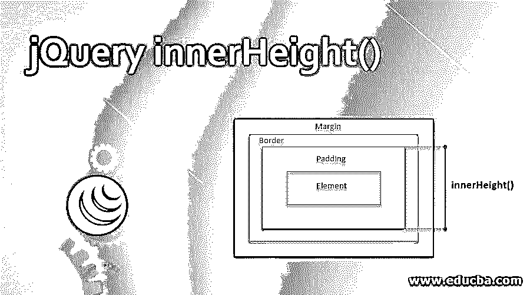
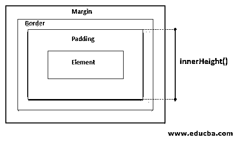
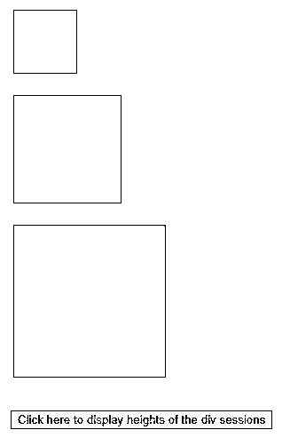
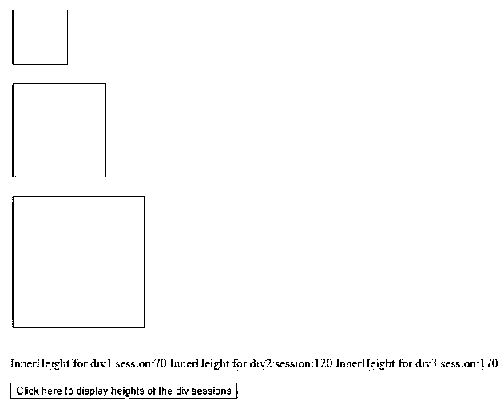
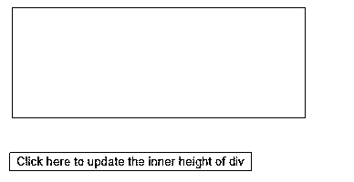
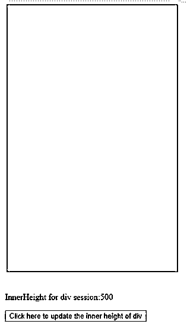
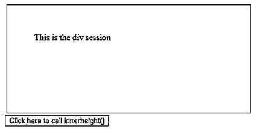
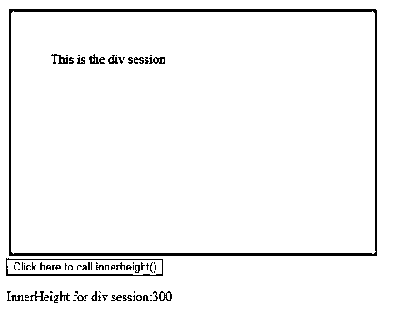
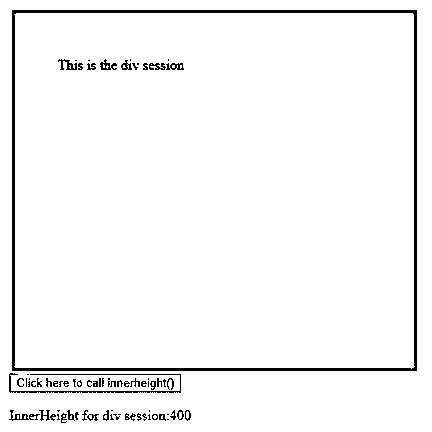

# jQuery innerHeight()

> 原文：<https://www.educba.com/jquery-innerheight/>




## jQuery innerHeight()简介

innerHeight()是 jQuery 的一个整型方法。它计算第一个匹配元素的当前内部高度，并设置每个匹配元素的高度。innerHeight()方法的计算包含填充值和元素的实际高度，但不包含边距或边框值，如下图所示。




<small>网页开发、编程语言、软件测试&其他</small>

这种方法与谷歌 Chrome、ie、Firefox、Opera 和 Safari 等浏览器兼容。

**语法:**

| **语法** | **值 T** **y** **pe** | **参数** **描述** | **版本** |
| $(selector).innerHeight() | 钠 | 不接受任何论点。 | One |
| $(选择器)**。**内高(值) | **处理程序:**数字/字符串。 | **Value:** 要设置为匹配元素高度的数值。 | 1.8.0 |
| $(选择器)。内部高度(功能) | **Function:**功能。 | **函数:**它接受元素的索引，旧的内部高度作为输入参数，并返回要设置的匹配元素的新的内部高度。 | 1.8.0 |

### jQuery innerHeight()的示例

下面给出了 jQuery innerHeight()的例子:

#### 示例# 1–不使用任何参数

在没有给定任何输入参数的情况下，innerHeight()方法用于读取第一个匹配元素的内部高度值，包括填充值。

此方法充当窗口的只读属性。因此，高度值是静态的，只能从 CSS 文件或在

下面的代码片段使用 innerHeight()方法获取 div 元素的高度。编写了一个脚本函数来显示 innerHeight()的输出，用于任何 div 会话，四个 div 元素是用不同的颜色、边距、边框粗细和填充值定义的。

**代码:**

```
<!DOCTYPE html>
<html>
<head>
<script src="https://ajax.googleapis.com/ajax/libs/jquery/3.4.1/jquery.min.js"></script>
<script>
$(document).ready(function(){
$("button").click(function(){
$( "p" ).text( "InnerHeight for div1 session:" + $( "#div1" ).innerHeight()+ " InnerHeight for div2 session:" + $( "#div2" ).innerHeight()+ " InnerHeight for div3 session:" + $( "#div3" ).innerHeight());
});
});
</script>
</head>
<body style="background-color: beige;">
<div id="div1" style="height:50px;width:50px;padding:10px;margin:3px;border:1px solid blue;background-color:lightblue;"></div><br>
<div id="div2" style="height:100px;width:100px;padding:10px;margin:3px;border:1px solid blue;background-color:lightgreen;"></div><br>
<div id="div3" style="height:150px;width:150px;padding:10px;margin:3px;border:1px solid blue;background-color:lightsalmon;"></div><br>
<p></p>
<button>Click here to display heights of the div sessions</button>
</body>
</html>
```

**输出:**

【innerHeight()方法被调用之前:




【innerHeight()方法被调用后:

点击“点击此处显示分区高度”按钮，显示所有

分区的当前高度




**Note:** In this case, the function innerHeight() cannot be used to modify the height of the <div> sessions dynamically.

#### 示例# 2–带有“值”参数

语法 innerHeight(value)被编程为将所选元素的高度更新为输入参数值。

考虑下面的例子，jQuery 事件 innerHeight()在

会话中被调用。编写一个脚本，在单击按钮时将 div 会话的高度更新为新值。

**代码:**

```
<!DOCTYPE html>
<html>
<head>
<script src="https://ajax.googleapis.com/ajax/libs/jquery/3.4.1/jquery.min.js"></script>
<script>
$(document).ready(function(){
$("button").click(function(){
//InnerHeight() is used to set the height to 500px
$("div").innerHeight(500)
$( "p" ).text( "InnerHeight for div session:" + $( "div" ).innerHeight() );
});
});
</script>
</head>
<body style="background-color: beige;">
<div style="height:100px;width:300px;padding:10px;margin:3px;border:1px solid blue;background-color:lightblue;"></div><br>
<p></p>
<button>Click here to update the inner height of div</button>
</body>
</html>
```

**输出:**

**调用 innerHeight()方法之前:**

当前高度:100 像素




【innerHeight()方法被调用后:

更新高度:500 像素




**Note:** If a numerical value without any unit being specified, is given as input argument for the syntax, innerHeight(value); jQuery considers ‘pixel’ as the default unit. If the input value type is a string, any CSS attribute can be used as the new height.

#### 示例# 3–带“函数”参数的 innerHeight()

innerHeight(function)方法的语法接受任何函数作为输入参数。argument 方法可以定义为有或没有输入参数。

函数 ChangeDivStyle()被定义为调节

会话的样式参数。该函数旨在更改会话的背景颜色，并将元素的高度增加 100 像素。ChangeDivStyle()的返回值作为输入参数传递给 innerHeight()方法。单击按钮后，会话高度将更新为从 ChangeDivStyle()函数中获得的值。

**代码**:

```
<!DOCTYPE html>
<html&gt
<body>
<div id="idDiv" style="height:100px;width:350px;padding:50px;margin:3px;border:1px solid blue;background-color:lightblue;">This is the div session</div>
<script src="https://cdnjs.cloudflare.com/ajax/libs/jquery/3.3.1/jquery.min.js"></script>
<script>
//The height of the div element is decided by the function output of myfunc() and //given as input argument to innerHeight()
$(document).ready(function(){
$("button").click(function(){
$("div").innerHeight(ChangeDivStyle());
$( "p" ).text( "InnerHeight for div session:" + $( "div" ).innerHeight());
});
});
function ChangeDivStyle()
{
document.getElementById("idDiv").style.backgroundColor="Grey";
return 100+$( "div" ).innerHeight()
}
</script>
<body style="background-color: beige;">
<button>Click here to call innerheight()</button>
<p></p>
</html>
```

**输出:**

**调用 innerHeight()方法之前:**




【innerHeight()方法被调用后:

**画面 1:** 按钮触发一次。

预期的内部高度结果=元素的高度(100px+padding value(50px+50px))+100 px(在函数 ChangeDivStyle()中添加)=300px




**屏幕 2:** 按钮被触发两次。

预期的内部高度结果=包含填充值的元素的先前内部高度(300px)+ 100px(在函数 ChangeDivStyle()中添加)




### 附加说明

1.  此方法返回值的默认单位是像素。
2.  如果元素集为空值，该方法返回“undefined”作为结果值。
3.  带有参数的 innerHeight()方法使用户能够在运行时动态修改任何元素的高度。
4.  如果匹配的元素或其父元素处于隐藏状态，innerHeight()可能会显示不太准确的结果。通过确保元素的可见性状态被设置为真，并在方法执行完成后再次返回隐藏状态，可以避免这样的错误结果。这种变通办法保证了准确性，但不能保证可靠性。
5.  浏览器可能不包括任何 API 来检测站点维度的部分错误情况。如果代码假定分数结果为整数值，则当站点页面与缩放功能一起使用时，它可能会显示不正确的尺寸。
6.  InnerHeight()、OuterHeight()和 Height()展示了几乎相似的功能，即对元素的高度值执行计算。

它们在包含或填充、边距和边框值方面的区别如下:

*   Height()只计算匹配元素的内部高度。
*   InnerHeight()计算元素的高度，包括填充值。
*   OuterHeight()计算元素的高度，加上填充和边框值。

### 推荐文章

这是 jQuery innerHeight()的指南。这里我们分别讨论 jQuery innerHeight()的介绍和例子。您也可以看看以下文章，了解更多信息–

1.  [JQuery 最近的](https://www.educba.com/jquery-closest/)
2.  [jquery out DTH()](https://www.educba.com/jquery-outerwidth/)
3.  [jQuery outerHeight()](https://www.educba.com/jquery-outerheight/)
4.  [jQuery 鼠标按下](https://www.educba.com/jquery-mousedown/)


