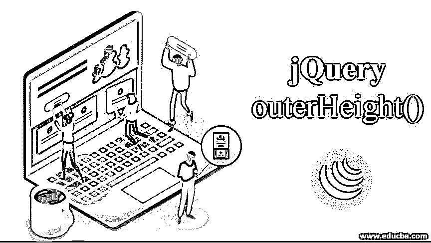
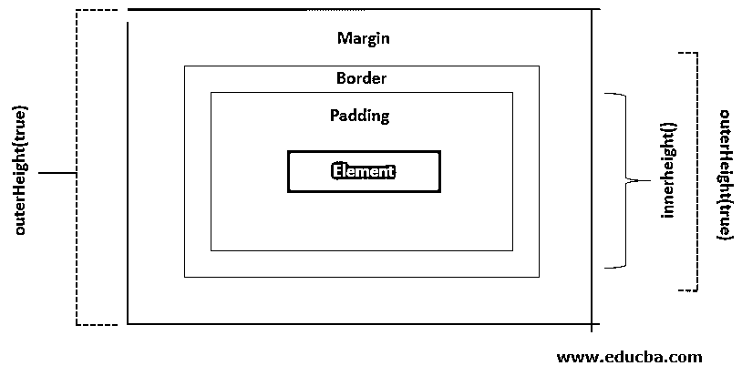
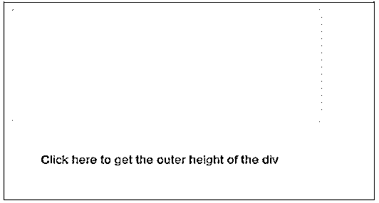
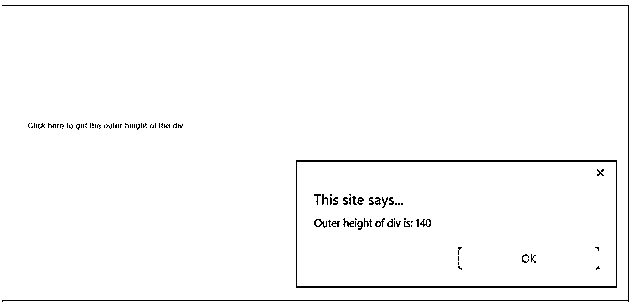
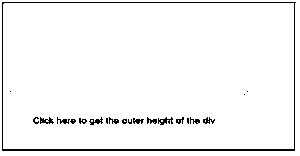
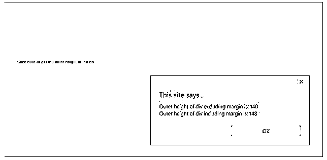
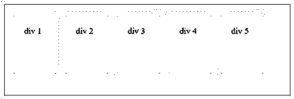
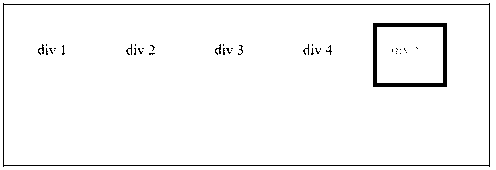
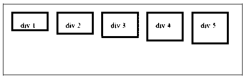

# jQuery outerHeight()

> 原文：<https://www.educba.com/jquery-outerheight/>




## jQuery outerHeight()简介

jQuery 维度方法使用户能够操作 DOM 元素的维度。jQuery outerHeight()方法返回元素的高度，包括填充(顶部和底部)、边框和可选的边距。jQuery outerHeight()是一个 jQuery 方法，主要用于操作 DOM 元素维度，如高度、宽度、偏移量、位置。此方法返回第一个匹配元素的外部高度，或者设置每个匹配的填充和边框的外部高度，两者都包括在此方法中，并且可以选择边距。此方法应用于一组空元素，它返回 undefined。此方法不能用于窗口或文档对象。对于这种情况，使用 height()方法。

下图说明了元素的不同维度。

<small>网页开发、编程语言、软件测试&其他</small>




### jQuery outerHeight()方法

以下是一些方法:

#### 1.jQuery height()方法

*   此方法计算元素的高度，不包括边框、填充和边距。
*   获取和设置给定元素的高度。

**语法:**

返回元素的高度。

```
$(selector).height()
```

设置元素的高度。

```
$(selector).height(value)
```

其中 value 是以像素为单位指定高度的强制参数。

#### 2.jQuery innerHeight()方法

*   此方法计算并返回第一个匹配元素的内部高度。
*   它包括填充，但不包括边框或边距。

**语法:**

```
$(selector).innerHeight()
```

#### 3.jQuery offset()方法

*   此方法获取并设置指定元素的当前坐标。
*   它返回一个包含元素上下坐标的对象。

**语法:**

```
$(selector).offset()
```

**jQuery outer height()的语法:**

```
$(selector).outerHeight(includeMargin)
```

其中 includeMargin 是可选参数。它是一个布尔值，指定是否包含边距。它有两个价值。

*   **False:** 这是 includeMargin 的默认值，它指定不包括在计算中的边距。
*   **True:** 指定计算中要包含的边距。

这个方法也可以用来设置所有匹配元素的 CSS 外部高度。

**语法:**

```
$(selector).outerHeight(newHeight )
```

其中，newHeight 可以是字符串、数字或函数，它将返回指定为 newHeight 的值。

*   如果 newHeight 是一个数字，jQuery 将采用一个像素值。
*   如果 newHeight 是一个字符串，那么可以使用任何有效的 CSS 单位，比如 px、auto、%。

### jQuery outerHeight()方法的示例

下面给出了 jQueryHeight()方法的例子:

#### 示例#1

这是一个简单的例子，通过简单地返回 div 的 outerHeight，展示了 jQuery outerHeight()方法的效果。

```
<!DOCTYPE html>
<html>
<head>
<script src="https://code.jquery.com/jquery-1.12.4.min.js"></script>
<style>
.button {
background-color: #d3ff33; border: none;
padding: 15px 32px; text-align: center; text-decoration: none; display: inline-block; font-size: 14px; margin: 2px 3px; cursor: pointer;
}
</style>
<script>
$(document).ready(function() {
$("#btn").click(function() {
alert("Outer height of div is: " + $("div").outerHeight());
});
});
</script>
</head>
<body>
<div
style="height:100px;width:300px;padding:20px;margin:4px;border:10px rgb(200
, 255, 0);background-color:rgb(182, 228, 255);"
></div>
<br />
<button class="button" id="btn">
Click here to get the outer height of the div
</button>
</body>
</html>
```

**输出:**

*   首次在浏览器中加载页面时，会显示以下屏幕。
*   直到现在都没有执行任何活动。




*   单击该按钮后，下面的屏幕会出现一个警告，显示 div 的外部高度。




#### 实施例 2

此示例显示了包含边距的 outerHeight 方法的效果。

```
<!DOCTYPE html>
<html>
<head>
<script src="https://code.jquery.com/jquery-1.12.4.min.js"></script>
<style>
.button {
background-color: #d3ff33; border: none;
padding: 15px 32px; text-align: center; text-decoration: none; display: inline-block; font-size: 14px; margin: 2px 3px; cursor: pointer;
}
</style>
<script>
$(document).ready(function() {
$("#btn").click(function() { alert(
"Outer height of div excluding margin is: " +
$("div").outerHeight() + "\n" +
"Outer height of div including margin is: " +
$("div").outerHeight(true)
);
});
});
</script>
</head>
<body>
<div
style="height:100px;width:300px;padding:20px;margin:4px;border:10px rgb(200
, 255, 0);background-color:rgb(182, 228, 255);"
></div>
<br />
<button class="button" id="btn">
Click here to get the outer height of the div
</button>
</body>
</html>
```

**输出:**

*   页面第一次加载到浏览器中时，会显示下面的屏幕。
*   到目前为止，还没有开展任何活动。




*   单击该按钮后，会弹出一个警报，如下面的快照所示。
*   此警报显示 div 的外部高度，不包括边距，也包括边距。




#### 实施例 3

让我们看一个例子，演示如何改变每个 div 的内部高度。

```
<!DOCTYPE html>
<html lang="en">
<head>
<meta charset="utf-8" />
<title>outerHeight demo</title>
<style> div {
width: 40px; padding: 20px; height: 70px; float: left; margin: 8px;
background: rgb(255, 238, 0); cursor: pointer;
}
.mod {
background: rgb(174, 0, 255); cursor: default;
}
</style>
<script src="https://code.jquery.com/jquery-1.12.4.min.js"></script>
</head>
<body>
<div>div 1</div>
<div>div 2</div>
<div>div 3</div>
<div>div 4</div>
<div>div 5</div>
<script>
var Height_mod = 70;
$("div").one("click", function() {
$(this)
.outerHeight(Height_mod)
.addClass("mod"); Height_mod -= 7;
});
</script>
</body>
</html>
```

**输出:**

*   当页面第一次加载到浏览器中时，会显示下面的屏幕。
*   到目前为止，还没有开展任何活动。




*   当 div 5 被点击时，它的高度随着它的颜色而改变。




*   每个 div 在被单击时都会改变其高度和颜色。




**NOTE*****:*** If the browser is zoomed in by the user, dimensions may change but browsers do not have any API to expose to address this situation. The result returned by the outerHeight() method may be fractional at times but that value should not be assumed as an Integer. This method supports both visible and hidden elements.

如果元素或其父元素是隐藏的，outerHeight()方法返回的值可能不总是准确的。为了确保返回值是准确的，在使用 outerHeight()方法之前，元素必须是可见的。

### 结论

本文演示了 jQuery outerHeight()方法的效果以及实现它来操作 DOM 的方式。这个方法有助于获得一个有或没有边框的 DOM 元素的当前计算维度。我们还试图理解一些类似的 jQuery 方法(如 height()、innerHeight()、outerHeight()在效果和实现方面的基本区别。

### 推荐文章

这是 jQuery outerHeight()的指南。这里我们讨论 jQuery outerHeight()的简介、语法和示例。您也可以看看以下文章，了解更多信息–

1.  [jQuery Clone()](https://www.educba.com/jquery-clone/)
2.  [jQuery prepend()](https://www.educba.com/jquery-prepend/)
3.  [jQuery height()](https://www.educba.com/jquery-height/)
4.  [jQuery innerHeight()](https://www.educba.com/jquery-innerheight/)


