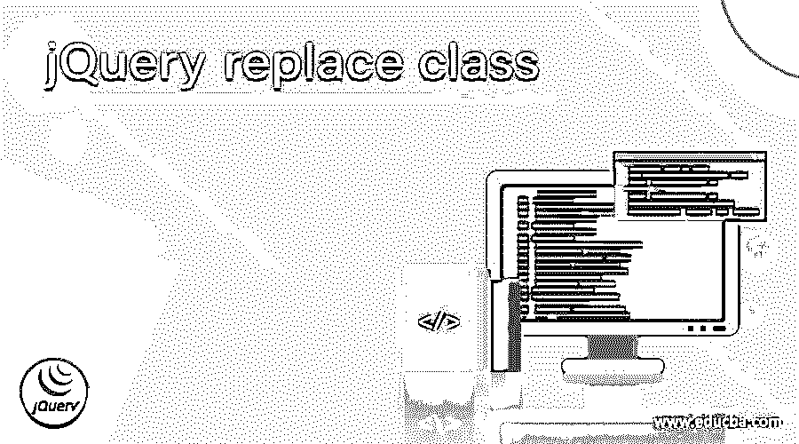
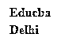

# jQuery 替换类

> 原文：<https://www.educba.com/jquery-replace-class/>




## jQuery 替换类介绍。

在 jQuery 中，replace class 是内置的且很少使用的函数之一，replace class()函数被定义为用另一个类属性替换一个类属性，该属性在该函数中被指定或声明为参数，其中这些类已经被定义，并且属性在代码的 head 标记中被声明。一般来说，我们可以说 jQuery 中的 replaceClass()函数很少使用，因为它什么也不做。相反，还有另外三个类，如 hasClass()、removeClass()和 addClass()。因此，replace 类被定义为用另一个类属性替换一个类属性。

**语法:**

<small>网页开发、编程语言、软件测试&其他</small>

```
$(selector tag).replaceClass(first_class_name, second_class_name);
```

在 jQuery 中 replaceClass()函数的给定语法中，它应用于匹配或指定的选择器标记或元素，这个 replace class()函数由两个参数组成，参数由类名组成。

**参数:**

*   **First_class_name:** 该参数用于指定需要用其他类属性替换的类名，在另一个参数中指定为 second_class_name。
*   **Second_class _name:** 该参数用于指定类名，其属性被参数 first_class_name 中指定的类替换。

这个函数 replaceClass()应该返回那个类的属性，也就是说用指定的类名替换。但是在 jQuery 中，这不会显示任何更改，因此在 jQuery 中，为了显示或查找更改，我们需要在 jQuery 中使用 removeClass()、addClass()函数。所以让我们也看看这些函数的语法。

*   删除类()

**语法:**

```
$(Selector).removeClass(Class_Name);
```

在上面的语法中，它可以应用于任何元素，并且它只使用一个参数，在这个参数中我们必须指定我们想要删除的类名。

*   **addClass()**

**语法:**

```
$(Selector).addClass(Class_Name);
```

在上面的语法中，它可以应用于任何元素，并且它使用一个参数，我们必须在该参数中传递我们需要添加的类名，要添加多个类，我们可以只指定用逗号分隔的类名。

### jQuery 中 replaceClass()函数如何工作，并举例说明？

在 jQuery 中，为了用一个类的属性替换另一个类的属性，有一个名为 replaceClass()的函数，它通过这个函数接受两个不同的类名。第一个类名被指定为一个类，它应该用第二个类名替换，第二个类名被指定为函数中的第二个参数，根据这个函数，它应该显示该元素的类的属性，该元素的属性被另一个类的属性替换。但是在 jQuery 中，当我们运行任何使用 replaceClass()函数的代码时，什么都不做，这意味着当使用这个函数时，在输出中看不到任何功能。因此，除了这个函数之外，还有另外两个用于替换的函数 removeClass()和 addClass()，这将删除属性并相应地添加类属性。

现在让我们看一个 jQuery 中演示 replaceClass()函数的例子，在这个例子中我们可以看到输出，当我们使用这个函数时，它没有显示任何变化。

**举例:**

```
<html lang="en">
<head>
<meta charset="utf-8">
<title> Demonstration of replaceClass() function in jQuery. </title>
<style>
p {
margin: 4px;
font-size: 16px;
font-weight: bolder;
}
.firstclass {
color: red;
}
.secondclass {
color: blue;
}
</style>
<script src="https://code.jquery.com/jquery-3.5.0.js"></script>
</head>
<body>
<p class="firstclass"> Educba</p>
<p class="secondclass"> Delhi </p>
<script>
$(document).ready(function() {
$( "p" ).replaceClass(  "firstclass", "secondclass");
});
</script>
</body>
</html>
```

**输出:**




在上面的代码中，我们可以看到我们已经使用 body 标签中的 script 标签中的 ready()函数准备好了文档，并且在 style 标签中的 head 标签中定义了 classes 属性。类名总是以点运算符(.)后跟类名，属性在大括号内声明。这些类在元素声明的 body 标记中被引用，类作为一个选项，类名的值。因此，我们在元素标记“p”上使用 replaceClass()函数，这是一个段落标记，其中显示的文本是类名“firstclass”的“Educba”和“secondclass”的“Delhi”。所以在这里，replaceClass 函数表示“firstclass”的类属性应该被“secondclass”替换，这意味着“firstclass”中的文本颜色是红色，必须被替换为蓝色，但是这个函数不显示任何变化。输出如上图截图所示。

现在让我们看另一个例子，其中我们将看到 removeClass()和 addClass()函数的演示，每当删除一个类的属性并添加其他类的其他属性时，都会使用该函数，其中 jQuery 为此使用了 replaceClass()函数，当显示输出时，该函数不显示任何功能。

**举例:**

```
<!DOCTYPE html>
<html>
<head>
<title> Demonstration of removeClass() and addClass() instead of replaceClass() in jQuery </title>
<script src="//ajax.googleapis.com/ajax/libs/jquery/2.1.1/jquery.min.js"></script>
<script>
$(document).ready(function() {
$( "p" ).removeClass( "classone" ).addClass( "classtwo" );
});
</script>
<style>
.classone {
color: red;
}
.classtwo {
color: yellow;
}
</style>
</head>
<body>
<p class ="classone">  Educba </p>
<p class ="classtwo"> Pune </p>
</body>
</html>
```

**输出:**


在上面的代码中，类似于前面的示例，但是这里用一个类替换另一个类是使用 jQuery 中的 removeClass()和 addClass()函数完成的，因为 replaceClass()函数没有适当的功能可以显示。在这一点上，唯一的区别是代替了 replaceClass()函数；我们将 removeClass()与我们希望用另一个类替换的类一起使用，然后后跟 addClass()，addClass()将类名作为替换后需要显示的参数。因此，在这里，声明为红色的“classone”的文本颜色现在被替换为黄色的“classtwo”的文本颜色。输出如上图截图所示。

### 结论–jQuery 替换类

在本文中，我们得出结论，在 jQuery 中用另一个类替换一个类，有一个函数 replaceClass()，但是由于它在输出中没有显示任何差异，jQuery 提供了 removeClass()函数，它删除指定类的属性，还提供了 addClass()函数，它将添加或附加指定类的属性，但不会替换现有的类。

### 推荐文章

这是一个 jQuery 替换类的指南。这里我们讨论 replaceClass()函数如何在 jQuery 中工作，以及示例和输出。您也可以看看以下文章，了解更多信息–

1.  [jQuery prev](https://www.educba.com/jquery-prev/)
2.  [jQuery 数组](https://www.educba.com/jquery-array/)
3.  [jQuery 数组过滤器](https://www.educba.com/jquery-array-filter/)
4.  [jQuery ajax 超时](https://www.educba.com/jquery-ajax-timeout/)


