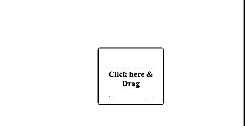
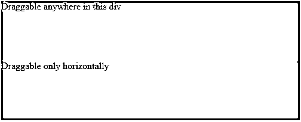
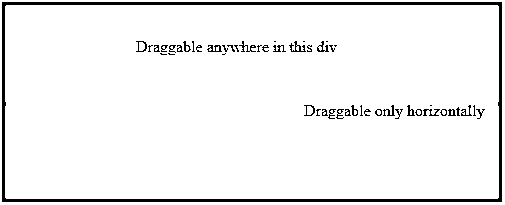
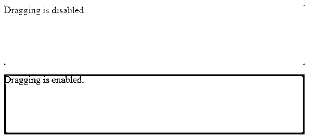
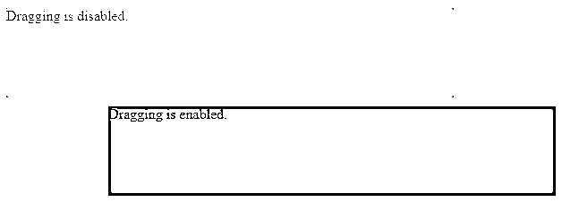
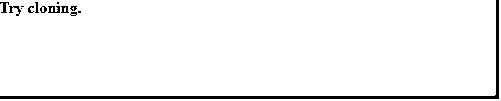

# jQuery draggable()

> 原文：<https://www.educba.com/jquery-draggable/>


## jQuery draggable()简介

jQueryUIdraggable()方法允许使用鼠标移动 DOM 元素。该方法可用于拖动 DOM 元素到视口中的任何位置，方法是用鼠标单击对象，然后将其拖动到视口中您想要的任何位置。这种 jQuery 交互方法在某种程度上有助于构建一个具有很好交互效果的强大网页。jqueryUI 的这一特性支持许多方法，如 destroy、disable、enable、option、widgetsas 以及创建、拖放、启动等事件。

**语法:**

<small>网页开发、编程语言、软件测试&其他</small>

有两种形式可以使用 draggable()方法:

```
$(selector, context).draggable(options)
```

其中，options 参数是指指定 DOM 元素行为的对象。可以提供一个或多个选项，用逗号分隔。

```
$(selector, context).draggable({option1: value1, option2: value2……})
```

可用于该方法的不同选项有:
添加类、追加、取消、连接到可排序、包含、光标、光标、禁用等。

```
$(selector, context).draggable("action", [params])
```

其中，action 指的是在第一个参数中指定为字符串的 jQuery 方法。
params 是可选的，可以是多个。

**该方法的一些动作有:**

destroy()，disable()，enable()，option(选项名)，option()，option(选项名，值)，widget()

### 实现 jQuery draggable()的示例

下面是 jQuery draggable()的例子

#### 示例#1

让我们考虑一个非常简单的例子，在不向 draggable()方法传递任何参数的情况下理解可拖动功能。

**代码:**

```
<!DOCTYPE html>
<html
<head>
<link
href="https://code.jquery.com/ui/1.10.4/themes/ui-lightness/jquery-ui.css"
rel="stylesheet"
/>
<script src="https://code.jquery.com/jquery-1.12.4.js"></script>
<script src="https://code.jquery.com/ui/1.10.4/jquery-ui.js"></script>
<style>
#divstyle {
width: 700px;
height: 300px;
padding-top: 20px;
padding-left: 5px;
text-align: center;
background-color: cadetblue;
}
#drag {
width: 150px;
height: 100px;
background: #eee;
text-align: center;
padding-top: 30px;
}
</style>
<script>
$(function () {
$("#drag").draggable();
});
</script>
</head>
<body>
<div id="divstyle">
<div id="drag">
<p style="font-size: larger; font-weight: bold;">Click here & Drag</p>
</div>
</div>
</body>
</html> Output :
```

下面的屏幕截图是第一次执行上述代码时显示的屏幕。


可以使用鼠标将 div 拖动到屏幕上的任何地方。




#### 实施例 2

下面的示例说明了通过 draggable()方法使用 containment 选项来约束元素在屏幕上的移动。

**代码:**

```
<!DOCTYPE html>
<html>
<head>
<link
href="https://code.jquery.com/ui/1.10.4/themes/ui-lightness/jquery-ui.css"
rel="stylesheet"
/>
<script src="https://code.jquery.com/jquery-1.12.4.js"></script>
<script src="https://code.jquery.com/ui/1.10.4/jquery-ui.js"></script>
</head>
<body>
<div id="div1">Draggable anywhere in this div<br /><br /></div>
<div id="div2">Draggable only horizontally<br /><br /></div>
<style>
#div1 {
width: 500px;
height: 100px;
background-color: cadetblue;
}
#div2 {
width: 500px;
height: 100px;
background-color: grey;
}
</style>
<script>
$("#div1 span").draggable({
containment: "#div1",
});
$("#div2 span").draggable({
axis: "x",
});
</script>
</body>
</html>
```

**输出:**

第一次执行上述代码时，屏幕显示如下。




在第一个 Div“div 1”中，span 元素不允许移出 div，但是可以移动到 div 内的任何位置。这是使用选项“遏制”完成的。

在第二个 div“div 2”中，只允许水平拖动 span 元素。这是使用选项轴“x”完成的。




#### 实施例 3

下面是一个使用禁用和启用操作演示 jQueryUI 的可拖动功能的例子。

**代码:**

```
<!DOCTYPE html>
<html>
<head>
<link
href="https://code.jquery.com/ui/1.10.4/themes/ui-lightness/jquery-ui.css"
rel="stylesheet"
/>
<script src="https://code.jquery.com/jquery-1.12.4.js"></script>
<script src="https://code.jquery.com/ui/1.10.4/jquery-ui.js"></script>
<style>
#div1 {
width: 500px;
height: 100px;
background-color: cadetblue;
}
#div2 {
width: 500px;
height: 100px;
background-color: grey;
}
</style>
</head>
<body>
<div id="div1">
<p>Dragging is disabled.</p>
<br /><br />
</div>
<div id="div2">
<p>Dragging is enabled.</p>
<br /><br />
</div>
<script>
$("#div1").draggable();
$("#div1").draggable("disable");
$("#div2").draggable();
$("#div2").draggable("enable");
</script>
</body>
</html>
```

**输出:**

第一次执行上述代码时，屏幕显示如下。




从下面的图片中，你可以看到第一个 div，拖动是禁用的。但是对于第二个 div，可以拖动，因此它可以被拖动到屏幕上的任何地方。




#### 实施例 4

下面的示例使用带有值克隆的选项帮助器通过复制来移动内容。

**代码:**

```
<!DOCTYPE html>
<html>
<head>
<link
href="https://code.jquery.com/ui/1.10.4/themes/ui-lightness/jquery-ui.css"
rel="stylesheet"
/>
<script src="https://code.jquery.com/jquery-1.12.4.js"></script>
<script src="https://code.jquery.com/ui/1.10.4/jquery-ui.js"></script>
<style>
#divstyle {
width: 500px;
height: 100px;
background-color: cadetblue;
}
</style>
</head>
<body>
<div id="divstyle">
<p style="font-weight: bold;">Try cloning.</p>
</div>
<script>
$("#divstyle p").draggable({
helper: "clone",
});
</script>
</body>
</html>
```

**输出:**

这个例子简单说明了通过复制来移动 DOM 元素的内容。第一次执行上述代码时，屏幕显示如下。




尝试移动元素时，只有复制/克隆的元素会移动，而原始元素保持不变。一旦松开鼠标，克隆的元素就会消失，而原始元素会继续留在原来的位置。


### 结论

*   在本文中，我们学习了 jQuery UI 的可拖动功能，它基本上允许使用鼠标移动或拖动 DOM 元素。
*   这可以通过用鼠标点击要拖动的对象并将其拖动到视口内的任何位置来实现。
*   jQueryUI 的这一特性有助于将交互动画添加到 web 页面中，使它们更加强大和具有交互性。

### 推荐文章

这是 jQuery draggable()的指南。在这里，我们讨论 jQuery draggable()及其示例和代码实现的简要概述。您也可以浏览我们推荐的其他文章，了解更多信息——

1.  [jQuery toggle()](https://www.educba.com/jquery-toggle/)
2.  [jQuery empty()](https://www.educba.com/jquery-empty/)
3.  [jQuery insertAfter()](https://www.educba.com/jquery-insertafter/)
4.  [jQuery appendTo()](https://www.educba.com/jquery-appendto/)


