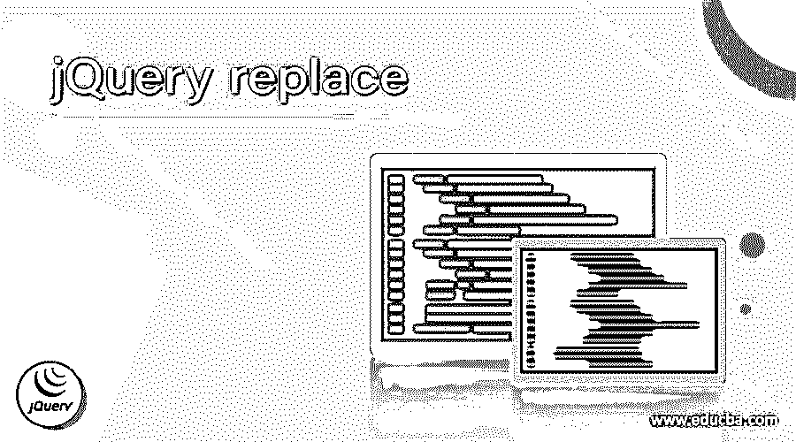
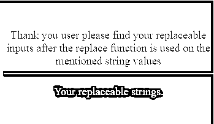
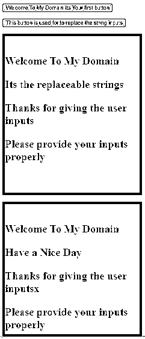
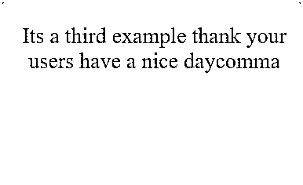

# jQuery 替换

> 原文：<https://www.educba.com/jquery-replace/>




## jQuery 替换简介

在 jQuery 中，replace 是可用于替换由最终用户声明的元素的函数之一，每个元素作为将被提供新内容的匹配元素的集合，并且它返回最终用户未移除的元素的集合，以及它仅返回移除的元素。这些 replace()方法具有一些子方法，如 replaceAll()， replaceWith()同样这些替换将通过目标元素来实现，所实现的元素集合在列表中，它可能是一组字符串，它只出现在第一个可以被替换的实例中。

**语法:**

<small>网页开发、编程语言、软件测试&其他</small>

在 jQuery replace 中，基本上它提供了一些默认的功能、关键字和变量来帮助操作 DOM(文档对象模型)。就像 replace()是字符串方法之一一样，借助于 jQuery 脚本上第一个且几乎是唯一的实例，它可以用来全局替换用户输入，如文本。

```
<html>
<head>
<script src=https://code.jquery.com/jquery-1.12.4.js>
</script>
</head>
<script>
$(document).ready(function(){
$(elements).text(function (var1, var2)
{
return text.replace(type values);
-----some jQuery and javascript codes depends on the user needs---
});
});
</script>
<body>
---some HTML codes depend on the UI requirement---
</body></html>
```

上述代码是替换字符串、文本等变量类型的基本语法。根据需要，它可以从一种类型转换或替换为另一种类型值。

### replace 方法在 jQuery 中是如何工作的？

replace()是用于替换应用程序上的用户内容的方法，它将一种类型的值转换为另一种类型的数据类型，如字符串、数字、文本等。实际上，replace()方法是从指定的 DOM(文档对象模型)中删除内容，然后它可以将新值放在与单个单元格相同的区域中。这是 jQuery 上 replace()方法的 DOM 结构。主要是所选元素通过移动旧位置来替换目标值，可以在特定区域上插入它，而不是在所有区域上克隆它。我们使用了类似 replaceWith()方法的并行方法，它将所有元素与指定的 DOM 和 HTML 元素进行匹配。jQuery replace()也是 string 的功能之一，它可以替换 string 标签值并将其留在标记上。这也是代码将变得更加复杂，但它可能会找到用户输入值的阅读。jQuery 代码片段主要是出现在所有可替换的字符串中的一个，在它需要找到这些字符串之前，它可以被替换。

#### 示例#1

**代码:**

```
<!DOCTYPE html>
<html lang="en">
<head>
<meta charset="utf-8" />
<title>Welcome To My Domain Your first replaceable string example</title>
<head>
<script src="https://code.jquery.com/jquery-1.12.4.js"></script>
<script type="text/javascript">
$(document).ready(function () {
$(".first span").text(function (index, text) {
return text.replace("Your first string", "Replaceable for the first string");
});
});
</script>
<style>
#styl {
width: 342px;
height: 177px;
padding-top: 25px;
padding-left: 6px;
font-size: 18px;
text-align: center;
color: blue;
background-color: green;
}
</style>
</head>
<body>
<div id="styl">
<div class="first">
<br />
Thank you user please find your replaceable inputs after the replace function is used on the mentioned string values
<hr />
<p style="color: yellow;">
Your replaceable strings.
</p>
</div>
</div>
</body>
</html>
</head>
</html>
```

**样本输出:**




在上面的例子中，我们使用 replace 方法来替换单个变量中的整个字符串。我们可以用输入字符串声明 replace(index，text ),它将替换字符串作为输出。

#### 实施例 2

**代码:**

```
<!DOCTYPE html>
<html>
<head>
<title>
Welcome To My Domain its a second example for replace method
</title>
<script src="https://cdnjs.cloudflare.com/ajax/libs/jquery/3.0.0-alpha1/jquery.js" type="text/javascript"></script>
<script>
$(function() {
$('#demo').click(function() {
var first = $('#eg');
var second = 0;
var ex = "Have a Nice Day"
var ex1 = "Its the replaceable strings";
while (second !== -1) {
second = first.html().indexOf(ex, second);
if (second != -1)
{
first.html(first.html().replace(ex, ex1))
second = second + ex1.length;
}
}
});
$('#demo1').click(function() {
var first = $('#eg1');
var ex = /Have a Nice Day/g
var ex1 = "Its the replaceable strings";
first.html(first.html().replace(ex, ex1))
});
});
</script>
<style>
div {
width: 342px;
height: 377px;
padding-top: 25px;
padding-left: 6px;
font-size: 18px;
text-align: center;
color: blue;
background-color: green;
}
p {
font-size:27px;
font-weight:bold;
}
</style>
</head>
<body>
<button id="demo">Welcome To My Domain Its Your first button</button><br><br>
<button id="demo1">This button is used for to replace the string inputs</button>
<br> <br>
<div id="eg">
<P dir="ltr" style="text-align: left;" trbidi="on">
Welcome To My Domain
</P>
<P dir="ltr" style="text-align: left;" trbidi="on">
Have a Nice Day
</P>
<P dir="ltr" style="text-align: left;" trbidi="on">
Thanks for giving the user inputs
</P>
<P dir="ltr" style="text-align: left;" trbidi="on">
Please provide your inputs properly
</P>
</div>
<br>
<div id="eg1">
<P dir="ltr" style="text-align: left;" trbidi="on">
Welcome To My Domain
</P>
<P dir="ltr" style="text-align: left;" trbidi="on">
Have a Nice Day
</P>
<P dir="ltr" style="text-align: left;" trbidi="on">
Thanks for giving the user inputsx
</P>
<P dir="ltr" style="text-align: left;" trbidi="on">
Please provide your inputs properly
</P>
</div>
</body>
</html>
```

**样本输出:**




在第二个示例中，我们使用 replace 方法来替换两个不同方法中的字符串。它专门替换变量中的特定字符串。

#### 实施例 3

**代码:**

```
<!DOCTYPE html>
<html>
<head>
<title>Welcome to My Domain it’s a third example</title>
<script src="https://code.jquery.com/jquery-1.12.4.js"></script>
<script>
$(document).ready(function() {
var first = $('body').html().replace(/\./g,'comma');
$('body').html(first);
});
</script>
<style>
#button{
color:red;
font-weight: bold;
font-size: medium;
background-color: green;
}
#demo {
width: 373px;
height: 204px;
padding-top: 27px;
padding-left: 7px;
font-size: 28px;
text-align: center;
color: blue;
background-color: pink;
}
</style>
</head>
<body>
<div id ="demo">
<div class="String">
Its a third example thank your users have a nice day.<br><br>
</div>
</div>
</div>
</html>
```

**样本输出:**




最后一个例子我们使用了一些正则表达式语法来替换操作符。在这里我们使用。(点)运算符来替换逗号之类的字符串值。

### 结论

jQuery 通常有许多不同的方法来使用特定的 replace()方法操作 dom。因此，它的主要功能是用整个 DOM 中的可替换内容替换整个内容，并且可以用脚本中用户提到的新内容替换它。

### 推荐文章

这是一个 jQuery 替换指南。在这里，我们讨论了 jQuery 中 replace 方法的工作原理。示例分别用代码实现。您也可以看看以下文章，了解更多信息–

1.  [jQuery JSON 编码](https://www.educba.com/jquery-json-encode/)
2.  [jQuery zindex](https://www.educba.com/jquery-zindex/)
3.  [jQuery 扩展](https://www.educba.com/jquery-extend/)
4.  [jQuery 修剪](https://www.educba.com/jquery-trim/)


