# jQuery remove()

> 原文：<https://www.educba.com/jquery-remove/>

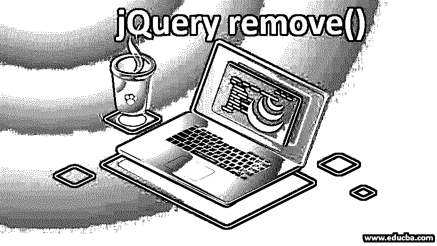


## jQuery remove()简介

用于删除所选元素及其内部所有内容的方法称为 jQuery remove method。元素的数据和事件也被从域中删除。所有文本和子节点以及流程的绑定元素都将被删除。我们可以使用选择器，这样如果需要删除多个元素，可以使用逗号分隔并应用这些元素。结果将是所选元素的数据被移除。这个方法也有助于查找和删除带有类名的元素。

**语法:**

<small>网页开发、编程语言、软件测试&其他</small>

| **语法** | **参数描述** | **值类型** | **版本** |
| $(var)。移除() | 钠 | 钠 | One |
| $(var) **。**移除(选择器) | **选择器:**接受过滤匹配元素的字符串值。 | **选择器:**字符串 | One |

### jQuery remove()的示例

下面是详细解释的 jQuery remove()的不同例子。

#### 1.不使用任何参数

可以在不提供任何输入参数的情况下使用 remove()方法。有两种情况可以应用这个签名。它们是:

##### 形容词（adjective 的缩写）移除选定的元素

它会删除与选定元素相关的所有数据和事件信息。

**举例:**

下面的代码片段旨在移除按钮点击事件中的

元素。

```
<html>
<head>
<script src="https://ajax.googleapis.com/ajax/libs/jquery/3.3.1/jquery.min.js">
//this is JQuery CDN directed from the JQuery website
</script>
<script>
$(document).ready(function() {
$("button").click(function() {
$("p").remove(); //remove method is used on <p> element
});
});
</script>
</head>
<body style="background-color:blanchedalmond;">
<div style="padding-left:220px;padding-top:100px;">
<p style="font-size:35px;">This session is contained under p element.</p>
<button style="padding:15px;">CLICK here to remove p element</button>
</div>
</body>
</html>
```

**输出:**

在调用 remove()方法之前:

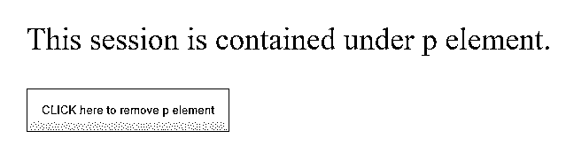


调用 remove()方法后:

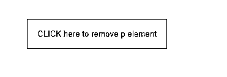


##### b.移除所选元素及其子元素

方法签名也适用于需要将子元素与所选元素一起移除的情况。下面的代码片段旨在从设计中删除 div 元素。remove()的使用消除了子元素以及相关的数据和事件信息。

**举例:**

下面的代码片段旨在删除

元素以及子节点

和<button>元素。</button>

```
<!DOCTYPE html>
<html>
<head>
<script src="https://ajax.googleapis.com/ajax/libs/jquery/3.4.1/jquery.min.js"></script>
<script>
$(document).ready(function(){
$("button").click(function(){
$("#panel").remove();*//remove() is used on the element with id ‘panel’*
});
});
</script>
<style>
//definition of ‘panel’
#panel {
padding: 5px;
text-align: center;
font-family: Arial, Helvetica, sans-serif;
background-color:burlywood;
border: solid 2px #c3c3c3;
}
</style>
</head>
<body style="background-color:blanchedalmond;">
<div id="panel">
---Beginning of 'div' session---
<p>This session is inside the child element:paragraph.</p>
<button style="background-color: burlywood;">This button is defined as child element inside div session</button>
<br>
---End of 'div' session---
</div>
<br>
<button style="margin-centre: 500px;font-family: Arial, Helvetica, sans-serif;font-size: medium;">Click here to remove 'div' session</button>
</body>
</html>
```

**输出:**

在调用 remove()方法之前:


调用 remove()方法后:

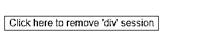


#### 2.使用“选择器”参数

对于 jQuery remove()，可以将一个字符串值作为输入值传递，这允许过滤要删除的元素。它还允许通过将多个过滤器属性配置为以逗号(，)分隔的参数值来消除多个元素。

##### 形容词（adjective 的缩写）使用单一选择器参数

在下面的代码片段中，remove()方法用于使用类“filter”过滤

元素。

**举例:**

```
<!DOCTYPE html>
<html>
<head>
<script src="https://ajax.googleapis.com/ajax/libs/jquery/3.4.1/jquery.min.js"></script>
<script>
$(document).ready(function(){
$("button").click(function(){
$("p").remove(".filter");*//*remove() method is used to remove <p> element if it contains the class ‘filter’
});
});
</script>
<style>
//definition of the class ‘filter’
.filter {
padding: 5px;
font-family: Arial, Helvetica, sans-serif;
background-color:burlywood;
border: solid 2px #c3c3c3;
width: 300px;
}
</style>
</head>
<body style="background-color:blanchedalmond;">
<p style="font-family: Arial, Helvetica, sans-serif;font-size:25px;border: solid 2px; width: 500px;">This session  does not contain "filter" class</p>
<p class="filter">This session contains the class "filter"</p>
<button>Click here to remove the session with 'filter' class</button>
</body>
</html>
```

**输出:**

在调用 remove()方法之前:

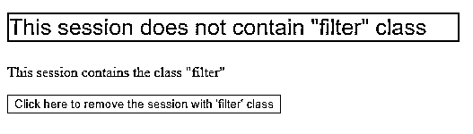


调用 remove()方法后:

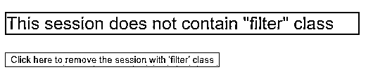


##### b.使用多重选择器参数

在下面的代码片段中，remove()方法用于过滤具有类“filter1”和“filter2”的

元素。请注意，在多过滤器实现的情况下，过滤器属性需要作为输入参数包含，用逗号(，)分隔。

**举例:**

```
<!DOCTYPE html>
<html>
<head>
<script src="https://ajax.googleapis.com/ajax/libs/jquery/3.4.1/jquery.min.js"></script>
<script>
$(document).ready(function(){
$("button").click(function(){
$("p").remove(".filter1,.filter2");*//*remove() method is used to remove <p> element whichcontains either the class ‘filter1’ or ‘filter2’ or both*.*
});
});
</script>
<style>
//Defining ‘filter1’ class
.filter1 {
padding: 5px;
font-family: Arial, Helvetica, sans-serif;
background-color:burlywood;
border: solid 2px #c3c3c3;
width: 300px;
}
//Defining ‘filter2’ class
.filter2 {
padding: 5px;
font-family: Arial, Helvetica, sans-serif;
background-color:chocolate;
border: solid 2px #c3c3c3;
width: 300px;
}
</style>
</head>
<body style="background-color:blanchedalmond;">
<p class="filter1">This session contains the class "filter1"</p>
<p class="filter2">This session contains the class "filter2"</p>
<p class="filter2" class="filter1">This session contains the class "filter1" and "filter2"</p>
<br>
<button class="btn1">Click here to execute filters</button>
</body>
</html>
```

**输出:**

在调用 remove()方法之前:

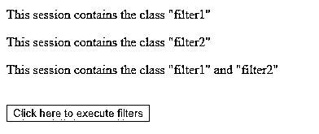


调用 remove()方法后:

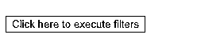


### 移除 jQuery 中元素的方法

基本上有两个 jQuery 方法被定义来删除元素及其内容。他们是，

1.  移除()
2.  [空()](https://www.educba.com/jquery-empty/)

这两种方法的区别在于 remove()方法将子元素与所选元素一起移除，而 empty()仅移除所选元素的子元素。

**举例:**

```
<!DOCTYPE html>
<html>
<head>
<script src="https://ajax.googleapis.com/ajax/libs/jquery/3.4.1/jquery.min.js"></script>
<script>
$(document).ready(function(){
$(".btn1").click(function(){
$("#panel").remove();
});
$(".btn2").click(function(){
$("#panel").empty();
});
});
</script>
<style>
#panel {
padding: 5px;
text-align: center;
font-family: Arial, Helvetica, sans-serif;
background-color:burlywood;
border: solid 2px #c3c3c3;
min-height: 100px;
}
</style>
</head>
<body style="background-color:blanchedalmond;">
<div id="panel">
---Beginning of 'div' session---
<p>This session is inside the child element:paragraph.</p>
<button style="background-color: burlywood;">This button is defined as child element inside div session</button>
<br>
---End of 'div' session---
</div>
<br>
<button class="btn1">Use 'remove()' method</button>
<button class="btn2">Use 'empty()' method</button>
</body>
</html>
```

**输出:**

页面加载到浏览器:

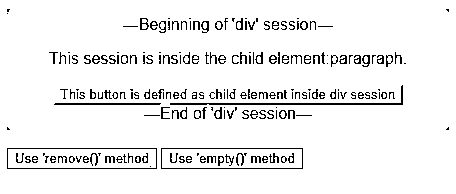


单击按钮“Use 'remove()' method”时调用 remove()方法:

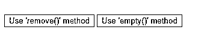


单击按钮“Use 'empty()' method”时调用了 empty()方法:

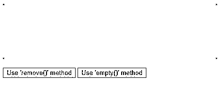


*   与 empty()方法不同，remove()方法从 DOM 中提取元素。
*   使用带有输入参数的 remove()方法类似于:

```
'$(selector).filter(":contains(conditional attribute)").remove()'
```

*   为了删除不包含过滤器属性的元素，需要使用以下签名:

```
$("html_element: not(selector)").remove()
```

这里。“not()”选择除指定选择器之外的元素，并对所选元素执行 remove()。

### 推荐文章

这是 jQuery remove()的指南。在这里，我们讨论 jQuery remove()的介绍，以及示例和代码实现。您也可以阅读以下文章，了解更多信息——

1.  [jQuery 中的动画](https://www.educba.com/animate-in-jquery/)
2.  [jQuery delay()](https://www.educba.com/jquery-delay/)
3.  [jQuery 效果](https://www.educba.com/jquery-effects/)
4.  [jQuery append()](https://www.educba.com/jquery-append/)


