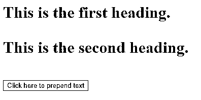
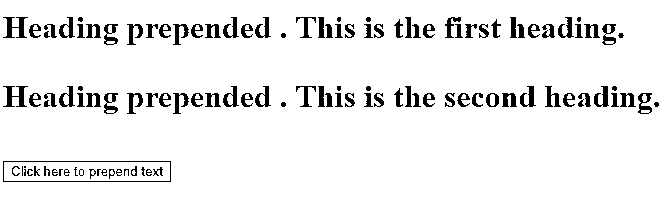
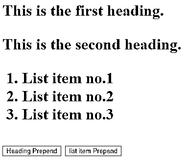
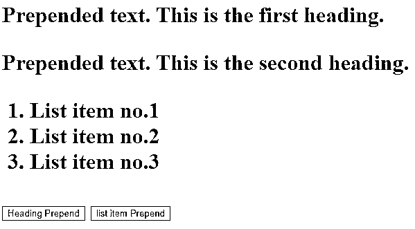
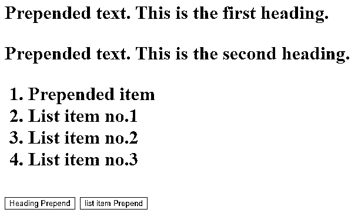
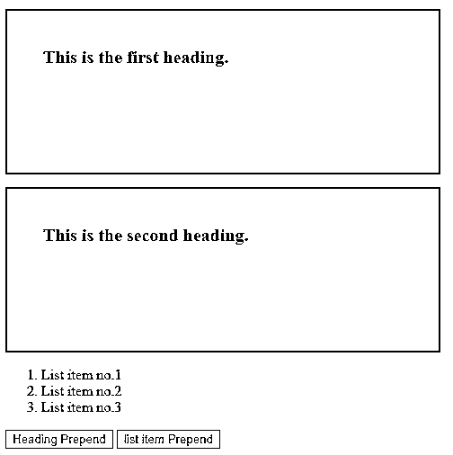
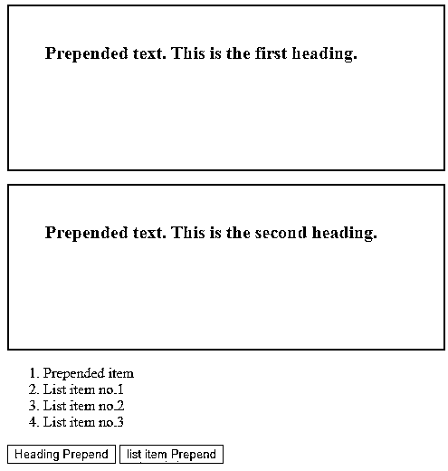
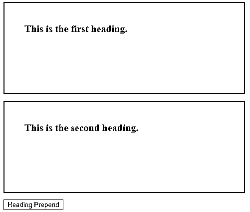
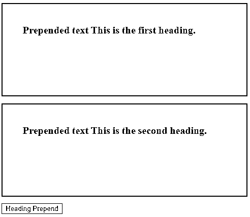

# jQuery 前置()

> 原文：<https://www.educba.com/jquery-prepend/>


## jQuery prepend()简介

jQuery prepend()方法用于预先追加所选 HTML 元素的指定内容。这个方法是 jQuery 的[内置方法。此方法用于在第一个子元素的开头插入所选 HTML 元素的内容。该方法与 jQuery append()方法相反，因为 jQuery prepend()方法在所选 HTML 元素的末尾插入内容。](https://www.educba.com/jquery-methods/)

**语法:**

<small>网页开发、编程语言、软件测试&其他</small>

```
$(selector).prepend( content, function( index, Currenthtml )
```

此方法用于获取选定元素的值。

**参数:**

*   **content:** content 参数不是可选参数，用于指定要插入的内容。content 参数可以接受 jQuery 对象、HTML 元素和 DOM 元素形式的值。
*   **function ( index，current tml):**function(index，current tml)参数是可选参数，用来指定要执行并返回插入内容的函数的名称。
*   **Index:** Index 用于指定所选 HTML 元素内容的索引位置。
*   **current html:**current value 用于指定所选 HTML 元素内容的当前 HTML。

### jQuery prepend()示例

下面是带有内容参数的示例。

#### 示例#1

这里，我们编写 HTML 代码来更清楚地理解 jQuery prepend()方法，在下面的示例中，我们将 prepend()方法应用于第一个和第二个标题元素的内容。

**代码:**

```
<!DOCTYPE html>
<html lang= "en" >
<html>
<head>
<meta charset= "utf-8" >
<script type = "text/javascript" src="https://ajax.googleapis.com/ajax/libs/jquery/1.11.3/jquery.min.js" >
</script>
<title> This is an example for jQuery prepend( ) method </title>
<!-- code to show the jQuery prepend( ) working method -->
<script>
$(document).ready(function(){
$("#btn").click(function(){
$("h1").prepend("<b> Heading prepended </b>. ");
});
});
</script>
</head>
<body>
<h1>This is the first heading.</p>
<h1>This is the second heading.</p>
<button id="btn"> Click here to prepend text </button>
</body>
</html>
```

**输出:**




一旦点击按钮点击，输出是:




在上面的代码中，prepend()方法使用了。由于 prepend()方法的使用是在开始处插入指定的内容，或者由于 jQuery 集合中所选元素的前端显示在上面的输出中。

#### 实施例 2

这是一个示例代码，其中使用 jQuery prepend()方法将文本预先附加到标题和元素列表中，如下面的代码所示。

**代码:**

```
<!DOCTYPE html>
<html lang= "en" >
<html>
<head>
<meta charset= "utf-8" >
<script type = "text/javascript" src="https://ajax.googleapis.com/ajax/libs/jquery/1.11.3/jquery.min.js" >
</script>
<title> This is an example for jQuery prepend( ) method </title>
<!-- code to show the jQuery prepend( ) working method -->
<script>
$(document).ready(function(){
$("#btn").click(function(){
$("h1").prepend("<b>Prepended text</b>. ");
});
$("#btn1").click(function(){
$("ol").prepend("<li>Prepended item</li>");
});
});
</script>
</head>
<body>
<h1>This is the first heading.</p>
<h1>This is the second heading.</p>
<ol>
<li> List item no.1 </li>
<li> List item no.2 </li>
<li> List item no.3 </li>
</ol>
<button id="btn"> Heading Prepend </button>
<button id="btn1"> list item Prepend </button>
</body>
</html>
```

**输出:**




一旦我们单击“heading prepend”按钮，输出是:




一旦我们单击“列表项前置”按钮，输出是:




#### 实施例 3

在下一个示例代码中，我们为 jQuery prepend()方法重写了上述代码，以便在属性框中预先追加文本。如下面的代码所示。

**代码:**

```
<!DOCTYPE html>
<html lang= "en" >
<html>
<head>
<meta charset= "utf-8" >
<script type = "text/javascript" src="https://ajax.googleapis.com/ajax/libs/jquery/1.11.3/jquery.min.js" >
</script>
<title> This is an example for jQuery prepend( ) method </title>
<!-- code to show the jQuery prepend( ) working method -->
<script>
$(document).ready(function(){
$("#btn").click(function(){
$("h1").prepend("<b>Prepended text</b>. ");
});
$("#btn1").click(function(){
$("ol").prepend("<li>Prepended item</li>");
});
});
</script>
<style>
h1 {
width : 400px;
height: 100px;
font-weight : bold;
padding : 40px;
font-size : 20px;
border : 2px solid red;
}
</style>
</head>
<body>
<h1> This is the first heading. </h1>
<h1> This is the second heading. </h1>
<ol>
<li> List item no.1 </li>
<li> List item no.2 </li>
<li> List item no.3 </li>
</ol>
<button id="btn"> Heading Prepend </button>
<button id="btn1"> list item Prepend </button>
</body>
</html>
```

**输出:**




一旦我们单击“heading prepend”按钮，输出是:


一旦我们单击“列表项前置”按钮，输出是:




#### 实施例 4

下一个示例代码，其中 jQuery prepend()方法接受一个函数，执行该函数以插入前置追加文本。如下面的代码所示。

**代码:**

```
<!DOCTYPE html>
<html lang= "en" >
<html>
<head>
<meta charset= "utf-8" >
<script type = "text/javascript" src="https://ajax.googleapis.com/ajax/libs/jquery/1.11.3/jquery.min.js" >
</script>
<title> This is an example for jQuery prepend( ) method </title>
<!-- code to show the jQuery prepend( ) working method -->
<script>
$(document).ready(function() {
$("#btn").click(function() {
$("h1").prepend(function() {
return "<b> Prepended text </b> ";
});
});
});
</script>
<style>
h1 {
width : 400px;
height: 100px;
font-weight : bold;
padding : 40px;
font-size : 20px;
border : 2px solid red;
}
</style>
</head>
<body>
<h1> This is the first heading. </h1>
<h1> This is the second heading. </h1>
<!-- Click on this button to see the change -->
<button id="btn"> Heading Prepend </button>
</body>
</html>
```

**输出:**




一旦点击按钮点击，输出是:




### 结论

*   jQuery prepend()方法用于预先追加所选 HTML 元素的指定内容。它与 jQuery append()方法相反，jQuery prepend()方法附加在所选 HTML 元素的末尾。
*   语法是$(选择器)。prepend( content，function( index，current tml)，参数是用于指定要预先追加的内容的 content，用于指定要执行的函数的名称的 function (index，current tml)，用于指定元素的索引位置的 index 和用于指定当前 html 元素的 current tml。

### 推荐文章

这是 jQuery prepend()的指南。在这里，我们讨论参数以及示例和代码实现。您也可以阅读以下文章，了解更多信息——

1.  [jQuery delay()](https://www.educba.com/jquery-delay/)
2.  [jQuery 事件](https://www.educba.com/jquery-events/)
3.  [jQuery wrapAll()](https://www.educba.com/jquery-wrapall/)
4.  [jQuery scrollTop()](https://www.educba.com/jquery-scrolltop/)


