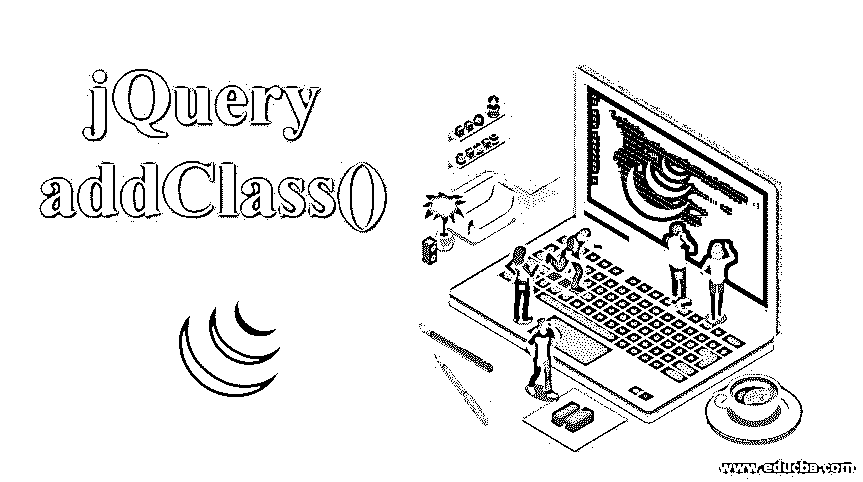
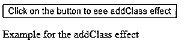
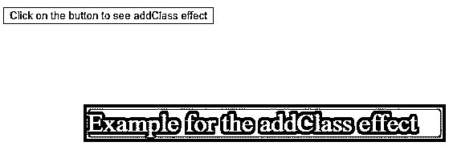
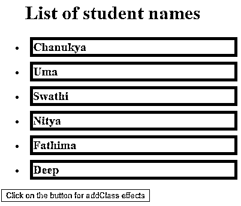
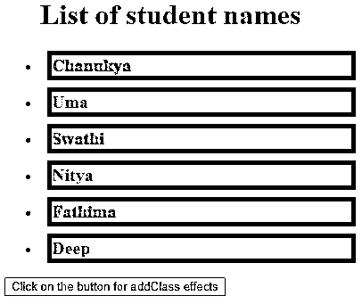
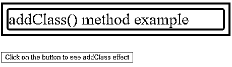
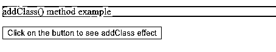

# jQuery addClass()

> 原文：<https://www.educba.com/jquery-addclass/>




## jQuery addClass()简介

在下面的文章中，我们将学习 jQuery addClass()。如果没有 JavaScript 编程语言的知识，学习 jQuery 会有点困难。jQuery 有许多内置的方法。这个方法就是其中之一。通过使用 addClass()方法，我们可以将指定的一个或多个类添加到匹配元素集中的选定元素中。此方法中已存在的类属性不会移除它们。这个方法可以接受一个或多个类名。要添加多个类，类名由空格字符分隔。

### jQuery addClass()的语法和参数

简而言之，我们可以说 addClass()方法用于为元素添加一个或多个类。jQuery 中的 addClass()方法语法。它是 jQuery 中的一个内置方法。jQuery addClass()方法的语法如下:

<small>网页开发、编程语言、软件测试&其他</small>

**语法:**

```
$(selector) .addClass(className [ , duration] [, easing][,options])
```

**参数:**

它包含一些参数；参数的一些细节如下:

*   **类名:**类名应该是字符串类型。它可以接受一个或多个类名；空格将它们分开。
*   **时长:**时长可以是字符串，也可以是数字。它可以是以毫秒为单位的时间，也可以是预设的时间。持续时间的默认值是 400 毫秒。它可以将 slow、fast 或 normal 作为字符串参数。这有助于我们根据需求控制幻灯片动画。
*   **缓动:**缓动应为字符串类型。它用于过渡。默认值为 swing。
*   **函数:**可选参数，返回类名。它接受元素的索引位置和类名。
*   **队列:**队列采用布尔值。如果布尔值为真，则它指示是否放置动画。如果布尔值为假，动画将立即发生。
*   **Complete:** 一旦一个元素的动画完成，这个函数就会被调用。
*   **子代:**子代取布尔值。这有助于确定要制作哪个后代的动画。

### 实现 jQuery addClass()的示例

这是 addClass()方法的一个简单例子。在这个例子中，我们可以观察 addClass()方法对段落的影响。在这个例子中，我们已经传递了两个类名；它们是一个亮点，主要我们可以在代码中看到它们在 addClass()方法中被空格隔开。

#### 示例#1

**代码:**

```
<!DOCTYPE html>
<html>
<head>
<script src="https://ajax.googleapis.com/ajax/libs/jquery/1.11.3/jquery.min.js"></script>
<script>
$(document).ready(function(){
$("#btn").click(function(){
$("p").addClass("highlight main");
});
});
</script>
<style>
.highlight {
font-size: 200%;
color: white;
display: block;
border: 5px solid red;
}
.main {
margin: 100px;
background:purple;
}
</style>
</head>
<body>
<button id = "btn"> Click on the button to see addClass effect</button>
<p>Example for the addClass effect</p>
</body>
</html>
```

**输出:**

*   在输出中，我们可以在点击按钮之前观察到“点击按钮查看 addClass 效果”。
*   段落内容为普通字体大小，没有背景和颜色，如下图所示。




*   在输出中，点击按钮后，“点击按钮查看 addClass 效果”。
*   我们可以在下图中看到，字体大小、背景颜色、边框、边距和显示都应用到了段落中，就像我们在代码中的 addClass()方法中提到的那样。




#### 实施例 2

这是 addClass()方法使用函数的另一个示例。

**代码:**

```
<!DOCTYPE html>
<html>
<head>
<script src="https://ajax.googleapis.com/ajax/libs/jquery/3.4.1/jquery.min.js"></script>
<script>
$(document).ready(function(){
$("button").click(function(){
$("li").addClass(function(n){
return "listitem_" + n;
});
});
});
</script>
<style>
p {
margin: 8px;
font-size: 20px;
font-weight: bolder;
cursor: pointer;
border: 5px solid blue;
}
.main {
background: orange;
}
.listitem_1, .listitem_3,.listitem_5 {
color: Brown;
}
.listitem_0, .listitem_2 ,.listitem_4{
color: green;
}
</style>
</head>
<body>
<ul>
<h1>List of student names</h1>
<li><p class="main">Chanukya</p></li>
<li><p class="main">Uma</p></li>
<li><p class="main">Swathi</p></li>
<li><p class="main">Nitya</p></li>
<li><p class="main">Fathima</p></li>
<li><p class="main">Deep</p></li>
</ul>
<script>
$( "p" ).click(function() {
$( this ).addClass( "main" );
});
</script>
<button>Click on the button for addClass effects</button>
</body>
</html>
```

**输出:**

*   在点击按钮“点击添加类效果的按钮”之前，我们可以看到一个学生姓名列表显示为黑色文本，背景填充为橙色，姓名周围有蓝色边框。




*   在点击“点击 addClass effects 按钮”后，我们可以观察到偶数和奇数顺序的学生姓名列表具有不同的文本颜色。如我们在代码中提到的，偶数列表改为绿色，即 0，2，4 的 list_item 应用绿色，1，3，5 的奇数列表 list_item 应用棕色。正如我们在下图中看到的那样，这些更改被应用到了输出中。




#### 实施例 3

这是 addClass()方法的另一个示例，通过 removeClass()方法移除现有效果，并通过 addClass()方法添加新效果。

**代码:**

```
<!DOCTYPE html>
<html>
<head>
<script src="https://ajax.googleapis.com/ajax/libs/jquery/3.4.1/jquery.min.js"></script>
<script>
$(document).ready(function(){
$("button").click(function(){
$("p").removeClass("highlight").addClass("main");
});
});
</script>
<style>
.highlight {
font-size: 200%;
color: blue;
display: block;
border: 15px solid Brown;
}
.main {
background-color: violet;
}
</style>
</head>
<body>
<p class="highlight">addClass() method example</p>
<button>Click on the button to see addClass effect</button>
</body>
</html>
```

**输出:**

*   在此示例中。突出显示类有字体大小、颜色、显示和边框。这个类名被传递给 removeClass()方法。在点击按钮"点击按钮查看 addClass 效果"之前，输出包含了所有的效果。突出显示类，因为它们没有被 removeClass()方法移除，如下图所示。




*   点击“点击按钮查看 addClass 效果”按钮后，我们可以观察到字体大小、颜色、显示和边框的效果。highlight 类通过 removeClass()方法和背景色效果(即紫色)移除。正如我们在下图中看到的，main()类是由 addClass()方法应用的。




这些是 addClass()方法使用一些参数和函数的一些例子。

### 推荐文章

这是 jQuery addClass()的指南。这里我们讨论 jQuery addClass()的语法和参数，以及不同的例子和它的代码实现。您也可以阅读以下文章，了解更多信息——

1.  [jQuery detach()](https://www.educba.com/jquery-detach/)
2.  [jQuery slideUp()](https://www.educba.com/jquery-slideup/)
3.  [jQuery fadeIn()](https://www.educba.com/jquery-fadein/)
4.  [jQuery outerHeight()](https://www.educba.com/jquery-outerheight/)


