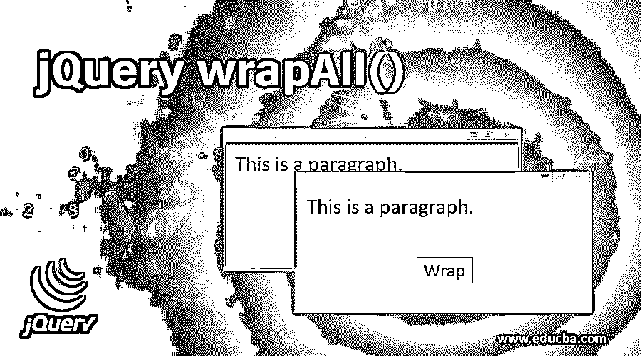
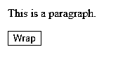
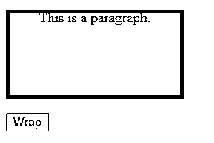
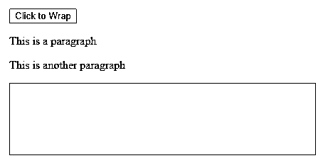
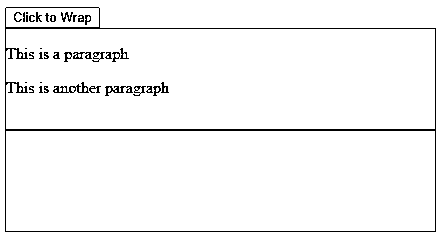
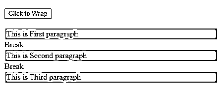
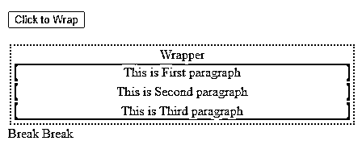
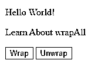
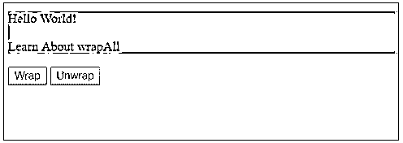
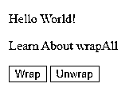

# jQuery wrapAll()

> 原文：<https://www.educba.com/jquery-wrapall/>




## jQuery wrapAll()概述

本文全面概述了 jQuery 的内置方法之一 wrapAll()。我们将通过一组例子来学习如何使用它。jQuery 是一个非常流行的 JavaScript 库，web 开发人员使用它来遍历和操作 HTML DOM。它加载了许多处理事件的方法、 [CSS 动画](https://www.educba.com/css-animation-transition/)和 AJAX。jQuery 的内置方法 wrapAll()用于将一组[匹配的 HTML 元素](https://www.educba.com/html-form-elements/)与提供的元素包装在一起。正如我们所知，JavaScript 与 DOM 交互，匹配元素的包装发生在 DOM 级别。原来的 HTML 源代码保持不变。

**语法:**

<small>网页开发、编程语言、软件测试&其他</small>

```
$(selector).wrapAll( wrappingElement )
```

方法签名只包含一个参数:

**包装元件**

1.指定包装元素以覆盖匹配的元素。

2.需要

3.可能的值:

*   选择器
*   HTML 字符串
*   元素
*   jQuery 对象

包装元素将所选元素作为单个组覆盖，以形成 DOM 结构。

### jQuery wrapAll()的示例

以下是一些例子:

#### 示例#1

这是一个使用 wrapAll()方法将段落括在 DIV 中的示例。

**代码:**

```
<!DOCTYPE html>
<html>
<head>
<script src="https://ajax.googleapis.com/ajax/libs/jquery/3.4.1/jquery.min.js">
</script>
<style>
.wrap p{
background-color: blue;
width: 200px;
height: 100px;
text-align: center;
}
</style>
<script>
$( document ).ready( function () {
$(".btn").click( function () {
$("p").wrapAll('<div class= "wrap"> </div>');
});
});
</script>
</head>
<body>
<p> This is a paragraph. </p>
<button class= "btn"> Wrap </button>
</body>
</html>
```

**输出:**




在上面的代码中，我们有一个段落(

)元素和一个按钮。单击该按钮时，段落元素将被一个 DIV 元素覆盖，该元素具有一个名为“wrap”的 CSS 类。




我们注意到段落的背景颜色变成了蓝色，因为在段落中应用了 wrap 类的样式，显示它被包装在

标签内。

#### 实施例 2

在这里，我们将看到如何使用另一个现有的元素来包装这些元素。

**代码:**

```
<!DOCTYPE html>
<html>
<head>
<script src="https://ajax.googleapis.com/ajax/libs/jquery/3.4.1/jquery.min.js">
</script>
<style>
.wrap{
border-width: 1px;
border-color: blue;
border-style: solid;
height: 100px;
}
</style>
<script>
$( document ).ready( function () {
$(".btn").click( function () {
$("p").wrapAll( $(".wrap") );
});
});
</script>
</head>
<body>
<button class= "btn"> Click to Wrap </button>
<br>
<p> This is a paragraph </p>
<p> This is another paragraph </p>
<div class= "wrap"></div>
</body>
</html>
```

**输出:**




上面的代码片段使用名为“wrap”的类呈现了一个按钮、两个段落和一个空 DIV 元素。点击按钮时，会触发一个函数来调用

标签上的 wrapAll()方法。在该方法中，jQuery 选择器方法作为 wrappingElement 传递，该方法返回由“wrap”类匹配的元素。

当我们点击按钮时，段落被蓝色边框包围，这意味着元素被换行

```
"<div class = "wrap"></div>"
```

**输出:**




但是我们注意到，空的

元素仍然存在于 HTML 中。因为 jQuery wrapAll 不移动或移除包装器 DOM 对象，而是实际上克隆它来包装元素，而不改变原始源代码。

#### 实施例 3

这个例子让我们对 wrapAll()的工作原理有了更深入的了解。

**代码:**

```
<!DOCTYPE html>
<html>
<head>
<script src="https://ajax.googleapis.com/ajax/libs/jquery/3.4.1/jquery.min.js">
</script>
<style>
p{ background: cyan;margin: 2px;
padding: 2px;
}
div{
border: 2px blue dotted;
margin: 2px;
padding: 2px;
text-align: center;
}
</style>
<script>
$( document ).ready( function () {
$( ".btn" ).click( function () {
$("p").wrapAll( "<div> Wrapper </div>" );
});
});
</script>
</head>
<body>
<br />
<br />
<button class= "btn"> Click to Wrap </button>
<br />
<br />
<p> This is First paragraph </p>
 Break 
<p> This is Second paragraph </p>
 Break 
<p> This is Third paragraph </p>
</body>
</html>
```

**输出:**




上面的代码呈现了一个按钮、三个段落以及段落之间的两个跨度。同样，与其他两个示例一样，当我们单击按钮时，click 事件调用 wrapAll()方法并用 DIV 包装匹配的元素。

在前面的示例中，我们已经看到，当应用 wrapAll()时，包装器元素没有移动。但是要包装的元素就不一样了。

那么…有什么区别呢？??

看看这里发生了什么…




段落被包裹在包装器

内。请注意，段落之间的任何内容都被省略了。在这里，元素被移动，但没有被克隆。但是，原始源代码保持不变。

#### 实施例 4

这个是关于打开包装的元素。我们将为它使用 jQuery 的内置方法 unwrap()。

**代码:**

```
<!DOCTYPE html>
<html>
<head>
<script src="https://ajax.googleapis.com/ajax/libs/jquery/3.4.1/jquery.min.js"></script>
<script>
$(document).ready( function () {
$("#btn1").click( function () {
$("p").wrapAll("<div></div>");
});
$("#btn2").click( function () {
$("p").unwrap();
});
});
</script>
<style>
div{ background-color: cyan; }
</style>
</head>
<body>
<p> Hello World! </p>
<p> Learn About wrapAll </p>
<button id= "btn1"> Wrap </button>
<button id= "btn2"> Unwrap </button>
</body>
</html>
```

**输出:**




这只是一个有两个段落和两个按钮元素的简单例子。一个按钮是换行，另一个按钮是打开。点击 Wrap 按钮时，事件调用 wrapAll()方法，而点击 Unwrap 按钮时， [unwrap()方法被调用](https://www.educba.com/jquery-unwrap/)。




当我们单击换行按钮时，背景颜色会随着段落被 DIV 元素换行而改变。现在，让我们单击“展开”按钮。




我们注意到背景色随着元素的展开而消失。

### 结论–jQuery wrap all()

我们学习了如何在网页上使用 jQuery 的 wrapAll()方法。我们执行了一组示例来学习它的技术细节，并进行同样的实践。因此，我们可以得出结论，该方法非常有用，并且易于在我们的网页或应用程序中实现。

### 推荐文章

这是 jQuery wrapAll()的指南。这里我们讨论 jQuery wrapAll()的概述、语法和不同的例子。您也可以看看以下文章，了解更多信息–

1.  [jQuery delegate()](https://www.educba.com/jquery-delegate/)
2.  [JQuery 进度条](https://www.educba.com/jquery-progress-bar/)
3.  [jQuery querySelector](https://www.educba.com/jquery-queryselector/)
4.  [jQuery scrollTop()](https://www.educba.com/jquery-scrolltop/)


