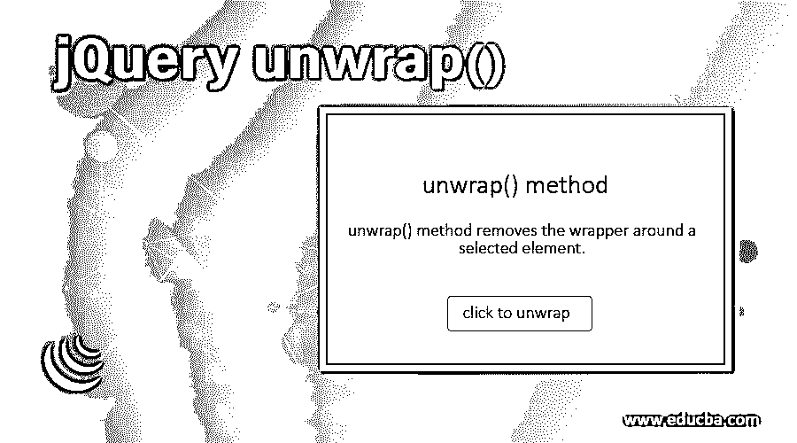
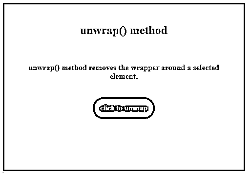
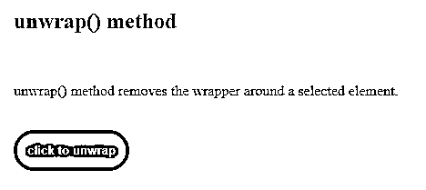
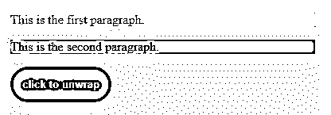
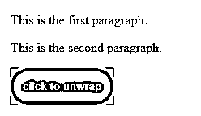
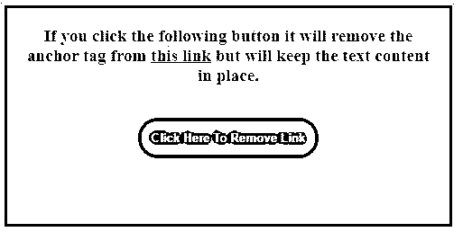
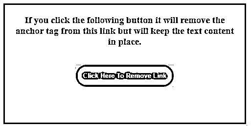
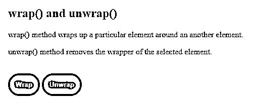
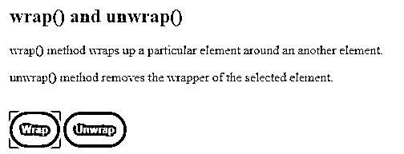
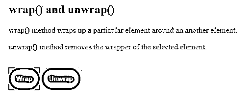

# jQuery unwrap()

> 原文：<https://www.educba.com/jquery-unwrap/>




## jQuery unwrap()简介

unwrap()的目的是从给定元素中移除包装器或父元素。jQuery unwrap()方法用于移除所选 HTML/DOM 元素的父元素。该方法在执行后返回未包装的内容。所选的元素以及任何兄弟元素都会替换它们在 DOM 结构中的父元素。一个简单的例子是，删除文本周围的锚标记。unwrap()方法只是删除锚标记，保持内部文本内容不变。wrap()方法的作用与 unwrap()相反。

**语法:**

<small>网页开发、编程语言、软件测试&其他</small>

```
$(selector).unwrap()
```

在哪里，

*   选择器是选定的元素。

此语法不接受任何参数。

**Note:** unwrapping will not occur if the selector and parent do not match.

### 实现 jQuery unwrap()方法的示例

现在让我们看几个例子来更好地理解 unwrap()方法的实现和工作。

#### 示例#1

下面是一个简单的例子，说明了 jQuery 中 unwrap()方法的效果

**代码:**

```
<!DOCTYPE html>
<html>
<head>
<title>Example for jQuery unwrap method</title>
<script src="https://code.jquery.com/jquery-1.12.4.min.js"></script>
<script>
$(document).ready(function() {
$("button").click(function() {
$("p").unwrap();
});
});
</script>
<style>
button {
background: teal;
color: yellow;
border-radius: 30px;
padding: 15px;
font-weight: bold;
border: none;
margin: auto;
cursor: pointer;
}
div {
width: 450px;
height: 300px;
padding: 20px;
font-size: medium;
color: maroon;
text-align: center;
background-color: lightgray;
margin: auto;
font-weight: bold;
border: 3px solid teal;
margin-top: 50px;
margin-bottom: 10px;
}
</style>
</head>
<body>
<div>
<h2>unwrap() method</h2>
<br />
<p>unwrap() method removes the wrapper around a selected element.</p>
<br />
<button>click to unwrap</button>
</div>
</body>
</html>
```

**输出:**

*   下面的屏幕截图显示了页面最初加载到浏览器时的屏幕。
*   到目前为止没有执行任何活动。
*   这里，我们有一个包装了一些文本的 div 和一个按钮，如下所示。
*   我们正在尝试打开 p 元素的父元素，即 div。




*   单击按钮后，所选段落 p 的父元素(即 div)将被删除，留下完整包装的全部内容。
*   如下所示，单击按钮后，div 提供的所有格式都被删除了。




#### 示例 **#2**

这是另一个说明 unwrap()方法工作的例子。

**代码:**

```
<!DOCTYPE html>
<html>
<head>
<title>Example for jQuery unwrap method</title>
<script src="https://code.jquery.com/jquery-1.12.4.min.js"></script>
<script>
$(document).ready(function() {
$("button").click(function() {
$("p").unwrap();
});
});
</script>
<style>
button {
background: teal;
color: yellow;
border-radius: 30px;
padding: 15px;
font-weight: bold;
border: none;
margin: auto;
cursor: pointer;
}
#div1 {
background-color: lightgray;
}
#div2 {
background-color: yellowgreen;
}
</style>
</head>
<body>
<div id="div1" >
<p>This is the first paragraph.</p>
</div>
<div id="div2" >
<p>This is the second paragraph.</p>
</div>
<button>click to unwrap</button>
</div>
</body>
</html>
```

**输出:**

*   下面是页面最初加载到浏览器时的截图。
*   到目前为止没有执行任何活动。
*   这里，我们有两个 id 为 div1 的 div。我们试图通过对 p 元素应用 unwrap()方法来移除 p 元素的父元素。




*   单击按钮后，p 元素的包装或父元素将被移除。
*   这两个段落的父元素是 div 元素。
*   因此，div 元素提供的格式完全从两个段落中删除。




#### 示例 **#3**

让我们再考虑一个例子来看看 unwrap()方法的工作原理。

**代码:**

```
<!DOCTYPE html>
<html lang="en">
<head>
<meta charset="utf-8" />
<title>jQuery unwrap() method example</title>
<script src="https://code.jquery.com/jquery-1.12.4.min.js"></script>
<script>
$(document).ready(function() {
$("button").click(function() {
$("p")
.find("a.link")
.contents()
.unwrap();
});
});
</script>
<style>
div {
width: 450px;
height: 200px;
padding: 20px;
font-size: medium;
text-align: center;
margin: auto;
background-color: lightgrey;
font-weight: bold;
border: 3px solid teal;
margin-top: 50px;
margin-bottom: 10px;
}
button {
background: teal;
color: yellow;
border-radius: 30px;
padding: 15px;
font-weight: bold;
border: none;
margin: auto;
cursor: pointer;
}
p {
color: brown;
font-weight: bold;
font-size: larger;
border: none;
margin: auto;
cursor: pointer;
}
</style>
</head>
<body>
<div>
<p>
If you click the following button it will remove the anchor tag from
<a href="#" class="link">this link</a> but will keep the text content in
place.
</p>
<br /><br />
<button type="button">Click Here To Remove Link</button>
</div>
</body>
</html>
```

**输出:**

*   上面的代码片段在运行时会给出以下输出。
*   这里，我们试图从选中的链接中删除锚标记。




*   单击按钮后，unwrap()方法将删除所选链接的父链接，即保持文本原样的锚标记。




#### 实施例 4

现在让我们看一个例子来理解 wrap()和 unwrap()方法之间的区别。在这里，我们展示了包装和展开元素之间的切换。

**代码:**

```
<!DOCTYPE html>
<html>
<head>
<title>Example for jQuery wrap & unwrap method</title>
<script src="https://code.jquery.com/jquery-1.12.4.min.js"></script>
<script>
$(document).ready(function() {
$("#btn1").click(function() {
$("p").wrap("<div></div>");
});
$("#btn2").click(function() {
$("p").unwrap();
});
});
</script>
<style>
#btn1 {
background: teal;
color: yellow;
border-radius: 30px;
padding: 15px;
font-weight: bold;
border: none;
margin: auto;
cursor: pointer;
}
#btn2 {
background: teal;
color: yellow;
border-radius: 30px;
padding: 15px;
font-weight: bold;
border: none;
margin: auto;
cursor: pointer;
}
div {
background-color: yellow;
}
</style>
</head>
<body>
<h2>wrap() and unwrap()</h2>
<p>
wrap() method wraps up a particular element around an another element.
</p>
<p>unwrap() method removes the wrapper of the selected element.</p>
<br />
<button id="btn1">Wrap</button>
<button id="btn2">Unwrap</button>
</body>
</html>
```

**输出:**

*   上面的代码片段在执行时会显示以下输出。
*   在这里，我们试图包装，然后解开如下所示的两个段落。




*   单击换行按钮后，所选段落将按照代码中指定的方式由一个 div 换行。




*   单击 Unwrap 按钮时，所选段落的包装，即 div 将被移除。




### 结论

这篇 jQuery 文章演示了 unwrap()方法的基本工作原理及其实现。该方法从 DOM 中移除匹配元素集的包装器或父元素，保留元素的内容。要在选定的元素周围包装指定的 HTML/DOM 结构，可以在该元素上使用 wrap()方法。

### 推荐文章

这是 jQuery unwrap()的指南。这里我们讨论实现 jQuery unwrap()的简介和不同的例子。您也可以看看以下文章，了解更多信息–

1.  [jQuery slideDown()](https://www.educba.com/jquery-slidedown/)
2.  [jQuery mouseout()](https://www.educba.com/jquery-mouseout/)
3.  [jQuery html()](https://www.educba.com/jquery-html/)
4.  [jQuery draggable()](https://www.educba.com/jquery-draggable/)


