# jQuery append()

> 原文：<https://www.educba.com/jquery-append/>

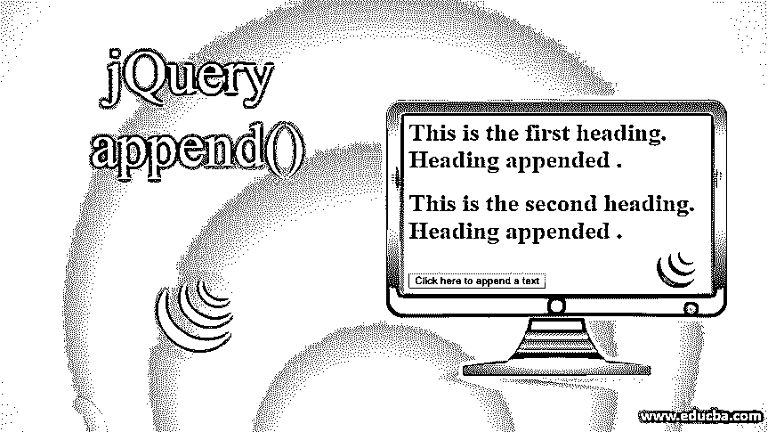


## jQuery append()简介

jQuery append()方法用于将指定的内容追加到 jQuery 集合中选定的 HTML 元素。这个方法是 jQuery 的内置方法。jQuery append()方法用于将指定的内容作为最后一个子元素插入到所选 HTML 元素的末尾。jQuery append()方法与 jQuery prepend()方法相反，jQuery append()方法在所选 HTML 元素的末尾插入内容，而 jQuery prepend()方法在所选 HTML 元素的开头插入内容。jQuery append()方法的替代方法是使用 jQuery appendTo()方法来执行相同的任务，但是它们之间的区别在于语法。

**语法:**

<small>网页开发、编程语言、软件测试&其他</small>

```
$(selector).append( content, function( index, Currenthtml )
```

此方法用于将内容追加到选定的元素中。

### 因素

*   **content** : content 参数不是可选参数，用于指定最后要插入的内容。content 参数可以接受 HTML 元素、DOM 元素及其对象形式的值。
*   **function ( index，****【current tml】**:function(index，current tml)参数是一个可选参数，用于指定要执行并返回的函数的名称，插入到最后的内容。
*   **Index:** index 用于指定元素在集合中的索引位置。
*   **Currenthtml:** Currenthtml 用于指定所选元素的当前 html。

### jQuery append()方法的示例

以下是要实施的示例:

#### 示例# 1–包含内容参数的方法

接下来，我们编写 Html 代码，通过下面的例子更清楚地理解这个方法，append()方法用于将内容插入第一个和第二个 heading 元素:

**代码:**

```
<!DOCTYPE html>
<html lang= "en" >
<head>
<meta charset= "utf-8" >
<script type = "text/javascript"
src="https://ajax.googleapis.com/ajax/libs/jquery/1.11.3/jquery.min.js" >
</script>
<title> This is an example for jQuery append( ) method </title>
<!-- code to show the jQuery append( ) working method -->
<script>
$(document).ready(function(){
$("#btn").click(function(){
$("h1").append("<br><b> Heading appended </b>. ");
});
});
</script>
</head>
<body>
<h1>This is the first heading.</h1>
<h1>This is the second heading.</h1>
<br><button id="btn"> Click here to append a text </button>
</body>
</html>
```

**输出:**

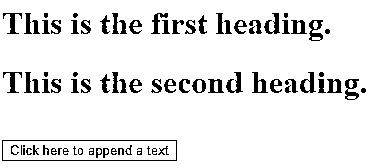


一旦点击按钮点击，输出是:

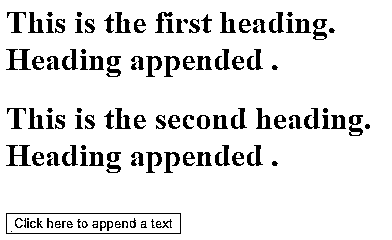


在上面的代码中，append()方法正在使用，在输出中我们可以看到 append()方法在 jQuery 集合中的选定元素< h1 >的末尾插入了指定的内容。

#### 示例# 2–带有内容参数的方法

下一个示例代码中，jQuery append()方法将文本附加到标题和元素列表中，如下面的代码所示

**代码:**

```
<!DOCTYPE html>
<html lang= "en" >
<head>
<meta charset= "utf-8" >
<script type = "text/javascript" src="https://ajax.googleapis.com/ajax/libs/jquery/1.11.3/jquery.min.js" >
</script>
<title> This is an example for jQuery append( ) method </title>
<!-- code to show the jQuery append( ) working method -->
<script>
$(document).ready(function(){
$("#btn").click(function(){
$("h1").append("<b> Appended text </b>. ");
});
$("#btn1").click(function(){
$("ol").append("<li> Appended item </li>");
});
});
</script>
</head>
<body>
<h1>This is the first heading.</h1>
<h1>This is the second heading.</h1>
<ol>
<li> List item no.1 </li>
<li> List item no.2 </li>
<li> List item no.3 </li>
</ol>
<button id="btn"> Heading Append </button>
<button id="btn1"> list item Append </button>
</body>
</html>
```

**输出:**

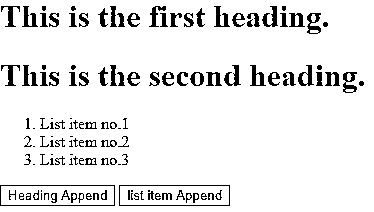


一旦我们单击“标题附加”按钮，输出是:

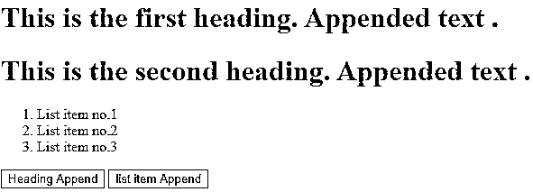


一旦我们单击“列表项追加”按钮，输出是:

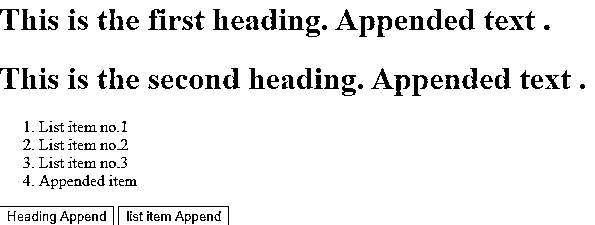


#### 示例# 3–带内容参数的方法

在下一个示例代码中，我们为其方法重写了上面的代码，以便在属性框中追加文本。如下例所示。

**代码:**

```
<!DOCTYPE html>
<html lang= "en" >
<head>
<meta charset= "utf-8" >
<script type = "text/javascript" src="https://ajax.googleapis.com/ajax/libs/jquery/1.11.3/jquery.min.js" >
</script>
<title> This is an example for jQuery append( ) method </title>
<!-- code to show the jQuery append( ) working method -->
<script>
$(document).ready(function(){
$("#btn").click(function(){
$("h1").append("<b>appended text</b>. ");
});
$("#btn1").click(function(){
$("ol").append("<li>appended item</li>");
});
});
</script>
<style>
h1 {
width : 400px;
height: 100px;
font-weight : bold;
padding : 40px;
font-size : 20px;
border : 2px solid red;
}
</style>
</head>
<body>
<h1> This is the first heading. </h1>
<h1> This is the second heading. </h1>
<ol>
<li> List item no.1 </li>
<li> List item no.2 </li>
<li> List item no.3 </li>
</ol>
<button id="btn"> Heading append </button>
<button id="btn1"> list item append </button>
</body>
</html>
```

**输出:**

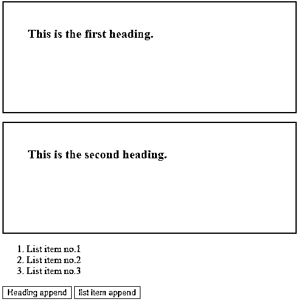


一旦我们单击“标题附加”按钮，输出是:

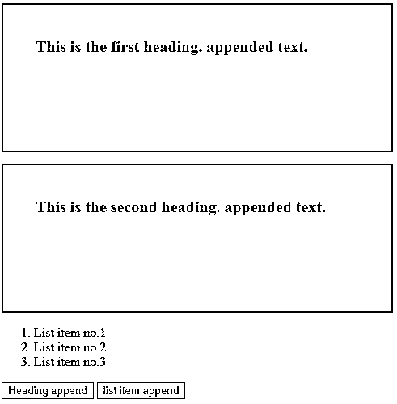


一旦我们单击“列表项追加”按钮，输出是:

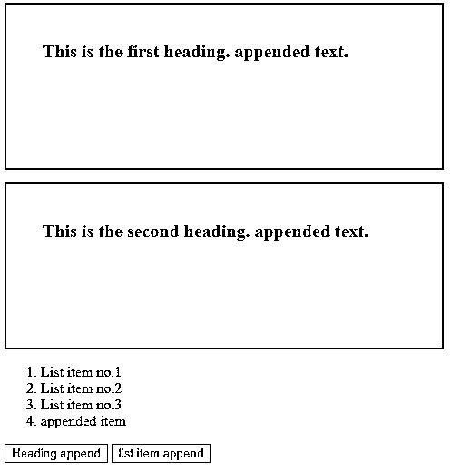


#### 示例 4–带函数参数的方法

下一个示例代码中，该方法接受一个函数，执行该函数以插入追加文本。如下例所示——

**代码:**

```
<!DOCTYPE html>
<html lang= "en" >
<head>
<meta charset= "utf-8" >
<script type = "text/javascript" src="https://ajax.googleapis.com/ajax/libs/jquery/1.11.3/jquery.min.js" >
</script>
<title> This is an example for jQuery append( ) method </title>
<!-- code to show the jQuery append( ) working method -->
<script>
$(document).ready(function() {
$("#btn").click(function() {
$("h1").append(function() {
return "<b> appended text </b> ";
});
});
});
</script>
<style>
h1 {
width : 400px;
height: 100px;
font-weight : bold;
padding : 40px;
font-size : 20px;
border : 2px solid red;
}
</style>
</head>
<body>
<h1> This is the first heading. </h1>
<h1> This is the second heading. </h1>
<!-- Click on this button to see the change -->
<button id="btn"> Heading Append </button>
</body>
</html>
```

**输出:**

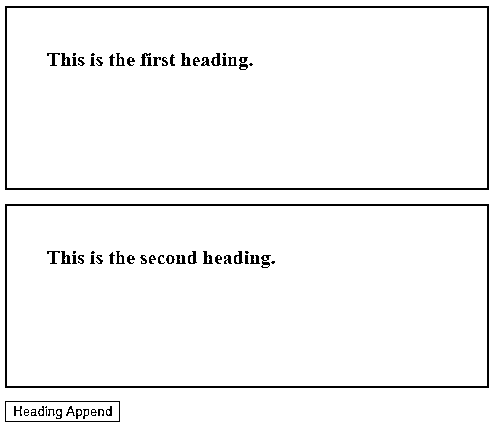


一旦我们单击该按钮，输出是:

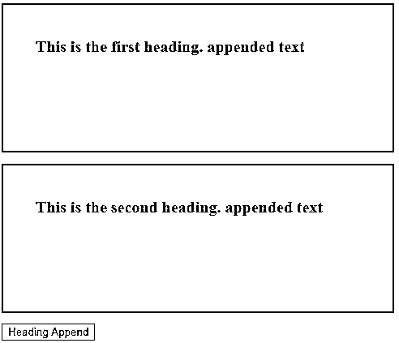


### 结论

append()方法是用于将指定内容追加到所选 HTML 元素的方法之一。jQuery prepend()方法也执行相同的任务，但是它在所选元素的开头插入内容。

### 推荐文章

这是 jQuery append()的指南。在这里，我们将讨论实现 jQuery append()的简介、参数和示例，以及它们的正确代码和输出。您也可以浏览我们的其他相关文章，了解更多信息——

1.  [jQuery Keypress()](https://www.educba.com/jquery-keypress/)
2.  [jQuery prop( )](https://www.educba.com/jquery-prop/)
3.  [jQuery toggleClass()](https://www.educba.com/jquery-toggleclass/)
4.  [jQuery UI 对话框](https://www.educba.com/jquery-ui-dialog/)


