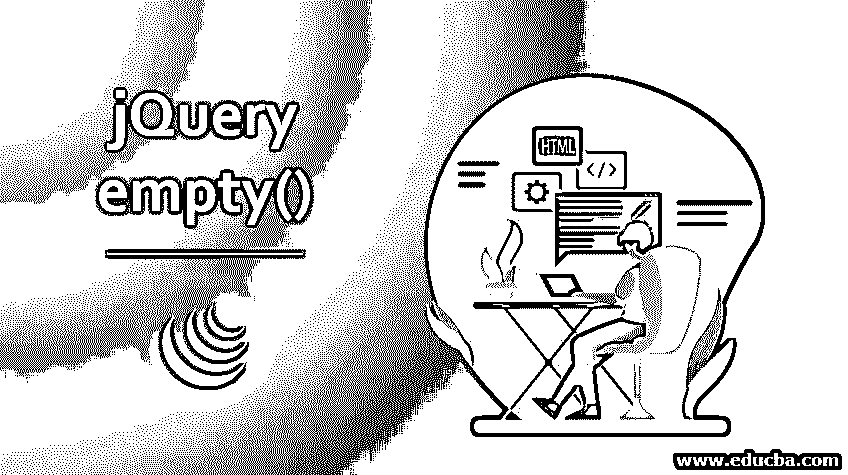
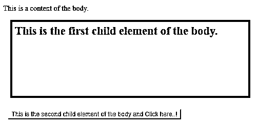
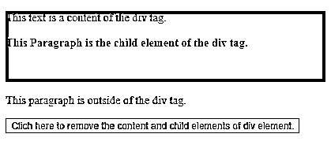
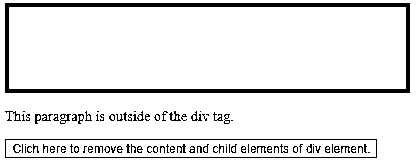
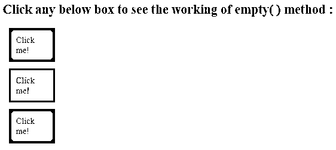
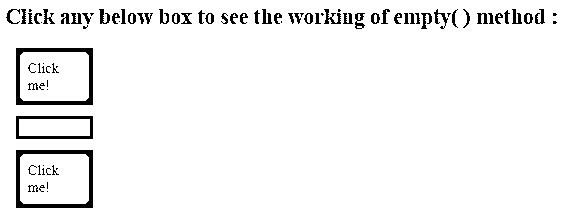

# jQuery empty()

> 原文：<https://www.educba.com/jquery-empty/>




## jQuery empty()简介

jQuery empty()方法用于从选定的 html 元素中移除所有内容和子元素。它是 jQuery 的内置方法。该方法并不删除元素本身，只是删除所选元素的内容以及该元素的所有子元素。jQuery detach()方法也可用于执行相同的任务，但是该方法仅移除子元素，而不移除其事件和数据，jQuery remove()方法也可用于执行相同的任务，并且该方法移除子元素及其事件和数据。

**语法**

<small>网页开发、编程语言、软件测试&其他</small>

jQuery empty()方法的语法

```
$(selector).empty( )
```

此方法用于移除选定 html 元素的内容和所有子元素。此方法不接受任何参数。

### jQuery empty()的示例

下面是下面提到的例子

#### 示例#1

在单个选定的 html 元素上运行的 jQuery empty()方法示例–

接下来，我们编写 html 代码，通过下面的例子更清楚地理解这个方法，empty()方法用于在单击按钮元素时删除 div 元素的内容和元素

**代码:**

```
<!DOCTYPE html>
<html lang= "en" >
<head>
<meta charset= "utf-8" >
<script type = "text/javascript" src="https://ajax.googleapis.com/ajax/libs/jquery/1.11.3/jquery.min.js" >
</script>
<title> This is an example for empty ( ) method </title>
<!-- code to show the jQuery empty ( ) working method -->
<script>
$(document).ready(function() {
$( "button").click(function() {
$( "body" ).empty();
});
});
</script>
<style>
p {
width: 500px;
height: 150px;
margin: 15px;
padding: 10px;
background-color: red;
font-weight: bold;
font-size: 25px;
}
button {
background-color: yellow;
margin: 10px;
}
</style>
</head>
<body>
This is a content of the body.
<p> This is the first child element of the body. </p>
<!-- click on this button to execute empty( ) method -->
<button> This is the second child element of the body and Click here..! </button>
</body>
</html>
```

**输出:**




一旦我们点击了这个按钮，就没有输出了，所有的东西都从页面上移走了，因为所有的内容和< body >的子元素都被删除了。

#### 实施例 2

在单个选定的 html 元素上运行的 jQuery empty()方法示例–

接下来，我们编写 html 代码，通过下面的例子更清楚地理解这个方法，empty()方法用于在单击按钮元素时删除 div 元素的内容和元素

**代码:**

```
<!DOCTYPE html>
<html lang= "en" >
<head>
<meta charset= "utf-8" >
<script type = "text/javascript" src="https://ajax.googleapis.com/ajax/libs/jquery/1.11.3/jquery.min.js" >
</script>
<title> This is an example for empty ( ) method </title>
<!-- code to show the jQuery empty ( ) working method -->
<script>
$(document).ready(function(){
$( "#btn" ).click(function(){
$( "div" ).empty();
});
});
</script>
</head>
<body>
<div style="height : 100px; background-color : red" >
This text is a content of the div tag. <br/>
<p> <b>This Paragraph is the child element of the div tag. </b> </p>
</div>
<p>This paragraph is outside of the div tag. </p>
<button id= "btn" > Clich here to remove the content and child elements of div element.
</button>
</body>
</html>
```

**输出:**




一旦我们点击按钮，输出是




在上面的代码中，empty()方法使用的是所选元素，即集合中的< div > html 元素，因此，一旦我们单击按钮，empty()就会执行，并删除内容及其子元素< p > html 元素，正如我们在代码输出中看到的那样。

#### 实施例 3

在多个 html 元素上运行的 jQuery empty()方法示例

下一个示例代码中，jQuery empty()方法运行并删除多个< div > html 元素的内容，如下面的代码所示

**代码:**

```
<!DOCTYPE html>
<html lang= "en" >
<head>
<meta charset= "utf-8" >
<script type = "text/javascript" src="https://ajax.googleapis.com/ajax/libs/jquery/1.11.3/jquery.min.js" >
</script>
<title> This is an example for empty ( ) method </title>
<!-- code to show the jQuery empty ( ) working method -->
<script type= "text/javascript" language= "javascript">
$(document).ready(function() {
$("div").click(function () {
$(this).empty();
});
});
</script>
<style>
.div{ margin : 12px; padding : 10px; border : 3px solid #666; width:60px;}
</style>
</head>
<body>
<h2> Click any below box to see the working of empty( ) method : </h2>
<!-- click to execute the jQuery empty ( ) method -->
<div class= "div" style="background-color: red; "> Click me! </div>
<div class="div" style="background-color: yellow;"> Click me! </div>
<div class="div" style="background-color: green;"> Click me! </div>
</body>
</html>
```

**输出:**




一旦我们单击任何一个框，输出就是




在上面的代码中，empty()方法在多次出现的选定的

html 元素上使用，所以一旦我们单击任何一个框，empty()方法就会被执行，并删除被单击的框的内容，正如我们在代码输出中看到的。

### 结论

empty()方法是 jQuery 的一个内置方法，用于从选定的 html 元素中删除所有内容和子元素，正如我们在一个示例中看到的那样。此方法不接受任何参数。jQuery detach()和 jQuery remove()方法可以用来执行相同的任务，但有一些不同。

### 推荐文章

这是 jQuery empty()的指南。我们将讨论 jQuery empty()的例子，它用于从选定的 html 元素中删除所有内容和子元素。你也可以看看下面这篇文章。

1.  [jQuery fadeIn()](https://www.educba.com/jquery-fadein/)
2.  [jQuery wrapInner()](https://www.educba.com/jquery-wrapinner/)
3.  [jQuery show( )](https://www.educba.com/jquery-show/)
4.  [jQuery 中的动画](https://www.educba.com/animate-in-jquery/)


