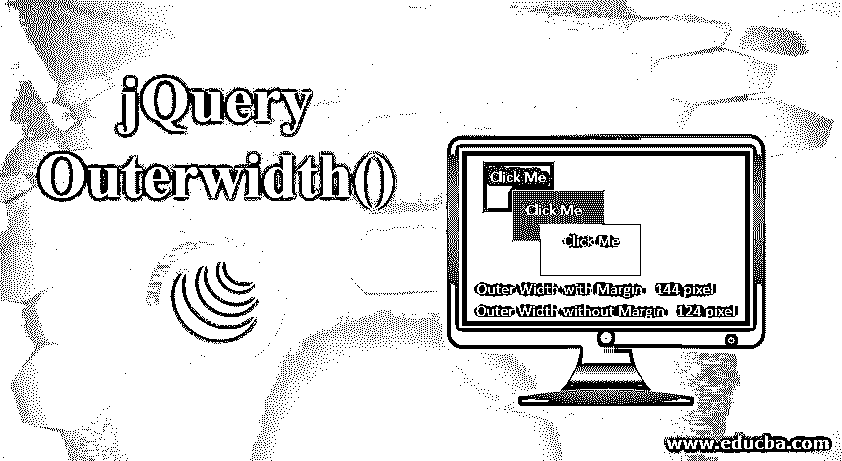
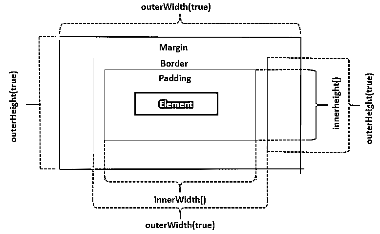
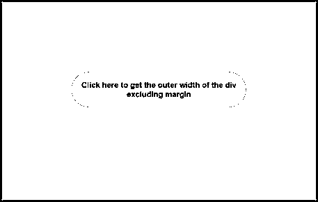
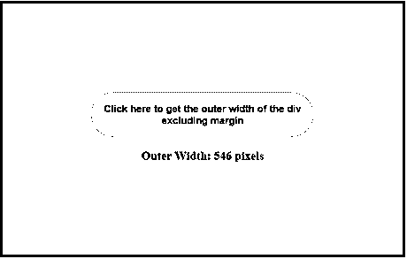
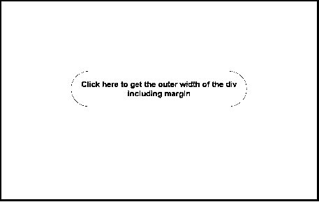
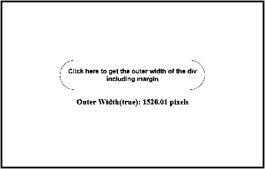
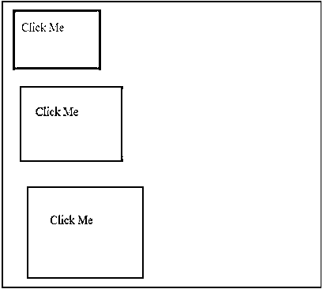
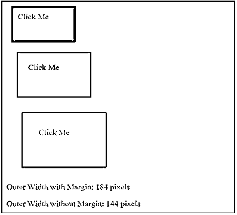

# jQuery Outerwidth()

> 原文：<https://www.educba.com/jquery-outerwidth/>




## jQuery Outerwidth()简介

这篇 jQuery 文章谈到了 jQuery 库提供的一个 dimensions 方法，outerWidth()方法。jQuery 提供了各种 dimensions 方法，如 height()、width()、innerHeight()、innerWidth()、outerHeight()和 outerWidth()来操作 DOM 元素的 CSS 维度。在这里，我们将学习如何使用 outerWidth()方法来获取或设置 DOM 元素的维度。jQuery outerWidth()方法用于获取第一个匹配元素的外部宽度(填充+边框+可选的边距)。

此方法返回匹配元素的宽度，包括左右填充、边框和边距(可选)，以像素为单位。为了在计算中包含边距，使用了 outerWidth(true)。outerWidth()对隐藏和可见元素都有效。它不适用于文档或窗口这样的对象使用 width()方法。如果该方法应用于一组空元素，则返回 undefined。

<small>网页开发、编程语言、软件测试&其他</small>

### jQuery Outerwidth()的方法

下面提到一些相关的方法:

1.  **height()** :这个方法获取或者设置一个元素的高度。
2.  **width()** :这个方法获取或者设置一个元素的宽度。
3.  **innerHeight()** :该方法返回一个元素的高度，它包括填充，但不包括边框或边距。
4.  **innerWidth()** :该方法返回一个元素的宽度，包括填充，但不包括边框或边距。
5.  **outerHeight()** :该方法返回包含边框和填充的元素的高度。




图示了 DOM 元素的不同维度。

**语法:**

```
$(selector).outerWidth(includeMargin)
```

**其中，**

1.选择器是选中的 HTML 元素。

2.includeMargin 是可选参数。

它是一个布尔值，指定是否要包含边距

*   如果值为真，则意味着边距为
*   如果 value 为 false，则意味着不包括边距，默认值为 false

### jQuery outerWidth()方法的实现

现在让我们通过一些例子来更好地理解 jQuery outerWidth()方法。

#### 示例#1

下面是一个简单的例子，展示了 outerWidth()方法是如何工作的。在本例中，outerWidth()方法用于返回所选

元素的外部宽度。在这种情况下，outerWidth 的值包括填充和边框，但不包括边距。

**代码:**

```
<!DOCTYPE html>
<html>
<head>
<script src="https://code.jquery.com/jquery-1.12.4.min.js"></script>
<style> div {
width: 300px; height: 100px; padding: 120px; font-size: medium; text-align: center; margin: auto;
font-weight: bold; border: 3px solid teal; margin-top: 50px; margin-bottom: 10px;
}
button {
background: lightblue; color: maroon;
border-radius: 30px; padding: 15px;
font-weight: bold; border: none; margin: auto; cursor: pointer;
}
</style>
<script>
$(document).ready(function() {
$("#btn").click(function() {
var divWidth = $("div").outerWidth();
$("#result").html("Outer Width: " + divWidth + " pixels");
});
});
</script>
</head>
<body>
<div>
<button id="btn">
Click here to get the outer width of the div
</button>
<p id="result"></p>
</div>
</body>
</html>
```

**输出**

*   下面的屏幕截图是最初在浏览器中加载页面时捕获的。
*   到目前为止没有执行任何活动**。**




*   单击按钮后，outerWidth()方法返回所选的计算宽度。

*   对于给定的 **<** div **>，**宽度为 300 像素，左右填充之和为 240 像素，左右边框之和为 6 像素。 **<** div **>** 的外宽计算如下:

```
Outer Width = 300 + 240 + 6 pixels = 546 pixels
```

*   这一计算不包括差额




#### 实施例 2

现在让我们看一个例子，outerWidth()方法返回所选元素的计算外部宽度，其中也包括边距。

**代码:**

```
<!DOCTYPE html>
<html>
<head>
<script src="https://code.jquery.com/jquery-1.12.4.min.js"></script>
<style> div {
width: 300px; height: 100px; padding: 120px; font-size: medium; text-align: center; margin: auto;
font-weight: bold; border: 3px solid teal; margin-top: 50px; margin-bottom: 10px;
}
button {
background: lightblue; color: maroon;
border-radius: 30px;
padding: 15px;
font-weight: bold; border: none; margin: auto; cursor: pointer;
}
</style>
<script>
$(document).ready(function() {
$("#btn").click(function() {
var divWidth = $("div").outerWidth(true);
$("#result").html("Outer Width(true): " + divWidth + " pixels");
});
});
</script>
</head>
<body>
<div>
<button id="btn">
Click here to get the outer width of the div imcluding margin
</button>
<p id="result"></p>
</div>
</body>
</html>
```

**输出**

*   下面是页面最初加载到浏览器时的截图。
*   到目前为止没有执行任何活动。




*   单击按钮后，outerWidth()方法返回所选的计算宽度。

*   这种计算也包括填充、边框和边距。




#### 实施例 3

下面的示例使用 outerWidth()和 outerWidth(true)方法获取选定 div 的外部宽度，包括和不包括边距。

**代码:**

```
<!DOCTYPE html>
<html>
<head>
<script src="https://code.jquery.com/jquery-1.12.4.min.js"></script>
<style> #div1 {
width: 100px; height: 50px; margin:10px; padding:10px; cursor: pointer;
border:2px solid black; background-color:teal;
}
#div2 {
width: 100px; height: 50px; margin:20px; padding:20px; cursor: pointer;
border:2px solid black; background-color:cornflowerblue;
}
#div3 {
width: 100px; height: 50px; margin:30px; padding:30px; cursor: pointer;
border:2px solid black; background-color:lightcoral;
}
</style>
<script>
$(document).ready(function() {
$("div").click(function() {
var color= $(this).css("background-color");
var divWidthtrue = $(this).outerWidth(true);
var divWidth = $(this).outerWidth();
$("#p1").html("Outer Width with Margin: " + divWidthtrue + " pixels");
$("#p2").html("Outer Width without Margin: " + divWidth + " pixels");
$("#p1").css({'color': color});
$("#p2").css({'color': color});
});
});
</script>
</head>
<body>
<div id="div1">Click Me</div>
<div id="div2">Click Me</div>
<div id="div3">Click Me</div>
<p id="p1"></p>
<p id="p2"></p>
</div>
</body>
</html>
```

**输出**

*   运行上述代码后，输出如下面的屏幕截图所示。
*   有三种不同的分区，即 div1、div2 和 div3，它们具有不同的颜色和尺寸。
*   每次单击一个 div 时，都会显示该 div 的外部宽度，包括边距和不包括边距。







### 结论

*   这篇 jQuery 文章演示了 jQuery outerWidth()的工作和使用
*   此方法用于获取所选元素的当前计算外部宽度。
*   外部宽度是填充、边框和可选边距的总和。
*   在隐藏元素的情况下，outerWidth()方法返回的值可能不总是准确的。
*   为了确保值的准确性，元素应该是可见的。

### 推荐文章

这是 jQuery Outerwidth()的指南。这里我们讨论基本概念，如何使用 outerWidth()方法来获取或设置 DOM 元素的维度。你也可以看看下面这篇文章

1.  [jQuery detach()](https://www.educba.com/jquery-detach/)
2.  [jQuery wrapInner()](https://www.educba.com/jquery-wrapinner/)
3.  [jQuery outerHeight()](https://www.educba.com/jquery-outerheight/)
4.  [JQuery 进度条](https://www.educba.com/jquery-progress-bar/)


