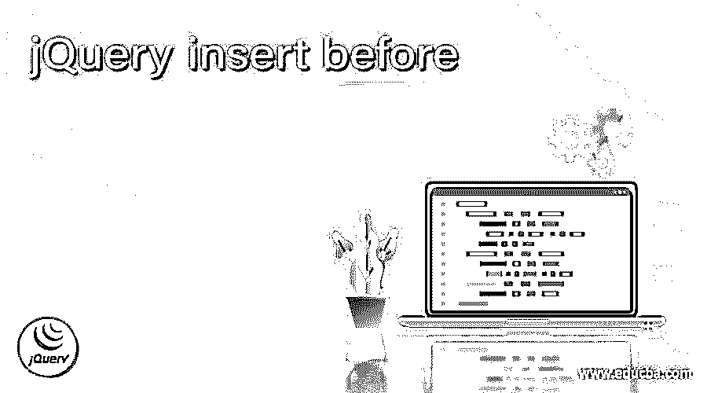
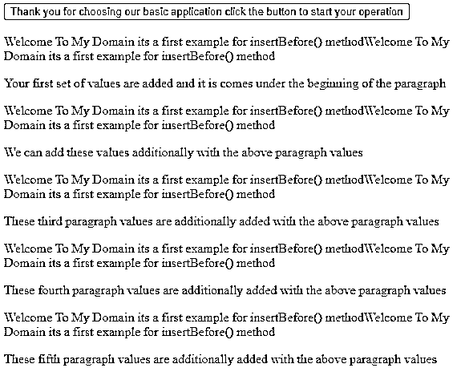
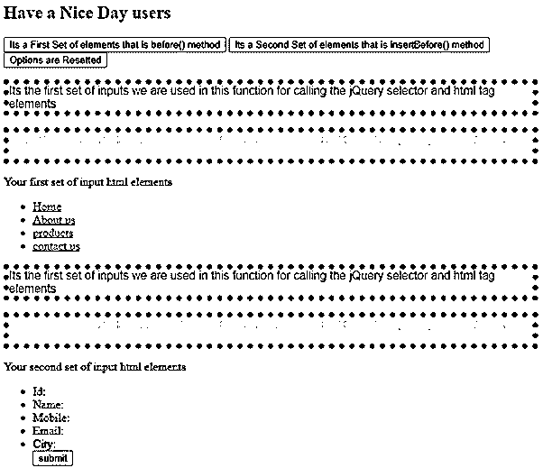
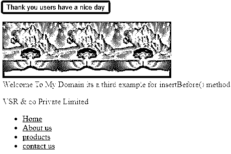

# jQuery 插入之前

> 原文：<https://www.educba.com/jquery-insert-before/>




## jQuery 简介插入之前

jQuery insertBefore()是一种预定义的内置方法，使用指定元素的 Before 来插入 html 内容，并且内容将在特定元素每次出现之前插入。它主要接受 target 或 destination 参数，即 html 内容要插入到哪个目标之前。before()和 insertBefore()这两个方法在 jQuery 库上执行相同的操作。语法互不相同，选择器表达式和在目标容器之前使用的插入元素也互不相同。

**语法:**

<small>网页开发、编程语言、软件测试&其他</small>

在 jQuery 库中，默认的方法起着主要的作用，以实现更复杂的用户界面。html 库元素在 jQuery 选择器中被传递和使用，作为在目标或目的元素之前使用的一组匹配元素。

```
<html>
<head>
<script src="https://code.jquery.com/jquery-3.5.0.js">
</script>
</head>
<body>
<div id="example">Elements</div>
<p>Elements</p>
<script>
$("p").insertBefore("#example");
----some jQuery and javascript codes depends upon the requirement---
</script>
</body></html>
```

以上代码是在 jQuery 和 JavaScript 代码上使用 insertBefore()方法的基本语法。html 元素 id 被传递并被称为 jQuery 选择器，这取决于必须由用户端执行的应用程序逻辑和要求。

### jQuery 中函数起作用前如何插入？

函数的作用是:用指定的元素插入一些 html 内容。html 内容会在指定元素上每次出现 before 时插入。该方法不返回任何值，并且接受并调用目标参数，该参数是 html 内容要插入到其之前的目标。基本上，jQuery 构造函数或任何缺省方法都是通过预定义的方法(如 jQuery()、append()等)来接受 html 字符串的。这种情况是由脚本标记或使用 html 属性注入的，这将有助于执行 html 代码。

这些字符串值由一些默认方法使用，这些方法不会使用这些值来插入来自不可信来源或由未知用户(如黑客等)托管的网站的字符串。这些属于易受攻击的跨站点脚本，因此它会在用户向表单文档添加输入内容之前删除。它不支持使用 jQuery 默认方法的 SVG 类型的文档，它明确记录了用户定义的方法，它会导致脚本中一些不需要的和意外的行为。insertBefore()方法插入节点，它将是引用节点的 Before，并且它表示具有脚本的指定父节点的子节点。

### jQuery insert before 示例

下面举几个例子

#### 示例#1

**代码:**

```
<!DOCTYPE html>
<html>
<head>
<script src="https://ajax.googleapis.com/ajax/libs/jquery/3.5.1/jquery.min.js"></script>
<script>
$(document).ready(function(){
$("button").click(function(){
$("Welcome To My Domain its a first example for insertBefore() method").insertBefore("p");
});
});
</script>
</head>
<body>
<button>Thank you for choosing our basic application click the button to start your operation</button>
<br><br>
<p> Your first set of values are added and it is comes under the beginning of the paragraph</p>
<p> We can add these values additionally with the above paragraph values</p>
<p> These third paragraph values are additionally added with the above paragraph values</p>
<p> These fourth paragraph values are additionally added with the above paragraph values</p>
<p> These fifth paragraph values are additionally added with the above paragraph values</p>
</body>
</html>
```

**输出:**




在上面的例子中，我们在 html 网页中使用了 insertBefore()方法。我们使用 html 标记元素进行调用，并在应用程序中执行操作。它一直持续到方法标签元素在标签元素上结束。

#### 实施例 2

**代码:**

```
<!doctype>
<html>
<head>
<title>Welcome To My Domain its a second example for insertBefore() method  </title>
<script src="http://code.jquery.com/jquery-2.2.3.min.js"></script>
</head>
<h2>Have a Nice Day users</h2>
<style>
.first{
border:7px dotted blue;
color:blue;
font-family: arial;
}
.second{
border:7px dotted blue;
color:violet;
font-family: arial;
}
</style>
<script type="text/javascript">
$(document).ready(function(){
$("#demo").click(function(){
$("div").before("<p class='first'>Its the first set of inputs we are used in this function for calling the jQuery selector and html tag elements </p>");
});
$("#demo1").click(function(){
$("<p class='second'>Its the second set of input values we are used in this function for calling the jQuery selector and html tag elements</p>").insertBefore("div");
});
$("#demo2").click(function(){
location.reload();
});
});
</script>
<body bgcolor="pink">
<button id="demo">Its a First Set of elements that is before() method</button>
<button id="demo1">Its a Second Set of elements that is insertBefore() method</button>
<button id="demo2">Options are Resetted</button>
<div>
Your first set of input html elements
<ul>
<li><a href="home"> Home </a></li>
<li><a href="aboutus"> About us </a> </li>
<li><a href="products"> products </a></li>
<li><a href="contactus"> contact us </a></li>
</ul>
</div>
<div>
Your second set of input html elements
<ul>
<li> Id: </li>
<li>Name: </li>
<li> Mobile:</li>
<li> Email:</li>
<li> City:</li>
<input type="button" value="submit" name="submit"/>
</ul>
</div>
</body>
</html>
```

**输出:**




在第二个例子中，我们使用了 before()。insertBefore()，选项在脚本中重置()特性。还有像

、

<button>这样的 html 标签元素在网页屏幕上插入 html 内容。</button>

#### 实施例 3

**代码:**

```
<!DOCTYPE html>
<html>
<head>
<script src="https://ajax.googleapis.com/ajax/libs/jquery/3.5.1/jquery.min.js"></script>
<script>
$(document).ready(function(){
$("button").click(function(){
$("").insertBefore("div");
});
});
</script>
</head>
<body bgcolor='red'>
<button>Thank you users have a nice day</button>
<br><br>
<div>
Welcome To My Domain its a third example for insertBefore() method
<p>VSR & co Private Limited</p>
<ul>
<li><a href="home"> Home </a></li>
<li><a href="aboutus"> About us </a> </li>
<li><a href="products"> products </a></li>
<li><a href="contactus"> contact us </a></li>
</ul>
</div>
</body>
</html>
```

**输出:**




在最后一个例子中，我们使用了用于网页的 html 标记元素的 image 属性。如果我们单击按钮，图像将被插入到

标签元素之前。我们使用选项卡导航创建了一些 html 

### 结论

在 jQuery 库中结合 html 标签元素来执行 UI 框架中的用户操作。例如，insertBefore()是在标签元素作为脚本中的参数被提及和调用之前，在网页上执行 html 内容的默认方法。

### 推荐文章

这是一个 jQuery 插入指南。在这里，我们将讨论如何在 jQuery 中使用 insert before 函数，并给出示例和输出。您也可以看看以下文章，了解更多信息–

1.  [jQuery 可见性](https://www.educba.com/jquery-visibility/)
2.  [jQuery 延期](https://www.educba.com/jquery-deferred/)
3.  [jQuery 移动元素](https://www.educba.com/jquery-move-element/)
4.  [jQuery 偏移底部](https://www.educba.com/jquery-offset-bottom/)


