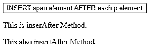
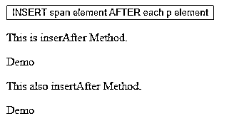
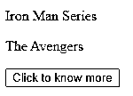
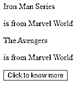
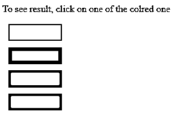
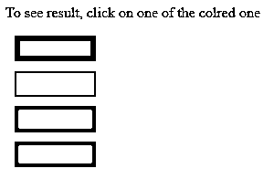
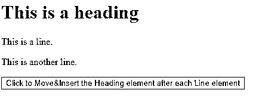
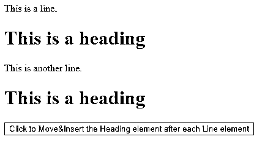

# jQuery insertAfter()

> 原文：<https://www.educba.com/jquery-insertafter/>


## jQuery insertAfter()简介

insertAfter()方法是 JQuery 提供的内置函数之一，用于在指定的元素或元素集之后插入一些内容。insertAfter()方法将文本或 HTML 内容与匹配的元素相加。另一个名为 after()的 JQuery 方法以相同的方式工作，但是在目标元素和匹配元素的优先级和位置上有所不同，也就是说，它们在语法上有所不同。的。after()方法将内容放在目标方法或容器之后。而在。insertAfter()方法中，内容位于方法之前，作为选择器表达式或创建的标记，内容位于目标元素或容器之后。

### 如何使用 jQuery insertAfter()方法？

insertAfter()方法是 JQuery 中的内置函数，也很容易使用。下面是使用 insertAfter()方法的简单语法。

<small>网页开发、编程语言、软件测试&其他</small>

```
$("HTML Content to be inserted").insertAfter("Target Element / Selector to be inserted after");
```

insertAfter 方法接受一个参数。但是还有一个元素是 insertAfter 方法的重要部分。他们是内容和选择者。

**参数:**

*   **内容:**insertAfter 方法的重要部分之一。这里的“内容”是指定插入内容的 HTML 内容。
*   **选择器:**“选择器”是一个参数，它告诉我们哪个元素是目标，也就是说，在哪个容器或元素之后添加“内容”。此方法不返回任何值。

### 实现 JQuery insertAfter()的示例

以下是 jQuery InsertAfter()的一些示例:

#### 示例#1

**代码:**

```
<!DOCTYPE html>
<html>
<head>
<script src="https://ajax.googleapis.com/ajax/libs/jquery/3.4.1/jquery.min.js"></script>
<script>
$(document).ready(function(){
$("button").click(function(){
$("Demo").insertAfter("p");
});
});
</script>
</head>
<body>
<button>INSERT span element AFTER each p element</button>
<p>This is inserAfter Method.</p>
<p>This also insertAfter Method.</p>
</body>
</html>
```

**输出:**

当执行上面的代码时，下面是我们得到的输出。




你应该注意到从上面的代码中可以学到的以下几点。




**代码解释:**如上图，注意$(文档)的用法。就绪功能，确保启动事件。它开始运行的那一刻，文档对象模型看起来已经为 JavaScript 代码准备好了[。$(“按钮”)。上面代码中使用的 click (function())定义了单击按钮时要遵循的代码行或指令。接下来是我们感兴趣的问题，insertAfter 函数。注意，HTML 内容(这里是“span”元素，“Demo”)被添加或插入到指定的内容或目标(这里是元素“p”)之后。HTML 元素将被添加到目标或指定元素的每个实例之后。](https://www.educba.com/what-is-javascript/)

#### 实施例 2

**代码:**

```
<!doctype html>
<html>
<head>
<title>insertAfter Method Demo</title>
<script
src="https://ajax.googleapis.com/ajax/libs/jquery/3.3.1/jquery.min.js"> </script>
<script>
$(document).ready(function() {
$("input").click(function() {
// insertAfter
$("<p>is from Marvel World</p>").insertAfter("p");
});
});
</script>
</head>
<body>
<p>Iron Man Series </p>
<p> The Avengers </p>
<input type="button" value="Click to know more"/>
</body>
</html>
```

当执行上面的代码时，我们得到下面的输出。

**输出:**




点击按钮后，我们将得到以下输出。




**Note:** as we mentioned above, the HTML CONTENT is added after ALL the instances of the TARGET element, that are appearing in the program or the code.

#### 实施例 3

考虑另一个显示该方法用法的简单示例。

**代码:**

```
<!doctype html>
<html>
<head>
<meta charset="utf-8">
<title>insertAfter Method Demo</title>
<script type = "text/javascript"
src = "https://ajax.googleapis.com/ajax/libs/jquery/2.1.3/jquery.min.js">
</script>
<style>
.source{ margin:10.2px;
padding:12.2px;
width:60px;
border:2px solid #666;
}
.blue{ margin:10.2px;
padding:12.2px;
width:60px;
background-color:blue;
border:2px solid #666
}
.green{ margin:10.2px;
padding:12.2px;
width:60px;
background-color:green;
border:2px solid #666;
}
.red{ margin:10.2px;
padding:12.2px;
width:60px;
background-color:red;
border:2px solid #666;
}
</style>
<script language = "javascript" type = "text/javascript" >
$(document).ready(function() {
$("p").click(function () {
//selecting the HTML content, here, id = source.
$("#source").insertAfter(this);
//and inserting after target element, here any element the user click.
});
});
</script>
</head>
<body>
<p>To see result, click on one of the colred one</p>
<p class = "source" id = "source"></p>
<p class = "blue"></p>
<p class = "green"></p>
<p class = "red"></p>
</body>
</html>
```

当我们执行上述代码时，会显示以下输出。

**输出:**




当单击任何一个彩色框时，ready 函数执行代码行，在用户单击的彩色框后插入空框。




#### 实施例 4

insertAfter 方法还可用于在页面上的另一个元素或目标之后添加或插入现有元素。观察下面的例子可以了解更多。

**代码:**

```
<!doctype html>
<html>
<head>
<meta charset="utf-8">
<title>insertAfter Method Demo</title>
<script src="https://ajax.googleapis.com/ajax/libs/jquery/3.4.1/jquery.min.js"></script>
<script>
$(document).ready(function(){
$("button").click(function(){
$("h1").insertAfter("p");
});
});
</script>
</head>
<body>
<h1>This is a heading</h1>
<p>This is a line.</p>
<p>This is another line.</p>
<button>Click to Move&Insert the Heading element after each Line element</button>
</body>
</html>
```

**输出:**




点击按钮后，我们将得到以下输出。




当像这样使用 insertAfter 方法时，[要添加的 HTML 内容](https://www.educba.com/what-is-html/)是 HTML 页面的现有内容，那么它不是简单地在目标之后插入。如果像我们在上面的代码中所做的那样选择了一个元素，那么该元素将被移动而不是被克隆，并且代码返回一个由新插入的元素组成的新集合。

还要知道，如果目标有多个位置或实例，在此之后我们选择的(现有的)HTML 内容将被添加，HTML 内容的克隆实例将被创建并插入到每个目标元素之后，然后代码返回第一个集合加上新的克隆集合。

### 结论

insertAfter()方法是 JQuery 提供的内置但简单的方法之一，可以帮助插入 HTML 元素，无论是新创建的还是从页面上的现有元素中选择的。还有一个名为 insertBefore()的函数，顾名思义，您应该已经猜到了，您可以使用它在所选元素之前插入 HTML 元素。它的工作方式与 insertAfter()方法相同。

### 推荐文章

这是 JQuery InsertAfter()的指南。在这里，我们讨论如何使用 jQuery insertAfter()方法以及示例和代码实现。您也可以浏览我们推荐的文章，了解更多信息——

1.  [jQuery wrap( )](https://www.educba.com/jquery-wrap/)
2.  [jQuery delegate( )](https://www.educba.com/jquery-delegate/)
3.  [jQuery 选择器](https://www.educba.com/jquery-elements/)
4.  [jquery intrawidth()](https://www.educba.com/jquery-innerwidth/)


