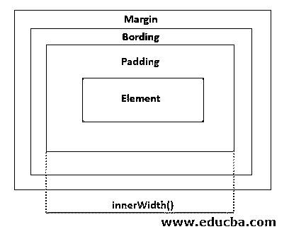
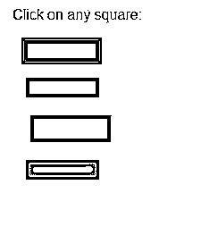
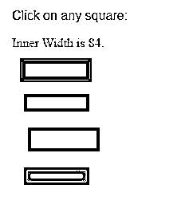
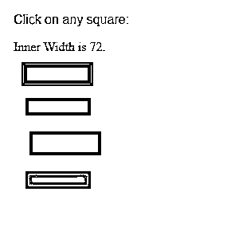
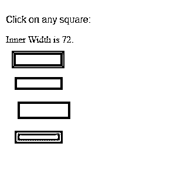
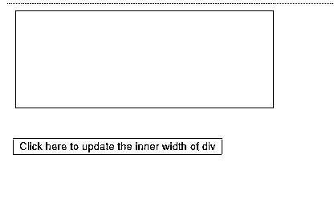
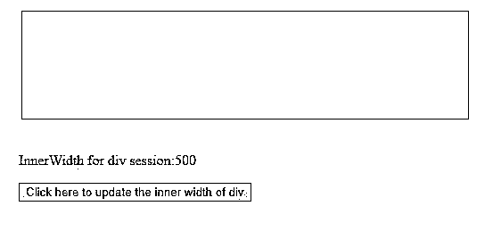
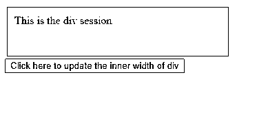
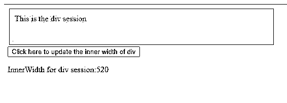

# jQuery innerWidth()

> 原文：<https://www.educba.com/jquery-innerwidth/>


## jQuery innerWidth()简介

jQuery innerWidth()是一个内置的 jQuery 方法。它给出第一个匹配元素的当前计算的内部宽度，并设置每个匹配元素的宽度。这种方法受到浏览器的支持——谷歌 Chrome、Internet Explorer、Firefox、Opera、Safari。

innerWidth()方法包括填充值，但不包括边距和边框值，如下图所示。

<small>网页开发、编程语言、软件测试&其他</small>




### jQuery innerWidth()的语法

| **语法** | **参数描述** | **值类型** | **版本** |
| $(选择器)。内部宽度() | 钠 | 钠 | One |
| $(选择器)**。**内宽(值) | ****1。**值:**一个数值作为测量值。 | **1。处理程序:**字符串/数字 | 1.8.0 |
| $(选择器)。内部宽度(功能) | **1。函数:**设置匹配元素的宽度，其索引作为输入参数给出。 | **1。功能:**功能 | 1.8.0 |

### jQuery innerWidth()的示例

下面给出了 jQuery innerWidth()的例子:

#### 示例 1:不使用任何参数

可以在不提供任何输入参数的情况下使用 innerWidth()方法。它用于获取第一个匹配元素的宽度度量，包括填充值。这个没有输入参数的方法成为窗口的只读属性。

下面的例子演示了 innerWidth 方法在获取 div 元素宽度中的应用。用不同的颜色、填充值、边框粗细和边距值定义了四个 div 元素。编写了一个脚本函数来显示 innerWidth()在单击时对 div 会话的输出。

**代码:**

```
<!DOCTYPE html>
<html>
<head>
<title>The jQuery Example</title>
<script type = "text/javascript"
src = "https://ajax.googleapis.com/ajax/libs/jquery/2.1.3/jquery.min.js">
</script>
<script type = "text/javascript" language = "javascript">
$(document).ready(function() {
//Displaying the inner width result for respective div sessions
$("div").click(function () {
var color = $(this).css("background-color");
var width = $(this).innerWidth();
$("#result").html("Inner Width is " + width + ".");
$("#result").css({'color': color, 'background-color':'white'});
});
});
</script>
//Design different div session with different margin, padding and border values
<style>
#div1 { margin:10px;padding:12px; border:3px solid #666; width:60px;}
#div2 { margin:15px;padding:6px; border:5px solid #666; width:60px;}
#div3 { margin:20px;padding:12px; border:3px solid #666; width:60px;}
#div4 { margin:15px;padding:6px; border:5px solid #666; width:60px;}
</style>
</head>
<body style="background-color: beige;">
<p style="font-family: Arial, Helvetica, sans-serif;">Click on any square:</p>
 
<div id = "div1" style = "background-color:blue;"></div>
<div id = "div2" style = "background-color:#8E44AD ;"></div>
<div id = "div3" style = "background-color:#BA4A00 ;"></div>
<div id = "div4" style = "background-color:#186A3B ;"></div>
</body>
</html>
```

**输出:**

在调用 innerWidth()方法之前:




调用 innerWidth()方法后:

**屏幕 1:** 点击蓝框时:




**屏幕 2:** 点击紫色方框时:




**屏幕 3:** 点击棕色方框时:


**屏幕 4:** 点击绿色方框时:




#### 示例 2:使用“值”参数

对于 jQuery innerWidth()，可以给定一个字符串或数字类型的值作为输入参数值。此语法可用于将选定元素的宽度修改为作为输入参数值传递给方法的值。

在下面的代码片段中，innerWidth()事件应用于

会话。div 会话的初始宽度设置为 300 像素。单击按钮元素后，div 元素的宽度变为 500px。

**代码:**

```
<!DOCTYPE html>
<html>
<head>
<script src="https://ajax.googleapis.com/ajax/libs/jquery/3.4.1/jquery.min.js"></script>
<script>
$(document).ready(function(){
$("button").click(function(){
//Innerwidth() is used to set the width to 500px
$("div").innerWidth(500)
$( "p" ).text( "InnerWidth for div session:" + $( "div" ).innerWidth() );
});
});
</script>
</head>
<body style="background-color: beige;">
<div style="height:100px;width:300px;padding:10px;margin:3px;border:1px solid blue;background-color:lightblue;"></div><br>
<p></p>
<button>Click here to update the inner width of div</button>
</body>
</html>/code<>
```

**输出:**

在调用 innerWidth()方法之前:




调用 innerWidth()方法后:




**Note:** For the syntax innerWidth(value), if a number is provided as value, jQuery treats in terms of pixel unit by default unless any specific unit is not mentioned. If a string value is provided, any CSS measurement can be used for the width value.

#### 示例#3:带有“函数”参数的 innerWidth()

在此语法中，innerWidth()方法接受 function 作为输入参数。innerWidth()方法的语法接受任何有或没有输入参数的函数。

在下面的代码片段中，函数 myfunc()将 div 会话的当前宽度加上 100px，并将结果值返回给 innerWidth()方法。myfunc()方法的结果值作为 innerWidth()方法的值输入。在按钮上单击，div 会话的宽度将更改为从 myfunc()函数中获得的值。

**代码:**

```
<!DOCTYPE html>
<html>
<body>
<div id="idDiv" style="height:50px;width:300px;padding:10px;margin:3px;border:1px solid blue;background-color:lightblue;">This is the div session</div>
<script src="https://cdnjs.cloudflare.com/ajax/libs/jquery/3.3.1/jquery.min.js"></script>
<script>
//The width of the div element is decided by the function output of myfunc() and //given as input argument to innerWidth()
$(document).ready(function(){
$("button").click(function(){
$("div").innerWidth(myfunc());
$( "p" ).text( "InnerWidth for div session:" + $( "div" ).innerWidth());
});
});
function myfunc()
{
return 100+$( "div" ).innerWidth()
}
</script>
<body style="background-color: beige;">
<button>Click here to update the inner width of div</button>
<p></p>
</html>
```

**输出:**

在调用 innerWidth()方法之前:




调用 innerWidth()方法后:

**屏幕 1:** myfunc 方法被调用一次。


**屏幕 2:** myfunc 方法被调用两次。




**Note:** The resultant width of the element is changed from 300px->400px->500px. The 20px is the total padding value from both sides of the div session.

### 附加说明

1.  此方法以像素为单位返回内部宽度的值。
2.  在元素集合为空的情况下，该方法给出的结果为“未定义”。
3.  此方法不支持。文档或窗口对象。对于这样一个物体。使用 width()方法。
4.  结果值也可以是分数。如果代码对结果取整，它可能会在缩放条件下给出不正确的站点尺寸，因为浏览器可能不包含任何检测这种条件的 API。
5.  如果匹配的元素或其父元素处于隐藏状态，innerWidth()可能不会给出准确的结果。为了避免这样的错误结果，需要[确保元素](https://www.educba.com/css-visibility/)的可见状态为真，然后在方法执行完成后恢复到隐藏状态。尽管这种方法的准确性很好，但它的可靠性仍然是个问题。
6.  InnerWidth()、OuterWidth()和 Width()彼此相似。它们在包含或填充、边距和边框值方面互不相同。InnerWidth()仅包括填充值，而 OuterWidth()同时包括填充值和边框值。Width()不仅仅考虑元素宽度。

### 推荐文章

这是 jQuery innerWidth()的指南。这里我们讨论 jQuery innerWidth()的简介、语法和示例。您也可以看看以下文章，了解更多信息–

1.  [jQuery remove()](https://www.educba.com/jquery-remove/)
2.  [jQuery wrapInner()](https://www.educba.com/jquery-wrapinner/)
3.  [jQuery fadeIn()](https://www.educba.com/jquery-fadein/)
4.  [jQuery appendTo()](https://www.educba.com/jquery-appendto/)


