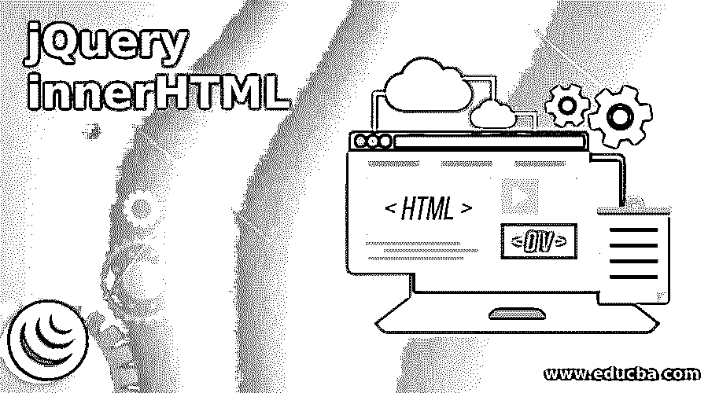
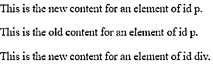
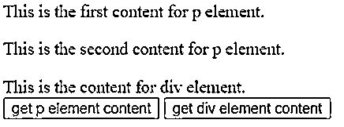
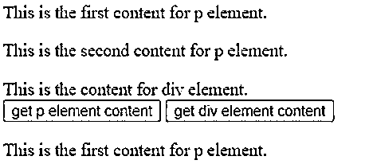
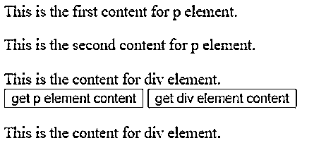
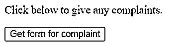
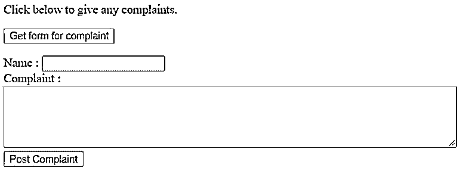

# jquery innerhtml

> 原文：<https://www.educba.com/jquery-innerhtml/>




## jQuery innerHTML 简介

jQuery UI innerHTML 属性用于设置或获取元素的 HTML 内容或内部 HTML。jQuery UI innerHTML 是 jQuery UI 库中的内置属性。jQuery UI innerHTML 属性允许在 HTML 文档上写一个动态 html。它主要用于创建链接、评论表、注册表等。所有的 HTML 元素都有一个 innerHTML 属性。jQuery。html()方法可用于检索匹配元素集合中第一个元素的 HTML 内容。注意，jQuery innerhtml 不作为方法存在，我们使用 HTML()方法来设置或获取 HTML 内容。

**jQuery UI innerHTML 属性的语法:**

<small>网页开发、编程语言、软件测试&其他</small>

根据使用目的，jQuery UI innerHTML 属性有两种语法:

```
HTMLelementObj.innerHTML
```

它用于返回 innerHTML 属性。该属性的返回值是 String，它表示元素的 HTML 内容。

```
HTMLelementObj.innerHTML = text
```

它用于设置 innerHTML 属性。文本表示元素的 HTML 内容。

### jQuery innerHTML 的示例

下面是提到的例子:

#### 示例#1

用于设置 HTML 元素内容的 innerHTML 属性。

**代码:**

```
<!doctype html>
<html lang ="en">
<head>
<meta charset="utf-8">
<title>This is an example for jQuery UI innerHTML property </title>
</head>
<body>
<p id = "p">This is the old content for an element of id p.</p>
<p id = "p">This is the old content for an element of id p.</p>
<div id = "div">This is the old content for an element of id div.</div>
<script>
document.getElementById("p").innerHTML = "This is the new content for an element of id p.";
document.getElementById("div").innerHTML = "This is the new content for an element of id div.";
</script>
</body>
</html>
```

**输出:**




在上面的程序中，p 和 div html 元素是用一些内容定义的，后来这些内容通过 innerHTML 属性使用 html 元素的 id 被设置或替换为其他内容。如果我们在上面的输出中看到，只有第一个 p 元素被新的内容设置，而第二个 p 元素的内容仍然没有改变。所以 innerHTML 设置匹配元素集合的第一个元素的内容。

#### 实施例 2

用于获取 HTML 元素内容的 innerHTML 属性。

**代码:**

```
<!doctype html>
<html lang ="en">
<head>
<meta charset="utf-8">
<title>This is an example for jQuery UI innerHTML property </title>
</head>
<body>
<p id = "p">This is the first content for p element. </p>
<p id = "p">This is the second content for p element. </p>
<div id = "div">This is the content for div element. </div>
<button onclick = "getpcontent()"> get p element content </button>
<button onclick = "getdivcontent()"> get div element content </button>
<p id = "d1"></p>
<script>
function getpcontent() {
var d = document.getElementById("p").innerHTML;
document.getElementById("d1").innerHTML = d;
}
function getdivcontent() {
var d = document.getElementById("div").innerHTML;
document.getElementById("d1").innerHTML = d;
}
</script>
</body>
</html>
```

**输出:**




一旦我们点击按钮"获取 p 元素内容"，输出:




而当我们点击按钮“获取 div 元素内容”时，输出:




在上面的程序中，p 和 div html 元素是用一些内容定义的，这些内容是我们通过使用 html 元素的 id 通过 innerHTML 属性获得的。如果我们在上面的输出中看到，只显示了第一个 p 元素的内容。因此 innerHTML 属性获取匹配元素集的第一个元素的内容。

#### 实施例 3

用于通过单击网页中的按钮来创建 HTML 表单的 innerHTML 属性。

**代码:**

```
<!doctype html>
<html lang = "en">
<head>
<meta charset = "utf-8">
<title>This is an example for jQuery UI innerHTML property </title>
</head>
<body>
<p> Click below to give any complaints. </p>
<form name = "form">
<input type = "button" value = "Get form for complaint" onclick = "showform()" >
<p id = "d1"></p>
</form>
<script>
function showform() {
var d = "Name : <input type = 'text' name = 'name'> <br> Complaint : <br> <textarea rows = '5' cols = '80'> </textarea> <br> <input type = 'submit' value = 'Post Complaint' >";
document.getElementById('d1').innerHTML = d;
}
</script>
</body>
</html>
```

**输出:**




一旦我们点击“获取投诉表格”按钮，表格就会动态创建，如下图所示:




在上面的程序中，通过单击调用函数 showform()的按钮“Get form for complaint ”,在 id 为 d1 的 p 元素内动态创建表单，在此函数内，表单创建并使用 p html 元素的 id 通过 innerHTML 属性将此表单设置为 p 元素的内容。

### 结论

jQuery UI innerHTML 属性是 jQuery UI 库中的内置属性，用于设置或获取元素的 HTML 内容或(内部 HTML)。它允许在 html 文档上写一个动态的 html，比如动态链接，动态评论，动态表单等等。用于 document.getElementById()方法的 jQuery UI innerHTML 属性。

### 推荐文章

这是 jQuery innerHTML 的指南。这里我们讨论 jQuery innerHTML 的介绍以及编程示例。您也可以看看以下文章，了解更多信息–

1.  [jQuery 可见](https://www.educba.com/jquery-is-visible/)
2.  [jQuery 重定向](https://www.educba.com/jquery-redirect/)
3.  [jQuery UI 对话框](https://www.educba.com/jquery-ui-dialog/)
4.  [jQuery hasClass()](https://www.educba.com/jquery-hasclass/)


