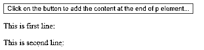
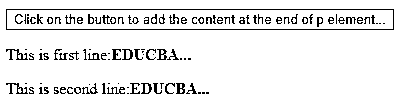
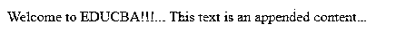
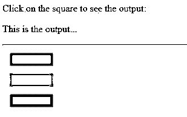
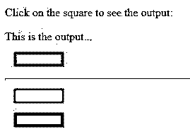
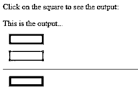
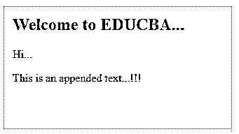
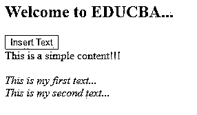
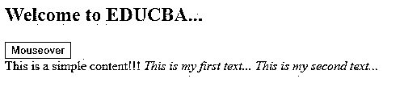

# jQuery appendTo()

> 原文：<https://www.educba.com/jquery-appendto/>


## jQuery appendTo()简介

jQuery appendTo()是一个嵌入式函数，用于在所选文档的末尾插入 HTML 代码。append()方法向中的每个匹配元素添加信息。内容伴随着流程，要么作为选择器的表达式，要么作为动态形成的标记，并被放入容器中。换句话说，appendTo()方法将选择器作为内容追加的目标。这个方法[与 append()方法](https://www.educba.com/jquery-append/)的工作原理相同，但是语法是唯一的。这可能看起来无关紧要，但是当你使用链接时，事情会变得更容易。

这种方法与。prependTo()方法，该方法在所选元素的开头添加 HTML 元素。这种方法可用于动态添加您选择的内容，这可以通过单击按钮或事件的任何其他侦听器来执行，因为在许多情况下，当我们打开选项卡时，我们不想让用户负担大量信息，或者是出于功能原因。

<small>网页开发、编程语言、软件测试&其他</small>

****语法:****

```
$(content).appendTo(selector)
```

**参数:**

语法包括两个参数:

*   ******内容:**** 必要参数，指定在 HTML 页面中插入哪些内容。**
***   ******选择器:**** 这也是一个必需的参数，它规定了哪些元素将被添加到内容中。它指示可以在哪些元素上附加内容。****

 ****### 实现 jQuery appendTo()的示例

下面是实现 jQuery appendTo()的不同示例。

#### 示例#1

**代码:**

```
<!DOCTYPE html>
<html>
<head>
<meta charset="utf-8">
<title>appendTo Example</title>
<script src="https://ajax.googleapis.com/ajax/libs/jquery/1.11.3/jquery.min.js"></script>
<script>
$(document).ready(function(){
$("button").click(function(){
$("<b>EDUCBA...</b>").appendTo("p");
});
});
</script>
</head>
<body>
<button>Click on the button to add the content at the end of p element...</button>
<p>This is first line:</p>
<p>This is second line:</p>
</body>
</html>
```

****输出:****




点击按钮后，输出如下所示




如图所示，每次单击按钮时，内容都会添加到元素的末尾。

#### 实施例 2

**代码:**

```
<!doctype html>
<html lang="en">
<head>
<meta charset="utf-8">
<title>appendTo demo</title>
<style>
#apppend_demo {
color: red;
}
</style>
<script src="https://code.jquery.com/jquery-3.4.1.js"></script>
</head>
<body>
This text is an appended content...
<div id="apppend_demo">Welcome to EDUCBA!!!... </div>
<script>
$( "span" ).appendTo( "#apppend_demo" );
</script>
</body>
</html>
```

**输出:**




在上图中，“欢迎来到 EDUCBA”是一个追加的内容。

#### 实施例 3

**代码:**

```
<html>
<head>
<title>appendTo() Demo</title>
<script src = "https://ajax.googleapis.com/ajax/libs/jquery/3.2.1/jquery.min.js"></script>
<script>
$(document).ready(function() {
$("div").click(function () {
$(this).appendTo("#append_demo");
});
});
</script>
<style>
.mydiv{
margin:12px;
padding:10px;
border:1px dotted #ccc;
width:50px;
}
</style>
</head>
<body>
<p>Click on the square to see the output:</p>
<p id = "append_demo"> This is the output... </p>
<hr />
<div class = "mydiv" style = "background-color:#52526a;"></div>
<div class = "mydiv" style = "background-color:#ff7a7a;"></div>
<div class = "mydiv" style = "background-color:#1c451c;"></div>
</body>
</html>
```

****输出:****










如图所示，每次当你点击正方形时，那么每次都会追加一条水平线。

#### 实施例 4

**代码:**

```
<html>
<head>
<meta charset="utf-8">
<title>appendTo() Demo</title>
<style>
#append_demo {
background: #E6D2C0;
display: block;
border: 1px dotted red;
padding: 12px;
width: 200px;
}
</style>
<script src="https://code.jquery.com/jquery-1.10.2.js">
</script>
</head>
<body>
Hello World!!!
<div id="append_demo">EDUCBA--> </div>
<script>
$("span").appendTo("#append_demo");
</script>
</body>
</html>
```

**输出:**


#### 实施例 5

**代码:**

```
<html>
<head>
<meta charset="utf-8">
<title>appendTo() Demo</title>
<style>
body{
display: block;
width: 300px;
height: 150px;
border: 1px dotted red;
padding: 12px;
}
</style>
<script src="https://code.jquery.com/jquery-1.10.2.js">
</script>
</head>
<body>
<h2>Welcome to EDUCBA...</h2>
<div class="container">
<div class="append_demo">
Hi...
</div>
</div>
<script>
$( "<p>This is an appended text...!!!</p>").appendTo( ".append_demo" );
</script>
</body>
</html>
```

****输出:****




#### 实施例 6

**代码:**

```
<html>
<head>
<meta charset="utf-8">
<title>appendTo() Demo</title>
<script src="https://code.jquery.com/jquery-1.10.2.js">
</script>
</head>
<body>
<h2>Welcome to EDUCBA...</h2>
<button>Insert Text</button>
<br>
<div id="append_demo">This is a simple content!!!</div>
<br>
 This is my first text...
<br>
 This is my second text...
<script>
$(document).ready(function(){
$("button").mouseover(function(){
$(this).text("Mouseover");
$(".myclass").appendTo("#append_demo");
$(".myclass, .myclass1").appendTo("#append_demo");
});
});
</script>
</body>
</html>
```

**输出:**







上面的代码指定了我们可以使用方法来执行各种选择器，也可以使用不同的事件处理程序。在这段代码中，我们使用了。mouseover()方法。HTML 页面上有一个按钮，元素被附加到一个 div 标签上，两个 spans 被配置了各自的类。

### 结论

总而言之，与方法相比，我们可以执行相同的任务。append()和。appendTo()方法。主要区别主要在于内容和目标位置中的语法。表单 with.append()方法前面的选择器元素是放置内容的容器。相比之下，使用. appendTo()方法，内容伴随着流程，或者作为选择器的表达式，或者作为动态生成的布局，并且嵌入到所需的容器中。

### 推荐文章

这是 jQuery appendTo()的指南。这里我们讨论 jQuery appendTo()的基本概念和参数，以及不同的示例和代码实现。您也可以阅读以下文章，了解更多信息——

1.  [jQuery mouseenter()](https://www.educba.com/jquery-mouseenter/)
2.  [jQuery toggle()](https://www.educba.com/jquery-toggle/)
3.  [jQuery unload()](https://www.educba.com/jquery-unload/)
4.  [jQuery mouseover()](https://www.educba.com/jquery-mouseover/)


****