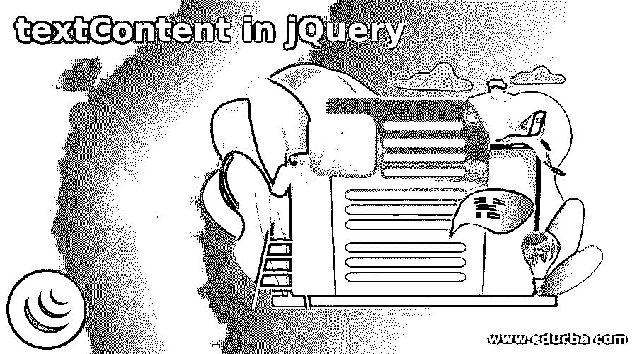
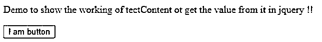
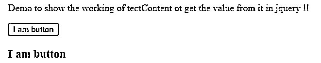
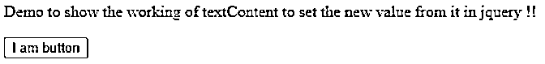
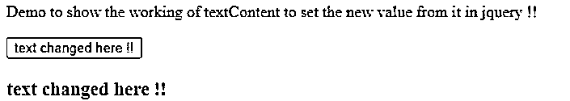

# jQuery 中的文本内容

> 原文：<https://www.educba.com/textcontent-in-jquery/>




## jQuery 中的 textContent 简介

在 jQuery 中，我们有 textContent，用于设置或获取特定节点的文本内容。我们可能会遇到很多情况，需要根据我们得到的一些值来设置节点的内容；然后，我们可以在 jQuery 中使用 textContent。这种方法易于使用和实现。这个方法的主要目的是设置节点的内容，或者通过使用它，我们也可以获取内容，并根据需要进行更改。在我们的程序中，我们不需要下载或包含任何外部库，它在 jQuery 中默认可用，但我们有一些浏览器版本不支持这种方法，如 internet explorer，它的内部工作以及我们如何在我们的程序中实现它来轻松设置和获取节点值。

**jQuery 中文本内容的语法**

<small>网页开发、编程语言、软件测试&其他</small>

我们知道，在 jQuery 中，textContent 用于节点级；它的工作方式与 innerText()方法类似，但语法不同。

在这里，我们将首先查看 textContent 的基本语法，以设置和获取特定节点的值。

1.设定值

**语法:**

```
node_name.textContent = your_text
```

2.获得价值

**语法:**

```
var varibale_name = node_name.textContent
```

从上面的语法中可以看出，我们可以很容易地得到 ad 设置节点的值。

### textContent 在 jQuery 中是如何工作的？

jQuery 中的 textContent 是一个内置的方法，用于设置和获取节点的值。通过使用这一点，我们可以很容易地改变或获得新的节点值的基础上，一些条件或我们的要求。要使用它，我们不需要任何外部库；它易于开发人员使用和操作。

#### 1.获取节点的值

在 jQuery 中，我们有 textContent 方法，可以用来获取节点的值；我们只需要在我们想要的节点上调用这个方法。

**举例:**

```
<button onclick="demofunction()" id="para1">some text</button>
var demovalue = document.getElementById("para1").textContent
```

正如您在上面的代码中看到的，我们正在尝试获取节点的值，这里称为“para1”。这将返回特定节点包含的文本。这里我们有一个 id 为“para1”的简单按钮，文本 t 内容为“some text”，因此每当我们试图获取该节点的 textContent 时，它将作为 jQuery 中上述程序的输出返回“some text”。所以在这个例子中，我们试图获取特定 textContent 的值或文本，这很容易使用和处理。

#### 2.设置节点的值

通过使用这种方法，我们可以很容易地设置特定节点的文本。

**举例:**

```
document.getElementById("para1").textContent = "value changed here !!";
```

通过上面的代码行，我们试图使用 jQuery 中的 textContent 方法来更改节点的文本。所以我们现在做的是。首先，我们试图通过使用 getElementById 方法来获取元素；一旦我们得到了它，我们就试图通过使用 textContent 方法来改变节点的值，并在这里给它分配一个新值。因此，当我们运行这个时,“para1”节点会将其文本更改为分配给它的文本。

这种方法与 innerText 类似，但是我们在使用这两种方法时有一些细微的区别:

*   通过使用 textContent 属性或方法，我们可以很容易地获得所有元素的文本。但是 innerText 属性却不是这样；它不能用于改变
*   如果我们有一些元素的文本在 CSS 的帮助下被隐藏，那么我们可以在 textContent 的帮助下获得这些文本，但是 innerText 将不能执行这样的操作。

浏览器对该属性的支持如下所示:

*   是的
*   **铬:** 1.0
*   互联网浏览器:9.0 版本
*   歌剧:是的

### jQuery 中的 textContent 示例

下面是 jQuery 中 textContent 的示例:

#### 示例#1

在下面的例子中，我们试图通过使用 jQuery 中的 textContent 属性来获取按钮文本的值。

**代码:**

```
<!DOCTYPE html>
<html>
<body>
<p>Demo to show the working of tectContent ot get the value from it in jquery !!</p>
<button onclick="demoFunction()" id="demoBtn">I am button </button>
<h3 id="show"></h3>
<script>
function demoFunction() {
var i = document.getElementById("demoBtn").textContent;
document.getElementById("show").innerHTML = i;
}
</script>
</body>
</html>
```

**输出:**







#### 实施例 2

使用 JQuery 中的 textContent 设置新文本的简单程序。

**代码:**

```
<!DOCTYPE html>
<html>
<body>
<p>Demo to show the working of textContent to set the new value from it in jquery !!</p>
<button onclick="demoFunction()" id="demoBtn">I am button </button>
<h3 id="show"></h3>
<script>
function demoFunction() {
var newtext = "text changed here !!"
document.getElementById("demoBtn").textContent = newtext;
document.getElementById("show").innerHTML = newtext;
}
</script>
</body>
</html>
```

**输出:**







### 结论

我们已经看到了 jQuery 中 textContent 属性的实现和用法，它可以帮助我们方便地更改或获取我们所需要的节点的文本内容；此外，我们可以使用这个来获得隐藏的节点文本。开发人员也很容易使用和处理，不需要外部库。

### 推荐文章

这是 jQuery 中的 textContent 指南。这里我们讨论一下简介，textContent 在 jQuery 中是如何工作的？和示例。您也可以看看以下文章，了解更多信息–

1.  [jQuery 选择选项](https://www.educba.com/jquery-select-option/)
2.  [jQuery zindex](https://www.educba.com/jquery-zindex/)
3.  [jQuery 宽度](https://www.educba.com/jquery-width/)
4.  [jQuery id 选择器](https://www.educba.com/jquery-id-selector/)


