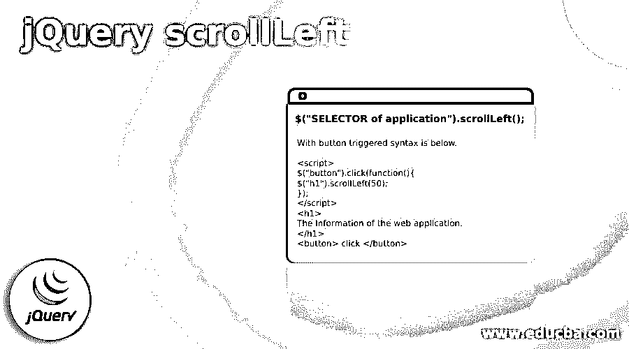
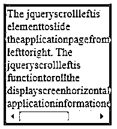
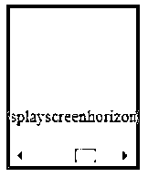
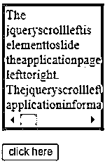
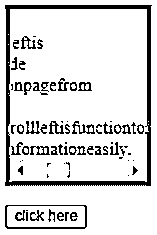
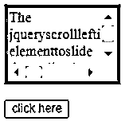
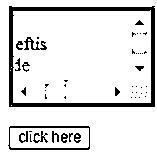
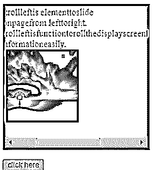

# jQuery scrollLeft

> 原文：<https://www.educba.com/jquery-scrollleft/>




## jQuery scrollLeft 简介

jQuery scrollLeft 是从左向右滑动应用程序页面的元素。该功能可以水平滚动显示屏，轻松显示应用信息。将按钮从左侧移动到右侧并显示 web 应用程序数据是 jQuery 事件。放置左侧并水平移动以显示隐藏数据是触发功能。它是一个按钮，位于 web 应用程序的左侧，向右侧滑动以显示所有 web 信息。

### 句法

下面给出了提到的语法:

<small>网页开发、编程语言、软件测试&其他</small>

```
$("SELECTOR of application").scrollLeft();
```

**说明:**

*   scrollLeft()方法用于使用 jQuery 的水平滚轴。
*   ＄(“应用程序的选择器”)用于选择类、id、标签，如 h1、div、.类和#id。

With position 语法如下。

```
$("SELECTOR of application").scrollLeft(select position range);
```

**说明:**

*   scrollLeft(选择位置范围)用于根据用户要求的位置放置按钮。
*   位置是按钮显示并开始水平滚动的地方。

用按钮触发的语法如下。

```
<script>
$("button").click(function(){
$("h1").scrollLeft(50);
});
</script>
<h1>
The Information of the web application.
</h1>
<button> click </button>
```

**说明:**

*   scrollLeft()方法放在 htmlpage 的 script 标记中。
*   web 应用程序主体部件和选择器位于 HTML 页面的主体部件内部。

### scrollLeft 方法在 jQuery 中是如何工作的？

要使用 jQuery scrollLeft，用户可以下载 jQuery 库或使用 jQuery CDN 版本链接。

*   从 jQuery.com 下载 jQuery 的开发版本或产品版本。
*   jQuery 最新版本放在 html 页面中。

jQuery 链接如下:

```
<script src = "https://ajax.googleapis.com/ajax/libs/jquery/3.5.1/jquery.min.js">
</script>
```

html 页面是用文件名和。html 扩展。

**举例:**

```
jqueryscroll.html
```

HTML 页面 head 部分中的 add script 标记。

```
<script>
Jquery scroll left syntax with required functions.
</script>
```

脚本标记内的语法。

```
$("p").scrollLeft(50);
```

在 body 标记内编写所需的代码。

```
<body>
<p >
Write required code inside of the p tag.
</p>
</body>
```

将所有过程组合在一起，得到 jQuery scrollLeft。

```
<!DOCTYPE html>
<html>
<head>
<script src="https://ajax.googleapis.com/ajax/libs/jquery/3.5.1/jquery.min.js"></script>
<script>
$(document).ready(function(){
$("p").scrollLeft();
});
</script>
<style>
p{
border: 5px solid darkgrey;
width: 150px;
overflow: auto;
}
</style>
</head>
<body>
<p>
The jqueryscrollleftis elementtoslide theapplicationpagefrom lefttoright.
</p>
</body>
</html>
```

### 例子

下面是提到的例子:

#### 示例#1

基本的 jQuery scrollLeft 示例和输出。

**代码:**

```
<!DOCTYPE html>
<html>
<head>
<script src="https://ajax.googleapis.com/ajax/libs/jquery/3.5.1/jquery.min.js"></script>
<script>
$(document).ready(function(){
$("p").scrollLeft();
});
</script>
<style>
p{
border: 5px solid darkgrey;
width: 150px;
overflow: auto;
}
</style>
</head>
<body>
<p>
The jqueryscrollleftis elementtoslide theapplicationpagefrom lefttoright.
The jqueryscrollleftis functiontorollthe displayscreenhorizontallytoshowthe applicationinformationeasily.
</p>
</body>
</html>
```

**输出:**




**说明:**

*   在 jQuery 函数内部使用选择器(" p ")的 scrollLeft()方法。
*   输出中的水平条显示称为 jQuery scrollLeft。

#### 实施例 2

带有位置示例和输出。

**代码:**

```
<!DOCTYPE html>
<html>
<head>
<script src="https://ajax.googleapis.com/ajax/libs/jquery/3.5.1/jquery.min.js"></script>
<script>
$(document).ready(function(){
$("p").scrollLeft(80);
});
</script>
<style>
p{
border: 5px solid darkgrey;
width: 120px;
overflow: auto;
}
</style>
</head>
<body>
<p>
The jqueryscrollleftis elementtoslide theapplicationpagefrom lefttoright.
Thejqueryscrollleftisfunctiontorollthedisplayscreenhorizontallytoshowthe applicationinformationeasily.
</p>
</body>
</html>
```

**输出:**




**说明:**

*   带有选择器(" p ")的 jQuery 函数内部使用的 scrollLeft(80)方法。
*   水平条显示在输出中，左侧有一些空间。
*   滚动条用方法设置位置(80)。

#### 实施例 3

带有按钮示例和输出。

**代码:**

```
<!DOCTYPE html>
<html>
<head>
<script src="https://ajax.googleapis.com/ajax/libs/jquery/3.5.1/jquery.min.js"></script>
<script>
$(document).ready(function(){
$("input").click(function(){
$("p").scrollLeft(80);
});
});
</script>
<style>
p{
border: 5px solid darkgrey;
width: 120px;
overflow: auto;
}
</style>
</head>
<body>
<p>
The jqueryscrollleftis elementtoslide theapplicationpagefrom lefttoright.
Thejqueryscrollleftisfunctiontorollthedisplayscreenhorizontallytoshowthe applicationinformationeasily.
</p>
<input type = "button" value = "click here">
</body>
</html>
```

**输出:**







**说明:**

*   带有选择器(" p ")的 jQuery 函数内部使用的 scrollLeft(80)方法。
*   与按钮一起使用并设置位置的触发功能。
*   点击按钮后，水平栏左侧显示一些空格。

#### 实施例 4

带有垂直滚动示例和输出。

**代码:**

```
<!DOCTYPE html>
<html>
<head>
<script src="https://ajax.googleapis.com/ajax/libs/jquery/3.5.1/jquery.min.js"></script>
<script>
$(document).ready(function(){
$("input").click(function(){
$("p").scrollLeft(80);
});
});
</script>
<style>
p{
border: 5px solid darkgrey;
height: 80px;
width: 120px;
overflow: auto;
}
</style>
</head>
<body>
<p>
The jqueryscrollleftis elementtoslide theapplicationpagefrom lefttoright.
Thejqueryscrollleftisfunctiontorollthedisplayscreenhorizontallytoshowthe applicationinformationeasily.
</p>
<input type = "button" value = "click here">
</body>
</html>
```

**输出:**







**说明:**

*   带有选择器(" p ")的 jQuery 函数内部使用的 scrollLeft(80)方法。
*   然后点击按钮后，水平栏从左侧显示一些空间。
*   宽度和高度用一些需要的样式设置，并放在 head 标记内。
*   垂直和水平的 jQuery 滚动显示在输出中。

#### 实施例 5

带有图像示例和输出。

**代码:**

```
<!DOCTYPE html>
<html>
<head>
<script src="https://ajax.googleapis.com/ajax/libs/jquery/3.5.1/jquery.min.js"></script>
<script>
$(document).ready(function(){
$("input").click(function(){
$("p").scrollLeft(80);
});
});
</script>
<style>
p{
border: 5px solid darkgrey;
height: 250px;
width: 250px;
overflow: auto;
background-color: yellow;
}
</style>
</head>
<body>
<p>
The jqueryscrollleftis elementtoslide theapplicationpagefrom lefttoright.
Thejqueryscrollleftisfunctiontorollthedisplayscreenhorizontallytoshowthe applicationinformationeasily.

</p>
<input type = "button" value = "click here">
</body>
</html>
```

**输出:**





**说明:**

*   带有选择器(" p ")的 jQuery 函数内部使用的方法。
*   触发功能与按钮一起使用，并设置滚动按钮的位置。
*   单击该按钮后，水平栏会从左侧显示一些空间。
*   可以显示图像、表格、多功能和信息。
*   在上面的输出中，您可以显示 web 数据和图像并进行显示。

### 结论

这是一个可调整的、用户友好的、有吸引力的 web 应用程序功能。它正在制作节省空间、优雅、可读的网站和网络应用程序。这是一个水平滚动条，在网站最小的空间里显示最多的信息。对于 web 应用程序中的导航栏、缩略图和多个表格来说，这是一个重要的功能。

### 推荐文章

这是一个 jQuery scrollLeft 的指南。这里我们讨论一下入门，scrollLeft 方法在 jQuery 中是如何工作的？和示例。您也可以看看以下文章，了解更多信息–

1.  [jQuery 选择选项](https://www.educba.com/jquery-select-option/)
2.  [jQuery zindex](https://www.educba.com/jquery-zindex/)
3.  [jQuery 宽度](https://www.educba.com/jquery-width/)
4.  [jQuery id 选择器](https://www.educba.com/jquery-id-selector/)


