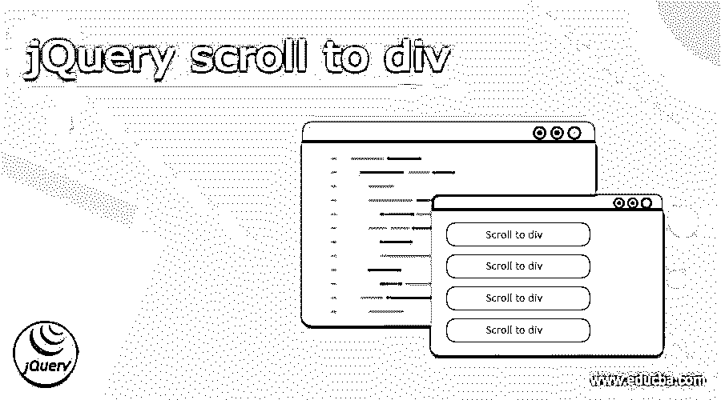
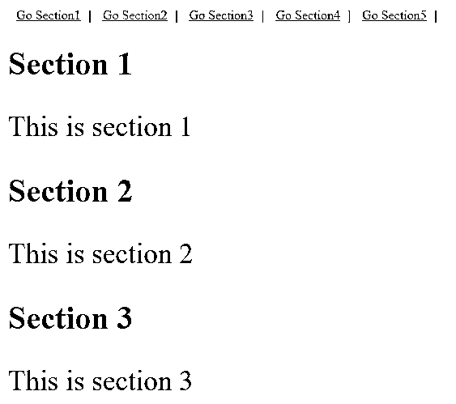
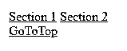
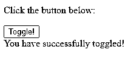

# jQuery 滚动到 div

> 原文：<https://www.educba.com/jquery-scroll-to-div/>




## jQuery 介绍滚动到 div

jQuery scroll to div 的定义是，它是对单页网站有帮助的功能，它允许用户通过单击锚链接或按钮进入页面的特定部分，而无需手动滚动，这种类型的滚动称为平滑滚动，jQuery scrollTop 方法是滚动到 div 元素的一种简单方法，通过使用 jQuery animate()方法，我们可以在页面上添加动画，滚动是当用户想要在元素中的不同位置滚动时发送元素的事件。

**语法:**

<small>网页开发、编程语言、软件测试&其他</small>

jQuery 的基本语法:

```
$(selector).action()
```

在哪里，

*   $–这用于定义 jQuery。
*   选择器-用于查找 HTML 元素。
*   动作-动作将在元素上执行。

而这些我们都需要写在脚本标签里。

*   在 div 中，我们可以编写不同的部分，我们可以在网页的顶部定义它们，div 标签如下，

```
<div>....</div>
```

### jQuery 中滚动到 div 是如何执行的？

如果我们有一个单页网站，我们必须浏览所有内容或少数内容，那么它可能会很长，需要更多的时间，如果我们想搜索该页面的特定部分，那么在平滑滚动的帮助下，我们可以通过单击页面顶部的按钮来访问该页面，我们可以通过使用滚动到 div 功能来使该按钮可用。
滚动到 div 是一种特殊类型的功能，它可以减少用户的工作量，例如，用户不需要浏览页面的所有内容就可以到达页面的特定部分，用户可以通过点击页面顶部的锚链接来到达特定部分。jQuery 提供了 scrollTop 方法来轻松地滚动到 div 元素。我们还可以使用 jQuery animate()方法添加动画，我们已经解释了如何在不手动滚动的情况下跳转到页面的特定部分的示例。

在示例 1 中，我们在 HTML 文件的 head 标签下定义了 CSS 文件和 JavaScript 文件，在 JavaScript 文件下，我们采用了函数和 scrollTop 方法及其语法，在脚本标签中，我们编写了 src 文件，在 HTML 文件的 body 标签下，我们可以定义不同的部分， 首先，通过使用 top，我们在页面顶部定义了五个链接，以便在该页面中访问特定页面，这些链接也称为锚链接，帮助用户轻松访问用户想要访问的特定页面，我们没有在该链接的每个部分的内容下编写内容，但您可以编写内容，因此用户不需要手动滚动它，而是我们可以直接单击链接。

为了给我们的网页提供更好的界面，我们可以使用 jQuery 提供的平滑滚动，这也减少了用户到达特定页面的时间和精力，我们可以通过使用 jQuery animate()方法添加动画，scrollTop 提供了一种简单的方法来滚动 div 元素，scroll 是当用户滚动不同的元素时向用户发送元素的事件， JavaScript 的 scroll()方法将允许检查页面是否滚动，这是我们在编写脚本之前必须添加的 jQuery 库。

#### 示例#1

```
<!DOCTYPE html>
<html lang="en-US">
<head>
<title>jQuery scroll to div</title>
<meta charset="utf-8">
<style>
h1{font-size: 40px;}
p{font-size: 35px;}
#top a {padding: 10px}
</style>
<!-- include jQuery library-->
<script src="js/jquery.min.js"></script>
<script>
$(function(){
$('a[href*=\\#]:not([href=\\#])').on('click', function() {
var target = $(this.hash);
target = target.length ? target : $('[name=' + this.hash.substr(1)+']');
if (target.length){
$('html,body').animate({scrollTop: target.offset().top}, 1000);
return false;}
</script>
</head>
<body>
<div id="top">
<a href="#Section1"> Go Section1</a>|
<a href="#Section2"> Go Section2</a>|
<a href="#Section3"> Go Section3</a>|
<a href="#Section4"> Go Section4</a>|
<a href="#Section5"> Go Section5</a>|
</div>
<div id="Section1">
<h1>Section 1</h1>
<p>This is section 1</p>
</div>
<div id="Section2">
<h1> Section 2</h1>
<p>This is section 2</p>
</div>
<div id="Section3">
<h1>Section 3</h1>
<p>This is section 3</p>
</div>
<div id="Section4">
<h1>Section 4</h1>
<p>This is section 4</p>
</div>
<div id="Section5">
<h1>Section 5</h1>
<p>This is section 5</p>
</div>
</body>
</html>
```

(注:我们也可以将上述代码写在 HTML、JavaScript 等不同的文件中。)

**输出:**




在这个例子中，我们使用了 jQuery scrollTop()方法，并在页面顶部定义了锚链接，在 HTML 代码体中，我们编写了五个部分，scroll()方法检查正在滚动的部分。

#### 实施例 2

**Html 文件:**

```
<!DOCTYPE html>
<html lang="en-US">
<head>
<title>jQuery scroll to div</title>
<meta charset="utf-8">
</head>
<body>
<div id="top">
<a href="#section1">Section 1</a>
<a href="#section2">Section 2</a>
</div>
<div id="section1">
<!-- Content goes here -->
</div>
<div id="section2">
<a href="#top">GoToTop</a>
<!-- Content goes here -->
</div>
</body>
</html>
CSS file:
<style>
h1{font-size: 40px;}
p{font-size: 35px;}
#top a {padding: 10px}
</style>
Javascript:
<script src="https://ajax.googleapis.com/ajax/libs/jquery/3.4.1/jquery.min.js">
</script>
<script>
$(function() {
$('a[href*=\\#]:not([href=\\#])').on('click', function () {
var target = $(this.hash);
target = target.length ? target : $('[name=' + this.hash.substr(1) + ']');
if (target.length) {
$('html,body').animate({
scrollTop: target.offset().top
}, 1000);
return false;
}
});
});
</script>
```

**输出:**




在这个滚动到 div 的例子中，我们可以在 animate()方法的帮助下在网页上添加动画，我们单击一个切换按钮，该按钮被切换，我们得到一条消息，表明您已成功切换。




### 结论

在这篇文章中，我们得出结论，有一个脚本的功能，通过它我们可以在我们的网站上添加滚动，我们也可以很容易地在我们的网站上使用自动滚动到 div，这样我们就可以很容易地通过点击按钮浏览不同的部分，而不用手动滚动。

### 推荐文章

这是一个 jQuery 滚动到 div 的指南。这里我们讨论一下入门，语法，如何在 jQuery 中执行 scroll to div？和示例。您也可以看看以下文章，了解更多信息–

1.  [jQuery 帖子](https://www.educba.com/jquery-post/)
2.  [jQuery keycode](https://www.educba.com/jquery-keycode/)
3.  [jQuery 替换类](https://www.educba.com/jquery-replace-class/)
4.  [jQuery ajax 请求](https://www.educba.com/jquery-ajax-request/)


