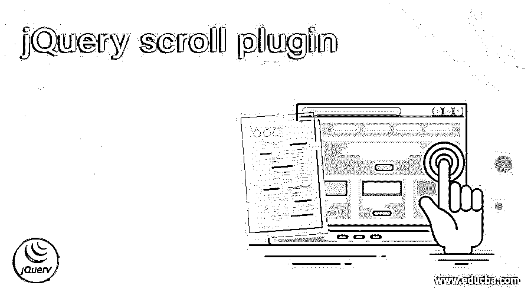
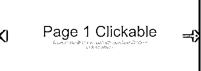

# jQuery 滚动插件

> 原文：<https://www.educba.com/jquery-scroll-plugin/>




## jQuery 滚动插件简介

jQuery scroll 插件创建页面指定部分的水平和垂直滚动。jQuery 插件是一个新功能，用于扩展 jQuery 的原型对象。所有 jQuery 对象都通过扩展原型对象来继承所有添加的功能。因此它用于扩展滚动对象或元素的功能。

有许多插件可以帮助开发人员为 web 应用程序创建有吸引力的滚动动画。下面给出了一些插件

<small>网页开发、编程语言、软件测试&其他</small>

*   这个 jQuery 插件用于创建一个全屏滚动的网站。
*   这个 jQuery 插件用于创建易于定制的滚动条；JavaScript 和 CSS 为它提供了动力。
*   这个 jQuery 插件允许像进度条一样创建滚动条，应用动画，并在滚动的特定部分固定一个元素。
*   这个 jQuery 插件需要最少的设置来创建一个滚动网站，速度和循环属性可以设置，并且它还支持每个页面的 SEO 友好的 URL。
*   jInvertScroll–它可以操纵默认的滚动行为并强制水平滚动。它允许用 onScroll 回调函数轻松创建视差效果。
*   这个 jQuery 插件提供了带有触觉效果的灵活的内容滚动。它在循环模式下自动处理大小不等的元素。
*   **Scroll**——这是一个 jQuery Scrolld.js 开源且独特的插件。它使用实时更新的数据值，为像素级完美布局和导航提供最精确的滚动功能。
*   这个 jQuery 插件允许轻松实现 CSS3 过渡效果。
*   这个 jQuery 插件有助于在网页上添加简单的滚动效果。设置页面很简单；它不需要一行 JavaScript 代码。在向下滚动页面时，它可以缩放、平移、旋转和改变页面元素的不透明度。

### jQuery 滚动插件示例

使用 fullpage.js 插件的 jQuery 滚动插件示例。使用 fullpage.js 插件的步骤如下。

首先，下载 fullpage.js 插件并解压。解压缩后的文件夹包含两个主要文件，即 fullpage.js 和 fullpage.css 文件。接下来，开始创建我们的网页，该网页是同一文件夹中的 Html 文件，如下例所示

**代码:**

```
<!DOCTYPE html>
<html >
<head>
<meta http-equiv = "Content-Type" content = "text/html; charset = utf-8" />
<title> This is an example for jQuery scroll plugin </title>
<meta name = "author" content = "Alvaro Trigo Lopez" />
<meta name = "keywords" content = "fullpage,jquery,demo,screen,fullscreen,navigation,control arrows, dots" />
<meta name = "description" content = "fullPage full-screen navigation and sections control menu." />
<meta name = "Resource-type" content = "Document" />
<link rel = "stylesheet" type = "text/css" href = "examples.css" />
<link rel = "stylesheet" type = "text/css" href = "../dist/fullpage.css" />
<style>
/* Style for h3 header texts
* --------------------------------------- */
h2{
font-size : 5em;
font-family : arial,helvetica;
color : #fff;
margin :0;
}
.intro p{
color : #f0f;
}
/* styles to control arrows for slides
* --------------------------------------- */
.controlArrow.prev {
left : 60px;
}
.controlArrow.next{
right : 60px;
}
/* Place texts in each section to the centered
* --------------------------------------- */
.section{
text-align : center;
}
/* Bottom menu
* --------------------------------------- */
#infoMenu li a {
color : #ff0f;
}
</style>
</head>
<body>
<select id= "Menu">
<option selected>Choose Example </option>
<option id = "jquery-adapter">jQuery adapter</option>
<option id = "active-slide">Active section and slide</option>
<option id = "callbacks-v2-compatible">Callbacks version 2</option>
<option id = "auto-height">Auto height</option>
<option id = "autoplay-video-and-audio">Autoplay Video and Audio</option>
<option id = "backgrounds">Background images</option>
<option id = "backgrounds-fixed">Fixed fullscreen backgrounds</option>
<option id = "background-video">Background video</option>
<option id = "fixed-headers">Fixed headers</option>
<option id = "callbacks-v3">Callbacks version 3</option>
<option id = "parallax">Parallax</option>
<option id = "continuous-horizontal">Continuous horizontal</option>
<option id = "continuous-vertical">Continuous vertical</option>
<option id = "backgrounds">Background images</option>
<option id = "css3">CSS3</option>
<option id = "drag-and-move">Drag And Move</option>
<option id = "easing">Easing</option>
<option id = "fading-effect">Fading Effect</option>
<option id = "looping">Looping</option>
<option id = "gradient-backgrounds">Gradient backgrounds</option>
<option id = "navigation-horizontal">Horizontal navigation dots</option>
<option id = "methods">Methods</option>
<option id = "navigation-vertical">Vertical navigation dots</option>
<option id = "interlocked-slides">Interlocked Slides</option>
<option id = "normalScrollElements">Normal scroll elements</option>
<option id = "no-anchor">No anchor links</option>
<option id = "normal-scroll">Normal scrolling</option>
<option id = "one-section">One single section</option>
<option id = "offset-sections">Offset sections</option>
<option id = "navigation-tooltips">Navigation tooltips</option>
<option id = "scrollBar">Scroll bar enabled</option>
<option id = "reset-sliders">Reset sliders</option>
<option id = "responsive-auto-height">Responsive Auto Height</option>
<option id = "responsive-height">Responsive Height</option>
<option id = "responsive-slides">Responsive Slides</option>
<option id = "responsive-width">Responsive Width</option>
<option id = "scrollOverflow">Scroll inside sections and slides</option>
<option id = "scrollBar">Scroll bar enabled</option>
<option id = "scroll-horizontally">Scroll horizontally</option>
<option id = "scrolling-speed">Scrolling speed</option>
<option id = "scrollOverflow-reset">ScrollOverflow Reset</option>
<option id = "lazy-load">Lazy load</option>
<option id = "vue-fullpage">Vue-fullpage component</option>
<option id = "trigger-animations">Trigger animations</option>
</select>
<div id = "fullpage">
<div id = "section1" class = "section">
<div class="intro">
<h3> This is an example for jQuery scroll plugin : </h3>
<h2> Dots Navigation </h2>
<p> Navigate throw the sections in an easy and beautiful way. </p>
</div>
</div>
<div id = "section2" class = "section">
<div id = "slide1" class = "slide">
<div class="intro">
<h1> Page 1 Clickable </h1>
<p>
You can even click on the navigation and jump directly to another section.
</p>
</div>
</div>
<div id = "slide2" class = "slide" >
<h2> Page 2</h2>
</div>
</div>
<div id = "section3" class = "section">
<div class = "intro">
<h2> Page 3 </h2>
</div>
</div>
</div>
<script type = "text/javascript" src = "../dist/fullpage.js"></script>
<script type = "text/javascript" src = "examples.js"></script>
<script type = "text/javascript">
var myFullpage = new fullpage('#fullpage', {
anchors: ['firstPage', 'secondPage', '3rdPage'],
sectionsColor : ['#C6000F', '#1BBC00', '#7E8F0C'],
navigationPosition: 'right',
navigation: true,
navigationTooltips: ['First page', 'Second page', 'Third page']
});
</script>
</body>
</html>
```

上述代码的输出是


一旦我们单击右侧的第二个点，输出是




一旦我们单击右侧的第三个点，输出是


在上面的代码中，创建了“div”元素的三个部分。接下来，使用 fullpage.js 文件，包括脚本部分，并将滚动导航应用于“div”元素的每个部分，如上面的输出所示。

### 结论

它用于扩展页面滚动功能；不同类型的 jQuery 滚动插件有其特定的特性。这些用于创建页面指定部分的水平和垂直滚动。

### 推荐文章

这是 jQuery 滚动插件的指南。这里我们讨论 jQuery 滚动插件的定义、语法和示例。您也可以阅读以下文章来了解更多信息—

1.  [jQuery 选择值](https://www.educba.com/jquery-select-value/)
2.  [jQuery 可见性](https://www.educba.com/jquery-visibility/)
3.  [jQuery removeClass()](https://www.educba.com/jquery-removeclass/)
4.  [jQuery 窗口](https://www.educba.com/jquery-window/)


