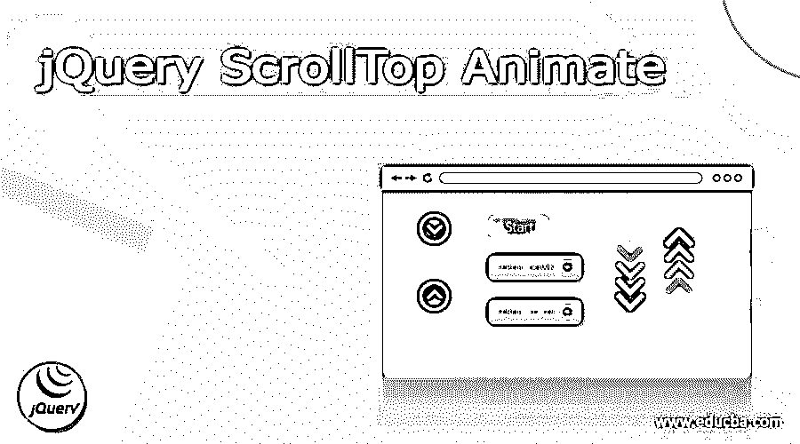
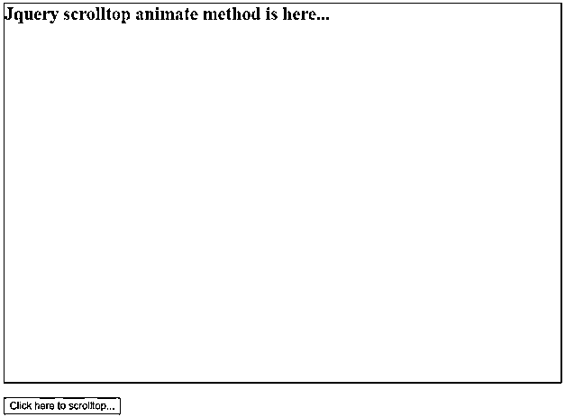
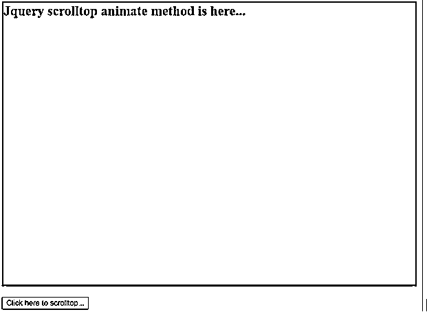
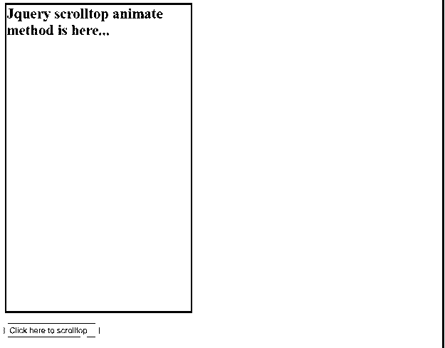
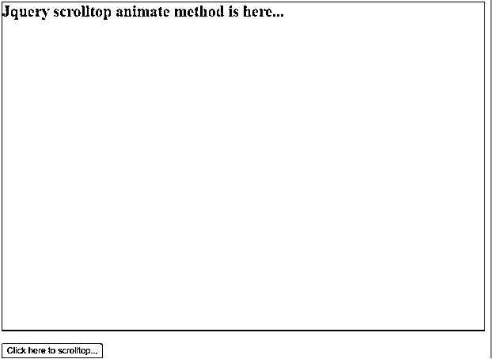
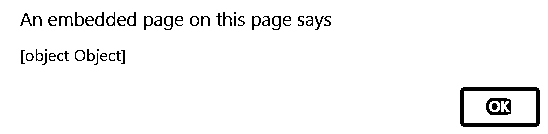

# jQuery 滚动动画

> 原文：<https://www.educba.com/jquery-scrolltop-animate/>




## jQuery 滚动条动画的定义

jquery scrolltop animate 是 scrolltop 和 animate 方法的组合，用于显示具有给定位置的动画滚动条。它具有多种功能，可以根据需要的动画显示垂直滚动条的位置。scrolltop animate 是使用 jquery 技术中的 animate 方法将垂直滚动条函数放置在顶部位置的方法。scrollbar animate 是一个包含 scrolltop 作为属性并应用动画样式的方法。该功能是在顶部位置或 0 位置显示垂直滚动条。jquery animate 是一种显示高级风格系统的方法，包括其他 jquery 函数或属性。

**语法:**

<small>网页开发、编程语言、软件测试&其他</small>

scrolltop 是 jquery 属性，用于在顶部位置显示垂直滚动条。语法如下所示。

```
$(html_selector).scrollTop(scrollbar position)
```

animate 是一个 jquery 方法，用于在样式和动画中显示应用程序属性。jquery animate 的语法如下所示。

```
$(html_selector).animate ({CSS style or animation style});
```

jquery scrolltop animate 结合了 scrolltop 属性和 animate 方法。jquery animate 方法包含 jquery scrolltop 属性及其位置。jquery scrolltop animate 的语法如下所示。

```
$(html_selector).animate ({scrollTop: position});
```

“HTML 选择器”是一个 Html 和 body 标签，用于在顶部显示滚动条。带有标签的 jquery scrolltop 动画的语法如下所示。

```
$("html, body").animate ({scrollTop: position});
```

jquery scrolltop 动画的语法如下所示。

```
$("html, body").animate ({scrollTop: position}, speed);
```

speed 属性用于控制滚动条以所需的速度显示。

### jQuery ScrollTop Animate 是如何工作的？

创建一个带有 HTML 扩展的应用程序页面。

#### 例子 1:jqueryScrollTopAnimate.html

下载 jquery 文件并连接 HTML 文件。

运筹学

将在线 jquery 文件放在 HTML 页面的脚本标记中。

```
<script src = "https://ajax.googleapis.com/ajax/libs/jquery/3.5.1/jquery.min.js">
</script>
```

创建一个应用程序页面并放置带有标签的内容。

```
<h2 class = "scrollanimate">
```

Jquery scrolltop animate 方法在这里…

```
</h2>
```

用“onclick”功能创建一个按钮。

```
<button onclick = "jqueryScrolltopAnimate()">
Click here to scrolltop...
</button>
```

为 jquery scrolltop animate 创建第二个脚本标记。

```
<script> write jquery scrolltop animate code here… </script>
```

使用 animate 方法放置选择器。

```
$("html, body").animate({ scroll top property here… });
```

用位置值放置 scrollTop 属性。

```
$("html, body").animate({ scrollTop: "0" });
```

如果你想，然后添加动画滚动条的速度。

```
$("html, body").animate({ scrollTop: "0" }, 2000);
```

如果你想，然后添加网页的风格。

```
.scrollanimate {
height: 800px;
background-color: lightgrey;
border: 3px solid black;
}
```

结合这里的工作程序。

```
<!DOCTYPE>
<html>
<head>
<script src = "https://ajax.googleapis.com/ajax/libs/jquery/3.5.1/jquery.min.js">
</script>
<script>
function jqueryScrolltopAnimate () {
$("html, body").animate ({ scrollTop: "0" });
}
</script>
</head>
<body>
<h2 class="scrollanimate">
Jquery scrolltop animate method is here...
</h2>
<button onclick="jqueryScrolltopAnimate()">
Click here to scrolltop...
</button>
</body>
</html>
```

### 例子

为了更好地理解，让我们讨论几个例子:

#### 示例#1

基本动画示例和输出如下所示

**代码:**

```
<!DOCTYPE>
<html>
<head>
<script src = "https://ajax.googleapis.com/ajax/libs/jquery/3.5.1/jquery.min.js">
</script>
<style>
.scrollanimate {
height: 800px;
background-color: lightgrey;
border: 1px solid black;
}
</style>
<script type="text/javascript">
function jqueryScrolltopAnimate() {
$("html, body").animate({ scrollTop: "0" });
}
</script>
</head>
<body>
<h2 class="scrollanimate">
Jquery scrolltop animate method is here...
</h2>
<button onclick="jqueryScrolltopAnimate()">
Click here to scrolltop...
</button>
</body>
</html>
```

**输出:**




**描述**

*   如果你点击给定的按钮，页面就会自动开始向上滑动。
*   必须使用 HTML，选择器和 scrollTop 位置的 body 标记为 0。

#### 实施例 2

基本的动画示例和输出如下所示。

**代码:**

```
<!DOCTYPE>
<html>
<head>
<script src = "https://ajax.googleapis.com/ajax/libs/jquery/3.5.1/jquery.min.js">
</script>
<style>
.scrollanimate {
height: 800px;
background-color: orange;
border: 3px solid black;
}
</style>
<script type="text/javascript">
function jqueryScrolltopAnimate() {
$("html, body").animate({ scrollTop: "0" }, 2000);
}
</script>
</head>
<body>
<h2 class="scrollanimate">
Jquery scrolltop animate method is here...
</h2>
<button onclick="jqueryScrolltopAnimate()">
Click here to scrolltop...
</button>
</body>
</html>
```

**输出:**




**描述:**

*   此方法应用滑动速度限制并显示首页内容。
*   您可以选择垂直滑动的快速或慢速限制。
*   如果你点击给定的按钮，页面就会自动开始向上滑动。

#### 实施例 3

CSS 样式的基本动画示例和输出如下所示。

**代码:**

```
<!DOCTYPE>
<html>
<head>
<script src = "https://ajax.googleapis.com/ajax/libs/jquery/3.5.1/jquery.min.js">
</script>
<style>
.scrollanimate {
height: 800px;
background-color: aqua;
border: 3px solid black;
width: 500px;
}
body{
background-color: gray;
}
button{
border: 1px solid yellow;
color: black;
background-color: orange;
}
</style>
<script type="text/javascript">
function jqueryScrolltopAnimate() {
$("html, body").animate({ scrollTop: "0" });
}
</script>
</head>
<body>
<h2 class="scrollanimate">
Jquery scrolltop animate method is here...
</h2>
<button onclick="jqueryScrolltopAnimate()">
Click here to scrolltop...
</button>
</body>
</html>
```

**输出:**




**描述:**

*   如果你点击给定的按钮，页面就会自动开始向上滑动。
*   必须使用 HTML，选择器和 scrollTop 位置的 body 标记为 0。
*   根据需要在网页上应用 CSS 样式。
*   使用按钮的样式来识别滚动按钮。
*   根据需要在网页主体上应用 CSS 样式。

#### 实施例 4

基本的动画和警报示例及输出如下所示。

**代码:**

```
<!DOCTYPE>
<html>
<head>
<script src = "https://ajax.googleapis.com/ajax/libs/jquery/3.5.1/jquery.min.js">
</script>
<style>
.scrollanimate {
height: 900px;
background-color: lightgrey;
border: 1px solid black;
}
</style>
<script type="text/javascript">
function jqueryScrolltopAnimate() {
alert($("html, body").animate({ scrollTop: "0" }, 1000));
}
</script>
</head>
<body>
<h2 class="scrollanimate">
Jquery scrolltop animate method is here...
</h2>
<button onclick="jqueryScrolltopAnimate()">
Click here to scrolltop...
</button>
</body>
</html>
```

**输出:**




**输出 2:**




**描述:**

*   如果你点击给定的按钮，然后在页面顶部弹出警告页面。
*   如果你点击确定按钮，自动开始向上侧滑动。
*   必须使用 HTML，选择器和 scrollTop 位置的 body 标记为 0。

### 结论

*   它使 web 应用程序变得没有骗子和用户友好。
*   它可以毫不费力地显示顶级数据。
*   这对于长页面和冗长的 div 或容器标签很有用。

### 推荐文章

这是一个 jQuery ScrollTop 动画指南。这里我们讨论 jQuery ScrollTop Animate 的定义、语法、工作原理。，代码实现示例。您也可以看看以下文章，了解更多信息–

1.  [jQuery 数组到字符串](https://www.educba.com/jquery-array-to-string/)
2.  [jQuery 停止表单提交](https://www.educba.com/jquery-stop-form-submit/)
3.  [jQuery 替换 innerhtml](https://www.educba.com/jquery-replace-innerhtml/)
4.  [jQuery 替换为](https://www.educba.com/jquery-replace-with/)


