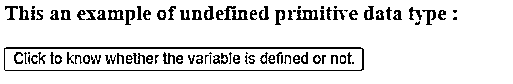
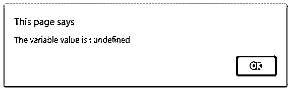
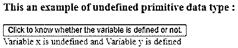
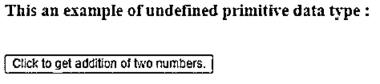
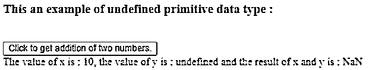

# jQuery 未定义

> 原文：<https://www.educba.com/jquery-undefined/>


## jQuery 介绍未定义

jQuery undefined 是一个原始值，它指定变量还没有被初始化为一个值，或者可能还没有被声明。jQuery undefined 是 jQuery 中内置的原始数据类型。jQuery 有七种原始数据类型，如数字、字符串、布尔、bigint、未定义、空和符号，所以未定义是 jQuery 中的原始数据类型之一。

在 jQuery 中，如果声明了一个变量，但没有给它赋值，那么一个未定义的值会自动赋给该变量。因此，当我们试图显示这个变量值时，未定义的单词将被显示，所以这意味着未定义的是一个未知值或缺少值或未提供值。null 也是一种未指定值的原始数据类型，这意味着 null 值意味着缺少值或没有值，undefined value 意味着变量已声明但值未赋值。

<small>网页开发、编程语言、软件测试&其他</small>

### jQuery 未定义的原始数据类型的语法

下面给出了提到的语法:

```
var myVariable;
if(myVariable == 'undefined')
{
// some code to execute
}
```

或者

```
// with strict equality operator
if(myVariable === 'undefined')
{
// some code to execute
}
```

### jQuery 未定义的原始数据类型的工作

*   jQuery 未定义的原始数据被自动赋给一个已声明但未被任何值初始化的变量。
*   假设我们有一个“phoneNo”变量，它被声明为“var phoneNo”，但不初始化。
*   现在，当我们将变量显示为“alert(phone no)；”，警报消息将显示“未定义”，因为该值未分配给变量“phoneNo”。

### 例子

下面是一些例子:

#### 示例#1

显示变量的未初始化值的 jQuery 原始数据类型示例。

**代码:**

```
<!doctype html>
<html lang = "en">
<head>
<meta charset = "utf-8">
<script src = "https://code.jquery.com/jquery-3.5.0.js"> </script>
<title> This is an example for jQuery undefined primitive data type </title>
<script>
function disp()
{
var x;
alert( "The variable value is : " +x );
}
</script>
</head>
<body>
<h3> This an example of undefined primitive data type : </h3>
<button onclick = "disp()"> Click to know whether the variable is defined or not. </button>
</body>
</html>
```

**输出:**




**一旦我们点击“点击了解变量是否被定义”按钮:**




在上面的代码中，当我们点击按钮时，disp()函数得到执行。在 disp()函数中，声明了变量 x，但没有给它赋值。接下来，x 变量显示在警报中，正如我们在输出中看到的，x 的值是“未定义”的，因为它没有被赋予任何值。

#### 实施例 2

将 jQuery 原始数据类型转换为具有未定义原始值的变量值的示例。

**代码:**

```
<!doctype html>
<html lang = "en">
<head>
<meta charset = "utf-8">
<script src = "https://code.jquery.com/jquery-3.5.0.js"> </script>
<title> This is an example for jQuery undefined primitive data type </title>
<script>
function disp()
{
var x;
var y = 56;
if ( typeof x === "undefined") {
message = "Variable x is undefined";
} else {
message = "Variable x is defined";
}
if ( typeof y === "undefined") {
message = message + " and Variable y is undefined";
} else {
message = message + " and Variable y is defined";
}
$( "div" ).text( message );
}
</script>
</head>
<body>
<h3> This an example of undefined primitive data type : </h3>
<button onclick = "disp()"> Click to know whether the variable is defined or not. </button>
<div style = "color:red;" > </div>
</body>
</html>
```

**输出:**


**一旦我们点击“点击了解变量是否被定义”按钮:**




在上面的代码中，当我们单击按钮时，disp()函数开始执行。在 disp()函数中，有两个变量 x 和 y，其中 x 被声明但没有赋值，y 用 56 值初始化。接下来，x 和 y 变量通过使用“typeof”操作符与“undefined”原语进行比较。x 变量自动获得“未定义”值，因此条件变为真，而 y 具有某个值，因此条件变为假，并且消息据此显示。

#### 实施例 3

显示传递未定义变量的 jQuery 原始数据类型示例。

**代码:**

```
<!doctype html>
<html lang = "en">
<head>
<meta charset = "utf-8">
<script src = "https://code.jquery.com/jquery-3.5.0.js"> </script>
<title> This is an example for jQuery undefined primitive data type </title>
<script>
function add( x, y)
{
$( "div" ).text( "The value of x is : " + x +", the value of y is : " +y + " and the result of x and y is : " + (x+y) );
}
function disp()
{
var n1 = 10;
var n2;
add(n1, n2);}
</script>
</head>
<body>
<h3> This an example of undefined primitive data type : </h3>
<br>
<button onclick = "disp()"> Click to get addition of two numbers. </button>
<div style = "color:red;" > </div>
</body>
</html>
```

**输出:**




**一旦我们点击“点击获得两个数的加法”按钮:**




在上面的代码中，在 disp()函数中，它通过传递两个变量 n1 和 n2 来调用 add()函数，其中 n1 用 10 初始化，n2 只是 declare，但不赋值(自动获得“未定义”的值)。接下来在 add()函数中，n1 和 n2 变量相加显示为“NAN”(非数字)。

### 结论

jQuery undefined 原语值是一种内置的数据类型，它指定变量还没有被初始化为值，或者还没有被声明。

### 推荐文章

这是一个 jQuery 未定义的指南。这里我们讨论 jQuery 未定义的原始数据类型的介绍、工作原理和例子。您也可以看看以下文章，了解更多信息–

1.  [jQuery eq()](https://www.educba.com/jquery-eq/)
2.  [jQuery next()](https://www.educba.com/jquery-next/)
3.  [jQuery 内容](https://www.educba.com/jquery-contents/)
4.  [jQuery 全局变量](https://www.educba.com/jquery-global-variable/)


