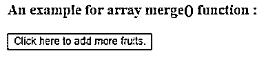
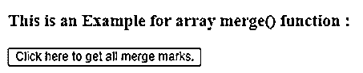
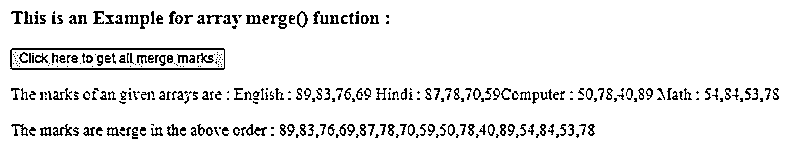
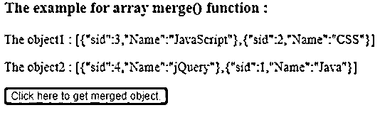
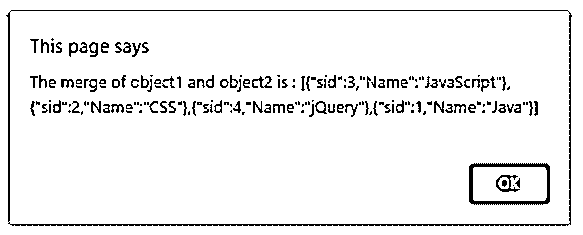

# jQuery 合并

> 原文：<https://www.educba.com/jquery-merge/>


## jQuery 合并简介

jQuery merge()函数用于将两个数组的元素合并到第一个数组中。jQuery merge()函数是 jQuery 中的内置函数。此函数通过将第二个数组中的元素追加到第一个数组来更改第一个数组的数字索引和长度属性。数组中元素的顺序保持不变。由于 merge()函数是破坏性的，它改变了第一个原始数组，如果将来我们需要第一个原始数组，那么在调用 merge()函数之前创建数组的副本。

**语法:**

<small>网页开发、编程语言、软件测试&其他</small>

```
jQuery.merge(firstArr, secondArr);
```

**参数:**

*   **firstArr:** 这不是可选参数。它指定用于合并或追加第二个数组的元素的第一个数组。
*   **secondar:**这不是可选参数。它指定用于合并到第一个数组中的第二个数组。

**返回值:**

这个函数的返回值是合并后的数组或修改后的第一个数组。

### jQuery merge()函数的工作原理

JQuery merge()函数接受两个参数，第一个参数作为第一个数组，第二个参数作为第二个数组。假设我们有一个数字列表“数字 1 = [ 20，64，60，45 ]”和“数字 2 = [ 10，20，30 ]”，现在我们需要合并。所以我们可以使用数组 merge()函数作为" $。merge(number1，number2)"，即修改 number1 和 number1 将成为"[ 20，64，60，45，10，20，30]。

### jQuery merge()函数的示例

下面是一些例子:

#### 示例#1

jQuery merge()函数合并给定数组的结果的例子

**代码:**

```
<!doctype html>
<html lang="en">
<head>
<meta charset="utf-8">
<script src="https://code.jquery.com/jquery-3.5.0.js"></script>
<title> This is an example for jQuery array merge() function </title>
</head>
<body>
<h3> An example for array merge() function : </h3>
<button onclick = "checkRes()" style = "background-color : yellow" > Click here to add more fruits. </button>
<p id = "p1" style = "color : green"></p>
<p id = "p2" style = "color : green"></p>
<p id = "p3" style = "color : red"></p>
<p id = "p4" style = "color : green"></p>
<script>
var fruits = [  "Orange", "Banana", "Apple", "Cherry", "Plums" ];
var more = [ "Blackberry", "Apricot" ]
function checkRes()
{
$( "#p1" ).text("The fruits of the first array before merge() function is : " + fruits);
$( "#p2" ).text("The fruits of the second array before merge() function is : " + more);
$.merge( fruits, more);
$( "#p3" ).text("The fruits of the first array after merge() function is : " + fruits);
$( "#p4" ).text("The fruits of the second array after merge() function is : " + more);
}
</script>
</body>
</html>
```

**输出:**




一旦我们点击按钮，输出是


**解释:**在上面的代码中，创建了两个数组，其中包含一些水果的名称。接下来，使用数组 merge()函数将 more fruits 数组作为“$”合并到水果中。合并(水果，更多)；”.一旦我们单击按钮，就会显示由 merge()函数修改的第一个数组，正如我们在输出中看到的那样。

#### 实施例 2

合并多个数组的 jQuery array merge()函数示例

**代码:**

```
<!doctype html>
<html lang="en">
<head>
<meta charset="utf-8">
<script src="https://code.jquery.com/jquery-3.5.0.js"></script>
<title> This is an example for jQuery array merge() function </title>
<style>
#p1 {
color: blue;
}
#p2 {
color: green;
}
</style>
</head>
<body>
<h3> This is an Example for array merge() function : </h3>
<button onclick = "checkRes()" > Click here to get all merge marks. </button>
<p id = "p1"></p>
<p id = "p2"></p>
<script>
var Computer = [ 50, 78, 40, 89 ];
var Math = [ 54, 84, 53, 78 ];
var English = [ 89, 83, 76, 69 ];
var Hindi = [ 87, 78, 70, 59 ];
function checkRes()
{
$( "#p1" ).text("The marks of an given arrays are : English : "+ English+" Hindi : "+ Hindi+"Computer : " + Computer+" Math : "+ Math  );
$.merge(English, $.merge(Hindi, $.merge(Computer, Math)));
$( "#p2" ).text("The marks are merge in the above order : " + English);
}
</script>
</body>
</html>
```

**输出:**




一旦我们点击按钮，输出是




**解释:**在上面的代码中，为科目 Computer、Maths、English 和 Hindi 创建了标记数组。接下来在 checkRes()函数中，使用 merge()函数来合并所有的主题标记数组，方法是使用 merge()函数作为" $。合并(英语，$。合并(印地语，$。合并(计算机，数学)))；”，所以这里首先将数学数组追加到计算机数组，然后将修改计算机数组追加到印地语数组，然后将修改印地语数组追加到英语数组。我们也可以在输出中看到合并的顺序。

#### 实施例 3

jQuery merge()函数合并对象的示例

**代码:**

```
<!doctype html>
<html lang="en">
<head>
<meta charset="utf-8">
<script src="https://code.jquery.com/jquery-3.5.0.js"></script>
<title> This is an example for jQuery array merge() function </title>
</head>
<body>
<h3> The example for array merge() function : </h3>
<p id = "p1" ></p>
<p id = "p2" ></p>
<button onclick = "checkRes()" style = "background-color : green" > Click here to get merged object. </button>
<script>
varobj = [ { sid: 3, Name: "JavaScript" },
{ sid: 2, Name: "CSS" }]
var obj2 = [{ sid: 4, Name: "jQuery" },
{ sid: 1, Name: "Java" } ];
$( "#p1" ).text("The object1 : " + JSON.stringify(obj));
$( "#p2" ).text("The object2 : " + JSON.stringify(obj2));
function checkRes()
{
$.merge(obj, obj2);
alert("The merge of object1 and object2 is : " + JSON.stringify(obj));
}
</script>
</body>
</html>
```

**输出:**




一旦我们点击按钮，输出是




**解释:**在上面的代码中，创建了两个对象，分别包含一些主题 id 和名称作为键值对。接下来，使用 merge()函数将两个对象合并到第一个对象中作为" $。merge(obj，obj 2)；".正如我们在输出中看到的，对象被合并。

### 推荐文章

这是一个 jQuery 合并指南。在这里，我们还将讨论 jquery merge()函数的介绍和工作原理，以及不同的示例和代码实现。您也可以看看以下文章，了解更多信息–

1.  [jQuery removeClass()](https://www.educba.com/jquery-removeclass/)
2.  [jQuery 延期](https://www.educba.com/jquery-deferred/)
3.  [jQuery 移动元素](https://www.educba.com/jquery-move-element/)
4.  [jQuery eq()](https://www.educba.com/jquery-eq/)


