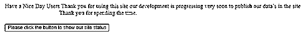
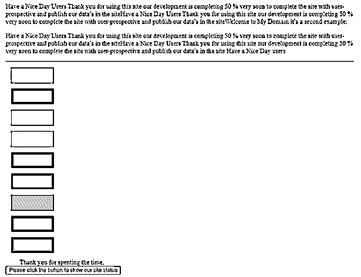
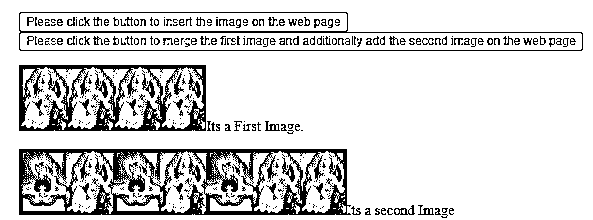

# jQuery 前置

> 原文：<https://www.educba.com/jquery-prependto/>


## jQuery 前置 to 简介

jQuery prependTo()是默认方法，它用于插入指定的 html 数据内容作为初始类型。它在 jQuery 数据中定义为该元素类型的子元素。内容在方法之前，内容有 htmlString、element、Text、Array。这些是将应用于该方法的一些 html 内容，也是作为该方法的参数的函数。该函数可以是整数或数字，字符串格式与 html 内容中的相同，但都需要是 jQuery 对象，以便将元素放置在集合中的匹配位置。

**语法:**

<small>网页开发、编程语言、软件测试&其他</small>

jQuery library 中有很多默认的方法，用于以更加复杂和用户友好的方式处理 UI。prependTo()是在页面上已经创建的 html 内容上插入数据的默认方法之一。

```
<html>
<head>
<script src="https://ajax.googleapis.com/ajax/libs/jquery/3.5.1/jquery.min.js"/>
<script>
$(document).ready(function(){
$("htmlelementID").click(function(){
$("").prependTo("htmlelements");
});
});
</script>
</head>
<body>
---some html UI elements depends on the requirement---
</body>
</html>
```

上面的代码是在网页上使用 prependTo()方法的基本语法。我们可以根据需要创建 html 标签，如果需要的话，这将用于方法中。

### jQuery 中的 prependTo 函数是如何工作的？

prependTo()方法主要用于插入已经创建在标签

、等中的 html 元素。该元素值被匹配并设置到 html 指定内容的开始位置，作为编码器已经使用的每个 html 元素的初始子元素。通过使用的 appendTo()方法，将指定的 html 内容作为每个元素的最后一个子元素插入到 html 页面的匹配集合值中。我们更多地使用 prependTo()方法，而不是像 appendTo()那样使用相同的功能，但它的工作方式略有不同，即数据内容被附加到 web 页面上的现有元素中。它显示指定的目标元素，并且仅将其中一个元素作为目标进行映射。仅使用一个目标元素，并将其附加到现有元素，该元素不会被移动和克隆到其他元素，如果目标元素不止一次，则 html 内容元素将被克隆。通过使用这种方法，元素还创建了重复的 id 属性，这些属性被认为是唯一的条件。我们可以避免克隆具有特定 id 属性的元素集，或者如果认为这对于确保元素是绝对必要的，可以使用类属性标识符来克隆和开发代码。

#### 示例#1

**代码:**

```
<!DOCTYPE html>
<html>
<head>
<title>Welcome to My Domain it’s a First Example</title>
<script src=
"https://ajax.googleapis.com/ajax/libs/jquery/3.3.1/jquery.min.js">
</script>
<script>
$(document).ready(function(){
$("button").click(function(){
$("Have a Nice Day Users Thank you for using this site our development is progressing very soon to publish our data’s in the site").prependTo("p");
});
});
</script>
<style>
first{
width: 425px;
min-height: 232px;
font-weight: bold;
padding:32px;
font-size: 28px;
border: 3px blue;
}
</style>
</head>
<body>
<div id="#first">
<p><marquee>Thank you for spending the time.</marquee></p>
<button >Please click the button to show our site status</button>
</div>
</body>
</html>
```

**输出:**




在上面的例子中，我们使用 prependTo()方法在页面的同一行添加或追加内容。这是在 jQuery 库上使用 prependTo()方法的一个基本示例。

#### 实施例 2

**代码:**

```
<html>
<head>
<title>The jQuery Example</title>
<script type = "text/javascript"
src = "https://ajax.googleapis.com/ajax/libs/jquery/2.1.3/jquery.min.js">
</script>
<script type = "text/javascript" language = "javascript">
$(document).ready(function() {
$("div").click(function () {
$(this).prependTo("#second");
});
});
$(document).ready(function() {
$("button").click(function(){
$("Have a Nice Day Users Thank you for using this site our development is completing 50 % very soon to complete the site with user-prospective and publish our data’s in the site").prependTo("p");
});
});
</script>
<style>
.div{ margin:13px;padding:17px; border:3px solid blue; width:67px;}
</style>
</head>
<body>
<p>Welcome to My Domain it’s a second example:</p>
<p id = "second"> Have a Nice Day users </p>
<hr />
<div class = "div" style = "background-color:yellow;"></div>
<div class = "div" style = "background-color:blue;"></div>
<div class = "div" style = "background-color:violet;"></div>
<div class = "div" style = "background-color:pink;"></div>
<div class = "div" style = "background-color:green;"></div>
<div class = "div" style = "background-color:red;"></div>
<div class = "div" style = "background-color:orange;"></div>
<div class = "div" style = "background-color:blue;"></div>
<div class = "div" style = "background-color:navy;"></div>
<marquee>Thank you for spenting the time.</marquee>
<button >Please click the button to show our site status</button>
</body>
</html>
```

**输出:**




在第二个例子中，我们使用了一些彩色矩形框，并在网站上添加了 html 标签。一旦我们执行了 prependTo()方法，数据将被追加并与单个页面上下文隔离。

#### 实施例 3

**代码:**

```
<!DOCTYPE html>
<html>
<head>
<title> Welcome to My Domain it’s a third example </title>
<script src="https://ajax.googleapis.com/ajax/libs/jquery/3.5.1/jquery.min.js"></script>
<script>
$(document).ready(function(){
$("button").click(function(){
$("").prependTo("p");
});
});
$(document).ready(function(){
$("#eg").click(function(){
$("").prependTo("#second");
});
});
</script>
</head>
<body>
<button>Please click the button to insert the image on the web page</button>
<button id="eg">Please click the button to merge the first image and additionally add the second image on the web page</button>
<p>Its a First Image.</p>
<p id="second">Its a second Image</p>
</body>
</html>
```

**输出:**




在最后一个例子中，我们使用了属性将图像添加到应用程序中。一旦我们点击第一个按钮，图像和文本被添加。我们为第一个和第二个图像创建了两个独立的按钮。使用应用的第一位置放置第一图像，使用应用的第二位置放置第二图像。但是，当我们单击第二个按钮时，它会添加第二个图像，第一个图像也会添加到屏幕上。

### 结论

在 jQuery 中，prependTo()方法是在应用程序中任何需要的地方追加或合并数据的默认方法之一。此外，它需要额外的参数来选择和插入内容。通过使用 selector 参数，它指定了在应用程序上预先放置内容的 html 元素。

### 推荐文章

这是一个 jQuery prependTo 的指南。这里我们讨论一下 jQuery 中的 prependTo 函数是如何工作的？以及代码实现的例子。您也可以看看以下文章，了解更多信息–

1.  [jQuery 窗口](https://www.educba.com/jquery-window/)
2.  [jQuery removeClass()](https://www.educba.com/jquery-removeclass/)
3.  [jQuery next()](https://www.educba.com/jquery-next/)
4.  [jQuery 日历](https://www.educba.com/jquery-calendar/)


